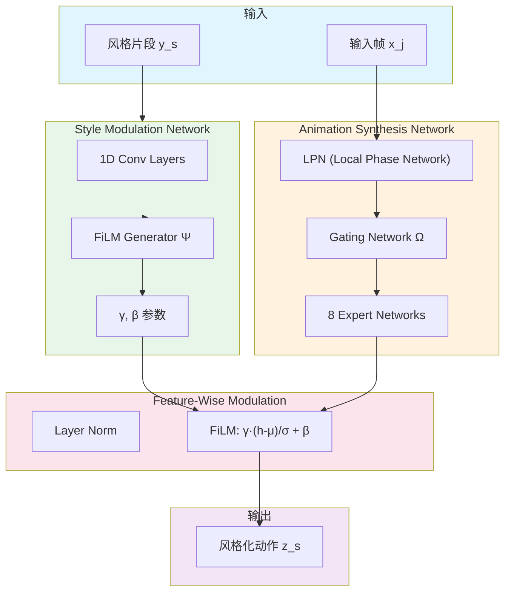

# Real-Time Style Modelling of Human Locomotion via Feature-Wise Transformations and Local Motion Phases

**论文信息**: SIGGRAPH 2020, Ian Mason et al., University of Edinburgh/Electronic Arts

**Link**: [ACM Digital Library](https://dl.acm.org/doi/10.1145/3386569.3392450)

---

## 一、核心问题

### 1.1 研究背景

在计算机图形学和游戏开发中，**角色动作的风格转换**是一个重要问题。例如：
- 同一个人以不同情绪行走（开心、悲伤、愤怒）
- 不同体型的人做相同动作（老人、小孩、运动员）
- 不同动物种类的运动（人类、四足动物）

**传统方法的挑战**：
- 需要大量手工调整
- 风格转换质量不高
- 难以实时运行
- 难以处理多种风格

### 1.2 核心问题

**如何实现实时的、高质量的人类 locomotion 风格转换？**

具体来说：
1. 能否从少量示例中学习风格？
2. 能否在运行时实时转换风格？
3. 能否处理多种风格的平滑过渡？

### 1.3 本文方法

论文提出了基于**Feature-Wise Transformations (FWT)** 和 **Local Motion Phases** 的实时风格转换框架。

**核心思想**：
1. **Feature-Wise Transformations**: 使用 AdaIN 等归一化方法进行风格转换
2. **Local Motion Phases**: 学习每个身体部位的局部相位，而非全局相位
3. **实时的风格转换**: 无需重新训练，在推理时切换风格

**关键创新**：
- 将风格表示为特征空间的仿射变换
- 局部相位学习，允许不同身体部位独立运动
- 支持实时风格插值和过渡

---

## 二、核心贡献

1. **实时风格转换框架**
   - 基于 Feature-Wise Transformations
   - 支持多种风格的平滑过渡
   - 60+ FPS 实时运行

2. **Local Motion Phases**
   - 每个身体部位学习独立的相位
   - 比全局相位更灵活
   - 更好地处理复杂动作

3. **少样本风格学习**
   - 从少量示例中学习新风格
   - 无需重新训练整个网络

---

## 三、大致方法

### 3.1 框架概述

**系统由两部分组成**：

1. **Animation Synthesis Network (ASN)**: 基于 Local Phase Network (LPN)，根据局部相位生成动作内容
2. **Style Modulation Network (SMN)**: FiLM Generator 从风格片段提取 FiLM 参数，调制 ASN 的隐藏层

### 3.2 Feature-Wise Transformations (核心创新)

**问题背景**：
- 现有风格迁移方法需要预知完整的内容动作片段
- 实时系统中未来动作未知且随用户输入变化
- One-hot 表示无法扩展到大量风格，且插值不平滑
- Residual Adapters 参数量大，无法高效存储

**FiLM (Feature-wise Linear Modulation) 公式**：

对于风格片段 \\(y_s\\)，FiLM Generator 输出：
$$\Psi(y_s) = \{ \gamma^{(1)}, \beta^{(1)}, \gamma^{(2)}, \beta^{(2)} \}$$

其中 \\(\gamma^{(i)}\\) 和 \\(\beta^{(i)}\\) 是第 \\(i\\) 层的 FiLM 参数向量。

**特征调制过程**：
1. **Layer Normalization**: 计算隐藏特征的均值和标准差
   $$\mu_j = \text{mean}(h_j), \quad \sigma_j = \text{std}(h_j)$$

2. **FiLM 调制**:
   $$h_j^{(i)} = \text{ELU}\left[ \gamma^{(i)} \odot \frac{h_j - \mu_j}{\sigma_j} + \beta^{(i)} \right]$$

   - \\(\odot\\): 元素乘法
   - \\(\gamma\\): 缩放参数 (scaling)
   - \\(\beta\\): 偏移参数 (shifting)
   - ELU: Exponential Linear Unit 激活函数

**关键洞察**：
- 将风格表示为特征空间的**仿射变换**
- 通过调制所有隐藏层的统计特性，实现高容量的风格表示
- 相比 One-hot (仅偏移) 和 Residual Adapter (单层)，FiLM 同时缩放和偏移所有层

**FiLM 的理论解释 (Multi-Task Dynamical Systems 视角)**：

FiLM 可视为 MTDS 框架的特例，通过风格参数 \\(s\\) 修改网络层参数：
$$\mathbf{h}^{(i+1)} = \sigma( \mathbf{W}_s (\mathbf{W}\mathbf{h}^{(i)} + \mathbf{b}) + \boldsymbol{\beta}_s ) = \sigma( \mathbf{W}'\mathbf{h}^{(i)} + \mathbf{b}' )$$

其中 \\(\mathbf{W}' = \mathbf{W}_s\mathbf{W}\\), \\(\mathbf{b}' = \mathbf{W}_s\mathbf{b} + \boldsymbol{\beta}_s\\)。

**优势**：
1. **高容量**: 调制所有隐藏层，而非单层
2. **紧凑表示**: 每风格仅需 2048 维 FiLM 参数 (可离线预计算)
3. **平滑插值**: 在 FiLM 参数空间线性插值产生平滑风格过渡
4. **易于扩展**: 冻结 ASN，仅微调 FiLM Generator 即可学习新风格

### 3.3 Local Motion Phases

**全局相位 vs 局部相位**：

| 全局相位 (PFNN) | 局部相位 (LPN) |
|---------------|--------------|
| 单一相位值 (从脚部接触提取) | 每个身体部位独立相位 |
| 适用于全局周期性动作 | 适用于异步肢体动作 |
| 手部动作易"卡住" | 灵活处理多接触动作 |

**Contact-Free Local Phase (创新点)**：

对于无接触信息的风格化动作，提出基于主成分分析的相位提取：

1. **主成分投影**: 对每个骨骼位置计算第一主成分 \\(\mathbf{v}_1\\)
2. **源函数**: \\(G(t) = \mathbf{p}(t) \cdot \mathbf{v}_1\\) (投影到主成分方向)
3. **正弦拟合**: \\(G(t) \approx a \sin(ft - s) + b\\)
4. **相位提取**: \\(\phi_i = (f_i \cdot t - s_i) \mod 2\pi\\)
5. **速度加权**: \\(\mathbf{p}_i^{(b)} = ||\mathbf{v}_w|| \cdot a_i \cdot [\sin\phi_i, \cos\phi_i]^T\\)

**相位表示**：
- 4 个末端效应器 (左右手、左右脚) × 2D 相位 = 8 维局部相位向量
- 作为 Gating Network 输入，控制 8 个 Expert 的混合权重

**优势**：
- 处理无全局相位的风格 (如 Pendulum Hands、单手插兜)
- 支持非对称动作 (如单脚跳跃、拖腿行走)
- 捕捉不同肢体的独立相位周期

---

## 四、训练细节

### 4.1 数据集：100style (新发布)

**数据集规模**：
- **100 种不同风格** 的 locomotion 动作
- **4,055,978 帧** motion capture 数据
- 单演员，身高 182cm，Xsens 动作捕捉系统，60fps
- 28 个骨骼关节 (含全身位置 + 旋转，不含手指)

**风格类型** (挑战现有方法)：
- **随机性风格**: Drunk Walk (醉酒行走)
- **非对称风格**: Drag Right Leg (拖右腿行走)
- **无全局相位**: Pendulum Hands (钟摆手)、Wild Arms (狂野手臂)
- **单脚接触**: Left Hopping (单脚跳)

**动作类型分布**：

| 动作类型 | 帧数 | 时长 (分) | 占比 |
|---------|------|---------|------|
| Backwards Run | 434,329 | 120 | 10.7% |
| Backwards Walk | 768,574 | 213 | 19.0% |
| Forwards Run | 414,911 | 115 | 10.2% |
| Forwards Walk | 777,640 | 216 | 19.2% |
| Sidestep Run | 250,980 | 70 | 6.2% |
| Sidestep Walk | 541,041 | 150 | 13.3% |
| Idling | 81,685 | 23 | 2.0% |
| Transitions | 786,818 | 218 | 19.4% |
| **Total** | **4,055,978** | **1125** | **100%** |

**数据划分**: 95 种风格训练，5 种风格保留用于测试微调

### 4.2 网络架构

| 组件 | 架构 | 参数量 |
|------|------|--------|
| **Motion Synthesis Net** | 3 FC 层 (512, 512, output) | 4.9M |
| **Gating Network** | 3 FC 层 (32, 32, 8) | - |
| **FiLM Generator** | 2×1D Conv (256 filters, kernel=25) → MaxPool → 2 FC (2048, output) | 35.7M |
| **Expert 数量** | 8 | - |

**FiLM 参数输出**：
- 每层 512 维 γ + 512 维 β
- 2 个隐藏层 × 2 × 512 = 2048 维/风格

### 4.3 损失函数

**总损失**: \\(\mathcal{L} = \mathcal{L}_{mse} + \mathcal{L}_{bll}\\)

**MSE Loss**:
$$\mathcal{L}_{mse} = \sum_{s=1}^{S} \frac{1}{N_s} \sum_{j=1}^{N_s} (z_j^s - \hat{z}_j^s)^2$$

**Bone Length Loss** (防止骨骼拉伸):
$$\mathcal{L}_{bll} = \sum_{s=1}^{S} \frac{1}{N_s} \sum_{j=1}^{N_s} \sum_{b=1}^{B} |||z_{bp} - z_b|| - ||\hat{z}_{bp} - \hat{z}_b|||^2$$

- \\(z_b\\): 子关节 3D 位置
- \\(z_{bp}\\): 父关节 3D 位置
- \\(B=25\\): 骨骼数量

**训练配置**:
- Optimizer: Adam, learning rate = 1e-4
- Batch size: 每 batch 仅含一种风格 (平衡训练)
- Dropout: 0.3
- Epochs: 90
- GPU: Nvidia GeForce GTX 1080 Ti

---

## 五、实验与结论

### 5.1 定性结果：Failure Case 分析

**对比方法**：
- **PFNN One-hot**: PFNN + One-hot 风格表示 [23]
- **PFNN Resad**: PFNN + Residual Adapter [38]
- **PFNN FiLM**: PFNN + FiLM
- **MANN FiLM**: MANN + FiLM [59]
- **LPN FiLM**: 本文方法 (LPN + FiLM)

**Failure Case 1: 无全局相位的动作**

| 方法 | 问题 |
|------|------|
| PFNN FiLM | 手部"卡住"或呈现平均姿势 |
| LPN FiLM | ✓ 正确处理 (手臂正常摆动) |

*风格：Pendulum Hands (双臂钟摆式摆动)*

**Failure Case 2: 大量风格建模**

| 方法 | 问题 |
|------|------|
| LPN One-hot | 锁骨骨骼建模错误，风格表示不正确 |
| LPN Resad | 艺术感差，容量不足 |
| LPN FiLM | ✓ 高容量建模 (缩放 + 偏移所有层) |

*原因：One-hot 和 Residual Adapter 仅对单层添加风格依赖偏移，FiLM 调制所有隐藏层*

**Failure Case 3: 风格插值**

| 方法 | 问题 |
|------|------|
| LPN One-hot | 插值时保持原风格直至过渡完成，不平滑 |
| LPN FiLM | ✓ 连续风格空间，平滑过渡 |

*风格：Bent Forward → Lean Back*

**Failure Case 4: 无显式相位特征**

| 方法 | 问题 |
|------|------|
| MANN FiLM | 手臂卡在身体前方 (使用末端速度作为 gating 输入) |
| LPN FiLM | ✓ 显式相位特征分离不同相位周期 |

*风格：Swimming (手臂独立相位周期)*

### 5.2 定量结果

**计算效率对比**：

| 模型 | ASN 参数 | SMN 参数 | 每风格参数 (运行时) | 推理时间 (ms) |
|------|---------|---------|------------------|-------------|
| PFNN One-hot | 2.4M | 194K | 2,048 | 0.78 ± 0.01 |
| LPN One-hot | 4.9M | 389K | 4,096 | 4.11 ± 0.02 |
| PFNN Resad | 2.4M | 3.0M | 31,352 | 0.92 ± 0.01 |
| LPN Resad | 4.9M | 25.0M | 262,656 | 4.78 ± 0.06 |
| PFNN FiLM | 2.4M | 35.7M | 2,048 | 1.37 ± 0.02 |
| MANN FiLM | 4.9M | 35.7M | 2,048 | 4.48 ± 0.04 |
| **LPN FiLM (Ours)** | **4.9M** | **35.7M** | **2,048** | **4.53 ± 0.04** |

**关键洞察**：
- FiLM 的 SMN 参数虽多，但可**离线预计算**，运行时仅需存储 2048 维向量
- Residual Adapter 必须保存全部参数 (输入推理时变化)
- LPN One-hot 每风格参数量是 LPN FiLM 的**2 倍**

**测试误差** (MSE + Bone Length Loss)：
- 所有 FiLM 方法误差最低 (高容量调制)
- LPN Resad vs PFNN Resad: CP 分解的相位依赖性重要
- MSE 与感知质量不强烈相关 (平均动作可能 MSE 低但质量差)

### 5.3 扩展性：新风格微调

**方法**：
1. 冻结 LPN 参数 (风格无关的动作表示)
2. 仅微调 FiLM Generator
3. 学习新风格的 FiLM 参数

**t-SNE 可视化**：
- 微调前：未见风格的 FiLM 参数分离较差
- 微调后：未见风格在风格空间中清晰分离

**对比**：
- One-hot: 需重新训练全部网络参数
- Residual Adapter: 需存储大量新参数 (262K/风格)
- FiLM: 仅微调 Generator，存储 2K 参数/风格

### 5.4 实时演示

**实现细节**：
- 用户键盘控制角色移动
- 预测轨迹与用户输入轨迹混合
- 基于足部接触 IK 后处理 (减少滑动)
- 手臂 IK 修正 (防止旋转插值导致的变形)

**风格插值**：
- 用户选择 3 个训练风格
- 根据三角形质心坐标混合 FiLM 参数
- 在线实时调整插值

---

## 六、局限性

1. **物理合理性**
   - 风格插值走"直接路径"，可能产生物理上不合理的姿势 (clipping)
   - 需要理解物理世界模型或添加骨骼感知

2. **随机性动作处理有限**
   - Contact-Free 源函数不擅长处理随机性动作
   - 需要设计新的源函数技术

3. **泛化到未见风格**
   - 训练数据不足以密集采样风格空间
   - 无法鲁棒泛化到未见风格 (需微调)

4. **仅适用于 Locomotion**
   - 上肢复杂交互动作支持有限
   - 主要针对下半身周期性运动

---

## 七、启发

### 7.1 方法学启发

**Feature-Wise Transformations 的通用性**：
- FiLM 可视为 MTDS 框架的特例，通过风格参数修改网络层权重
- 共享参数跨所有风格，风格无关变异用共享参数建模
- 相比其他方法，风格表示显著更紧凑 (2K vs 262K 参数/风格)

**局部相位的灵活性**：
- 源函数设计是关键：不同任务需要不同的源函数
- Contact-Free 相位提取可扩展到其他无接触信息的场景
- 显式相位特征帮助分离不同相位周期的肢体动作

### 7.2 与相关工作对比

| 方法 | 实时性 | 风格数量 | 质量 | 每风格参数 | 平滑插值 |
|------|-------|---------|------|-----------|---------|
| PFNN One-hot [23] | ✓ | 少 | 中 | 2K | ✗ |
| PFNN Resad [38] | ✓ | 中 | 中 | 31K | ✓ |
| **LPN FiLM (本文)** | **✓** | **多** | **高** | **2K** | **✓** |
| MOCHA [2023] | ✓ | 多 | 高 | - | ✓ |

**注**：MOCHA 继承了本文的 FiLM 风格调制思想，但核心是 Neural Context Matcher 进行上下文匹配

### 7.3 核心设计选择的重要性

**Inductive Bias > 原始容量**：
- FiLM 的低测试误差归因于高容量调制 (缩放 + 偏移所有层)
- LPN Resad vs PFNN Resad: CP 分解的相位依赖性重要
- 参数使用的归纳偏置比原始网络容量更重要

**风格表示设计**：
- 内容不变性假设：动作内容 = 跨风格相同的部分，风格 = 差异部分
- 紧凑但强大的风格表示支持有意义的线性插值
- 离线预计算 FiLM 参数降低运行时成本

---

## 八、遗留问题

### 8.1 开放性问题

1. **零样本风格转换**
   - 能否从未见过的风格示例中学习？
   - 跨领域风格迁移？

2. **源函数设计**
   - 如何设计处理随机性动作的源函数？
   - 如何针对不同任务设计专用源函数？

3. **物理合理性**
   - 如何学习世界模型以鼓励物理理解？
   - 如何直接在神经网络中添加骨骼感知？

4. **更细粒度的控制**
   - 能否控制特定身体部位的风格？
   - 能否组合不同风格特征？

---

## 九、补充：Style 的定义讨论

论文对"Style"的定义采用了**内容不变性假设**：
- **动作内容**：跨所有风格相同的部分 (由共享的 LPN 参数建模)
- **动作风格**：风格之间差异的部分 (由 FiLM 参数建模)

但这不是唯一的定义方式，Style 是一个主观且创造性的概念。论文希望此工作对未来创意系统有用。

---

**笔记说明**：本文是 SIGGRAPH 2020 关于实时风格转换的工作，提出了基于 Feature-Wise Transformations (FiLM) 和 Local Motion Phases 的框架。关键创新是使用 FiLM 参数 (γ缩放 + β偏移) 调制动画合成网络的所有隐藏层，实现高容量、紧凑的风格表示。发布的 100style 数据集包含 100 种风格、400 万帧动作数据。理解本文有助于学习角色动画的风格化方法，MOCHA (2023) 继承了 FiLM 风格调制思想。
