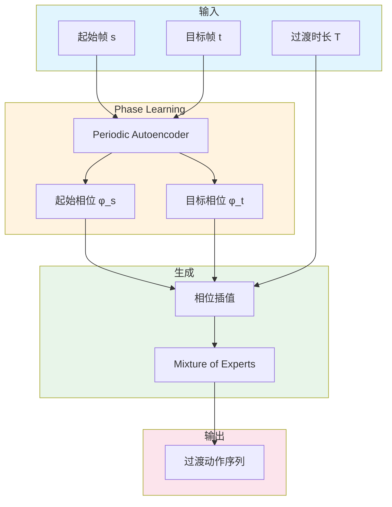

# Motion In-Betweening with Phase Manifolds

**论文信息**: 2023, Paul Starke et al., Electronic Arts/Universität Hamburg/Meta Reality Labs

**Link**: [arXiv:2308.12751](https://arxiv.org/abs/2308.12751)

---

## 一、核心问题

### 1.1 研究背景

**Motion In-Betweening（动作中间帧生成）** 是角色动画中的经典问题：
- 给定起始关键帧和目标关键帧
- 生成中间过渡动作
- 要求过渡自然、符合运动规律

**传统方法的挑战**：
- 手工制作中间帧耗时
- 线性插值导致动作僵硬
- 难以处理复杂的多接触动作
- 无法生成多样化的过渡

### 1.2 核心问题

**如何自动生成自然、多样化的 motion in-betweening，同时支持用户控制？**

### 1.3 本文方法

论文提出了基于 **Phase Manifolds（相位流形）** 的 motion in-betweening 系统。

**核心思想**：
1. 使用 **Periodic Autoencoder** 学习相位变量
2. 相位在空间和时间上聚类动作
3. Mixture-of-Experts 网络生成过渡

**关键创新**：
- 相位变量学习，捕捉动作的周期性结构
- 支持用户约束（如 end effector 位置）
- 生成多样化的过渡动作

---

## 二、核心贡献

1. **Phase Manifolds for In-Betweening**
   - 使用相位变量聚类动作
   - 在相位空间进行插值
   - 生成自然过渡

2. **Mixture-of-Experts 架构**
   - 不同专家处理不同动作类型
   - 动态权重组合
   - 支持多样化生成

3. **用户约束支持**
   - 支持 end effector 约束
   - 动画师可手动调整关键帧
   - 系统自动满足约束

---

## 三、大致方法

### 3.1 框架概述

### 3.2 Periodic Autoencoder

**目标**：学习动作的相位表示

**架构**：
$$\phi = E_{phase}(x)$$
$$\hat{x} = D_{phase}(\phi)$$

**相位约束**：
- 相位在单位圆上：\\(\phi \in [0, 2\pi)\\)
- 周期性：\\(\phi(t) = \phi(t + T)\\)

### 3.3 Mixture-of-Experts

**Expert 网络**：
$$y_i = f_i(x, \phi)$$

**权重计算**：
$$w = \text{softmax}(g(x, \phi))$$

**输出**：
$$y = \sum_i w_i y_i$$

---

## 四、训练细节

### 4.1 数据集

- AMASS mocap 数据集
- 包含多种 locomotion 动作
- 行走、跑步、跳跃等

### 4.2 训练策略

1. **Phase 学习**：无监督学习相位表示
2. **Expert 训练**：每个专家学习特定动作类型
3. **Gating 网络**：学习专家权重分配

---

## 五、实验与结论

### 5.1 定性结果

- 生成自然流畅的过渡
- 支持多样化过渡类型
- 满足用户约束

### 5.2 应用场景

1. **动画制作**
   - 自动生成中间帧
   - 减少动画师工作量

2. **游戏开发**
   - 实时动作过渡
   - 响应玩家输入

3. **VR/AR**
   - 实时化身动画
   - 低延迟过渡

---

## 六、局限性

1. **依赖训练数据**
   - 只能生成训练过的动作类型
   - 新动作需要重新训练

2. **长过渡质量下降**
   - 过长过渡可能不自然
   - 需要分段处理

---

## 七、启发

### 7.1 方法学启发

1. **相位表示的通用性**
   - 适用于各种周期性动作
   - 可推广到其他动作生成任务

2. **Mixture-of-Experts 的灵活性**
   - 动态组合不同技能
   - 支持多模态生成

---

**笔记说明**：本文是 2023 年关于 motion in-betweening 的工作，提出了基于 Phase Manifolds 的方法。理解本文有助于学习数据驱动的动作过渡生成方法，与 RTN、CAMDM 等工作形成对比。
