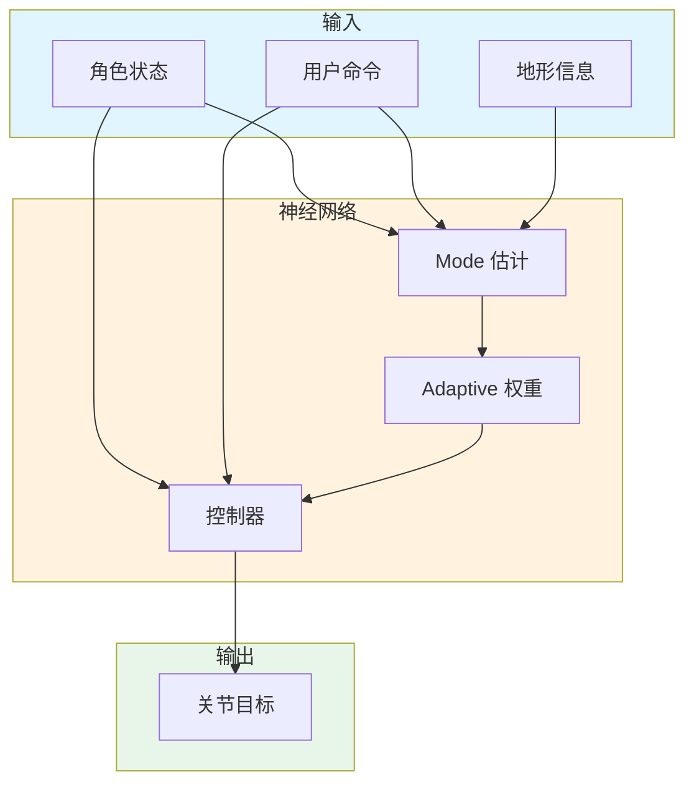

# Mode-Adaptive Neural Networks for Quadruped Motion Control

**论文信息**: SIGGRAPH 2018, Hongwei Zhang et al., University of Edinburgh

**Link**: [ACM Digital Library](https://dl.acm.org/doi/10.1145/3197517.3201366)

---

## 一、核心问题

### 1.1 研究背景

**四足动物运动控制**是计算机图形学和机器人学的重要问题：
- 游戏和电影中的动物角色
- 机器狗的运动规划
- 生物运动研究

**传统方法的挑战**：
- 不同步态需要不同的控制器
- 步态切换不流畅
- 难以适应不同地形
- 手工制作控制器耗时

### 1.2 核心问题

**如何实现统一的、自适应的四足动物运动控制框架？**

### 1.3 本文方法

论文提出了 **Mode-Adaptive Neural Networks**：

**核心思想**：
1. 单个神经网络处理多种步态
2. 自动学习步态切换
3. 适应不同地形和速度

**关键创新**：
- Mode-adaptive 权重调整
- 统一的控制框架
- 无需显式步态标注

---

## 二、核心贡献

1. **Mode-Adaptive 架构**
   - 单个网络处理多种步态
   - 自动调整权重
   - 流畅的步态切换

2. **四足运动学习**
   - 从 mocap 数据学习
   - 生成自然运动
   - 物理仿真兼容

---

## 三、大致方法

### 3.1 框架概述

---

## 四、训练细节

### 4.1 数据集

- 四足动物 mocap 数据
- 多种步态：行走、小跑、奔跑
- 不同地形数据

### 4.2 训练策略

1. **模仿学习**：跟踪参考动作
2. **强化学习**：优化运动质量
3. **域适应**：适应不同地形

---

## 五、实验与结论

### 5.1 定性结果

- 流畅的步态切换
- 适应不同地形
- 自然运动质量

### 5.2 应用场景

1. **游戏动物角色**
2. **机器狗控制**
3. **生物运动研究**

---

## 六、局限性

1. **仅适用于四足动物**
2. **需要 mocap 数据**
3. **复杂地形适应有限**

---

**笔记说明**：本文是 SIGGRAPH 2018 关于四足动物运动控制的工作，提出了 Mode-Adaptive Neural Networks。理解本文有助于学习动物运动生成方法。
