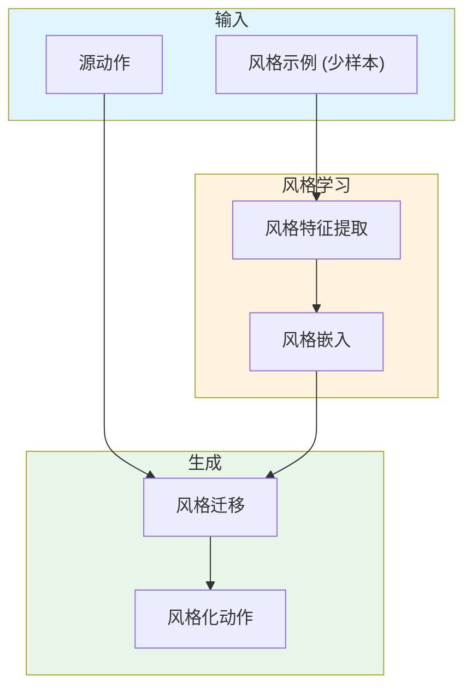

# Few-shot Learning of Homogeneous Human Locomotion Styles

**论文信息**: Computer Graphics Forum (EG 2018), Ian Mason et al., University of Edinburgh

**Link**: [DOI:10.1111/cgf.13555](https://doi.org/10.1111/cgf.13555)

---

## 一、核心问题

### 1.1 研究背景

**少样本学习（Few-shot Learning）** 在角色动画中具有重要意义：
- 动画师通常只有少量参考动作
- 收集大量 mocap 数据成本高
- 需要快速适配新风格

**传统方法的挑战**：
- 深度学习需要大量数据
- 少样本情况下容易过拟合
- 难以泛化到新风格

### 1.2 核心问题

**如何从少量示例中学习并生成新的 locomotion 风格？**

### 1.3 本文方法

论文提出了 **Few-shot Learning of Homogeneous Human Locomotion Styles**：

**核心思想**：
1. 学习通用的风格表示空间
2. 从少量示例中提取风格特征
3. 生成新的风格化动作

**关键创新**：
-  homogeneous 风格假设（同一风格的动作共享特征）
- 风格空间插值
- 少样本风格迁移

---

## 二、核心贡献

1. **Few-shot 风格学习框架**
   - 从少量示例学习
   - 生成新风格
   - 风格迁移

2. **Homogeneous 风格假设**
   - 同一风格的动作共享潜在特征
   - 简化风格表示

---

## 三、大致方法

### 3.1 框架概述

---

## 四、训练细节

### 4.1 数据集

- 多种风格的 locomotion 数据
- 每种风格少量示例

### 4.2 少样本学习策略

1. **Meta-learning**：学习如何学习风格
2. **数据增强**：生成更多训练样本
3. **正则化**：防止过拟合

---

## 五、实验与结论

### 5.1 定性结果

- 少样本风格学习效果良好
- 风格迁移自然
- 支持风格插值

### 5.2 应用场景

1. **快速原型设计**
2. **个性化角色动画**
3. **风格化游戏角色**

---

## 六、局限性

1. **依赖 homogeneous 假设**
2. **极端风格质量下降**
3. **需要至少几个示例**

---

**笔记说明**：本文是 EG 2018 关于少样本风格学习的工作，提出了从少量示例中学习 locomotion 风格的方法。理解本文有助于学习数据高效的角色动画方法。
