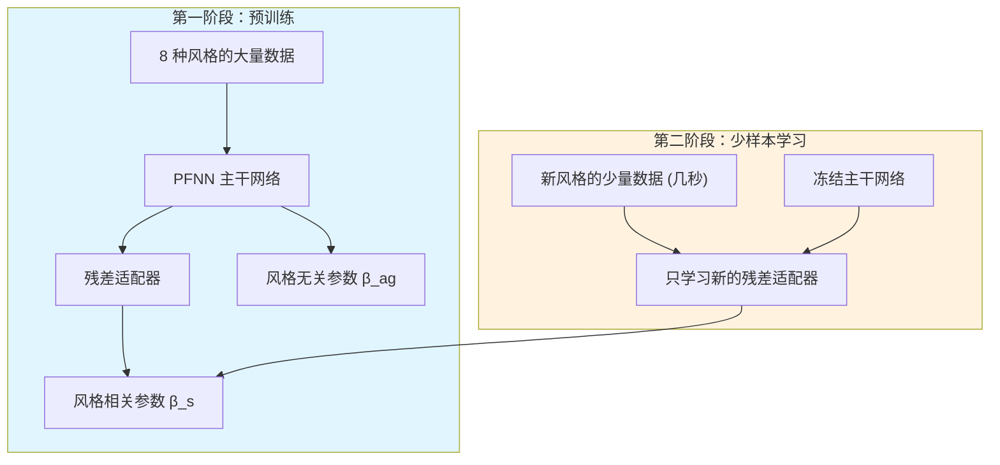

# Few-shot Learning of Homogeneous Human Locomotion Styles

**论文信息**: Computer Graphics Forum (Eurographics 2018), Ian Mason et al., University of Edinburgh

**Link**: [DOI:10.1111/cgf.13555](https://doi.org/10.1111/cgf.13555)

**引用**: Mason, I, Starke, W, Zhang, H, Bilen, H & Komura, T (2018). Few-shot Learning of Homogeneous Human Locomotion Styles. Computer Graphics Forum, 37(7), 143-153.

---

## 一、核心问题：用非常基础的语言解释

### 1.1 这个问题为什么重要？

**想象你是一个游戏动画师**：

你想让游戏里的角色走出一种特殊的步伐，比如：
- 像喝醉了酒一样摇摇晃晃地走
- 像小偷一样蹑手蹑脚地走
- 像将军一样昂首挺胸地走

**传统方法的问题**：

1. **需要大量数据**：你想让角色学会一种新风格的走路，传统方法需要收集**成百上千条**这种风格的动作捕捉数据
2. **成本极高**：动作捕捉需要专业设备、演员、场地，非常昂贵
3. **训练时间长**：每次学习新风格都要重新训练整个神经网络，可能需要几天时间
4. **不实用**：动画师通常只有**几秒到几十秒**的参考视频，不可能提供大量数据

**核心问题**：

> **能否只给神经网络看几秒种的动作视频，它就能学会这种风格的走路？**

这就是 **"少样本学习" (Few-shot Learning)** 要解决的问题。

### 1.2 什么是"Homogeneous"风格学习？

**Homogeneous（同质的）vs Heterogeneous（异质的）**：

| 类型 | 例子 | 难度 |
|------|------|------|
| **Homogeneous** | 看到"向前走"的风格，学会向各个方向"走"的风格 | 较简单 |
| **Heterogeneous** | 看到"向前走"的风格，学会"跑"、"跳"、"打拳"的风格 | 非常难 |

**本文聚焦于 Homogeneous 学习**：
- 输入：几秒种"风格 A 的向前走"
- 输出：能用风格 A 向各个方向走、改变速度

**为什么不做 Heterogeneous？**
- 从"走"的风格推断"跑"的风格，没有确定性映射
- 有些风格在跑步时会完全改变（比如醉汉走路 vs 醉汉跑步）
- 这是开放性问题，超出了本文范围

### 1.3 本文方法的核心思想

**关键洞察**：

 locomotion（移动）动作可以分解为两部分：
1. **风格无关的部分**：所有走路方式共有的特征（如左右脚交替、身体平衡）
2. **风格相关的部分**：不同风格的独特特征（如步幅大小、身体倾斜角度）

**方法概述**：



**两阶段训练**：

1. **第一阶段（预训练）**：
   - 用 8 种风格的大量数据训练
   - 学习"风格无关参数"（所有走路的共同规律）
   - 学习 8 套"风格相关参数"（每种风格的独特之处）

2. **第二阶段（少样本学习）**：
   - 给新风格的几秒种视频
   - **冻结主干网络**（不改变已学到的共同规律）
   - **只学习新的残差适配器**（新风格的独特之处）

**类比理解**：

想象学习写字：
- **主干网络** = 学习写字的基本规则（笔画顺序、结构）
- **风格无关参数** = 所有人都要遵守的规则
- **风格相关参数** = 每个人的字迹特点
- **少样本学习** = 看几眼某人的字，就能模仿他的字迹，而不需要重新学习写字的基本规则

---

## 二、核心技术详解

### 2.1 基础知识铺垫

在深入方法之前，需要先理解几个关键概念：

#### 概念 1：什么是 PFNN (Phase-Functioned Neural Network)？

**PFNN 是什么？**

PFNN 是一种专门用于角色动画的神经网络，由 Holden 等人在 2017 年提出。

**为什么需要 PFNN？**

传统神经网络生成动画的问题：
- 输出容易"模糊"（blurriness）
- 动作不够清晰、不够真实

PFNN 的解决方案：
- 引入"相位"(Phase) 的概念
- 根据相位动态调整网络权重

**什么是"相位"(Phase)？**

相位表示动作的周期进度。以走路为例：

```
一个完整的走路周期（相位从 0 到 2π）：
- 相位 = 0：右脚着地
- 相位 = π/2：右脚抬起，左脚支撑
- 相位 = π：左脚着地
- 相位 = 3π/2：左脚抬起，右脚支撑
- 相位 = 2π：回到右脚着地（完成一个周期）
```

**PFNN 如何工作？**

PFNN 的权重是相位的函数：

$$W(p) = \text{根据相位 p 动态调整权重}$$

具体实现使用 **Catmull-Rom 样条曲线**：
- 定义 4 个"控制点"权重：\\(\alpha_1, \alpha_2, \alpha_3, \alpha_4\\)
- 根据当前相位，平滑地混合这 4 个权重
- 公式：
  $$W(p; \beta) = \alpha_{k1} + \frac{d}{2}(\alpha_{k2} - \alpha_{k0}) + \frac{d^2}{2}(\alpha_{k0} - \alpha_{k1} + 2\alpha_{k2} - \alpha_{k3}) + \frac{d^3}{2}(\alpha_{k1} - \alpha_{k2} + \alpha_{k3} - \alpha_{k0})$$
  其中 \\(d = \frac{4p}{2\pi} \mod 1\\)，\\(k_n = \lfloor\frac{4p}{2\pi}\rfloor + n - 1 \mod 4\\)

**通俗理解**：
- 把走路周期分成 4 个阶段
- 每个阶段有一套专用权重
- 根据当前走到哪个阶段，平滑地切换权重
- 这样可以保证动作连贯、不突兀

#### 概念 2：什么是残差适配器 (Residual Adapter)？

**残差适配器是什么？**

残差适配器是一种轻量级的网络模块，用于适应新领域（新风格）。

**基本结构**：

```
输入 x
  │
  ├──────→ [主网络 f] ────→┐
  │                        ↓ (+) → 输出 y
  └────→ [残差适配器 h] ──→┘
```

**数学公式**：

$$y = f * x + h_{1\times1} * x$$

- \\(f\\)：主网络过滤器（domain agnostic，领域无关）
- \\(h_{1\times1}\\)：残差适配器（domain specific，领域特定）
- \\(*\\)：卷积操作

**为什么用残差适配器？**

1. **参数少**：使用 \\(1\times1\\) 过滤器，新增参数很少
2. **易于扩展**：每个新领域只需训练新的适配器，主网络共享
3. **可调节**：通过正则化控制适应强度

**本文的改进**：

原版的残差适配器用于图像分类，包含 Batch Normalization。但 PFNN：
- 不使用 Batch Normalization
- 是前馈网络而非卷积网络

因此本文做了适配修改。

#### 概念 3：什么是 CP 分解 (Canonical Polyadic Decomposition)？

**为什么需要 CP 分解？**

问题：每个新风格都要存储一整套残差适配器参数，内存消耗大。

- 完整矩阵：每风格 4.01 MB（存储控制点）/ 50.1 MB（离散化相位）
- 8 种风格就要 32 MB，50 种风格就要 200+ MB

**CP 分解的思想**：

把一个 3D 张量分解成三个矩阵的乘积：

$$X_k = A D(k) B^T$$

- \\(X \in \mathbb{R}^{I\times J\times K}\\)：原始 3D 张量
- \\(A \in \mathbb{R}^{I\times R}\\)：左矩阵（与相位无关）
- \\(B \in \mathbb{R}^{J\times R}\\)：右矩阵（与相位无关）
- \\(D(k) \in \mathbb{R}^{R\times R}\\)：对角矩阵（与相位相关）
- \\(R \ll I, J\\)：降维后的维度

**本文的具体实现**：

把残差适配器的权重视为 3D 张量 \\(512 \times 512 \times 50\\)：
- 512×512：权重矩阵大小
- 50：相位离散化数量（把 0 到 2π 分成 50 份）

分解后：
- \\(A\\)：512 × 30（与相位无关）
- \\(B\\)：512 × 30（与相位无关）
- \\(D(k)\\)：30 × 30 对角矩阵（与相位相关，k=1...50）

**效果对比**：

| 方法 | 训练时内存 | 运行时内存 | 训练时间 | 推理时间 |
|------|----------|----------|---------|---------|
| 完整矩阵 | 4.01 / 50.1 MB | 99 秒 | 0.0013 秒 |
| 对角矩阵 | 0.016 / 0.20 MB | 44 秒 | 0.0010 秒 |
| **CP 分解** | **0.126 / 0.131 MB** | **50 秒** | **0.0011 秒** |

**CP 分解的优势**：
1. **大幅减少参数**：从 4MB 降至 0.13MB（约 30 倍压缩）
2. **防止过拟合**：参数少 = 更不容易记住训练数据
3. **保持灵活性**：相位相关部分保留，相位无关部分共享

**直观理解**：

想象学习不同人的字迹：
- **A 和 B 矩阵** = 这个人的基本笔画特征（横、竖、撇、捺的特点）
- **D 矩阵** = 不同字之间的变化（写"大"和写"小"的区别）
- CP 分解 = 把"基本笔画"和"字间变化"分开学习

### 2.2 方法详解

#### 第一步：预训练（学习风格无关参数）

**数据准备**：

- 8 种代表性风格：angry（愤怒）、childlike（孩子气）、depressed（沮丧）、neutral（中性）、old（老人）、proud（骄傲）、sexy（性感）、strutting（大摇大摆）
- 每种风格约 1 小时动作捕捉数据
- 总共约 8 小时、23104 帧/风格

**网络架构**：

```
输入 X (234 维)
  │
  ├→ [主网络 W0, W1, W2] → 风格无关参数 β_ag (灰色)
  │    └─ 权重由相位控制
  │
  └→ [残差适配器 Wres] → 风格相关参数 β_s (彩色，8 套)
       └─ CP 分解：A, D(k), B

输出 Y (400 维)
  │
  ├→ 未来轨迹位置 (12 维)
  ├→ 未来轨迹方向 (12 维)
  ├→ 关节位置 (93 维)
  ├→ 关节速度 (93 维)
  ├→ 关节旋转 (186 维)
  ├→ 相位变化 (1 维)
  └→ 根节点平移/旋转 (3 维)
```

**损失函数**：

对于风格 \\(s\\) 的输入 \\(X_i^{(s)}\\)：

$$\mathcal{L}(X_i^{(s)}, Y_i^{(s)}, p_i^{(s)}; s) = ||Y_i^{(s)} - \Phi(X_i^{(s)}, p_i^{(s)}; \beta^{(s)}, \beta_{ag})||^2 + \lambda_{ag}||\beta_{ag}||_1 + \lambda_s||\beta^{(s)}||_1$$

**关键设计**：

1. **平衡数据集**：
   - 每种风格帧数相同（23104 帧）
   - 镜像和非镜像动作数量相同
   - 确保不偏向任何一种风格

2. **L1 正则化**：
   - \\(\lambda_{ag} = \lambda_s = 0.01\\)
   - 鼓励稀疏性，防止过拟合

3. **分批次训练**：
   - 每个 batch 只包含一种风格
   - 每 8 个 batch 循环一次（确保均衡）

**训练配置**：
- 优化器：Adam
- 学习率：默认
- 训练轮数：25 epochs（早停防止过拟合）
- 硬件：NVIDIA GTX 1080 Ti
- 训练时间：约 6 小时

#### 第二步：少样本学习（学习新风格）

**数据准备**：

- 从 CMU 动作捕捉数据库提取 50 种风格
- 每种风格可能只有 1-5 秒 的数据（一个走路周期）
- 例如：joy（快乐）、on toes crouched（踮脚蹲下）、roadrunner（走鹃）、wild arms（狂野手臂）、zombie（僵尸）

**核心挑战**：

1. **数据太少**：
   - 只有直直向前走的几秒视频
   - 需要泛化到转弯、加速等新情况
   - 极易过拟合

2. **内存消耗**：
   - 每新增一种风格就要存储一套参数
   - 50 种风格需要大量存储

**解决方案**：

1. **冻结主干网络**：
   - 不改变 \\(\beta_{ag}\\)（风格无关参数）
   - 只学习新的 \\(\beta^{(new)}\\)（新风格参数）

2. **CP 分解**：
   - 将参数数量从 4MB 压缩到 0.13MB
   - 降低过拟合风险

3. **可变 Dropout**：
   - 对不同风格使用不同的 dropout 率
   - 数据越少、风格越独特 → dropout 越高
   - 通过网格搜索找到最优值

**为什么能泛化？**

- 主干网络已经学会了"走路的一般规律"
- 新风格只需要学习"如何调整这些规律"
- 例如：主干知道如何转弯，新风格只需要调整转弯时的姿态

### 2.3 推理（生成新动作）

**输入**：
- 用户控制的轨迹（键盘/游戏手柄）
- 当前相位

**处理流程**：

1. 根据相位计算权重：
   - 主网络权重：\\(W_0(p), W_1(p), W_2(p)\\)
   - 残差适配器权重：\\(W_{res}(p)\\)

2. 前向传播：
   $$\Phi(X, p; \beta^{(s)}, \beta_{ag}) = W_2 \cdot \text{ELU}(W_1 \cdot \text{ELU}(W_0 X + b_0) + b_1 + W_{res} \cdot \text{ELU}(W_0 X + b_0) + b_{res}) + b_2$$

3. 输出下一帧：
   - 关节位置、速度、旋转
   - 根节点运动
   - 相位变化

4. 相位离散化（加速）：
   - 预计算 50 个相位的权重（相位 0, 2π/50, ..., 2π）
   - 推理时使用最近的预计算权重
   - 加速 3-4 倍

**实时性能**：
- 推理时间：0.0011 秒/帧
- 帧率：约 900 FPS（远超实时要求）

---

## 三、实验结果

### 3.1 定性结果

**成功的风格**：

| 风格 | 效果 | 说明 |
|------|------|------|
| Joy（快乐） | ✓ | 轻快的步伐，自然 |
| On toes crouched（踮脚蹲下） | ✓ | 保持蹲姿，踮脚走路 |
| Roadrunner（走鹃） | ✓ | 快速小步跑 |
| Wild arms（狂野手臂） | ✓ | 手臂大幅度摆动 |
| Zombie（僵尸） | ✓ | 僵硬的双脚跳跃 |

**失败案例**：

| 风格 | 问题 | 原因 |
|------|------|------|
| Left hop（单脚跳） | 右脚几乎不抬 | 风格与训练集差异太大 |
| March（正步走） | 膝盖抬不够高 | 输出过于平滑 |
| Gedanbarai（空手道） | 无法处理 | 非周期性动作，相位定义不清 |

### 3.2 对比实验

**vs 微调整个 PFNN**：

- 微调整个网络 → 严重过拟合
- 只能复现训练轨迹，无法泛化到转弯

**vs 对角残差适配器**：

- 对角矩阵 → 欠拟合
- 无法捕捉复杂风格，输出"平均化"动作

**vs 完整残差适配器**：

- 完整矩阵 → 过拟合
- 风格捕捉好，但无法向左转弯（参数太多）

**vs Holden et al. [HSK16] 风格迁移**：

- 本文方法 ≈ 或优于 Holden 的方法
- 但本文是"同时生成 + 风格化"，不需要预定义内容轨迹

### 3.3 消融实验

**可视化风格无关参数**：

将残差适配器权重设为 0，生成"平均动作"：
- 接近中性走路
- 快速转弯时有轻微"咔哒"声（snap）
- 这是底层"平均动作"的瑕疵

**CP 分解的有效性**：

| n 值 | 参数量 | 风格质量 | 过拟合 |
|------|--------|---------|--------|
| n=512（无分解） | 4MB | 好 | 严重 |
| n=30 | 0.13MB | 好 | 轻微 |
| n=10 | 0.02MB | 一般 | 无 |

---

## 四、局限性

### 4.1 无法处理异质迁移 (Heterogeneous Transfer)

**问题**：
- 只能从"风格 A 的走路"生成"风格 A 的其他走路"
- 无法从"风格 A 的走路"生成"风格 A 的跑步/打拳"

**原因**：
- 走路→跑步没有确定性映射
- 有些风格在跑步时完全改变

**未来方向**：
- 需要手工设计的解决方案（如 Yumer et al. [YM16]）

### 4.2 缺乏定量评估指标

**问题**：
- 动画质量评估是开放性问题
- 没有"标准答案"来比较生成结果
- 主要依赖主观视觉判断

**现状**：
- 使用定性比较（看视频）
- 与 Holden et al. [HSK16] 对比

### 4.3 丢失高频细节

**问题**：
- 生成动作比训练数据"平滑"
- 丢失细微的手部、头部动作
- 与人工动画相比缺乏细腻感

**原因**：
- 数据量太少，模型倾向于"平均化"
- 正则化导致平滑

**可能改进**：
- 增加训练轮数
- 调整 dropout 率
- 改进归一化方法

### 4.4 无法处理非周期性动作

**问题**：
- PFNN 设计用于周期性运动（走路、跑步）
- 难以处理"走走停停"的动作（如空手道）
- 相位定义不清的风格无法处理

**未来方向**：
- 需要新的相位定义方法
- 或放弃基于相位的方法

---

## 五、启发与应用

### 5.1 方法学启发

**核心洞察**：

1. **分解思想**：
   - 将问题分解为"通用规律" + "特定风格"
   - 通用规律一次性学习，特定风格快速适应
   - 类似思想可用于其他生成任务

2. **参数效率**：
   - CP 分解大幅减少参数（30 倍压缩）
   - 降低过拟合风险
   - 减少存储需求

3. **终身学习**：
   - 新风格可以逐个添加
   - 不影响旧风格
   - 适合增量式学习场景

### 5.2 与相关工作的对比

| 方法 | 核心思想 | 数据需求 | 实时性 | 适用场景 |
|------|---------|---------|--------|---------|
| PFNN [HKS17] | 相位控制权重 | 大量/风格 | ✓ | 单一风格 |
| Style Transfer [HSK16] | 隐空间优化 | 大量 + 参考 | ✗ | 离线迁移 |
| **本文 (2018)** | **残差适配器 + CP 分解** | **几秒/新风格** | **✓** | **少样本** |
| Style Modelling [211] | FiLM 调制 | 大量/多风格 | ✓ | 多风格建模 |
| MOCHA [2023] | 神经上下文匹配 | 大量 | ✓ | 实时匹配 |

### 5.3 实际应用场景

1. **游戏开发**：
   - 快速原型：几秒参考视频即可生成 NPC 动画
   - 个性化角色：玩家自定义走路风格
   - 独立开发者福音：无需昂贵动捕

2. **VR/AR 化身**：
   - 用户录制几秒视频 → 个性化虚拟形象
   - 实时风格化：改变情绪状态

3. **动画制作**：
   - 动画师提供参考 → 系统生成中间帧
   - 风格库扩展：快速添加新风格

### 5.4 技术细节的启发

**CP 分解的通用性**：

不仅适用于 PFNN，还可用于：
- 其他基于相位的网络
- 任何具有周期性输入的神经网络
- 论文中提到：应用到完整 PFNN 可使参数从 136MB 降至 1MB

**可变 Dropout 的策略**：

- 数据越少 → dropout 越高
- 风格越独特 → dropout 越高
- 通过网格搜索找到最优值
- 类似思想可用于其他少样本学习任务

---

## 六、遗留问题与未来方向

### 6.1 开放性问题

1. **异质迁移**：
   - 如何从"走路风格"推断"跑步风格"？
   - 需要什么样的先验知识？

2. **定量评估**：
   - 如何客观评价生成动画的质量？
   - 什么是"好"的动画？

3. **高频细节恢复**：
   - 如何在泛化和细节之间取得平衡？
   - 是否需要额外的后处理？

4. **非周期性动作**：
   - 如何处理"走走停停"的动作？
   - 是否需要放弃相位表示？

### 6.2 可能的改进方向

1. **数据增强**：
   - 合成更多训练样本
   - 使用程序化生成

2. **更强的正则化**：
   - 尝试不同的正则化方法
   - 如 L1、L2、DropConnect

3. **分层风格表示**：
   - 粗粒度风格（整体姿态）
   - 细粒度风格（手部动作）

4. **结合物理仿真**：
   - 确保物理合理性
   - 处理接触、碰撞

---

## 七、关键公式汇总

### 7.1 PFNN 相位权重

$$W(p; \beta) = \alpha_{k1} + \frac{d}{2}(\alpha_{k2} - \alpha_{k0}) + \frac{d^2}{2}(\alpha_{k0} - \alpha_{k1} + 2\alpha_{k2} - \alpha_{k3}) + \frac{d^3}{2}(\alpha_{k1} - \alpha_{k2} + \alpha_{k3} - \alpha_{k0})$$

其中：
- \\(d = \frac{4p}{2\pi} \mod 1\\)
- \\(k_n = \lfloor\frac{4p}{2\pi}\rfloor + n - 1 \mod 4\\)
- \\(\beta = \{\alpha_1, \alpha_2, \alpha_3, \alpha_4\}\\) 是控制点

### 7.2 残差适配器

$$y = f * x + h_{1\times1} * x$$

### 7.3 CP 分解

$$X_k = A D(k) B^T$$

- \\(X \in \mathbb{R}^{I\times J\times K}\\)：原始张量
- \\(A \in \mathbb{R}^{I\times R}\\)，\\(B \in \mathbb{R}^{J\times R}\\)：与相位无关
- \\(D(k) \in \mathbb{R}^{R\times R}\\)：对角矩阵，与相位相关

### 7.4 损失函数

$$\mathcal{L} = ||Y - \Phi(X, p; \beta^{(s)}, \beta_{ag})||^2 + \lambda_{ag}||\beta_{ag}||_1 + \lambda_s||\beta^{(s)}||_1$$

### 7.5 网络前向传播

$$\Phi(X, p; \beta^{(s)}, \beta_{ag}) = W_2 \cdot \text{ELU}(W_1 \cdot \text{ELU}(W_0 X + b_0) + b_1 + W_{res} \cdot \text{ELU}(W_0 X + b_0) + b_{res}) + b_2$$

---

## 八、术语表

| 术语 | 英文 | 解释 |
|------|------|------|
| 少样本学习 | Few-shot Learning | 从少量示例中学习 |
| 同质迁移 | Homogeneous Transfer | 同一类型动作之间的迁移（走→走） |
| 异质迁移 | Heterogeneous Transfer | 不同类型动作之间的迁移（走→跑） |
| 相位 | Phase | 动作周期的进度（0 到 2π） |
| 风格无关参数 | Style-agnostic Parameters | 所有风格共享的参数 |
| 风格相关参数 | Style-specific Parameters | 每种风格独特的参数 |
| 残差适配器 | Residual Adapter | 用于领域适应的轻量级模块 |
| CP 分解 | Canonical Polyadic Decomposition | 3D 张量分解为三个矩阵的乘积 |
| Dropout | Dropout | 随机丢弃神经元的正则化技术 |
| 前馈网络 | Feed-forward Network | 无循环连接的神经网络 |
| 动作捕捉 | Motion Capture | 记录真实人体动作的技术 |

---

**笔记说明**：本文是 EG 2018 的工作，提出了基于残差适配器和 CP 分解的少样本风格学习方法。核心贡献是将风格分解为"通用规律"和"特定风格"，通过冻结主干网络、只学习残差适配器，实现了从几秒视频学习新风格。理解本文有助于学习数据高效的角色动画方法，与 Style Modelling (211)、MOCHA 等工作形成对比。本文是第一作者 Ian Mason 早期工作，后续发展出 Style Modelling (2020) 和 MOCHA (2023)。
