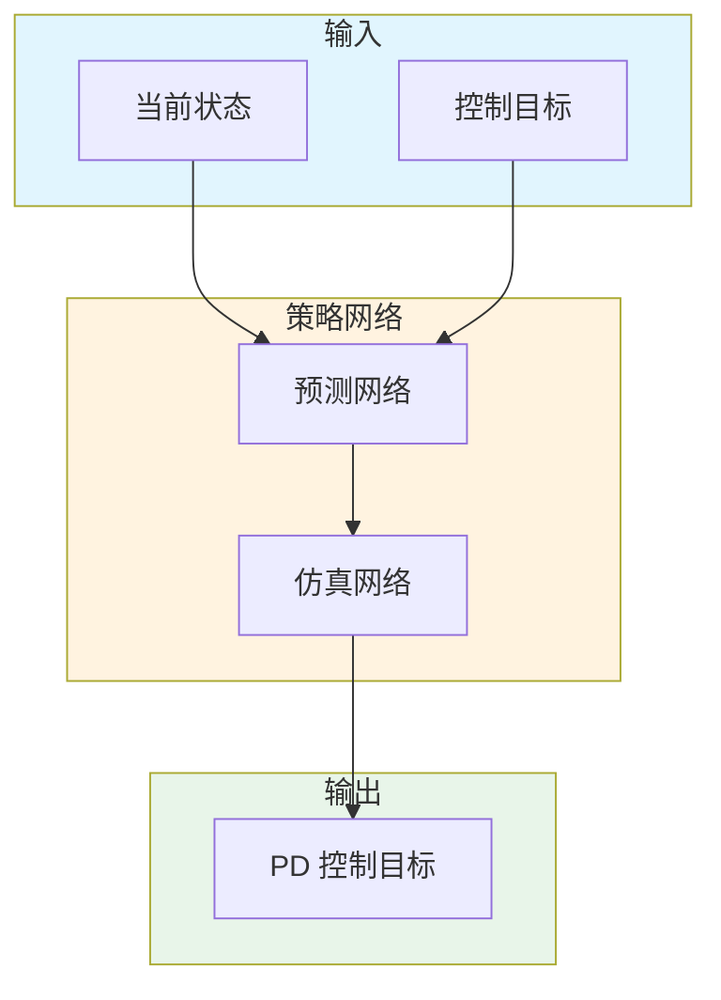

# Learning predict-and-simulate policies from unorganized human motion data

**论文信息**: TOG 2019, Soohwan Park et al., Seoul National University

**Link**: [ACM Digital Library](https://dl.acm.org/doi/10.1145/3355089.3356516)

---

## 一、核心问题

### 1.1 研究背景

**基于物理的角色控制**是一个长期挑战：
- 游戏和 VR 需要物理合理的角色
- 需要抗扰动能力
- 需要丰富的运动技能

**传统方法的挑战**：
- 需要精心设计的参考动作
- 需要大量标注
- 技能有限

### 1.2 核心问题

**如何从无标注、无组织的人体动作数据中学习物理控制策略？**

### 1.3 本文方法

论文提出了 **Predict-and-Simulate Policy**：

**核心思想**：
1. 从无组织 mocap 数据学习
2. Predict-and-simulate 架构
3. 物理仿真执行

**关键创新**：
- 无需精确跟踪参考动作
- 学习通用运动技能
- 支持交互式控制

---

## 二、核心贡献

1. **Predict-and-Simulate 架构**
   - 预测下一步动作
   - 在物理仿真中执行
   - 闭环控制

2. **无组织数据学习**
   - 无需标注
   - 无需分段
   - 自动发现技能

---

## 三、大致方法

### 3.1 框架概述

### 3.2 Predict-and-Simulate

**预测**：
$$\hat{s}_{t+1} = f_{predict}(s_t, g)$$

**仿真**：
$$a_t = f_{simulate}(s_t, \hat{s}_{t+1})$$

---

## 四、训练细节

### 4.1 数据集

- 无组织 mocap 数据
- 无需标注
- 多种动作混合

### 4.2 训练策略

1. **模仿学习**：跟踪预测状态
2. **强化学习**：优化物理合理性
3. **课程学习**：从简单到复杂

---

## 五、实验与结论

### 5.1 定性结果

- 学习多种运动技能
- 物理合理
- 抗扰动能力强

### 5.2 应用场景

1. **游戏角色控制**
2. **VR 化身**
3. **机器人仿真**

---

## 六、局限性

1. **需要物理仿真**
2. **训练时间长**
3. **复杂技能有限**

---

**笔记说明**：本文是 TOG 2019 关于物理角色控制的工作，提出了 Predict-and-Simulate Policy。理解本文有助于学习基于物理的动作生成方法，与 AMP、ASE 等工作形成对比。
