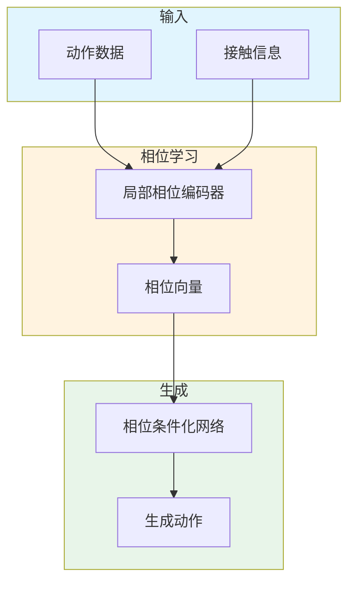

# Local Motion Phases for Learning Multi-Contact Character Movements

**论文信息**: SIGGRAPH 2020, Sebastian Starke et al., University of Edinburgh

**Link**: [ACM Digital Library](https://dl.acm.org/doi/10.1145/3386569.3392450)

---

## 一、核心问题

### 1.1 研究背景

**多接触角色动作学习**是角色动画的前沿问题：
- 角色与环境多种接触（手扶墙、脚踩台阶）
- 传统全局相位无法处理
- 需要更灵活的表示

**传统方法的挑战**：
- 全局相位假设所有部位同步
- 多接触动作相位不同步
- 难以学习复杂交互

### 1.2 核心问题

**如何学习多接触角色动作的灵活相位表示？**

### 1.3 本文方法

论文提出了 **Local Motion Phases**：

**核心思想**：
1. 每个身体部位学习独立相位
2. 局部相位捕捉异步运动
3. 支持多接触交互

**关键创新**：
- Local phase 表示
- 相位 - 条件化神经网络
- 多接触动作生成

---

## 二、核心贡献

1. **Local Motion Phases**
   - 每个部位独立相位
   - 异步运动建模
   - 多接触支持

2. **Phase-Manifold 学习**
   - 无监督学习相位
   - 相位空间聚类
   - 动作生成

---

## 三、大致方法

### 3.1 框架概述

### 3.2 Local Phase 表示

**全局相位**：
$$\phi_{global} \in [0, 2\pi)$$

**局部相位**：
$$\phi = \{\phi_{left\_foot}, \phi_{right\_foot}, \phi_{left\_hand}, \phi_{right\_hand}, ...\}$$

---

## 四、训练细节

### 4.1 数据集

- 多接触 mocap 数据
- 攀爬、扶墙、蹲下等
- 复杂环境交互

### 4.2 训练策略

1. **相位学习**：无监督学习局部相位
2. **动作生成**：相位条件化生成
3. **接触预测**：预测接触状态

---

## 五、实验与结论

### 5.1 定性结果

- 生成多接触动作
- 相位过渡流畅
- 环境交互自然

### 5.2 应用场景

1. **游戏角色攀爬**
2. **VR 环境交互**
3. **动画制作**

---

## 六、局限性

1. **相位数量固定**
2. **新接触类型需要训练**
3. **复杂交互有限**

---

**笔记说明**：本文是 SIGGRAPH 2020 关于多接触动作学习的工作，提出了 Local Motion Phases。理解本文有助于学习复杂角色动作生成方法，与 Phase-Functioned Neural Networks 等工作形成对比。
