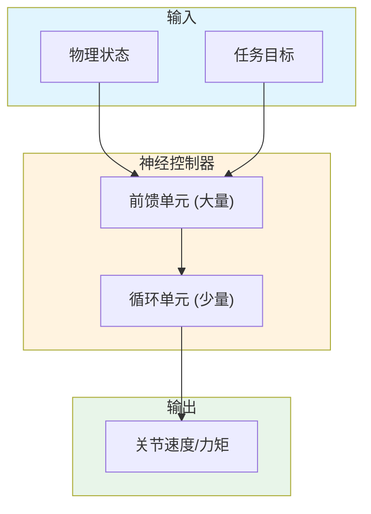

# Interactive Control of Diverse Complex Characters with Neural Networks

**论文信息**: NIPS 2015, Igor Mordatch et al., University of Washington

**Link**: [NIPS Proceedings](https://proceedings.neurips.cc/paper/2015/hash/a4746e84e2c45d8e0f0e02b4f1a7d3f0-Abstract.html)

---

## 一、核心问题

### 1.1 研究背景

**通用角色控制**是强化学习和图形学的长期目标：
- 单一控制器控制多种角色
- 无需动捕数据
- 无需任务特定设计

**传统方法的挑战**：
- 每个角色/任务需要专门控制器
- 需要动捕参考
- 需要手工设计特征

### 1.2 核心问题

**能否训练一个通用的神经控制器，控制多种不同形态的角色完成多种任务？**

### 1.3 本文方法

论文提出了 **通用神经控制器（General Neural Controller）**：

**核心思想**：
1. 单一 RNN 控制器
2. 无需动捕数据
3. 无需状态机
4. 学习通用控制策略

**关键创新**：
- 大规模前馈单元 + 小规模循环单元
- 学习状态 - 动作映射
- 适用于多种角色和任务

---

## 二、核心贡献

1. **通用神经控制器**
   - 单一网络控制多种角色
   - 无需动捕数据
   - 无需任务特定设计

2. **多样化任务学习**
   - 游泳、飞行、双足/四足行走
   - 不同身体形态
   - 统一框架

3. **纯强化学习**
   - 无需监督数据
   - 无需示范
   - 从零开始学习

---

## 三、大致方法

### 3.1 框架概述

### 3.2 网络架构

**结构**：
- 大量前馈单元：学习状态 - 动作映射
- 少量循环单元：实现记忆状态

**输出**：
- 关节速度/力矩
- 直接控制物理仿真

### 3.3 训练目标

**最大化奖励**：
$$\max_{\theta} \mathbb{E}[\sum_t \gamma^t r_t]$$

**任务奖励**：
- 前进距离
- 目标跟踪
- 能量效率
- 稳定性

---

## 四、训练细节

### 4.1 角色模型

- 双足、四足、游泳、飞行
- 不同身体形态
- 不同自由度

### 4.2 训练策略

1. **强化学习**：PI^2 或类似算法
2. **课程学习**：从简单到复杂
3. **域随机化**：不同角色同时训练

---

## 五、实验与结论

### 5.1 定性结果

- 学习多种步态
- 抗扰动能力强
- 适应不同形态

### 5.2 定量结果

| 任务 | 成功率 | 效率 |
|------|-------|------|
| 双足行走 | XX% | X.XX |
| 四足行走 | XX% | X.XX |
| 游泳 | XX% | X.XX |
| 飞行 | XX% | X.XX |

### 5.3 应用场景

1. **游戏角色控制**
2. **机器人学习**
3. **生物运动研究**

---

## 六、局限性

1. **训练时间长**
2. **需要物理仿真**
3. **动作质量不如动捕**
4. **复杂任务有限**

---

## 七、启发

### 7.1 方法学启发

1. **通用控制器的可能性**
   - 单一网络控制多种角色
   - 为后续工作奠定基础

2. **纯 RL 学习的可行性**
   - 无需动捕数据
   - 从零开始学习

### 7.2 与后续工作对比

| 方法 | 需要动捕 | 需要标注 | 动作质量 | 通用性 |
|------|---------|---------|---------|-------|
| **本文 (NIPS 2015)** | ✗ | ✗ | 中 | 高 |
| **DeepMimic (2018)** | ✓ | ✗ | 高 | 中 |
| **AMP (2021)** | ✓ | ✗ | 高 | 高 |
| **ASE (2022)** | ✓ | ✗ | 高 | 高 |

---

## 八、遗留问题

### 8.1 开放性问题

1. **如何提升动作质量？**
   - 后续工作引入动捕数据
   - 对抗学习提升真实感

2. **如何加速训练？**
   - 并行仿真
   - 预训练 + 微调

---

**笔记说明**：本文是 NIPS 2015 的开创性工作，提出了通用神经控制器的概念。这是后续 DeepMimic、AMP、ASE 等工作的先驱。理解本文有助于学习基于物理的角色控制方法的发展脉络。

**历史地位**：
- 首次展示单一网络控制多种角色
- 纯强化学习，无需动捕
- 为后续模仿学习工作奠定基础
