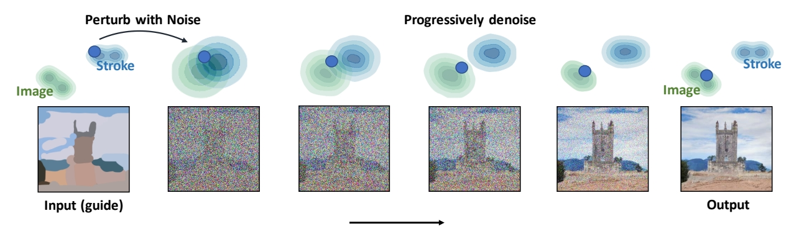
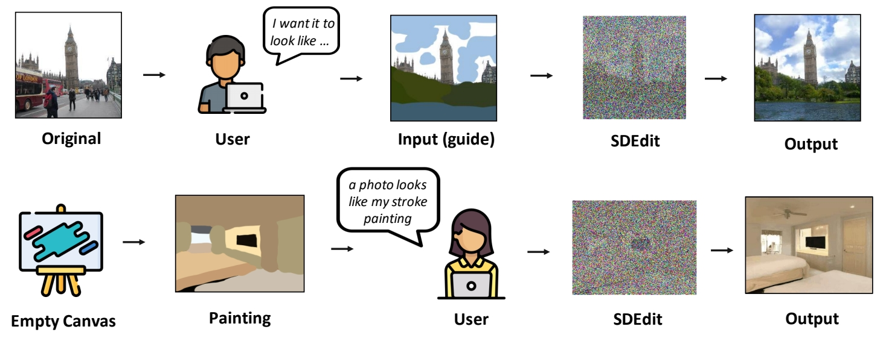
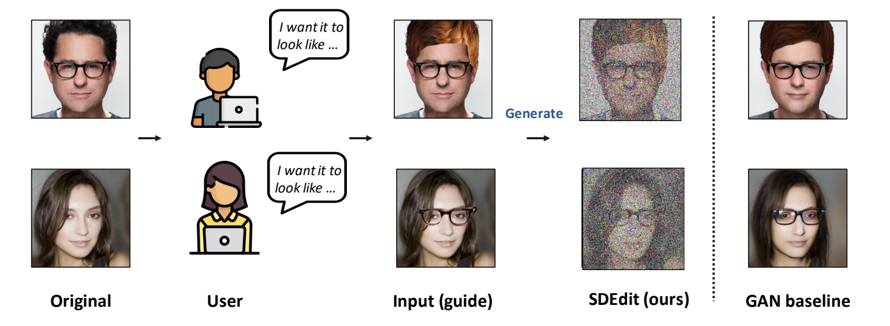
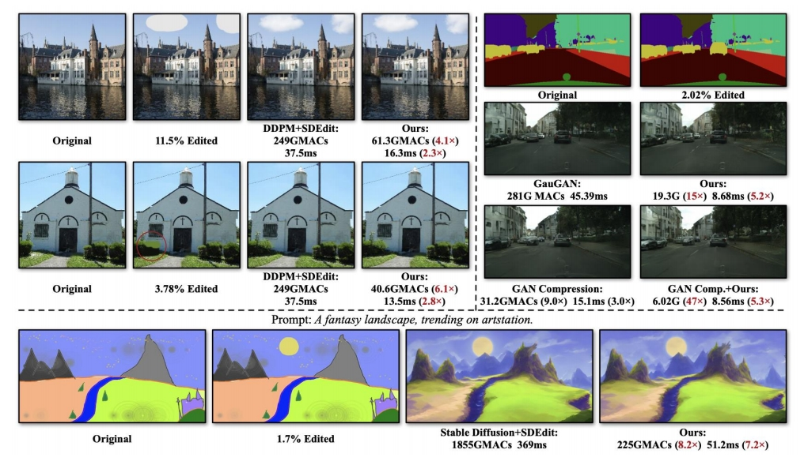

### guided synthesis／editing Task   

 

> &#x2705; 过去的 guided synthesis／editing 任务是用 GAN based 方法实现的。    

P12   
### Pipeline

 

**Gradually projects the input to the manifold of natural images.**

> 准备工作：一个预训练好的Image Diffusion Model  
> 第一步：perturb the input with **Gaussian noise**  
> 第二步：progressively remove the noise using a pretrained diffusion model.    
> [?] 怎样保证Denoise的图像与原始图像有高度的一致性？

### 特点

> 只需要一个预训练模型，不需要额外的finetune。  

P13   
### 其它应用场景

#### Fine-grained control using strokes

 

> 可以在Image上加上草图，也可以直接使用草图生成图像  

P16   
#### Image compositing  

 

> 把上面图的指定pixel patches应用到下面图上。  
> SDEdit的结果更合理且与原图更像。  

P17   
### 效率提升

Efficient Spatially Sparse Inference for Conditional GANs and Diffusion Models

 

原理：全图生成速度比较慢，因此针对被编辑区域进行部分生成。  

Li et al., <u>"Efficient Spatially Sparse Inference for Conditional GANs and Diffusion Models", </u>NeurIPS 2022    
