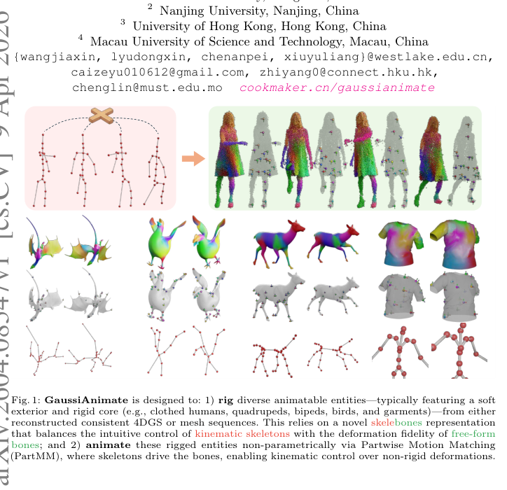
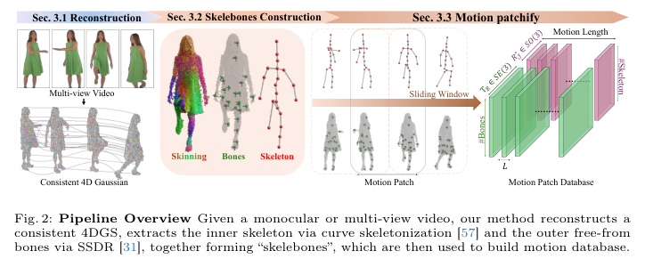
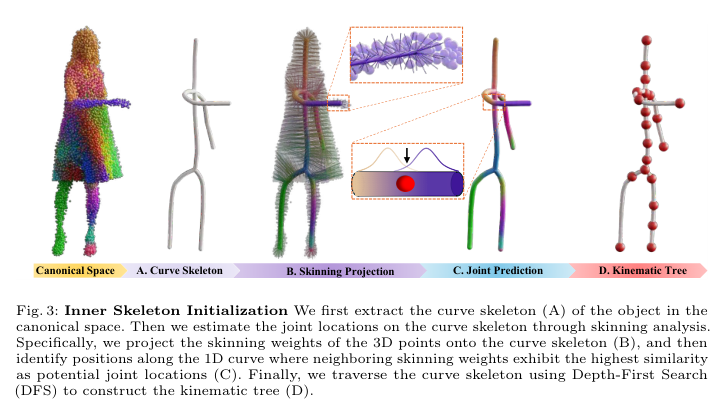
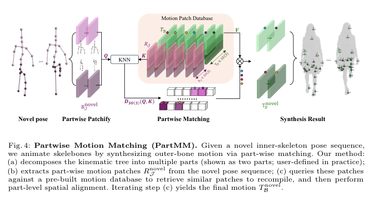
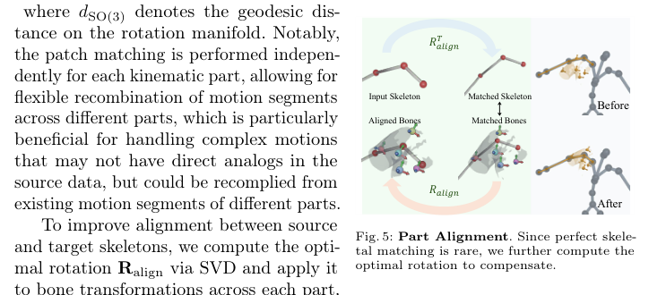
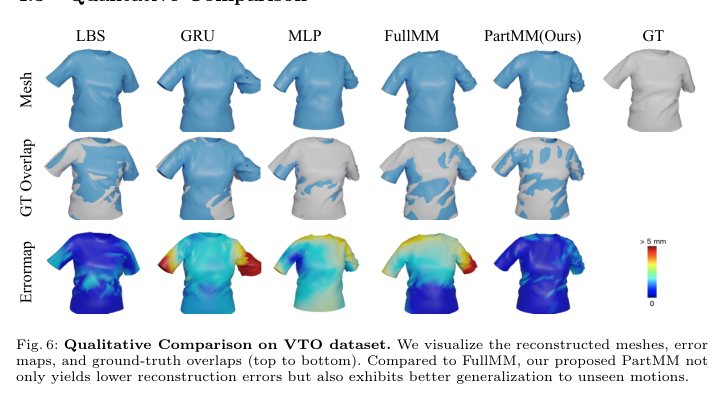
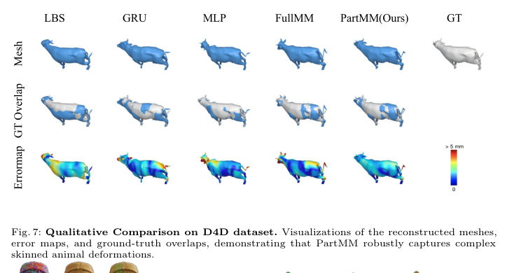
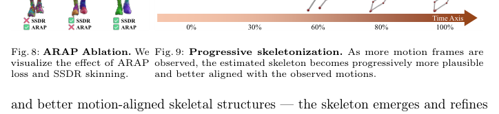

# GaussiAnimate: Reconstruct and Rig Animatable Categories with Level of Dynamics

- **作者**: Jiaxin Wang, Dongxin Lyu, Zeyu Cai, Zhiyang Dou, Cheng Lin, Anpei Chen, Yuliang Xiu (西湖大学)
- **机构**: Westlake University, Nanjing University, HKU, MUST
- **会议**: arXiv 2604.08547 (Apr 2026)
- **代码**: cookmaker.cn/gaussianimate

## 1. 研究背景与问题

### 核心问题
如何让 3DGS 重建的动态角色具备**可操控的动画能力**——从 "reconstruction for replay" 转向 "reconstruction for reanimation"？

### 控制力 vs. 形变精度的本质矛盾

| 需求 | 内层（控制） | 外层（表现） |
|------|------------|------------|
| **目标** | 紧凑、刚性的运动学骨架 | 高保真、非刚性表面形变 |
| **适用表示** | 层次化骨架 (SMPL 等) | Free-form bones / blobs |
| **典型例子** | 关节旋转驱动 | 衣物褶皱、软组织形变 |

**现有方法的局限**:
- **基于模板的方法** (SMPL, SMAL)：依赖预定义骨架，无法泛化到新类别
- **Bag-of-Bones** (BANMo)：缺少运动学约束，拓扑不正确
- **RigGS**：将骨架提取与渲染耦合，优化慢（~2小时 vs 本文~15分钟）
- **CAMM**：依赖首帧骨架初始化，缺乏运动自适应性

### 本文方法：Skelebones（骨架-骨骼脚手架蒙皮系统）
提出 **Scaffold-Skin Rigging System**，显式建模 **Level of Dynamics**：
- **内层**：运动学骨架（Kinematic Skeleton）→ 捕捉低频刚性关节运动
- **外层**：自由骨骼（Free-form Bones）→ 表示高频非刚性表面形变
- **绑定**：PartMM（部件级运动匹配）→ 骨架驱动骨骼



## 2. 方法总览



整体流程分为三个阶段：

```
输入视频（单目/多视）
    ↓
[阶段1] 重建（Sec 3.1）
    Deformable 3DGS + ARAP 正则化 → 时序一致的 4D 高斯序列
    ↓
[阶段2] Skelebones 构建（Sec 3.1 + 3.2）
    运动聚类 + SSDR → 外层 Bones
    MCS 骨架化 + 关节检测 + IK → 内层 Skeleton
    ↓
[阶段3] PartMM 绑定与动画（Sec 3.3）
    构建运动数据库 → 部件级匹配 + 对齐 + 粗到细细化 → 新姿态动画
```

## 3. 阶段一：时序一致的 4D 高斯重建

### 3.1 Deformable 3DGS

采用 SC-GS 的框架，用 MLP 形变场 $D_{\text{MLP}}(f)$ 将 canonical 高斯 $\mathcal{G}_c$ 变形到第 $f$ 帧 $\mathcal{G}_f$：

$$\mathcal{G} _f ^{(\cdot)} = \mathcal{G} _c ^{(\cdot)} + D _{\text{MLP}} ^{(\cdot)}(f), \quad (\cdot) \in \{\mu, c, \sigma, q, s\}$$

> **📖 参考笔记**：SC-GS 的详细内容参见 [234](234.md)（Sparse-Controlled Gaussian Splatting，CVPR 2024）。核心思路是用稀疏控制点 + MLP 形变场将 canonical 高斯映射到各帧，GaussiAnimate 直接借用了这一 deformable 建模框架。

**设计选择**：使用**各向同性高斯**（而非各向异性），牺牲少量渲染质量以换取对新姿态更好的泛化能力（following RigGS）。

**训练损失**：光度损失（L1 + D-SSIM）：

$$\mathcal{L} _{\text{photo}} = \sum _{f=1} ^{F} \left[(1-\lambda)\|I _f - \hat{I} _f\|_1 + \lambda(1 - \text{D-SSIM}(I _f, \hat{I} _f))\right]$$

### 3.2 局部刚性正则化（ARAP）

为了满足后续 SSDR 对时序一致性的要求，引入 ARAP 约束 + 距离保持约束：

$$\mathcal{L} _{\text{rigid}} = \sum _{(i,j)\in K} \left[ \underbrace{\|(x _f ^i - x _f ^j) - R _i(x _c ^i - x _c ^j)\|_2 ^2} _{\text{ARAP 项}} + \underbrace{(\|x _f ^i - x _f ^j\|_2 - \|x _c ^i - x _c ^j\|_2) ^2} _{\text{距离保持项}} \right]$$

其中 $R_i \in SO(3)$ 通过 SVD 从协方差矩阵计算得到。$K_m$ 为第 $m$ 个聚类的 KNN 邻域集合。

**ARAP 的作用**：抑制高斯点的过度变形，使后续运动聚类更稳定，骨骼结构更连贯。

### 3.3 运动聚类

> **📖 参考笔记**：LBG-VQ 运动聚类的详细内容参见 [236](236.md)（Robust and Accurate Skeletal Rigging from Mesh Sequences, SIGGRAPH 2014，Le & Deng）。本文直接采用其运动感知聚类策略，将高斯点按运动相似性分组为刚性簇。

基于 **Gestalt 共同命运定律**——具有相似运动的元素被视为同一组——采用 **LBG-VQ**（Linde-Buzo-Gray Vector Quantization）将高斯点分组为刚性聚类。

- 输入：所有帧的高斯点位置 $\{\mathcal{G}_f\}_{f=1}^F$
- 输出：每帧每聚类的刚性变换 $\hat{T}_B \in SE(3)^{F \times B}$
- 聚类数量 $B$ 通过**从粗到细的分裂细化**过程自动确定（最大 50）

> **💡 为什么只借用 [236](236.md) 的聚类，而不使用其完整的绑定流程？**
>
> [236](236.md) 的完整绑定流程（拓扑重建 MST、迭代权重更新、关节约束优化、骨骼剪枝）是为**网格（Mesh）**设计的，严重依赖三角面片的邻接拓扑关系。而 3DGS 是**无拓扑的点云表示**，没有面片连接信息，因此 236 中依赖拓扑的步骤（如边权重计算、刚性拉普拉斯正则化）无法直接移植。
>
> LBG-VQ 运动聚类是 236 中**唯一纯运动驱动**的步骤——它只看每个点的位移轨迹是否相似，不依赖任何拓扑信息，因此可以无缝适配到 3DGS 上。

### 3.4 SSDR 皮肤分解

> **📖 参考笔记**：SSDR 的详细内容参见 [235](235.md)（Smooth Skinning Decomposition with Rigid Bones, SIGGRAPH 2012）。该方法从示例姿态中自动提取 LBS 参数（骨骼变换 + 皮肤权重），本文直接借用该算法作为后处理步骤，将运动聚类结果压缩为稀疏的 LBS 表示。

用 SSDR（Smooth Skinning Decomposition with Rigid Bones）拟合 LBS 参数：

- **输入**：运动聚类得到的初始刚体变换 $\hat{T}_B$
- **输出**：
  - 皮肤权重 $W \in \mathbb{R}^{N \times B}$（$N$ 个高斯、$B$ 个骨骼）
  - 优化后的骨骼变换 $T_B \in SE(3)^{F \times B}$

这步将密集的 4D 变形压缩为**稀疏的刚体骨骼变换**，近似非刚性表面动力学，形成 Skelebones 的**外层 Bones**。

> **💡 [235](235.md) 与 [236](236.md) 的关系及本文的选用策略**
>
> [235](235.md)（SSDR, SIGGRAPH 2012）和 [236](236.md)（Le & Deng, SIGGRAPH 2014）出自同一作者组，是同一研究路线的两篇递进工作：
> - **[235](235.md)** 解决"给定骨骼结构，求最优的 LBS 权重和变换"——输入需要已知的骨骼数量和拓扑
> - **[236](236.md)** 解决"什么都不给，从头自动生成骨骼系统"——包含聚类初始化、拓扑重建（MST）、迭代绑定、骨骼剪枝
>
> 236 可以看作是 235 的"加强版"，补齐了自动确定骨骼数量和拓扑的能力。但 236 的迭代绑定和拓扑重建依赖网格拓扑，无法在 3DGS 上直接使用。
>
> **本文的选用策略**：从 [236](236.md) 取其"分组能力"（LBG-VQ 运动聚类，确定骨骼数量和初始变换），从 [235](235.md) 取其"求解能力"（块坐标下降 + 闭式 SVD 精确求解 LBS 参数）。两者拼成一条适配 3DGS 无拓扑场景的管道：
>
> ```
> [236] LBG-VQ 聚类 → 初始刚体变换 T̂_B（骨骼分组 + 初始化）
>         ↓ （不运行 236 的拓扑重建、迭代绑定、剪枝）
> [235] SSDR → 皮肤权重 W + 优化后的骨骼变换 T_B（LBS 参数精炼）
> ```
>
> 内层运动学骨架的拓扑则由本文原创的 MCS 曲线骨架 + 皮肤权重梯度关节检测方案生成，与 236 的 MST 拓扑重建无关。

## 4. 阶段二：内层运动学骨架提取

外层 bones 虽然能捕捉表面变形，但缺乏解剖学对应关系，无法直观操控。因此需要提取内层运动学骨架。



### 4.1 Mean Curvature Skeleton 提取

从 canonical 形状 $\mathcal{G}_c$（取第 0 帧）直接提取 **Mean Curvature Skeleton (MCS)**，记为 $\mathcal{S}$。

**选择 MCS 而非 MAT 的原因**：
- MAT 对表面噪声敏感，容易产生虚假分支
- MCS 提供**直接的表面-骨架对应关系**，便于后续将 SSDR 皮肤权重投影到骨架上

### 4.2 基于皮肤权重梯度的关节检测

**核心观察**：解剖学关节处，皮肤权重 $W$ 会出现**急剧的空间变化**。

$$\mathcal{J} = \{ s _j \in \mathcal{S} \mid \nabla W(s _j) > \tau \}$$

- $\mathcal{S} = \{s_j \in \mathbb{R}^3 \mid j = 1, \ldots, M\}$：曲线骨架的离散点集
- $\nabla W(s_j)$：骨架点 $s_j$ 处的皮肤权重梯度
- $\tau = 0.3$：权重变化的阈值

**具体过程**：
1. 将 3D 高斯点的 SSDR 皮肤权重投影到曲线骨架上
2. 沿一维曲线骨架计算权重的空间梯度
3. 梯度超过阈值的点即为关节候选

### 4.3 运动学树构建

将检测到的关节组织为树状结构 $T = (\mathcal{J}, A)$：

1. **保留边**：保留与曲线骨架空间对齐的边
2. **确定父子关系**：从**根关节**（距全局质心最近的关节）出发，DFS 遍历
3. **输出**：稀疏骨架表示 $\{\mathcal{J}, E\}$，$E \subset \mathcal{J} \times \mathcal{J}$ 编码关节间的边

**Part 的定义**：运动学树中**两个关节之间的一段骨骼**即为一个 Part。每个 Part 有对应的骨骼子集 $\mathcal{B}'$。实际中划分为 **5 个重叠的 Part**。

### 4.4 骨骼姿态优化（IK）

通过逆运动学求解每帧的局部关节旋转 $R_\mathcal{J} = \{R_j\}_{j=1}^J$，最小化：

$$R _\mathcal{J} ^* = \arg\min _{R _\mathcal{J}} \sum _{f=1} ^{F} \left[ \mathcal{L} _{\text{CD}}(\mathcal{J} _c(R _\mathcal{J}), \mathcal{S} _f) + \lambda \, \mathcal{L} _{\text{L2}}(\mathcal{G} _c(R _\mathcal{J}), \mathcal{G} _f) \right]$$

- 第一项：Chamfer 距离，使变形后的骨架关节与每帧的曲线骨架对齐
- 第二项：L2 距离，使前向运动学变形后的高斯与观测高斯一致

### 4.5 渐进式骨架优化

随着更多运动帧被观测，骨架质量**渐进提升**：
- 少量帧 → 粗糙骨架，可能遗漏细节
- 更多帧 → 接触更丰富的姿态和变形 → 更准确的运动聚类 → 更好的骨架结构
- **关键特性**：骨架从运动观测中"自然涌现"（motion-adaptive）

## 5. 阶段三：PartMM（部件级运动匹配）

> **重要纠正**：PartMM 不是基于 MLP 的概率加权绑定，而是一个**非参数化的运动匹配（Motion Matching）算法**，灵感来自 motion retargeting 的 KV 检索思想。



### 5.1 问题定义

**已知**：
- 内层关节旋转 $R_\mathcal{J} \in SO(3)^{F \times J}$
- 外层骨骼变换 $T_B \in SE(3)^{F \times B}$
- 皮肤权重 $W \in \mathbb{R}^{N \times B}$

**问题**：给定新的骨架姿态 $R_\mathcal{J}^{\text{novel}}$，如何合成对应的外层骨骼运动 $T_B^{\text{novel}}$？

**核心困难**：外层 free-form bones 与内层 kinematic skeleton 之间**没有显式对应关系**，无法直接映射。

### 5.2 KVQ 检索框架

将骨骼绑定转化为**非参数化的 patch 匹配问题**：

| 角色 | 含义 | 空间 |
|------|------|------|
| **Query (Q)** | 目标骨架运动（新姿态） | $SO(3)$ 关节旋转空间 |
| **Key (K)** | 源骨架运动（数据库中） | $SO(3)$ 关节旋转空间 |
| **Value (V)** | 源骨骼运动（数据库中） | $SE(3)$ 骨骼变换空间 |

### 5.3 运动分片（Motion Patchifying）

从重建的 Skelebones 序列中提取运动片段，构建源运动数据库：

$$\mathcal{D} _{\text{src}} = \{\mathcal{P} _l \mid \mathcal{P} _l = (R _\mathcal{J} ^l, T _B ^l), \; l = 1, \ldots, L\}, \quad L = F - p + 1$$

- $p = 7$：默认分片大小（7 帧一个 patch）
- 每个分片同时包含骨架旋转和骨骼变换的配对数据

### 5.4 部件级匹配与对齐

**这是 PartMM 的核心创新——在 Part 级别而非全局进行匹配**。

对于每个运动学 Part $\mathcal{J}'$（对应骨骼 Part $\mathcal{B}'$）：

**Step 1: KNN 检索**（在 $SO(3)$ 空间）

$$\mathcal{P} ^{\text{match}} = \arg\min _{\mathcal{P} _l \in \mathcal{D} _{\text{src}}} d _{SO(3)}(R _{\mathcal{J}'} ^{\text{novel}}, R _{\mathcal{J}'} ^l)$$

- $d_{SO(3)}$：旋转流形上的测地距离
- $k = 7$：取 7 个最近邻
- **关键**：每个 Part 独立匹配，允许跨 Part 灵活重组运动片段

**Step 2: SVD 刚性对齐**

由于完美匹配很少，计算最优旋转 $R_{\text{align}}$（via SVD）来补偿源-目标骨架的旋转差异：

$$T _{\mathcal{B}'} ^{\text{aligned}} = R _{\text{align}} \circ T _{\mathcal{B}'} ^{\text{match}}$$



### 5.5 粗到细细化

通过**运动金字塔**进行多尺度细化：

$$T _{\mathcal{B}'} ^{\ell+1} = (1 - \lambda _\alpha) \, T _{\mathcal{B}'} ^{\ell} + \lambda _\alpha \, \bar{T} _{\mathcal{B}'} ^{\ell}$$

- 每层 $\ell$ 下采样率 $2^{5-\ell}$（共 5 层金字塔）
- $\lambda_\alpha = 0.7$：混合权重
- $\bar{T}_{\mathcal{B}'}^{\ell}$：该层匹配分片的加权平均

从粗尺度到细尺度迭代混合，确保平滑的时间过渡和几何合理性。

### 5.6 PartMM 伪代码

```
输入: R_query (新骨架运动), D_src (运动数据库), parts (Part 分组)
输出: T_out (新骨骼运动)

T_out = {}
for part in parts:
    Q = R_query[part]           # Query: 该 Part 的新骨架旋转
    K = D_src[part].R           # Key:   该 Part 的数据库骨架旋转
    V = D_src[part].T           # Value: 该 Part 的数据库骨骼变换

    idx = knn_match(Q, K, k=7)  # SO(3) 空间 KNN 检索
    K_match = K[idx]
    V_match = V[idx]

    R_align = svd_align(Q, K_match)        # SVD 对齐
    V_aligned = bmm(R_align, V_match)       # 对齐后的骨骼变换

    T_out[part] = blend(V_aligned)          # 混合输出

return T_out
```

### 5.7 PartMM vs 其他绑定方式

| | LBS | BoB | MLP/GRU | PartMM |
|--|-----|-----|---------|--------|
| **绑定方式** | 皮肤权重传递 | 骨骼袋 + 网络驱动 | 神经网络回归 | 非参数化运动匹配 |
| **变换类型** | 刚体（线性） | 刚体（LBS） | 非线性 | 复用数据库中的变换 |
| **泛化能力** | 关节处伪影严重 | 依赖模板 | 姿态外推退化 | **强（尤其低数据量）** |
| **需要训练** | 否 | 是 | 是 | **否（training-free）** |
| **新姿态处理** | 插值 | 网络推理 | 外推 | **检索+混合** |
| **计算开销** | 极低 | 中等 | 推理 | 极低（匹配+对齐） |

## 6. 实验结果

### 6.1 新视角合成（Table 2）

| 方法 | Rig | D-NeRF PSNR/SSIM/LPIPS | DG-Mesh PSNR/SSIM/LPIPS | 时间 |
|------|-----|------|------|------|
| SC-GS | No | 43.04/0.998/0.007 | 38.96/0.993/0.014 | ~1hr |
| AP-NeRF | Yes | 30.94/0.970/0.035 | 31.83/0.967/0.046 | >1day |
| RigGS | Yes | 40.82/0.996/0.011 | 37.65/0.991/0.017 | ~2hrs |
| **Ours** | **Yes** | **41.00/0.996/0.015** | **37.59/0.990/0.022** | **~15min** |

**关键优势**：解耦范式（rigging 与渲染分离）使得优化时间从 RigGS 的 ~2小时 降至 ~15分钟。

### 6.2 新姿态动画（Table 3 - 几何评估）

| 方法 | VTO T-shirt/Dress RMSE | D4D Animals RMSE |
|------|------|------|
| Robust LBS | 33.7/52.2 | 65.3 |
| Ours_MLP | 23.9/36.8 | 68.8 |
| Ours_GRU | 22.9/37.5 | 58.4 |
| FullMM | 38.2/37.0 | 53.3 |
| **PartMM** | **17.4/36.7** | **54.6** |

### 6.3 新姿态动画（Table 4 - 渲染评估）

| 方法 | DNA-Rendering PSNR/SSIM/LPIPS | ActorHQ PSNR/SSIM/LPIPS |
|------|------|------|------|------|------|
| D3DGS (GT) | 32.16/0.978/0.033 | 30.56/0.938/0.136 |
| SMPL+LBS | 0.948/0.049 | 17.54/0.738/0.315 |
| SMPL+BoB | 0.935/0.057 | 16.66/0.722/0.259 |
| **SMPL+PartMM** | **0.964/0.039** | **24.26/0.850/0.182** |

**核心数字**：
- vs LBS：**+17.3%** PSNR（DNA-Rendering）
- vs BoB：**+21.7%** PSNR（ActorHQ，实际 +45.6%）
- vs Robust LBS：**48.4%** RMSE 改进（VTO）
- vs MLP/GRU：>20% RMSE 改进

### 6.4 定性比较





PartMM 在衣物（VTO）和动物（D4D）上均能稳健捕捉复杂的蒙皮变形。

### 6.5 消融实验



**ARAP 的作用**：
- 无 ARAP → 高斯点变形过度 → 运动聚类不稳定 → 骨骼结构碎片化
- 有 ARAP + 无 SSDR → 过密的骨骼集 → 碎片化皮肤权重 → 骨架退化
- 有 ARAP + 有 SSDR → **连贯的骨骼结构 + 平滑的皮肤权重**

**渐进式骨架化**：
- 观测帧越多 → 接触更多姿态 → 更准确的运动聚类和皮肤权重 → 骨架从运动中自然涌现并逐步完善

## 7. 与现有方法的全面对比（Table 1）

| 方法 | 绑定方式 | Template Free | Motion Adaptive | Topology Correct | Non-rigid Dynamic |
|------|---------|:---:|:---:|:---:|:---:|
| Robust | Skeleton | Yes | Yes | No | No |
| TAVA | Skeleton | No | No | Yes | No |
| BANMo | Skeleton | No | Yes | Yes | No |
| CAMM | Skeleton | Yes | No | No | No |
| AP-NeRF | Skeleton | Yes | No | No | No |
| WIM | Skeleton+Bones | Yes | Yes | No | No |
| SC-GS | Skeleton | Yes | No | No | Yes |
| DressRecon | SMPL+Bones | No | No | Yes | Yes |
| RigGS | Skeleton+Bones | Yes | Yes | No | Yes |
| CANOR | Bones | Yes | No | No | Yes |
| **Ours** | **Skelebones** | **Yes** | **Yes** | **Yes** | **Yes** |

**GaussiAnimate 是唯一同时满足全部五个属性的方法**。

## 8. 实现细节

- **D_MLP**：8 层 MLP，特征维度 256
- **重建训练**：40,000 迭代，单张 RTX 4090D，~15 分钟（Adam）
- **后处理（训练无关）**：运动聚类 + SSDR + 骨架化 + PartMM，共 ~2 分钟
- **运动聚类**：最大骨骼数 50，骨架化阈值 $\tau = 0.3$
- **PartMM 匹配**：5 个重叠 Part，KNN $k=7$，5 层金字塔，分片大小 $p=7$

## 9. 局限性与未来方向

1. **计算性能**：尚未达到实时，但数据库构建可通过神经压缩 / neural SSDR 加速
2. **骨架提取敏感性**：依赖皮肤权重质量和 canonical 形状精度，复杂衣物（如裙子）的髋关节定位可能偏差
3. **渲染伪影**：新姿态下可能因高斯覆盖不足出现空洞，可通过 mesh-based 渲染或 image-space refinement 解决

## 10. 核心贡献总结

| 贡献 | 内容 |
|------|------|
| **表示 (Skelebones)** | 骨架-骨骼脚手架蒙皮系统，显式建模 Level of Dynamics，平衡控制力与形变精度 |
| **算法 (PartMM)** | 非参数化部件级运动匹配，training-free，低数据量下强泛化 |
| **框架 (GaussiAnimate)** | 完全自动的系统，从 4DGS 重建到稳健重动画，template-free，支持人/衣物/动物 |

## 11. 与知识库的关联

### 3DGSAnimation
- **Skeleton Agent 类别**的首篇条目
- Skelebones 表示 = 内层骨架 + 外层骨骼，填补了 "无代理" 和 "物理仿真代理" 之间的空白
- PartMM 的非参数化匹配思路可作为方法论标杆

### GAMES105 — Skinning
- 直接对比并超越 LBS（Skinning 核心内容）
- SSDR 将非刚性形变压缩为 LBS 系统 → 本质上仍是 LBS 框架
- PartMM 不是 LBS 的替代，而是**骨架到骨骼的绑定方式**的替代

### 关键区别
- 之前笔记将 PartMM 错误描述为 "MLP 概率加权绑定"，实际是**非参数化运动匹配算法**
- PartMM 不涉及 MLP 残差、softmax 概率或 affinity loss
- 骨骼变形仍通过 LBS（$T_B$ + 皮肤权重 $W$），PartMM 解决的是**如何从新骨架姿态得到 $T_B$**

## Reference
- arXiv: 2604.08547
- PDF: [ReadPapers/220](../PDF/220.pdf)
