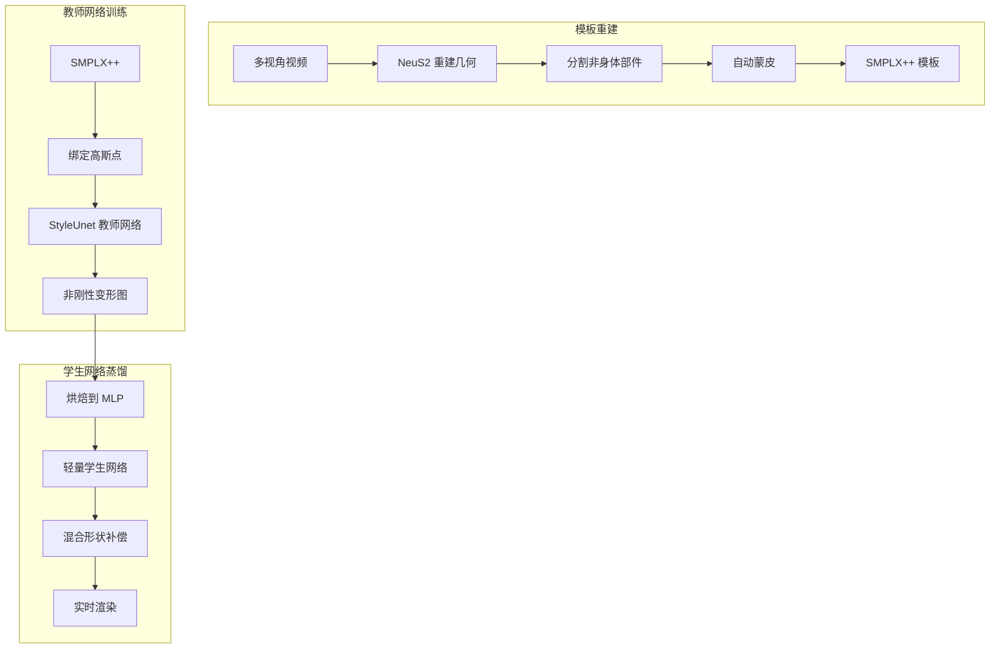
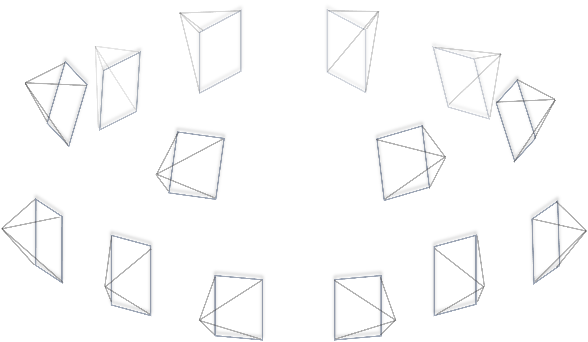
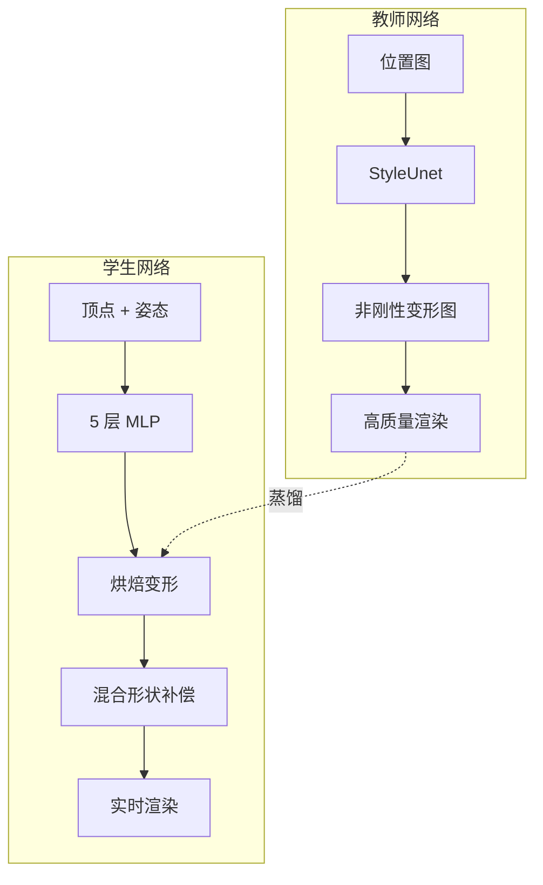
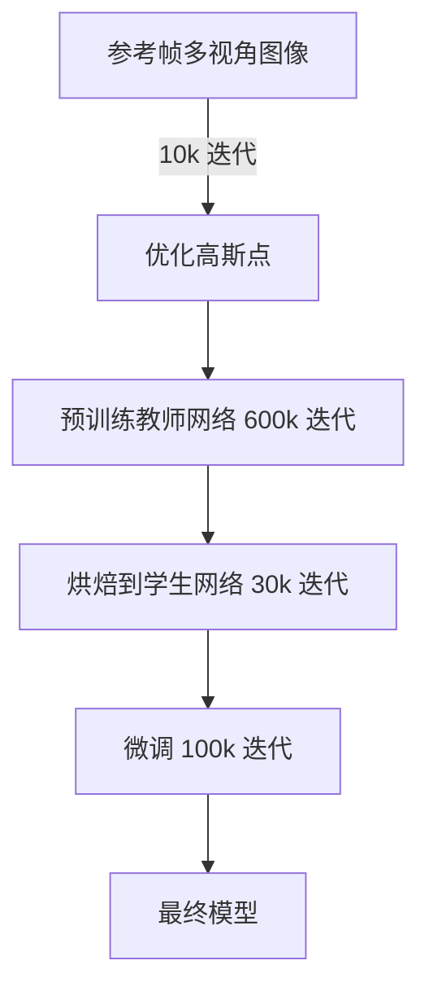
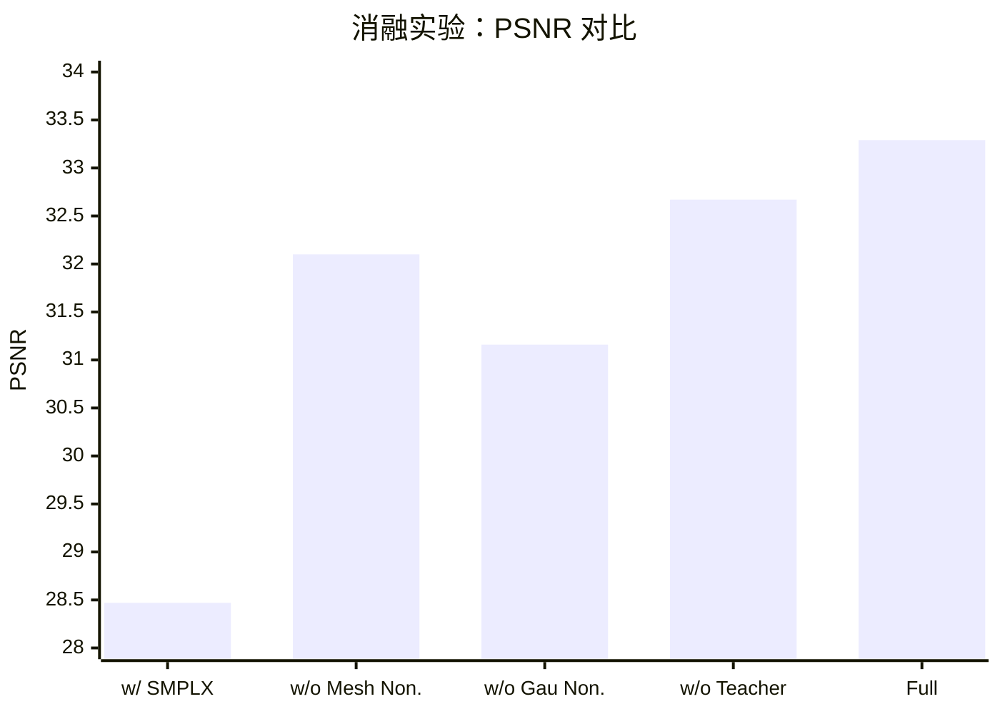
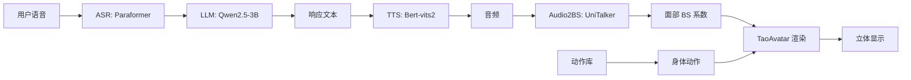

# TaoAvatar: Real-Time Lifelike Full-Body Talking Avatars for Augmented Reality via 3D Gaussian Splatting

**论文 ID**: 225  
**arXiv**: 2503.17032v2  
**机构**: 阿里巴巴集团  
**发布时间**: 2025 年 3 月（修订版 2025 年 7 月）

---

## 1. 核心问题

### 1.1 研究目的

创建**逼真的 3D 全身说话数字人**，能够在移动设备和 AR 眼镜（如 Apple Vision Pro）上**实时运行**。

### 1.2 现有方法及局限

现有方法存在以下问题：

| 方法类型 | 代表工作 | 局限性 |
|---------|---------|--------|
| **参数化模型** | SMPL/SMPLX | 无法处理宽松衣物、复杂几何形状和高频细节（如飘动的裙子、细发丝） |
| **NeRF 方法** | 各类神经辐射场 | 体积渲染速度慢，难以实时运行 |
| **3DGS 方法** | GaussianAvatar 等 | 面部表情和身体动作的细粒度控制不足，细节不够，无法在移动设备实时运行 |

### 1.3 本文方法

提出 **TaoAvatar**——一个基于 3D Gaussian Splatting (3DGS) 的**高保真、轻量化全身说话数字人框架**。

核心创新：
1. 构建个性化的**穿衣参数化模板 SMPLX++**，将高斯点绑定到网格上作为纹理
2. 提出**教师 - 学生框架**，用 StyleUnet 作为教师网络学习复杂的姿态相关非刚性变形
3. 通过**知识蒸馏**将非刚性变形"烘焙"到轻量级 MLP 学生网络
4. 设计**两个轻量化混合形状（blend shapes）**补偿细节

### 1.4 效果


- 在 Apple Vision Pro 上实现 **2K 分辨率、90 FPS 立体渲染**
- 渲染质量超越现有最先进方法
- 支持面部表情、手势、身体姿态驱动

---

## 2. 核心贡献

1. **TaoAvatar 框架**：新颖的教师 - 学生框架，创建拓扑一致、几何对齐的高保真轻量化 3DGS 全身说话数字人

2. **非刚性变形烘焙策略**：
   - 提出非刚性变形烘焙技术
   - 设计两个轻量化混合形状补偿
   - 实现移动端高效高性能渲染

3. **TalkBody4D 数据集**：
   - 多视角全身说话数据集
   - 包含丰富的面部表情、手势和同步音频
   - 即将开源

---

## 3. 背景知识

在深入方法之前，先了解几个关键概念：

### 3.1 SMPLX 参数化人体模型

SMPLX 是一个广泛使用的人体参数模型，包含：
- **身体姿态参数** \\( \theta \\)：控制关节旋转
- **形状参数** \\( \beta \\)：控制人体型
- **表情参数** \\( \psi \\)：控制面部表情
- **手部姿态参数**：控制手指动作

**优点**：通用性强，可直接驱动动画  
**缺点**：只能表示裸体，无法处理衣物、头发等

### 3.2 3D Gaussian Splatting (3DGS)

3DGS 是一种**显式点基表示**方法，用 3D 高斯分布表示场景：

每个高斯点包含属性：
- **位置** \\( \mathbf{u} \\)
- **旋转** \\( \mathbf{r} \\)
- **缩放** \\( \mathbf{s} \\)
- **不透明度** \\( o \\)
- **球谐系数** \\( sh \\)（表示视角相关颜色）

**优点**：
- 实时渲染（>100 FPS）
- 高质量渲染
- 可处理复杂材质（头发、半透明等）

### 3.3 线性混合蒙皮（LBS）

LBS 是计算机图形学中驱动角色动画的标准技术：

$$
\mathbf{v}' = \sum_{i=1}^{N} w_i \cdot (\mathbf{R}_i \mathbf{v} + \mathbf{t}_i)
$$

其中：
- \\( \mathbf{v} \\) 是顶点在标准姿态下的位置
- \\( w_i \\) 是第 \\( i \\) 个关节的权重
- \\( \mathbf{R}_i, \mathbf{t}_i \\) 是第 \\( i \\) 个关节的旋转和平移

**核心思想**：用骨骼驱动网格变形

### 3.4 非刚性变形

LBS 只能处理**刚性变换**（旋转 + 平移），但真实人体和衣物还有**非刚性变形**：

- 肌肉伸缩
- 衣物褶皱和摆动
- 头发飘动

这些无法用骨骼直接驱动，需要额外建模。

---

## 4. 方法详解

### 4.1 整体框架

TaoAvatar 的整体流程如下图所示：




### 4.2 混合穿衣参数表示（SMPLX++）

#### 4.2.1 问题



原始 SMPLX 只能表示裸体，无法处理：
- 宽松衣物（裙子、外套）
- 头发
- 鞋子
- 配饰

#### 4.2.2 解决方案

创建 **SMPLX++**——扩展的穿衣参数模型：

**步骤**：
1. 选择接近 T-pose 的帧作为参考帧（可见细节多，几何不粘连）
2. 使用 **NeuS2** 从多视角图像重建完整几何
3. 用 4D-Dress 方法分割出非身体部件（衣服、头发、鞋子）
4. 估计 SMPLX 形状和姿态
5. 使用 **Robust Skinning Transfer** 自动为非身体部件生成蒙皮权重
6. 通过逆向蒙皮变换回标准 T-pose
7. 组合裸体 SMPLX 和非身体部件 = **SMPLX++**

**结果**：
- 约 22k 顶点，45k 面片
- 其中 23k 面片用于衣物、头发、鞋子
- 保留 SMPLX 原生面部表情和手部控制能力

### 4.3 网格绑定高斯点作为纹理

#### 4.3.1 核心思想

将 3D 高斯点**绑定到三角形面片上**，作为"纹理"随网格同步运动。

#### 4.3.2 高斯点局部属性

对于每个三角形面片 \\( F_f(v_1, v_2, v_3) \\)，随机初始化 \\( k \\) 个高斯点，每个高斯点维护**局部坐标系**下的属性：

$$
\{f, (u, v), \gamma, \mathbf{r}, \mathbf{s}, o, sh\}
$$

- \\( f \\)：父三角形索引
- \\( (u, v) \\)：重心坐标
- \\( \gamma \\)：沿法线方向的平移
- \\( \mathbf{r} \\)：局部空间旋转
- \\( \mathbf{s} \\)：局部空间缩放
- \\( o \\)：不透明度
- \\( sh \\)：球谐系数

#### 4.3.3 从局部到世界坐标变换

构建基于父三角形的变换矩阵：

$$
\mathbf{p} = u \cdot \mathbf{v}_1 + v \cdot \mathbf{v}_2 + (1 - u - v) \cdot \mathbf{v}_3
$$

$$
\mathbf{R} = [\mathbf{n}, \mathbf{q}, \mathbf{n} \times \mathbf{q}], \quad \mathbf{q} = \frac{(\mathbf{v}_2 + \mathbf{v}_3)/2 - \mathbf{v}_1}{\|(\mathbf{v}_2 + \mathbf{v}_3)/2 - \mathbf{v}_1\|}
$$

$$
e = (\|\mathbf{v}_1 - \mathbf{v}_2\| + \|\mathbf{v}_2 - \mathbf{v}_3\| + \|\mathbf{v}_1 - \mathbf{v}_3\|) / 3
$$

世界坐标下的属性：

$$
\begin{aligned}
\mathbf{u}_w &= \mathbf{p} + \gamma \mathbf{R} \mathbf{n} \\
\mathbf{r}_w &= \mathbf{R} \mathbf{r} \\
\mathbf{s}_w &= e \cdot \mathbf{s} \\
\mathbf{c}_w &= \text{SH}(sh, \mathbf{R}^{-1}\mathbf{d})
\end{aligned}
$$

**关键优势**：高斯点可以随网格**正向蒙皮**直接驱动，无需逆向映射

### 4.4 动态非刚性变形学习

#### 4.4.1 挑战


线性混合蒙皮（LBS）不足以处理：
- 衣物褶皱
- 裙子摆动
- 头发飘动

需要学习**姿态相关的动态非刚性变形**。

#### 4.4.2 教师网络：StyleUnet

使用大型 **StyleUnet** 作为教师网络，在 2D 纹理空间学习高斯点的非刚性变形：

**输入**：
- 前视和后视位置图 \\( P_f, P_b \\)（通过光栅化 T-pose 网格获得）
- 视角方向

**输出**：
- 非刚性变形图 \\( \Delta U_f, \Delta U_b \\)
- 其他高斯属性残差图

**训练损失**：

$$
\mathcal{L}_{rec} = \mathcal{L}_1 + \lambda_{ssim}\mathcal{L}_{ssim} + \lambda_{lpips}\mathcal{L}_{lpips} + \lambda_{nor}\mathcal{L}_{nor}
$$

其中法线损失：

$$
\mathcal{L}_{nor} = \|\mathbf{N}_t - \mathbf{N}_g\|
$$

- \\( \mathbf{N}_t \\)：教师网络渲染的法线图
- \\( \mathbf{N}_g \\)：从 NeuS2 获得的真实法线图

**超参数**：
- \\( \lambda_{ssim} = 0.2 \\)
- \\( \lambda_{lpips} = 0.01 \\)
- \\( \lambda_{nor} = 0.02 \\)

#### 4.4.3 学生网络：轻量 MLP

教师网络虽然强大，但参数量大，无法在移动端实时运行。因此需要**蒸馏到学生网络**。

**学生网络结构**：
- 5 层 MLP
- 输入：标准姿态顶点坐标 \\( \bar{\mathbf{v}}_i \\)、姿态参数 \\( \theta \\)、每帧可学习嵌入 \\( z_t \\)
- 输出：非刚性变形 \\( \Delta \bar{\mathbf{v}}_i \\)

$$
\Delta \bar{\mathbf{v}}_i = \mathcal{S}(\bar{\mathbf{v}}_i, \theta, z_t)
$$

**可学习嵌入** \\( z_t \\) 的作用：
- 补偿不准确的姿态估计
- 捕获 LBS 无法建模的动态变化（衣物惯性、肌肉变形等）

#### 4.4.4 烘焙过程

**蒸馏损失**：

$$
\mathcal{L}_{bak} = \mathcal{L}_{rec} + \lambda_{non}\mathcal{L}_{non} + \lambda_{sem}\mathcal{L}_{sem}
$$

**非刚性损失**：

$$
\mathcal{L}_{non} = \|\Delta V_f - \Delta U_f\| + \|\Delta V_b - \Delta U_b\|
$$

将学生网络的变形图与教师网络对齐。

**语义损失**（防止衣物与身体穿透）：

$$
\mathcal{L}_{sem} = \|E_s - E_t\|
$$

为每个顶点分配语义标签：

$$
e_i = c_i + \sin(\tau \bar{\mathbf{v}}_i)
$$

- \\( c_i \\)：分割颜色（如衣服红色、头发黄色）
- \\( \tau \\)：缩放因子（增加位置变化频率）

**超参数**：
- \\( \lambda_{non} = 0.1 \\)
- \\( \lambda_{sem} = 1.0 \\)

### 4.5 混合形状补偿

受 SMPL 姿态矫正混合形状启发，为每个高斯点设计**可学习的混合形状**：

#### 4.5.1 位置混合形状 \\( \mathbf{U} \in \mathbb{R}^{3 \times n} \\)

补偿不同姿态下的高斯位置调整：
- 头发飘动
- 衣物褶皱

#### 4.5.2 颜色混合形状 \\( \mathbf{C} \in \mathbb{R}^{3 \times n} \\)

补偿外观变化：
- 自遮挡产生的阴影变化

#### 4.5.3 驱动系数

使用两个映射网络：
- **头部网络** \\( \mathcal{H} \\)：输入表情参数 \\( \epsilon \\)，输出系数 \\( z_h \in \mathbb{R}^{n_h} \\)
- **身体网络** \\( \mathcal{B} \\)：输入身体姿态 \\( \theta \\)，输出系数 \\( z_b \in \mathbb{R}^{n_b} \\)

**补偿计算**：

$$
\begin{aligned}
\delta \mathbf{u} &= \text{BS}(z_h \oplus z_b; \mathbf{U}) \\
\delta \mathbf{c} &= \text{BS}(z_h \oplus z_b; \mathbf{C})
\end{aligned}
$$

最终属性：

$$
\begin{aligned}
\mathbf{u}_w &= \mathbf{p} + \mathbf{R}(\gamma \mathbf{n} + \delta \mathbf{u}) \\
\mathbf{c}_w &= \text{SH}(\mathbf{R}^{-1}\mathbf{d} + \delta \mathbf{c})
\end{aligned}
$$

**超参数**：
- \\( n = 28 \\)（总混合形状数量）
- \\( n_h = 8 \\)（头部）
- \\( n_b = 20 \\)（身体）

### 4.6 网络架构对比



---

## 5. 训练与实现细节

### 5.1 数据集：TalkBody4D

**数据规模**：
- 4 个不同身份，每人穿 2 套不同服装
- 每个说话序列约 6k 帧，4K 分辨率
- 60 个视角：48 个全身视角 + 12 个面部特写视角

**补充数据**：
- 从 ActorHQ 数据集选择 4 个序列（04, 05, 06, 08）
- 2 个舞蹈序列
- 2 个夸张表情序列

**训练/测试图像分辨率**：1500 × 2000

### 5.2 训练流程



### 5.3 优化策略

| 阶段 | 优化对象 | 迭代次数 | 批次大小 |
|-----|---------|---------|---------|
| 高斯初始化 | 高斯点属性 | 10k | - |
| 教师预训练 | StyleUnet | 600k | 1 |
| 烘焙 | 学生 MLP | 30k | - |
| 微调 | 映射网络 + 混合形状 | 100k | 4 |

### 5.4 部署优化

为了在移动设备实时运行，采用以下优化：
1. **FP16 量化**：MLP 使用半精度
2. **UInt16 量化**：高斯点排序
3. **异步推理**：
   - 动画系统 20 FPS（训练数据捕获帧率）
   - 渲染系统插值到 90 FPS（Apple Vision Pro 最大刷新率）

---

## 6. 实验与结论

### 6.1 对比方法

与以下最先进方法比较：
- **GaussianAvatar**：基于 2D CNN 的非刚性变形
- **3DGS-Avatar**：MLP 学习非刚性变形
- **MeshAvatar**：纯网格表示
- **AnimatableGS**：从头学习隐式模板

### 6.2 全身说话任务定量对比

| 方法 | PSNR↑ | SSIM↑ | LPIPS↓ | FPS |
|-----|-------|-------|--------|-----|
| GaussianAvatar | 26.58 (23.57) | .9313 (.8159) | .10577 (.25242) | 54 |
| 3DGS-Avatar | 28.91 (23.95) | .9411 (.8303) | .07984 (.20450) | 55 |
| MeshAvatar | 28.53 (24.55) | .9360 (.8083) | .09470 (.25572) | 22 |
| AnimatableGS | 32.50 (26.42) | .9599 (.8587) | .06695 (.19535) | 16 |
| **Ours (Teacher)** | 33.45 (27.01) | .9649 (.8741) | .04986 (.15613) | 16 |
| **Ours (Student)** | **33.81 (27.80)** | **.9689 (.8975)** | **.06437 (.14218)** | **156** |

括号内为面部区域评估结果

**关键发现**：
- 学生网络质量超越教师网络（蒸馏效果）
- 速度提升近 10 倍（16 → 156 FPS）
- 面部区域提升尤为显著

### 6.3 复杂运动和表情重建


| 方法 | PSNR↑ | SSIM↑ | LPIPS↓ |
|-----|-------|-------|--------|
| GaussianAvatar | 25.94 (24.33) | .9294 (.8251) | .10478 (.24179) |
| 3DGS-Avatar | 30.04 (25.08) | .9403 (.8458) | .08471 (.18044) |
| MeshAvatar | 28.51 (24.94) | .9334 (.8100) | .08846 (.23517) |
| AnimatableGS | 31.81 (26.79) | .9493 (.8608) | .07586 (.19521) |
| **Ours (Student)** | **32.72 (27.35)** | **.9579 (.8836)** | **.07326 (.13914)** |

### 6.4 消融实验




**关键发现**：
- 使用 SMPLX（无衣物扩展）效果最差（28.47）
- 网格非刚性变必不可少（去除后降至 32.10）
- 高斯非刚性补偿显著提升质量（31.16 vs 33.29）
- 教师蒸馏策略高效（32.67 vs 33.29）

### 6.5 定性对比


下图展示了各方法在全身说话任务上的视觉质量对比：

**关键观察**：
- **3DGS-Avatar**：MLP 低频偏差导致模糊
- **GaussianAvatar**：受 SMPLX 拓扑限制，无法处理宽松裙子
- **MeshAvatar**：细节不足（头发、眼镜等）
- **AnimatableGS**：面部细节不足（眨眼、牙齿）
- **TaoAvatar**：清晰衣物动态 + 增强面部细节

### 6.6 驱动能力


TaoAvatar 支持多种驱动方式：
1. **骨骼驱动**：使用相同骨架参数驱动不同角色
2. **表情参数驱动**：来自 UniTalker 的音频生成面部表情
3. **混合驱动**：身体动作库 + 音频驱动面部

---

## 7. 应用

### 7.1 3D 数字人智能体管道

在 Apple Vision Pro 上部署的完整系统：



**所有模型本地运行**，无需云端

### 7.2 跨平台部署

使用 MNN 推理引擎，可部署到：
- Apple Vision Pro（立体 2000×1800@90FPS）
- MacBook（3024×1964@90FPS）
- Android 设备（1080×2400@60FPS）

---

## 8. 局限性

1. **极端姿态下的衣物建模**：
   - 训练数据分布外的夸张动作
   - 宽松衣物（大裙摆）变形不足
   - **可能解决方案**：集成 GNN 模拟器

2. **SMPLX 参数精度依赖**：
   - 姿态估计不准确时产生伪影
   - 需要高质量动作捕捉

3. **教师网络能力限制**：
   - 复杂运动（舞蹈引起的裙子摆动）建模困难
   - 学生网络继承教师缺陷

---

## 9. 启发

### 9.1 技术启发

1. **教师 - 学生蒸馏**：将强大但缓慢的模型蒸馏到轻量模型
   - 教师负责学习复杂模式
   - 学生直接学习教师的输出
   - 实现质量和速度的平衡

2. **混合表示优势**：
   - 网格提供拓扑和刚性驱动
   - 高斯点提供细节和材质
   - 两者结合兼具优点

3. **分阶段训练**：
   - 先训练强大的教师
   - 再蒸馏到学生
   - 最后微调补偿
   - 比直接训练小网络更高效

### 9.2 应用启发

1. **AR/VR 实时数字人**：
   - 电商直播带货
   - 全息通讯
   - 虚拟助手

2. **端侧部署**：
   - 保护隐私（数据不离设备）
   - 低延迟
   - 离线可用

---

## 10. 遗留问题

1. **更复杂的衣物模拟**：
   - 如何集成物理模拟器处理大变形衣物？
   - 如何保持实时性能？

2. **多人交互**：
   - 当前方法针对单人
   - 如何扩展到多人场景？

3. **长期一致性**：
   - 长时间运行时如何保持稳定性？
   - 如何处理衣物状态变化（如脱下外套）？

4. **更细粒度控制**：
   - 手指精细动作
   - 衣物材质编辑
   - 动态发型变化

---

## 11. 重要图表

### 11.1 方法总览图

论文 Figure 2 展示了完整的 TaoAvatar 方法流程：

```
┌─────────────────────────────────────────────────────────────┐
│                    TaoAvatar 方法总览                        │
├─────────────────────────────────────────────────────────────┤
│ (a) 模板重建：多视角 → NeuS2 → 分割 → SMPLX++               │
│                                                             │
│ (b) 教师分支：StyleUnet → 非刚性变形图 → 高质量渲染          │
│                                                             │
│ (c) 学生分支：MLP + 混合形状 → 烘焙 → 实时渲染               │
└─────────────────────────────────────────────────────────────┘
```

### 11.2 定量对比表

关键指标对比（全身说话任务）：

| 方法 | 整体 PSNR | 面部 PSNR | 整体 LPIPS | 面部 LPIPS | FPS |
|-----|---------|---------|----------|----------|-----|
| 最佳基线 | 32.50 | 26.42 | .06695 | .19535 | 16 |
| **TaoAvatar** | **33.81** | **27.80** | **.06437** | **.14218** | **156** |

### 11.3 消融实验结果

| 配置 | PSNR↑ | SSIM↑ | LPIPS↓ | P2S↓ | Chamfer↓ |
|-----|-------|-------|--------|------|----------|
| w/ SMPLX | 28.47 | .9476 | .07899 | .7690 | .9995 |
| w/o Mesh Non. | 32.10 | .9734 | .03814 | .4877 | .5007 |
| w/o Gau Non. | 31.16 | .9686 | .03932 | .2968 | .3068 |
| w/o Teacher | 32.67 | .9751 | .03769 | .5236 | .5359 |
| **Full** | **33.29** | **.9772** | **.03464** | **.2953** | **.3052** |

---

## 12. 总结

TaoAvatar 提出了一个**轻量化、高保真全身说话数字人**解决方案，主要贡献：

1. **SMPLX++ 模板**：扩展 SMPLX 处理衣物、头发、鞋子
2. **混合表示**：网格 + 高斯点结合
3. **教师 - 学生蒸馏**：高质量非刚性变形学习 + 实时推理
4. **混合形状补偿**：位置和颜色细节补偿
5. **TalkBody4D 数据集**：全身说话场景多视角数据

**效果**：
- 渲染质量 SOTA
- 实时性能（156 FPS on RTX4090, 90 FPS on Vision Pro）
- 跨平台部署能力

---

## 参考文献

```bibtex
@article{chen2025taoavatar,
  title={TaoAvatar: Real-Time Lifelike Full-Body Talking Avatars for Augmented Reality via 3D Gaussian Splatting},
  author={Chen, Jianchuan and Hu, Jingchuan and Wang, Gaige and Jiang, Zhonghua and Zhou, Tiansong and Chen, Zhiwen and Lv, Chengfei},
  journal={arXiv preprint arXiv:2503.17032},
  year={2025}
}
```
