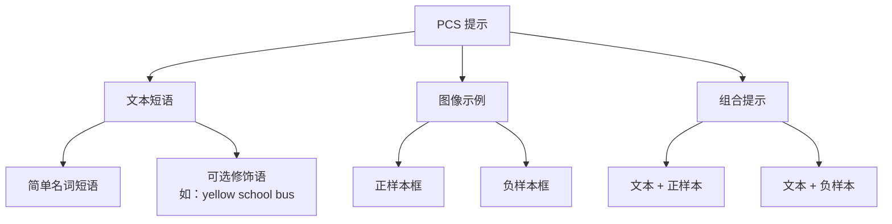
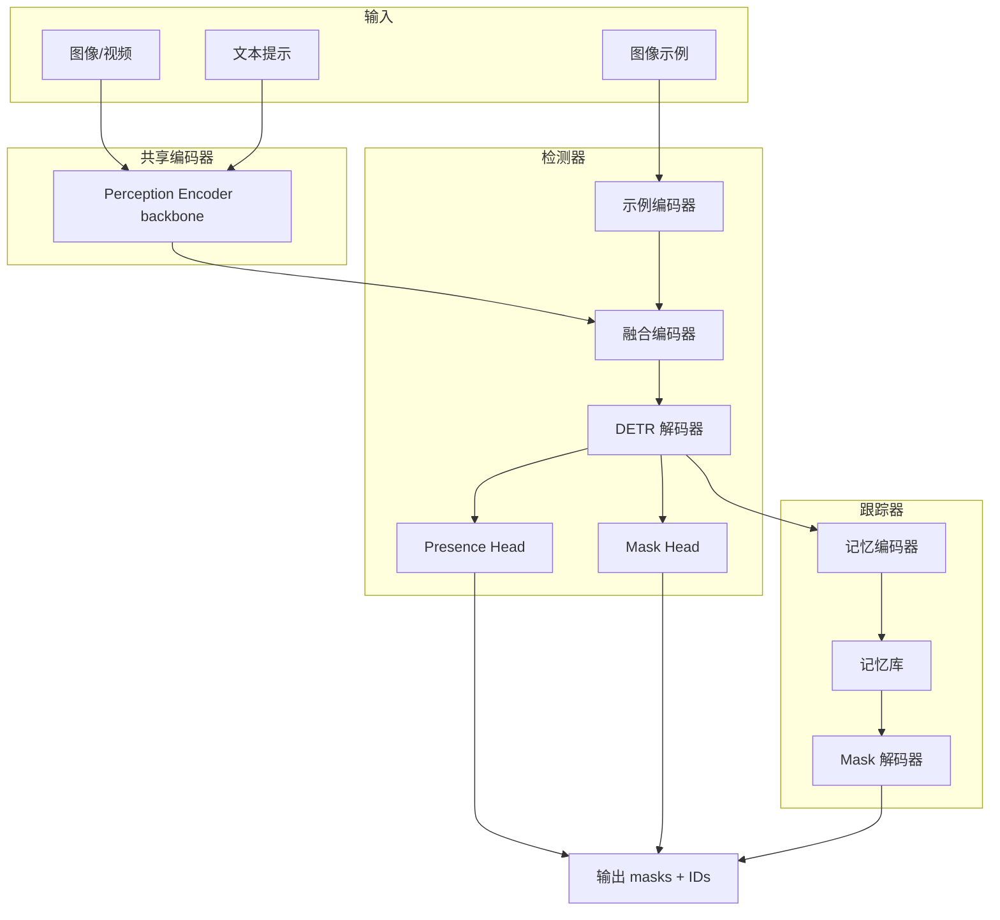
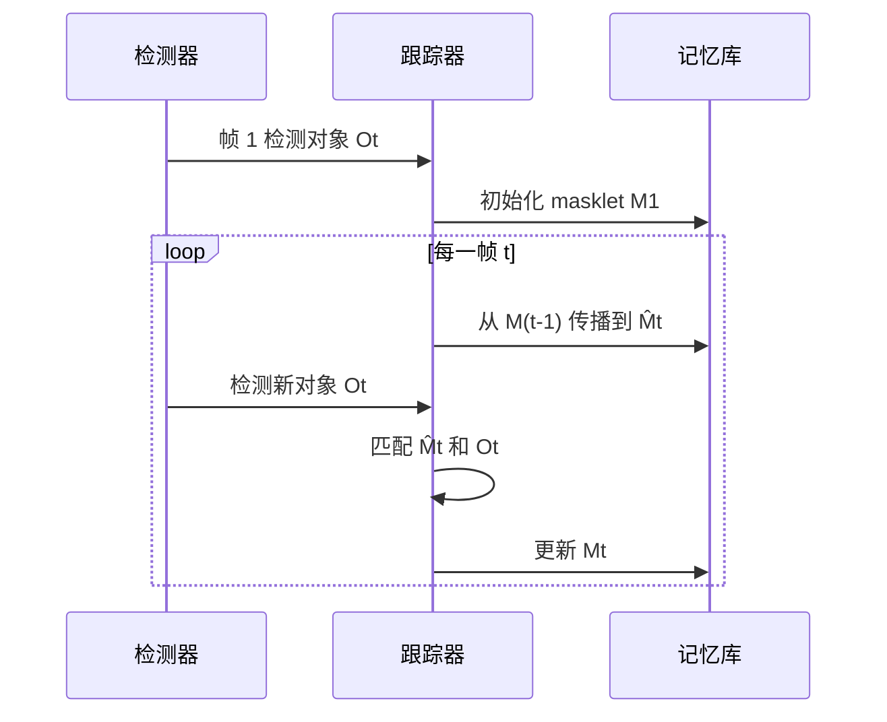
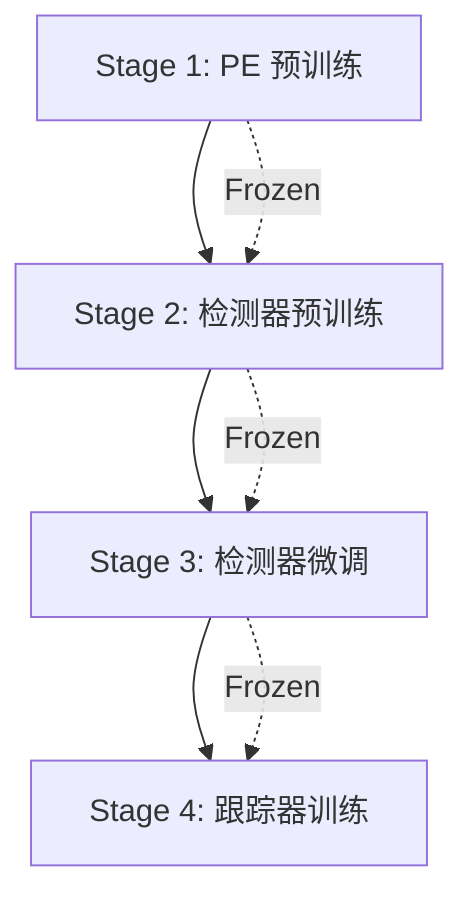
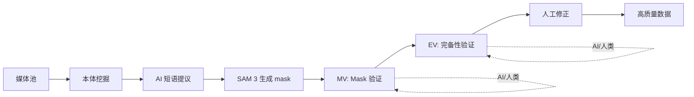
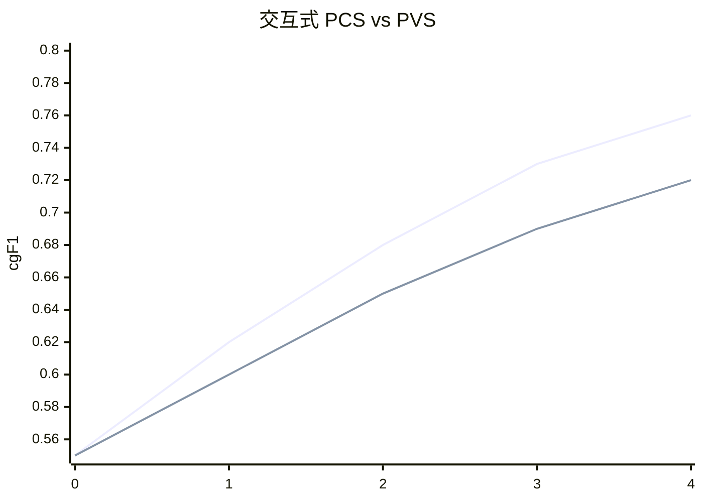
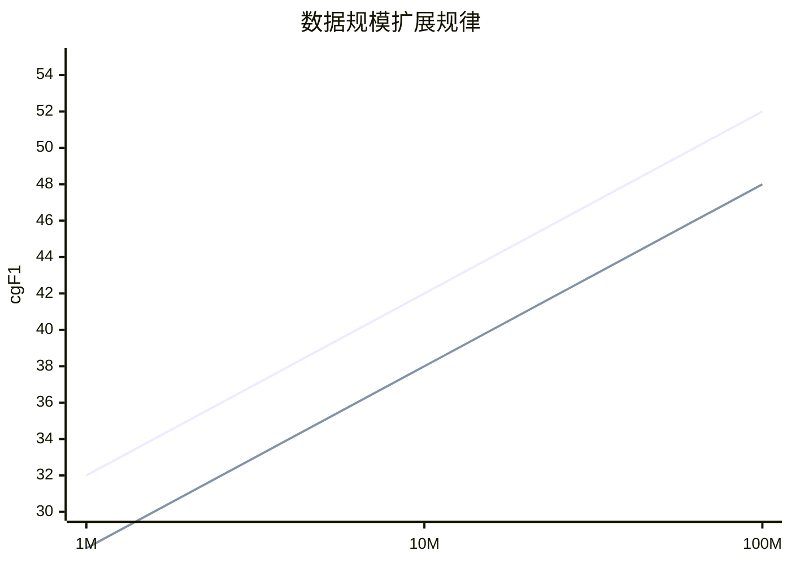

# SAM 3: Segment Anything with Concepts

**论文 ID**: 226  
**arXiv**: 2511.16719v2  
**机构**: Meta Superintelligence Labs  
**发布时间**: 2026 年 3 月

---

## 1. 核心问题

### 1.1 研究目的

创建**统一的图像/视频分割模型**，能够根据**概念提示**（文本短语或图像示例）检测、分割和跟踪**所有匹配的对象实例**。

### 1.2 现有方法及局限

SAM 系列发展历程：

| 模型 | 能力 | 局限性 |
|-----|------|--------|
| **SAM 1** | 点/框/ mask 提示分割单个对象 | 无法找到所有同类对象 |
| **SAM 2** | 视频分割 + 交互 | 仍是单实例分割，无法按概念分割 |
| **开放词汇检测器** | 文本检测对象 | 只输出边界框，无 mask |

**核心 Gap**：现有方法无法完成 **"找到视频中所有'猫'并分割跟踪"** 这类任务。

### 1.3 本文方法

提出 **SAM 3**——统一的 Promptable Concept Segmentation (PCS) 模型：

**输入**：
- 文本短语（如"yellow school bus"）
- 图像示例（正/负样本框）
- 或两者组合

**输出**：
- 所有匹配对象的分割 mask
- 跨帧的对象 ID（跟踪）

**核心创新**：
1. **检测器 + 跟踪器**架构，共享视觉编码器
2. **Presence Head**：解耦识别和定位
3. **人机协同数据引擎**：4M 独特概念标签
4. **SA-Co Benchmark**：207K 独特概念的评估基准

### 1.4 效果

- **LVIS 零 shot mask AP**: 48.8（之前最佳 38.5）
- **SA-Co 基准**: 超越基线 2 倍以上
- **推理速度**: 单图 30ms（H200 GPU，100+ 对象）
- **视频性能**: ~5 个并发对象接近实时

---

## 2. 核心贡献

1. **SAM 3 模型**：
   - 统一图像/视频概念分割
   - 检测器 + 跟踪器解耦设计
   - Presence Head 提升检测精度

2. **数据引擎**：
   - 4M 独特概念，52M masks
   - AI 验证器翻倍标注效率
   - 38M 短语合成数据

3. **SA-Co 基准**：
   - 207K 独特概念
   - 120K 图像 + 1.7K 视频
   - 比现有基准多 50 倍概念

---

## 3. 背景知识

### 3.1 Promptable Visual Segmentation (PVS)

**定义**：给定点/框/mask 提示，分割单个对象。

```
输入：点击位置 / 边界框 / 初始 mask
输出：该对象的精细 mask
```

**局限**：每次提示只分割一个对象实例

### 3.2 Promptable Concept Segmentation (PCS)

**定义**：给定概念提示（文本/图像示例），分割所有匹配实例。

```
输入："red apple" + 正/负样本框
输出：图中所有红苹果的 mask + ID
```

**能力**：
- 开放词汇识别
- 多实例检测
- 跨帧跟踪

### 3.3 DETR (DEtection TRansformer)

基于 Transformer 的目标检测框架：

**核心组件**：
- **图像编码器**：提取特征
- **对象查询**：可学习向量，每个对应一个潜在对象
- **解码器**：查询与特征交互，预测框和类别

**优势**：
- 端到端训练
- 无需 NMS 后处理
- 天然支持多模态输入

### 3.4 Matthews Correlation Coefficient (MCC)

二分类问题的平衡评估指标：

$$
\text{MCC} = \frac{TP \times TN - FP \times FN}{\sqrt{(TP+FP)(TP+FN)(TN+FP)(TN+FN)}}
$$

取值范围 [-1, 1]：
- 1：完美预测
- 0：随机猜测
- -1：完全相反

---

## 4. Promptable Concept Segmentation (PCS) 任务定义

### 4.1 形式化定义

**输入**：
- 图像或短视频（≤30 秒）
- 概念提示：
  - **名词短语**（NP）：如"red apple"、"striped cat"
  - **图像示例**：正/负边界框
  - 或两者组合

**输出**：
- 所有匹配对象的实例 mask
- 跨视频帧的对象 ID

### 4.2 提示类型



### 4.3 交互性

支持迭代细化：

1. 初始文本提示 → 获取初始结果
2. 发现漏检 → 添加正样本框
3. 发现误检 → 添加负样本框
4. 重复直到满意

### 4.4 任务模糊性处理

**模糊性来源**：
- 多义词（"mouse"：老鼠 vs 鼠标）
- 主观描述（"cozy"、"large"）
- 边界模糊（"mirror"是否包含边框）
- 遮挡和模糊

**解决方案**：
- 每个样本 3 个标注者
- 评估时考虑多种有效解释
- 数据管道最小化模糊性

---

## 5. SAM 3 模型架构

### 5.1 整体架构



### 5.2 检测器架构

#### 5.2.1 组件

| 组件 | 功能 |
|-----|------|
| **Perception Encoder** | 图像 + 文本联合编码 |
| **示例编码器** | ROI Pool + 位置/标签嵌入 |
| **融合编码器** | 交叉注意力条件化 |
| **DETR 解码器** | 对象查询交叉注意力 |
| **Presence Head** | 全局存在性预测 |
| **Mask Head** | 像素级分割 |

#### 5.2.2 Presence Token（核心创新）

**问题**：proposal query 需要同时解决：
- **识别**（是什么）：需要全局上下文
- **定位**（在哪里）：需要局部特征

**冲突**：全局上下文与局部定位目标冲突

**解决方案**：引入**全局 Presence Token**

$$
\begin{aligned}
\text{Presence Score: } & p(\text{NP present}) \\
\text{Query Score: } & p(q_i \text{ is match} | \text{NP present}) \\
\text{Final Score: } & p(\text{NP present}) \times p(q_i \text{ is match} | \text{NP present})
\end{aligned}
$$

**优势**：
- Presence Token 专注识别（全局）
- Query 专注定位（局部）
- 解耦后提升检测精度

#### 5.2.3 图像示例编码

每个示例框编码为：
- **位置嵌入**：框的位置
- **标签嵌入**：正/负样本
- **视觉特征**：ROI Pool 提取

通过小型 Transformer 处理，与文本 prompt 拼接为 prompt tokens。

### 5.3 跟踪器架构

#### 5.3.1 视频处理流程



#### 5.3.2 关键组件

| 组件 | 功能 |
|-----|------|
| **记忆编码器** | 当前帧 + 历史帧特征交叉注意力 |
| **记忆库** | 存储对象外观特征 |
| **Mask 解码器** | 两向 Transformer 预测 3 个候选 mask |
| **匹配函数** | IoU 基础匹配 |

#### 5.3.3 时间消歧策略

**问题**：拥挤场景中的匹配模糊

**策略 1：时间一致性检测**
- 测量 masklet 在时间窗口内被匹配的频率
- 低于阈值则抑制

**策略 2：检测器校正**
- 周期性用高置信度检测替换跟踪预测
- 确保记忆库有可靠参考

### 5.4 训练阶段

SAM 3 采用**四阶段渐进训练**：



| 阶段 | 训练内容 | 数据 |
|-----|---------|------|
| 1 | Perception Encoder | 大规模图像 - 文本对 |
| 2 | 检测器 | SA-Co 图像数据 |
| 3 | 检测器 + Presence Head | 含困难负样本 |
| 4 | 跟踪器 | SA-Co 视频数据 |

---

## 6. 数据引擎

### 6.1 核心挑战

**需求**：大规模、多样化的概念和视觉域数据

**现有数据集局限**：
- 封闭词汇（固定类别）
- 视觉域单一
- 标注成本高

### 6.2 数据引擎组件



**验证类型**：
1. **Mask Verification (MV)**：mask 质量和相关性
2. **Exhaustivity Verification (EV)**：是否所有实例都已标注

### 6.3 四阶段数据收集

#### Phase 1: 人类验证

**流程**：
- 随机采样图像 + 简单 captioner 提议 NP
- SAM 2 + 开放词汇检测器生成初始 mask
- 人类验证 MV 和 EV

**产出**：4.3M image-NP 对（SA-Co/HQ 初始数据）

#### Phase 2: 人类 + AI 验证

**创新**：
- 用 Phase 1 数据微调 Llama 3.2 作为**AI 验证器**
- AI 验证器输出 MV/EV 的多选评分
- 人类专注困难案例

**效率提升**：
- AI 验证器使通量翻倍
- 迭代训练 SAM 3 + AI 验证器 6 次

**产出**：1.22 亿 image-NP 对

#### Phase 3: 扩展和域扩展

**策略**：
- 扩展到 15 个数据集域
- 从图像 alt-text 提取长尾概念
- 基于 Wikidata 构建 22.4M 节点本体（17 顶层类别，72 子类别）

**产出**：19.5M image-NP 对

#### Phase 4: 视频标注

**挑战**：视频标注更困难

**策略**：
- 场景/运动过滤
- 内容平衡
- 针对性搜索拥挤场景
- 人类专注跟踪失败案例

**产出**：52.5K 视频，467K masklets

### 6.4 最终数据规模

| 数据集 | 图像/视频 | 独特 NP | Mask/Masklets |
|-------|----------|---------|---------------|
| **SA-Co/HQ** | 5.2M 图像 | 4M | 52M masks |
| **SA-Co/SYN** | 合成数据 | 38M 短语 | 1.4B masks |
| **SA-Co/EXT** | 15 外部数据集 | - | 增强困难负样本 |
| **SA-Co/VIDEO** | 52.5K 视频 | 24.8K | 134K video-NP 对 |

---

## 7. SA-Co 基准

### 7.1 评估数据集划分

| 划分 | 域数量 | 标注者数量 | 用途 |
|-----|--------|----------|------|
| **SA-Co/Gold** | 7 | 3/样本 | 测量人类表现 |
| **SA-Co/Silver** | 10 | 1/样本 | 大规模评估 |
| **SA-Co/Bronze** | 9 | 自动 | 现有数据集 |
| **SA-Co/Bio** | 9 | 自动 | 生物医学域 |
| **SA-Co/VEval** | 3 | 1/样本 | 视频评估 |

### 7.2 评估指标

#### 7.2.1 定位指标：Positive Micro F1 (pmF1)

在正样本（至少一个 GT mask）上评估定位精度。

#### 7.2.2 分类指标：Image-Level MCC (IL_MCC)

评估图像级二分类（"对象是否存在"）。

#### 7.2.3 主指标：Classification-gated F1 (cgF1)

$$
\text{cgF1} = 100 \times \text{pmF1} \times \text{IL\_MCC}
$$

**设计原理**：
- 同时考虑定位和分类
- 仅评估置信度 > 0.5 的预测（模拟实际使用）

### 7.3 模糊性处理

**Gold 集评估**：
- 每个 NP 有 3 个标注
- 计算 oracle 精度（选择最佳匹配）

---

## 8. 实验结果

### 8.1 图像 PCS（文本提示）

#### 8.1.1 闭词汇实例分割

| 方法 | COCO AP | LVIS AP |
|-----|---------|---------|
| OWLv2 | - | 19.9 |
| gDino-T | - | 20.5 |
| **SAM 3** | **48.5** | **48.8** |

#### 8.1.2 开放词汇实例分割（SA-Co）

```mermaid
xychart-beta
    title "SA-Co cgF1 对比"
    x-axis ["Gold", "Silver", "Bronze", "Bio"]
    y-axis "cgF1" 0 --> 60
    bar OWLv2 [17.3, 24.6, 7.6, 11.5]
    bar SAM3 [54.1, 49.6, 55.4, 40.6]
```



**关键发现**：
- SAM 3 在所有 split 上超越 OWLv2 两倍以上
- Gold 集达到人类表现的 74%

#### 8.1.3 开放词汇语义分割

| 方法 | ADE-847 | PC-59 | Cityscapes |
|-----|---------|-------|------------|
| APE | 9.2 | 58.5 | 44.2 |
| **SAM 3** | **13.8** | **60.8** | **65.2** |

### 8.2 少样本迁移

#### 8.2.1 ODinW13（13 个野生数据集）

| 方法 | Zero-shot AP | 10-shot AP |
|-----|--------------|------------|
| Gemini2.5-Pro | 33.7 | - |
| gDino1.5-Pro | 58.7 | 67.9 |
| **SAM 3** | **61.0** | **71.8** |

### 8.3 单示例 PCS

使用 1 个 GT 框作为提示评估：

| 方法 | COCO AP+ | LVIS AP+ | ODinW AP+ |
|-----|----------|----------|-----------|
| T-Rex2 | 58.5 | 65.8 | 61.8 |
| **SAM 3 (T+I)** | **78.1** | **78.4** | **81.8** |

**提示类型**：
- T：仅文本
- I：仅图像
- T+I：文本 + 图像

### 8.4 交互式 PCS

模拟人机协作迭代细化：



**关键发现**：
- 3 次点击后，PCS 超越 PVS 2.0 点
- PCS 从示例泛化，PVS 只修正单实例
- 4 次点击后趋于平稳

### 8.5 物体计数

| 方法 | CountBench MAE | CountBench Acc | PixMo-Count MAE | PixMo-Count Acc |
|-----|----------------|----------------|-----------------|-----------------|
| DINO-X | 0.62 | 82.9 | 0.61 | 85.0 |
| Qwen2-VL-72B | 0.28 | 86.7 | 0.17 | 63.7 |
| Gemini 2.5 Pro | 0.24 | 92.4 | 0.38 | 88.8 |
| **SAM 3** | **0.12** | **93.8** | **0.21** | **86.2** |

**优势**：SAM 3 不仅计数准确，还提供 segmentation（MLLM 无法提供）

### 8.6 视频 PCS

#### 8.6.1 SA-Co/VEval 基准

| 方法 | SA-V cgF1 | YT-Temporal cgF1 | SmartGlasses cgF1 |
|-----|-----------|------------------|-------------------|
| GLEE | 0.1 | 1.6 | 0.1 |
| LLMDet + SAM3 Tracker | 2.3 | 8.0 | 0.3 |
| SAM3 Detector + T-by-D | 25.7 | 47.6 | 29.7 |
| **SAM 3** | **30.3** | **50.8** | **36.4** |

人类表现：~53-71 cgF1

#### 8.6.2 公开基准

| 方法 | LVVIS mAP | BURST HOTA | OVIS mAP |
|-----|-----------|------------|----------|
| GLEE | 20.8 | 28.4 | 31.3 |
| **SAM 3** | **36.3** | **44.5** | **57.4** |

### 8.7 Promptable Visual Segmentation (PVS)

#### 8.7.1 视频对象分割（VOS）

| 方法 | DAVIS17 J&F | LVOSv2 J&F | MOSEv2 J&F |
|-----|-------------|------------|------------|
| SAM 2 | 85.2 | 83.1 | 62.3 |
| **SAM 3** | **87.6** | **85.4** | **68.8** |

**MOSEv2 提升**：+6.5 点（最具挑战性基准）

#### 8.7.2 交互式图像分割

37 个数据集平均 mIoU：

| 方法 | Clicks=1 | Clicks=3 | Clicks=5 | Average |
|-----|----------|----------|----------|---------|
| SAM 2 | 75.2 | 79.8 | 81.1 | 78.7 |
| **SAM 3** | **77.5** | **81.3** | **82.6** | **80.5** |

---

## 9. 消融实验

### 9.1 Presence Head 效果

| 配置 | LVIS AP | SA-Co Gold cgF1 |
|-----|---------|-----------------|
| 无 Presence | 42.1 | 31.5 |
| **+ Presence** | **+6.7** | **+5.7** |

### 9.2 Backbone 选择

| Backbone | 参数量 | LVIS AP |
|----------|--------|---------|
| ViT-L | 307M | 41.2 |
| **PE (Huge)** | **632M** | **48.8** |

### 9.3 困难负样本效果

| 训练数据 | SA-Co Gold cgF1 |
|---------|-----------------|
| 无困难负样本 | 46.3 |
| **+ 困难负样本** | **+7.8** |

### 9.4 数据规模扩展规律



---

## 10. 推理效率

| 场景 | 配置 | 延迟 |
|-----|------|------|
| **图像** | H200, 100+ 对象 | 30ms |
| **视频 (1 对象)** | H200 | ~50ms |
| **视频 (5 对象)** | H200 | ~100ms |
| **视频 (10 对象)** | H200 | ~200ms |

---

## 11. 局限性

1. **长文本理解**：
   - 不支持长指代表达
   - 需要推理的查询
   - **解决**：可与 MLLM 结合

2. **极端拥挤场景**：
   - 对象密集时性能下降
   - 跟踪歧义增加

3. **罕见概念**：
   - 训练数据外的概念识别困难
   - 需要图像示例辅助

4. **视频长度**：
   - 当前支持≤30 秒
   - 更长视频需要分段处理

---

## 12. 启发

### 12.1 架构设计启发

1. **解耦识别和定位**：
   - Presence Head 专注"是否存在"
   - Query 专注"在哪里"
   - 避免任务冲突

2. **检测器 + 跟踪器分离**：
   - 检测器：类别无关，专注识别
   - 跟踪器：分离 identity
   - 避免任务干扰

3. **共享 Backbone**：
   - 图像/文本/视频统一编码
   - 参数高效
   - 特征一致

### 12.2 数据工程启发

1. **人机协同标注**：
   - AI 处理简单案例
   - 人类专注困难案例
   - 效率翻倍

2. **课程学习式数据收集**：
   - Phase 1：基础数据
   - Phase 2：AI 验证 + 困难负样本
   - Phase 3：域扩展
   - Phase 4：视频扩展

3. **本体驱动的概念挖掘**：
   - 结构化知识指导数据收集
   - 长尾概念覆盖

### 12.3 应用启发

1. **多模态 AI 基础组件**：
   - 机器人（视觉理解）
   - 内容创作（智能标注）
   - AR/VR（实时分割）

2. **与 MLLM 结合**：
   - MLLM 处理复杂查询
   - SAM 3 提供精细分割
   - 互补优势

---

## 13. 遗留问题

1. **复杂推理**：
   - 如何处理需要多步推理的查询？
   - 如"穿红衣服的人左边的包"

2. **开放世界学习**：
   - 如何持续学习新概念？
   - 灾难性遗忘问题

3. **3D 理解**：
   - 当前仅 2D 分割
   - 如何扩展到 3D 实例分割？

4. **实时性能**：
   - 当前视频推理仍需优化
   - 边缘设备部署挑战

---

## 14. 重要图表

### 14.1 SAM 3 架构总览

```
┌─────────────────────────────────────────────────────────────┐
│                      SAM 3 架构                              │
├─────────────────────────────────────────────────────────────┤
│ 输入：文本短语 + 图像示例 + 图像/视频                        │
│                                                             │
│ ↓                                                           │
│                                                             │
│ Perception Encoder (共享 Backbone)                          │
│                                                             │
│ ↓                                                           │
│ ┌─────────────────┬─────────────────┐                       │
│ │   检测器分支     │   跟踪器分支     │                       │
│ │ - 融合编码器     │ - 记忆编码器     │                       │
│ │ - DETR 解码器    │ - 记忆库        │                       │
│ │ - Presence Head │ - Mask 解码器    │                       │
│ │ - Mask Head     │                 │                       │
│ └─────────────────┴─────────────────┘                       │
│                                                             │
│ ↓                                                           │
│ 输出：Instance Masks + IDs                                  │
└─────────────────────────────────────────────────────────────┘
```

### 14.2 数据引擎流程

```
媒体池 → 本体挖掘 → AI 短语提议 → Mask 生成
                              ↓
        ← AI 验证器 (MV/EV) ← 人类验证器
                              ↓
                         困难案例修正
                              ↓
                        高质量训练数据
```

### 14.3 主要结果对比

**LVIS 零 shot 实例分割**：
| 方法 | AP |
|-----|----|
| OWLv2 | 19.9 |
| 之前最佳 | 38.5 |
| **SAM 3** | **48.8** |

**SA-Co/Gold 开放词汇分割**：
| 方法 | cgF1 |
|-----|------|
| OWLv2* | 24.6 |
| 人类 | 72.8 |
| **SAM 3** | **54.1** |

---

## 15. 总结

SAM 3 实现了 Promptable Concept Segmentation 的重大突破：

**模型贡献**：
- 统一图像/视频概念分割
- Presence Head 解耦识别定位
- 检测器 + 跟踪器解耦设计

**数据贡献**：
- 4M 独特概念，52M masks
- AI 验证器翻倍标注效率
- SA-Co 基准（207K 概念）

**性能**：
- LVIS AP: 48.8（+10.3 点）
- SA-Co cgF1: 54.1（人类 74%）
- 视频 pHOTA: 58-70（人类 80%）

**开源**：
- 代码：https://github.com/facebookresearch/sam3
- 模型权重
- SA-Co 基准

---

## 参考文献

```bibtex
@article{carion2026sam3,
  title={SAM 3: Segment Anything with Concepts},
  author={Carion, Nicolas and Gustafson, Laura and Hu, Yuan-Ting and Debnath, Shoubhik and Hu, Ronghang and Suris, Didac and Ryali, Chaitanya and Alwala, Kalyan Vasudev and Khedr, Haitham and Huang, Andrew and Lei, Jie and Ma, Tengyu and Guo, Baishan and Kalla, Arpit and Marks, Markus and Greer, Joseph and Wang, Meng and Sun, Peize and R{\"a}dle, Roman and Afouras, Triantafyllos and Mavroudi, Effrosyni and Xu, Katherine and Wu, Tsung-Han and Zhou, Yu and Momeni, Liliane and Hazra, Rishi and Ding, Shuangrui and Vaze, Sagar and Porcher, Francois and Li, Feng and Li, Siyuan and Kamath, Aishwarya and Cheng, Ho Kei and Doll{\'a}r, Piotr and Ravi, Nikhila and Saenko, Kate and Zhang, Pengchuan and Feichtenhofer, Christoph},
  journal={arXiv preprint arXiv:2511.16719},
  year={2026}
}
```
