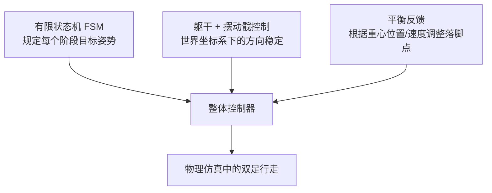
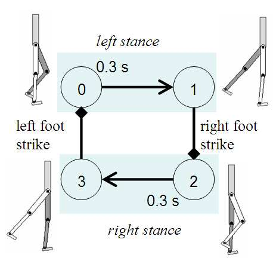
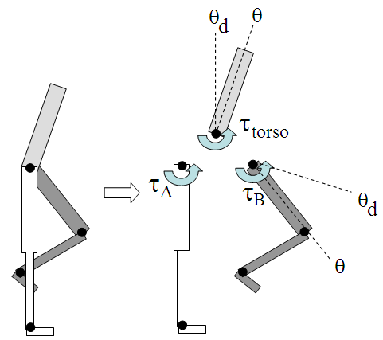
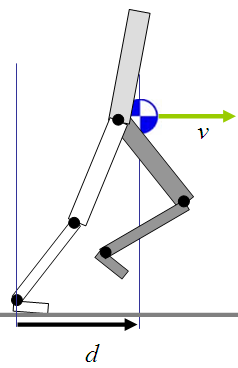
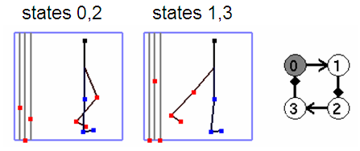
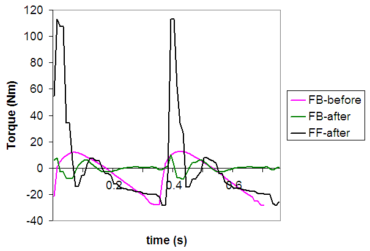
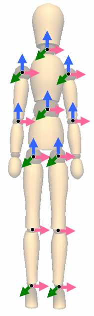
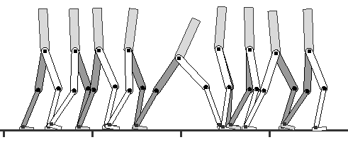
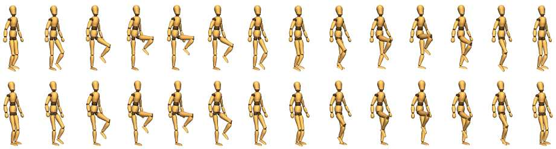

# SIMBICON: Simple Biped Locomotion Control

> **论文信息**
> - **标题**：SIMBICON: Simple Biped Locomotion Control
> - **作者**：KangKang Yin, Kevin Loken, Michiel van de Panne（英属哥伦比亚大学）
> - **发表**：ACM Transactions on Graphics, Vol. 26, No. 3, Article 105, July 2007
> - **DOI**：10.1145/1239451.1239556

---

## 一句话总结

SIMBICON 用一套**极其简单**的有限状态机 + 平衡反馈公式，让物理仿真的二足角色（像游戏里的人形角色）能在实时环境中**走、跑、跳、转向，还能被推倒后自己稳住**。

---

## 背景：为什么控制双足行走这么难？

想象一下，你让一个机器人在物理引擎里走路。它的身体有关节、有质量、会受重力，还会和地面碰撞。如果不给它一个"控制器"，它就会直接倒下。

控制双足行走之所以困难，是因为：

```
┌──────────────────────────────────────────┐
│  双足行走的难点                           │
│                                          │
│  1. 不稳定 —— 人在行走中大部分时间只有   │
│     一只脚着地，随时可能摔倒              │
│                                          │
│  2. 欠驱动 —— 脚对地面没有主动控制力    │
│                                          │
│  3. 高维度 —— 3D人体有30+个关节自由度   │
│                                          │
│  4. 接触复杂 —— 脚着地时有冲击力        │
└──────────────────────────────────────────┘
```

之前的方法要么太复杂（轨迹优化、零力矩点控制），要么不够通用（只能走直线，不能应对推力）。

---

## 核心思想：三个简单模块组合

SIMBICON 的名字来自 **SIM**ple **BI**ped **CON**trol，整个控制策略只有三个部分：



---

## 模块一：有限状态机（FSM）

**什么是有限状态机？**

可以把它想象成一个"动作剧本"，规定角色在不同阶段应该摆出什么姿势。

以走路为例，一个完整的步态循环分4个状态：



```
状态0 → 状态1 → 状态2 → 状态3 → 回到状态0
 右腿    右腿     左腿    左腿
 抬起    落地     抬起    落地
(计时)  (脚触地) (计时)  (脚触地)
```

**每个状态里，角色的每个关节都有一个"目标角度"**。控制器用 **PD控制器** 让关节趋向目标角度：

$$\tau = k_p(\theta_d - \theta) - k_d\dot{\theta}$$

- \(\tau\) 是关节施加的力矩（扭力）
- \(\theta_d\) 是目标角度
- \(\theta\) 是当前角度
- \(k_p, k_d\) 是弹簧-阻尼增益参数

> **通俗解释**：就像弹簧一样，目标角度是弹簧的自然长度，关节偏离越多，拉回的力越大；同时加阻尼防止抖动。

**状态转换条件**：
- 固定时间后转换（如摆腿阶段持续0.3秒）
- 或脚碰到地面时转换（`fc` = foot contact）

---

## 模块二：躯干 + 摆动髋的世界坐标控制

这是 SIMBICON 的一个关键创新。普通方法里，所有关节目标角度都是**相对父关节**的局部角度。但躯干和摆动腿的髋关节采用**世界坐标系**的目标角度。

**为什么这样做？**

```
传统方法：
  躯干目标角度 = 相对于骨盆的角度
  → 如果骨盆倾斜了，躯干也跟着倾斜 → 容易失衡

SIMBICON方法：
  躯干目标角度 = 相对于世界坐标系（垂直方向）
  → 无论骨盆怎么动，躯干始终尝试保持直立
```



具体力矩计算（图(a)展示了三者关系）：
- 摆动髋力矩 \(\tau_B\)：用世界坐标PD控制器计算
- 躯干力矩 \(\tau_{torso}\)：用世界坐标PD控制器计算  
- 支撑髋力矩 \(\tau_A = -\tau_{torso} - \tau_B\)（自由变量，由上面两个推导出来）

> **通俗解释**：想象你在走路时手里拿着一杯水。你的身体倾斜，但手要保持水平，所以手腕会自动调整。这里躯干就是那杯水，始终相对于地面保持目标方向。

---

## 模块三：平衡反馈（最关键！）

这是 SIMBICON 最核心、也最优雅的部分。

**核心公式**：

$$\theta_d = \theta_{d0} + c_d \cdot d + c_v \cdot v$$

- \(\theta_{d0}\)：FSM规定的默认摆动髋目标角度
- \(d\)：重心（COM）相对于支撑脚踝的水平距离
- \(v\)：重心的水平速度
- \(c_d, c_v\)：反馈增益参数



**为什么同时用位置和速度？**

只用速度不够！看这个例子：

```
场景：原地踏步，期望速度 v = 0

情况A：重心在支撑脚前方 d = +10cm
  → 需要赶紧往前迈一步！

情况B：重心在支撑脚后方 d = -10cm  
  → 需要赶紧往后迈一步！

如果只看速度（都是0），完全区分不了这两种情况
只有(d, v)一起看，才能知道当前步态的完整"相位"
```

**通俗比喻**：就像骑自行车，你不仅要看现在偏向哪里（位置d），还要看倾斜的速度有多快（速度v），才能决定该怎么打方向盘。

**3D扩展**：同样的反馈在**矢状面**（前后方向）和**冠状面**（左右方向）都分别应用，各自独立调整落脚位置。

---

## 控制器的两种设计方式

### 方式一：手动设计

通过一个图形界面（GUI）交互式地调整参数：



- 左边三个滑块：控制状态持续时间 \(\Delta t\)、位置增益 \(c_d\)、速度增益 \(c_v\)
- 右边：直接拖拽棍型人物的各关节目标角度

**最重要的参数**（只需调这几个）：
- 每个状态的持续时间 \(\Delta t\)
- 摆动髋目标角度
- 摆动膝目标角度

表1 列出了所有手动设计的2D和3D步态参数（走、跑、跳、倒退走等12种步态）。

### 方式二：从动捕数据生成

1. 给定3-7个动捕行走周期
2. 用傅里叶分析提取步态周期 \(T\)
3. 用主要频率分量重建平滑的周期运动 \(\Theta\)
4. 用 \(\Theta\) 替代FSM中的固定目标姿势

结果：动捕风格 + 物理平衡 = 可应对外力的风格化行走

---

## 反馈误差学习（FEL）

**问题**：高增益PD控制虽然能跟踪目标轨迹，但动作显得"僵硬"，而且躯干会因为总是"被动反应"而产生不自然的晃动。

**人类运动的启发**：人类在熟悉的动作中依赖**前馈力矩**（预测性地提前施力），反馈只做微调。

**FEL的做法**：


学习更新公式：

$$v'_{ff} = (1-\alpha)v_{ff} + \alpha(v_{ff} + v_{fb})$$

- \(\alpha = 0.1\)（学习率）
- 把步态划分成 N=20~1000 个相位区间，每个区间独立学习

**效果**：
- 躯干晃动幅度从 5° 降至 0.5°
- PD增益可以降低，动作更自然



> 图中显示：学习前反馈力矩大幅波动（蓝线），学习后反馈力矩（红线）大幅减小，被前馈力矩（绿线）取代。

---

## 实验结果

### 2D双足结果

设计了12种周期步态，全部实时运行：

| 步态类型 | 特点 |
|---------|------|
| 普通行走 (walk) | 标准步态 |
| 原地踏步 (in-place walk) | 零速度平衡 |
| 快步走 (fast walk) | 加速前进 |
| 高抬腿走 (highstep walk) | 大幅抬腿 |
| 弯腰走 (bent walk) | 前倾姿态 |
| 蹲走 (crouch walk) | 膝盖弯曲 |
| 剪刀跳 (scissor hop) | 腿交叉跳 |
| 倒退走 (backwards walk) | 向后行走 |
| 快跑 (fast run) | 高速奔跑 |
| 普通跑 (run) | 常规奔跑 |
| 跳跃步 (skipping) | 跳跃步态 |



**鲁棒性测试**：
- 走路控制器可承受 600N（前向）/ 500N（后向）、0.1s 的推力
- 可应对 20cm 的台阶和 ±6° 的坡度

### 3D双足结果


*(左：2D模型6个内部自由度；右：3D模型28个内部自由度)*

- 手动设计：双脚跳跃、三种前向行走、爬坡（20°）、侧走太极动作、跳跃步等
- 最大可恢复推力（八个方向）：
  ```
  前方: 340N, 后方: 270N, 左方: 240N, 右方: 330N（近似值）
  ```

### 动捕风格化结果

从动捕数据生成了7种控制器：


*(上排：原始动捕数据；下排：控制器生成的物理仿真运动)*

四种行走风格：高抬腿走、宽步距走、后退走、弯腰走

---

## 控制器之间的过渡

控制器绑定到按键，用户可以实时切换！过渡发生在状态 n 到 n+1 的边界。

一个完整的过渡序列示例：
```
走 → 原地踏步 → 站立 → 后空翻 → 原地踏步 → 走 →
大步走 → 走 → 原地踏步 → 高抬腿走 → 原地踏步 →
剪刀跳 → 走 → 跳跃 → 走 → 弯腰走 → 走 → 
蹲走 → 走 → 原地踏步 → 倒退走 → 跑 → 快跑
```

> **注意**：不是所有过渡都能直接进行，需要步态状态的"吸引域"（basin of attraction）有重叠。

---

## 参数稳定性分析

对 \(c_d\) 和 \(c_v\) 的稳定范围：

| 参数 | 矢状面（前后）| 冠状面（左右）|
|------|------------|------------|
| \(c_d\) | [-0.71, 1.4] | [-1.29, 1.13] |
| \(c_v\) | [0.03, 0.59] | [-0.06, 0.48] |

- \(c_v\) 太小 → 速度失控直到倒下
- \(c_v\) 太大 → 前后/左右摇摆越来越大直到倒下
- 参数接近边界 → 可能出现"倍周期分岔"（步态变为两步一循环）

---

## 系统参数（仿真配置）

| 参数 | 2D模型 | 3D模型 |
|------|--------|--------|
| PD增益 \(k_p\) | 300 Nm/rad | 300~1000 Nm/rad |
| PD增益 \(k_d\) | 30 Nms/rad | \(0.1 k_p\) |
| 摩擦系数 | 0.65 | 0.8 |
| 时间步长 | 0.0001s | 0.005s |
| 实时倍率 | 5× 实时 | 1.2× 实时 |

---

## 局限性

1. **动捕流程未完全自动化**：反馈增益 \(c_d, c_v\) 仍需手动调
2. **能量效率未优化**：步态看起来自然但能耗未考虑
3. **没有反应时延模型**：真实人类有约150ms神经延迟
4. **高难动作不适用**：翻跟头、跳跃需要精确起跳动量，FSM+平衡反馈不够
5. **楼梯问题**：控制器"看不见"前方台阶，脚尖碰到台阶可能摔倒

---

## 与同期工作的对比

| 方法 | 优势 | 劣势 |
|------|------|------|
| ZMP控制（ASIMO等）| 工程上可靠 | 大扰动时需要额外规划 |
| 轨迹优化 | 可得最优步态 | 计算慢，不实时 |
| 强化学习 | 原理上可学习 | 2007年时高维状态空间难处理 |
| **SIMBICON** | **简单、实时、多步态** | **复杂动作有限** |

---

## 贡献总结

```
┌─────────────────────────────────────────────┐
│  SIMBICON 的三大贡献                         │
│                                             │
│  1. 首个展示大量集成双足技能的框架           │
│     （走/跑/跳/转向/推力恢复全都有）         │
│                                             │
│  2. 从动捕数据构建鲁棒风格化控制器           │
│     （保留风格的同时能应对真实物理扰动）      │
│                                             │
│  3. 将反馈误差学习用于复杂动态系统           │
│     （前馈力矩让动作更流畅自然）             │
└─────────────────────────────────────────────┘
```

---

## 个人理解：为什么这篇论文重要？

这篇2007年的论文在角色动画领域具有**里程碑意义**，原因如下：

1. **极简设计**：核心公式就一行 \(\theta_d = \theta_{d0} + c_d d + c_v v\)，却产生了惊人的效果

2. **实时性**：游戏和交互应用需要实时控制，SIMBICON 做到了

3. **奠基性**：后来大量的角色动画物理控制工作（包括 DeepMimic、AMP 等深度强化学习方法）都在思考如何超越 SIMBICON 的局限性，它是一个重要的基线

4. **直觉正确**：用重心的位置和速度来调整落脚点，本质上模拟了人类行走的核心平衡机制

---

## 参考文献（精选）

- Raibert & Hodgins 1991 - 早期跳跃/奔跑控制，提出了速度控制和摆脚落点思想
- Faloutsos et al. 2001 - 可组合控制器架构
- Kawato et al. 1987 - 反馈误差学习（FEL）的原始提出
- Laszlo et al. 1996 - 极限环控制用于平衡
