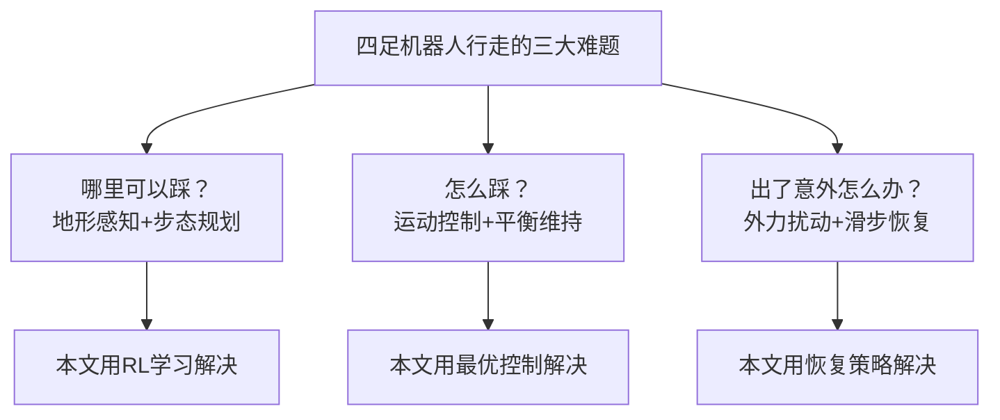
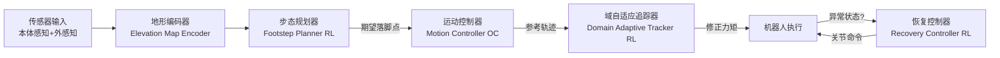
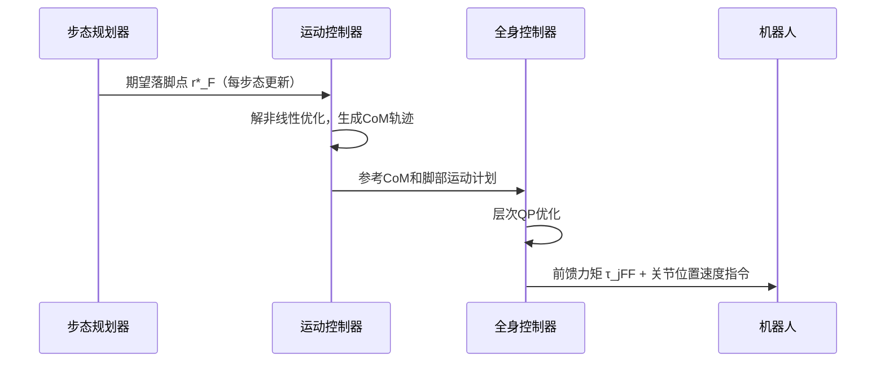
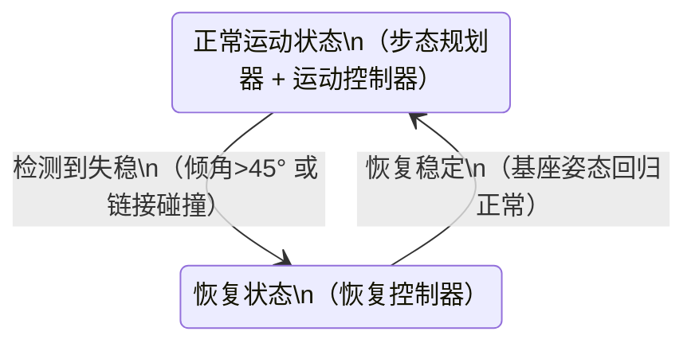
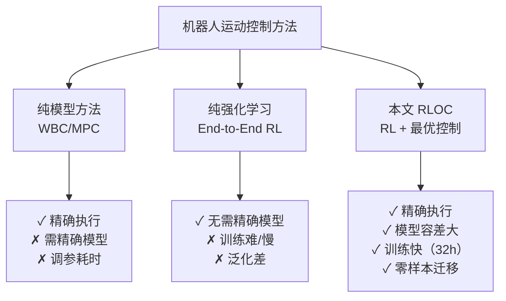

# RLOC: Terrain-Aware Legged Locomotion using Reinforcement Learning and Optimal Control

> **论文信息**
> - **作者**：Siddhant Gangapurwala, Mathieu Geisert, Romeo Orsolino, Maurice Fallon, Ioannis Havoutis
> - **机构**：牛津大学机器人研究所（Oxford Robotics Institute）
> - **发表**：arXiv:2012.03094v3 (2022)
> - **关键词**：四足机器人、强化学习、最优控制、地形感知、运动规划

---

## 📖 TL;DR（一句话总结）

本文提出 **RLOC 框架**：让四足机器人（ANYmal B/C）像人一样"看地形走路"——用强化学习决定踩哪里，用最优控制执行动作，两者结合实现在楼梯、斜坡、碎石等复杂地形上的稳健行走。

---

## 🎯 问题背景：为什么四足机器人走路这么难？

想象你闭着眼睛在崎岖山路上走路——几乎不可能。机器人也一样，要在复杂地形行走，需要同时解决三大难题：

传统方法要么计算太慢（全身轨迹优化），要么太依赖精确模型（MPC），要么只会走平地（大多数RL方法）。RLOC 的创新在于**把 RL 的感知决策能力和最优控制的精确执行能力结合起来**。

---

## 🤖 实验平台：ANYmal 四足机器人

| 属性 | ANYmal B | ANYmal C |
|------|---------|---------|
| 重量 | 30 kg | 50 kg |
| 关节数 | 12 | 12 |
| 主要特点 | 工业检测用，大工作空间 | 更重、更高负载 |
| 在本文中的作用 | 训练平台 | 零样本迁移测试 |

> 🔑 **关键结论**：在 ANYmal B 上训练的策略，**不需要任何重新训练**，直接在 ANYmal C 上也能工作！这证明了方法的通用性。

---

## 🏗️ RLOC 系统总览

RLOC（Reinforcement Learning + Optimal Control）由 **4 个模块** 组成：

| 模块 | 运行频率 | 作用 |
|------|---------|------|
| 地形编码器 | 按需 | 将高程图压缩为96维特征向量 |
| 步态规划器（RL） | 每步态周期更新 | 决定四只脚落在哪里 |
| 运动控制器（OC） | 400 Hz | 规划身体轨迹并执行整体控制 |
| 域自适应追踪器（RL） | 400 Hz | 补偿建模误差，输出修正力矩 |
| 恢复控制器（RL） | 400 Hz（仅失稳时激活） | 机器人摔倒或失稳时救场 |

---

## 📐 数学基础：系统建模

### 机器人状态表示

四足机器人被建模为一个**浮动基座（floating base）** 加上四条腿：

$$
q = \begin{bmatrix} {}^W r_{WB} \\ q_{WB} \\ q_j \end{bmatrix} \in SE(3) \times \mathbb{R}^{n_j}
$$

- \({}^W r_{WB} \in \mathbb{R}^3\)：机器人基座在世界坐标系中的位置（x, y, z）
- \(q_{WB} \in SO(3)\)：基座的姿态（用四元数表示旋转）
- \(q_j \in \mathbb{R}^{12}\)：12 个关节的角度

### 关节控制：阻抗控制

机器人最终通过**阻抗控制**（impedance control）驱动关节：

$$
\tau_j = K_p(q_j^* - q_j) + K_d(\dot{q}_j^* - \dot{q}_j) + \tau_{jFF}
$$

> **通俗理解**：就像弹簧-阻尼系统。\(K_p\) 是弹簧刚度（偏差越大、力越大），\(K_d\) 是阻尼（速度越快、阻力越大），\(\tau_{jFF}\) 是前馈力矩（提前知道要做什么就先加上去）。

---

## 🗺️ 模块1：地形编码器（Elevation Map Encoder）

### 什么是高程图？

机器人用深度相机扫描周围地形，生成一张 **91×91 像素的高程图**（覆盖 1.8m × 1.8m 范围），记录每个点的高度。

### 去噪自编码器

原始高程图可能有噪声、遮挡，所以用**去噪卷积自编码器**处理：

加入的噪声包括：
1. **高斯噪声**：模拟传感器误差
2. **椒盐噪声**：模拟随机错误测量
3. **模糊卷积**：模拟边缘模糊（楼梯边缘会变模糊）

> 💡 **为什么这么做？** 真实机器人的传感器数据很脏，训练时加噪声让网络学会"无论输入多差都能提取关键特征"。

---

## 👣 模块2：步态规划器（Footstep Planner）

这是 RLOC 的"大脑"，用 **强化学习** 学习：给定地形和速度指令，四只脚该落在哪里。

### 状态空间 \(s_f \in \mathbb{R}^{204}\)

| 状态分量 | 维度 | 含义 |
|---------|------|------|
| \(s_R\)：基座方向 | 3 | 机器人身体朝向 |
| \(s_v\)：速度 | 6 | 线速度+角速度 |
| \(s_j\)：关节历史 | 96 | 过去几帧的关节位置和速度 |
| \(s_c\)：速度指令 | 3 | 用户期望的前进/侧移/转向速度 |
| \(s_M\)：地形特征 | 96 | 编码器输出的地形特征向量 |

### 动作空间 \(a_f \in \mathbb{R}^8\)

输出四只脚的 **水平落脚位置**（每脚2个坐标 = 4×2 = 8维）。

### 奖励函数

奖励分为**运行奖励**（每个控制步）和**最终奖励**（每次步态完成后）：

$$
r_F = r_F^f + \frac{1}{(n+1)_t - (n_t+1)} \sum_{t=n_t+1}^{(n+1)_t} r_{Ft}^r
$$

运行奖励包括：
$$
r_{Ft}^r = 8r_v - 0.016 d_f r_\tau - 2.5 d_f r_\mu + 4r_m
$$

| 奖励项 | 含义 | 方向 |
|--------|------|------|
| \(r_v\)：速度追踪奖励 | 实际速度 vs 期望速度 | ↑ 越接近越好 |
| \(r_\tau\)：力矩惩罚 | 关节力矩大小 | ↓ 越小越省能量 |
| \(r_\mu\)：滑步惩罚 | 支撑脚是否滑动 | ↓ 不能滑 |
| \(r_m\)：稳定裕度奖励 | 机器人的动态稳定性 | ↑ 越稳越好 |

### 训练算法：SAC（Soft Actor-Critic）

用 SAC 训练，相比 PPO/TRPO 在这种低频决策环境中更**样本高效**（只需 32 小时训练，而同类方法需要 454 小时！）。

---

## ⚙️ 模块3：运动控制器（Motion Controller）

运动控制器是系统的"手脚"——接收步态规划器给出的落脚点，生成具体的关节轨迹并执行。

### 工作流程

### CoM轨迹参数化：五次样条

机器人重心（CoM）的运动用**五次多项式样条**描述：

$$
x(t) = \alpha_{j5}^x t^5 + \alpha_{j4}^x t^4 + \alpha_{j3}^x t^3 + \alpha_{j2}^x t^2 + \alpha_{j1}^x t + \alpha_{j0}^x
$$

> **为什么用五次？** 五次多项式可以同时约束位置、速度、加速度的起止条件，轨迹更平滑。

---

## 🔧 模块4：域自适应追踪器（Domain Adaptive Tracker）

**问题**：训练时用 ANYmal B 的模型，真实机器人的参数（质量、摩擦等）可能不同。

**解决方案**：训练一个 RL 策略，学习**补偿力矩** \(\delta\tau_{jFF}\)，让实际跟踪效果接近理想：

$$
\tau_j = K_p(q_j^* - q_j) + K_d(\dot{q}_j^* - \dot{q}_j) + \underbrace{\tau_{jFF}}_{\text{运动控制器输出}} + \underbrace{\delta\tau_{jFF}}_{\text{自适应补偿}}
$$

训练时进行大量**域随机化**（domain randomization）：随机改变机器人质量、摩擦系数、关节延迟等，让策略学会应对各种不确定性。

---

## 🆘 模块5：恢复控制器（Recovery Controller）

当机器人失稳（倾斜角超过 45°、发生碰撞等），运动控制器可能无法恢复，此时**恢复控制器**接管，直接输出关节位置指令让机器人站稳，然后切回正常控制。

---

## 🏋️ 训练设置

### 地形生成器

训练在程序化生成的多种地形上进行：

| 地形类型 | 特征 |
|---------|------|
| 平地（Flat Ground） | 基础测试 |
| 楼梯（Stairs） | 最高 45cm，随机宽度 |
| 正弦波（Sine Wave） | 不规则起伏 |
| 砖块（Bricks） | 分散的不规则块 |
| 木板（Planks） | 狭长可踩面 |
| 混合地形 | 以上的组合 |

### 课程学习（Curriculum Learning）

从简单地形开始，逐渐增加难度——这通过 **惩罚权重系数 \(d_f\)** 实现，随训练进度从 0.02 逐渐增大。

---

## 📊 实验结果

### 模拟中的性能对比

| 方法 | 平地速度追踪 | 楼梯成功率 | 训练时间 |
|------|------------|----------|---------|
| 纯RL（端到端） | 中等 | 低 | 长 |
| 模型预测控制（MPC） | 高 | 中等 | 需手动调参 |
| **RLOC（本文）** | **高** | **高** | **32小时** |

### 零样本迁移：ANYmal B → ANYmal C

在 ANYmal B 上训练的所有策略，**直接**在 ANYmal C 上运行（不重训练），测试环境包括：
- 室外：草地、泥地、斜坡
- 室内：楼梯、人行道

---

## 💡 消融研究：各模块贡献

通过移除某个模块来测试其重要性：

| 移除的模块 | 影响 |
|-----------|------|
| 去掉地形编码器（随机步态） | 楼梯成功率大幅下降 |
| 去掉域自适应追踪器 | ANYmal C 上的追踪误差增大 |
| 去掉恢复控制器 | 受到外力扰动后无法恢复 |

---

## 🔬 与传统方法的比较

---

## 🎓 关键概念解释

### 什么是"步态"（Gait）？
四条腿的抬起和放下有特定的时序节律，称为步态。常见步态有：
- **对角步（Trot）**：左前+右后同时、右前+左后同时
- **跑步（Gallop）**：类似马奔跑的节律
- **爬行（Crawl）**：每次只抬一条腿

### 什么是"稳定裕度"（Stability Margin）？
机器人支撑脚形成一个多边形（支撑多边形），重心在这个多边形内越居中越稳定。裕度是重心到边界的最小距离。

### 什么是"sim-to-real transfer"（仿真到现实迁移）？
在仿真器中训练的策略，在真实机器人上直接用。难点在于仿真和现实的物理差异（"reality gap"）。RLOC 用域随机化和去噪自编码器解决这个问题。

---

## 📝 总结：RLOC 的创新点

1. **模块化混合架构**：RL 负责感知决策，最优控制负责精确执行，各司其职
2. **高效训练**：借助运动控制器的约束，32 小时完成训练（vs 同类方法 454 小时）
3. **零样本跨平台迁移**：ANYmal B 训练的策略直接在 ANYmal C 上用
4. **地形感知**：通过去噪自编码器处理真实噪声，实现对楼梯、斜坡的感知行走
5. **内置恢复机制**：失稳时自动切换恢复控制器，增强鲁棒性
