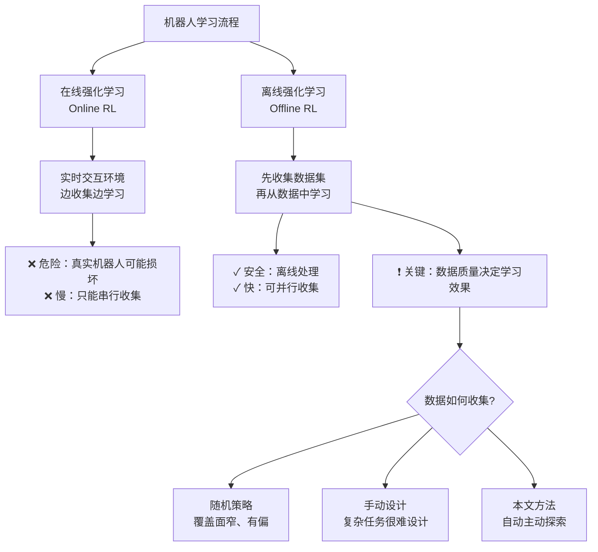
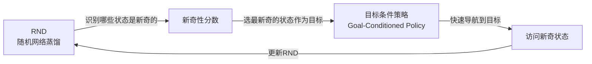
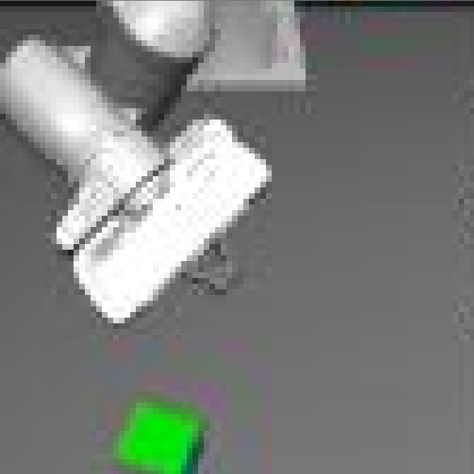
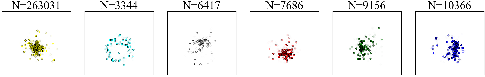
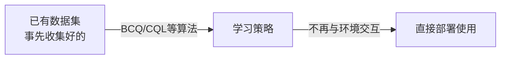
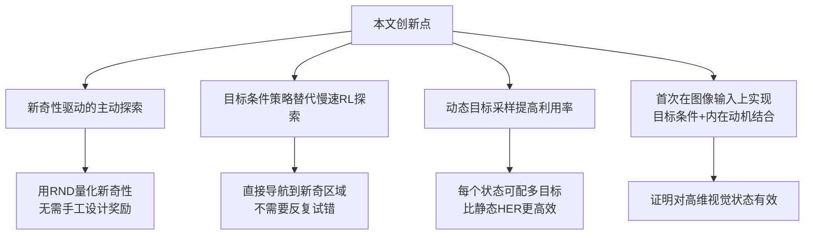

# Efficient Self-Supervised Data Collection for Offline Robot Learning

> **论文信息**
> - **作者**：Shadi Endrawis, Gal Leibovich, Guy Jacob, Gal Novik, Aviv Tamar
> - **机构**：Technion - 以色列理工学院 & Intel Labs
> - **发表**：arXiv:2105.04607 (2021), ICRA 2021
> - **关键词**：离线强化学习、探索策略、内在动机、目标条件策略、数据收集

---

## 📖 TL;DR（一句话总结）

**问题**：机器人学复杂任务需要大量高质量数据，但手动设计数据收集策略很难，随机探索又效率低下。

**解决方案**：训练一个"好奇心驱动"的机器人——用 **RND 识别新奇状态 + 目标条件策略快速抵达**，自动收集覆盖面广、分布均匀的离线数据集，让后续任务学习效果大幅提升。

---

## 🎯 问题背景：为什么数据收集这么重要？



**核心洞察**：对于复杂任务（如叠积木），如果数据收集策略只是随机乱抓，几乎不会遇到"积木叠起来"这样的关键状态，学出来的策略就很差。

---

## 💡 核心思路：目标条件 + 新奇性驱动

本文提出 **三个关键"成分"** 的组合：



### 成分1：RND（Random Network Distillation，随机网络蒸馏）

**目的**：判断一个状态有多"新奇"（从未访问过 → 新奇；反复访问 → 不新奇）

**原理**：
1. 随机初始化一个固定的"目标网络" \(f: S \rightarrow \mathbb{R}^k\)
2. 训练一个"预测网络" \(\hat{f}: S \rightarrow \mathbb{R}^k\) 来预测目标网络的输出
3. 预测误差 \(\|\hat{f}(s) - f(s)\|^2\) 代表新奇性：
   - 见过很多次的状态 → 预测准确 → 误差小 → 不新奇
   - 从没见过的状态 → 预测不准 → 误差大 → 很新奇

> **比喻**：就像一个学生做题，反复做过的题型很熟练（误差小），遇到新题型就会出错（误差大）。误差大的题 = 新奇的状态。

### 成分2：目标条件策略（Goal-Conditioned Policy）

**目的**：快速"导航"到指定的目标状态

**关键区别**：
- **普通RL探索**：靠奖励信号慢慢调整，遇到新奇区域要花很久才能"学会去那里"
- **目标条件策略**：直接把目标作为输入，训练"给定目标，如何以最少步骤到达"

训练方式：**HER（Hindsight Experience Replay，事后经验回放）**
- 即使没有达到原来的目标，也可以把轨迹中经过的任意状态作为"虚假目标"重新使用
- 这样每条轨迹都能产生大量训练样本，极大提高数据利用率

### 成分3：主动目标选择

每个 episode 开始时：
1. 从回放缓冲区（replay buffer）中采样一批状态
2. 选择其中 **新奇性分数最高** 的那个作为当前 episode 的目标
3. 用目标条件策略快速导航到这个目标
4. 把访问过的轨迹加入数据集

---

## 📝 算法详解

```
算法1：目标条件 + RND 数据集收集

初始化：RND 网络 f, f^, 回放缓冲区 R, 离策略RL算法 A

对每个训练循环（N次）：
  对每个 episode（M次）：
    1. 从 R 中采样子集 R'
    2. 目标 g = argmax_{R'} ||f^(s) - f(s)||²  ← 选最新奇的状态为目标
    3. 对每步 t = 0 ... T：
       a. 执行动作 at = π(st, g)  ← 用目标条件策略
       b. 观察新状态 st+1
       c. 将 (st, at, st+1) 存入 R
    4. 从 R 采样 mini-batch：
       - 动态采样目标 gτ（从轨迹中随机选）
       - 奖励：到达目标为 0，否则为 -1
       - 用 HER 方式训练
  更新 RND 的预测网络 f^（仅用最近的 M 个 episode）

返回数据集 R
```

> 💡 **动态目标采样 vs 静态（HER）的区别**：HER 在状态存入缓冲区时就固定了目标；本文每次从缓冲区采样时才分配目标，同一个状态可以配对不同的目标，**样本利用率更高**。

---

## 🔬 实验设置

### 环境：Franka Panda 机械臂 + 彩色方块



- **机器人**：7 自由度 Franka Panda 机械臂，末端执行器位置控制
- **场景**：桌面上有一个六面不同颜色的方块
- **观测**：俯视摄像头图像（84×84 像素）
- **动作**：末端执行器的笛卡尔位置移动
- **每个 episode**：200 步，方块每次重置到初始位置（黄色面朝上）

### 对比基线

| 方法 | 描述 |
|------|------|
| 随机策略 | 完全随机动作 |
| 纯 RND（Vanilla RND） | 仅用内在奖励训练 RL，不使用目标条件 |
| **本文（Goal-Conditioned + RND）** | 目标条件策略 + RND 新奇性选目标 |

---

## 📊 实验结果

### 实验1：玩具域——覆盖度测试

对象（白色方块）在 84×84 格子中移动，测量收集的状态有多少覆盖了整个状态空间：

| 方法 | 覆盖的独特状态数（500 episodes） |
|------|-------------------------------|
| 随机策略 | ~10,000 → **平台期** |
| 纯 RND | 更多，但效率低 |
| **本文（Goal-Conditioned Max Novelty）** | **最多，持续增长** |
| 目标条件（最小新奇性） | 最差（反向选目标） |
| 目标条件（随机目标） | 比随机策略还差 |

> 关键发现：随机策略会陷入"平台期"，增加样本量也无法改善；本文方法**持续发现新状态**。

### 实验2：数据集可视化



可视化方块在桌面上的位置和朝向：
- **随机策略**：方块位置集中在初始位置附近，朝向单一（几乎全是黄色面朝上）
- **纯 RND**：稍好，但仍有很大空白区域
- **本文方法**：方块位置遍布整个桌面，六个面颜色分布均匀

### 实验3：下游任务——监督学习

基于收集的数据训练分类/回归模型：

| 下游任务 | 随机策略 | 纯 RND | 本文方法 |
|---------|---------|--------|---------|
| 预测方块上表面颜色（分类准确率）| 低 | 中 | **最高** |
| 预测方块位置（回归 MSE）| 高 | 中 | **最低** |

### 实验4：下游任务——离线强化学习（BCQ）

基于收集的数据训练 BCQ 策略，成功率（%）：

| 任务 | 随机策略 | 纯 RND | 本文方法 |
|------|---------|--------|---------|
| 翻转方块（指定颜色朝上） | 低 | 中 | **高** |
| 推方块到右侧区域 | 中 | 中 | **高** |
| 翻转 + 推（组合任务） | 低 | 低 | **高** |

---

## 🧠 关键技术解释

### 什么是"离线强化学习（Offline RL）"？



与在线 RL 的对比：

| 方面 | 在线 RL | 离线 RL |
|------|---------|---------|
| 与环境交互 | 是，持续交互 | 否，只用固定数据 |
| 数据来源 | 自己收集 | 事先给定 |
| 安全性 | 低（可能损坏机器人） | 高 |
| 数据质量依赖 | 低 | **高（核心挑战）** |

### 什么是"HER（Hindsight Experience Replay，事后经验回放）"？

**比喻**：假设你想练习"把杯子放到指定位置"，但每次都失败了。

普通训练：这条失败的轨迹没有用。

HER训练：把"轨迹中最后杯子真正在的位置"作为目标，这条轨迹就变成了"成功到达目标 X"的训练样本！

> 就像事后总结："虽然没到达原定目标，但我成功到达了另一个地方，这也算学到了导航能力。"

### 什么是"目标条件策略（Goal-Conditioned Policy）"？

策略输入 = 当前状态 + 目标状态，输出动作：

$$
a_t = \pi(s_t, g)
$$

价值函数变成"从 \(s_t\) 出发，以 \(a_t\) 动作，到达目标 \(g\) 的期望折扣奖励"：

$$
Q^\pi(s, a, g) = \mathbb{E}\left[\sum_{k=t+1}^{\infty} \gamma^{k-t-1} r_k \mid s_t = s, a_t = a, g\right]
$$

用 -1 奖励（未到达）和 0 奖励（到达），该值函数实际上代表了"从 s 到 g 的负距离"。

---

## 🔑 创新点总结



---

## ⚠️ 局限性与未来工作

1. **仅在仿真中验证**：真实机器人的 sim-to-real 迁移未测试
2. **固定 episode 长度**：真实场景中 episode 长度可能不固定
3. **单任务场景**：更复杂的多任务场景未评估
4. **计算开销**：每个 episode 需要查询新奇性 → 大型数据集时可能慢

**未来方向**：在真实机器人上测试，结合 sim-to-real 方法，探索组合仿真和真实数据的方案。

---

## 📝 总结

| 要素 | 内容 |
|------|------|
| **问题** | 离线RL的数据质量瓶颈 |
| **方法** | RND新奇性 + 目标条件策略 |
| **优势** | 比随机/纯RND更广、更均匀的状态覆盖 |
| **验证** | 监督学习+离线RL多种下游任务均有提升 |
| **局限** | 仅在仿真验证，计算有额外开销 |
