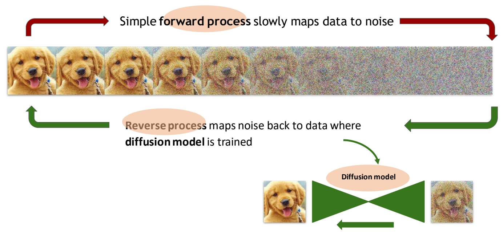
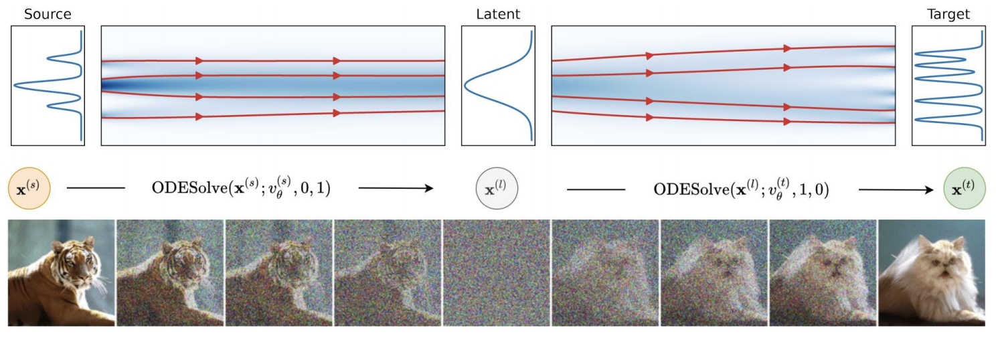
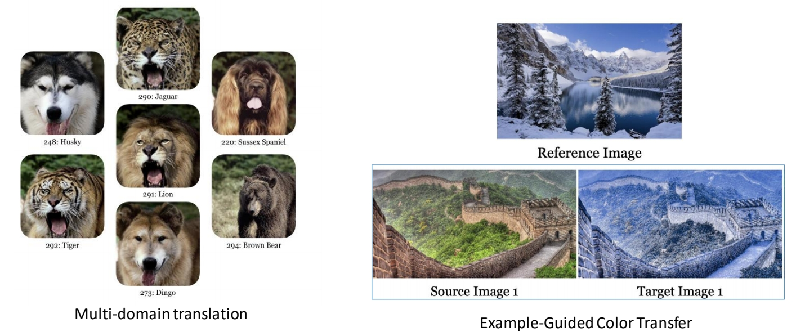

# Dual Diffusion Implicit Bridges for Image-to-Image Translation

DDIB提出了一种基于扩散模型的图像到图像翻译方法，通过隐式桥接（Implicit Bridges）实现跨域转换。以下从方法原理、技术贡献、理论关联及实验结果等方面进行解读：

---

### 一、核心思想与背景
传统图像翻译方法（如CycleGAN）依赖对抗训练，但存在模型扩展性差（n个域需n²个模型）和数据隐私受限（需跨域联合训练）的问题。DDIB基于**去噪扩散隐式模型（DDIM）**，利用其确定性隐空间映射特性，提出了一种无需成对数据、各域独立训练的解决方案。核心思路是：将源域图像通过DDIM的前向过程映射到隐空间，再通过目标域的DDIM反向过程生成目标图像，形成“隐式桥接”。

---

### 二、方法原理
#### 1. **DDIM的特性**

[Recap DDIM Inversion](https://caterpillarstudygroup.github.io/ReadPapers/2.html)

DDIM通过常微分方程（ODE）将扩散过程建模为确定性映射，其前向过程（图像→隐变量）与反向过程（隐变量→图像）互为逆过程，保证了隐空间的一致性。这一特性使得不同域的隐变量可以直接传递，无需对齐或额外处理。使得DDIM Inversion 成为图像编辑的常用方法。     

 

#### 2. **DDIB流程**

 

> &#x2705; 假设已有一个 文生图的pretrained DDIM model．    
> &#x2705; 任务：把老虎的图像变成猫的图像，且不改变 Sryle.     

1. **源域编码**：使用源域预训练的DDIM，通过前向ODE将图像\\( x_0^{(s)} \\)映射到隐变量\\( x_T \\)。

> &#x2705; (1) 老虎图像 ＋ DDIM Inversion ＋ “老虎”标签  → noise      

2. **隐变量传递**：直接将\\( x_T \\)输入目标域的DDIM。

3. **目标域解码**：通过目标域的反向ODE从\\( x_T \\)生成目标图像\\( x_0^{(t)} \\)。

> &#x2705; (2) noise ＋ DDIM ＋ “猫”标签 → 猫图像        

#### 3. **隐空间对齐的理论依据**
作者将DDIB与**蒙日最优传输（Monge Optimal Transport）**关联，认为DDIM的训练目标近似于最小化源域到隐空间、隐空间到目标域的最优传输代价。尽管理论证明不完整，但实验显示DDIB生成的图像与最优传输方法结果接近。

---

### 三、技术贡献与优势
1. **无需成对数据**：仅需各域独立训练的DDIM模型，适用于医疗等隐私敏感场景。
2. **模型扩展性**：n个域仅需n个模型，而非传统方法的n²个，显著降低计算成本。
3. **确定性生成**：DDIM的确定性隐变量映射避免了随机噪声干扰，提升生成稳定性。
4. **兼容性**：可与现有扩散模型结合，例如在CT超分辨率任务中保留拓扑结构，或用于医学图像合成。
5. 只需要预训练模型，不需要根据特定任务重训。     

---

### 四、实验与验证
1. **二维分布实验**：在简单分布（如高斯混合分布）上验证隐空间桥接的有效性，结果显示DDIB的转换结果与最优传输方法接近。
2. **多域图像翻译**：在自然图像数据集（如Edges→Photos）中，DDIB生成质量与CycleGAN相当，但模型复杂度更低。
3. **医学应用**：后续工作（如CT超分辨率）借鉴DDIB思想，通过双流扩散模型在保留结构的同时提升分辨率。

---

### 五、局限性与未来方向
1. **理论解释不足**：隐空间直接传递的可行性缺乏严格数学证明，需进一步探索。
2. **隐空间对齐假设**：若源域与目标域的隐空间分布差异过大，可能导致转换失败，需引入自适应对齐机制。
3. **扩展性优化**：针对高分辨率图像，需结合分层扩散模型或加速采样策略（如DDIM的子序列采样）。

---

### 其它应用

 

> &#x2705; 学习不同颜色空间的 transform    

### 六、总结
DDIB通过扩散模型的隐空间桥接机制，为图像翻译提供了一种高效、安全的解决方案，尤其适用于多域、无配对数据的场景。其思想在后续研究中被广泛应用于医学成像和跨模态生成任务，推动了扩散模型在跨域转换中的发展。

