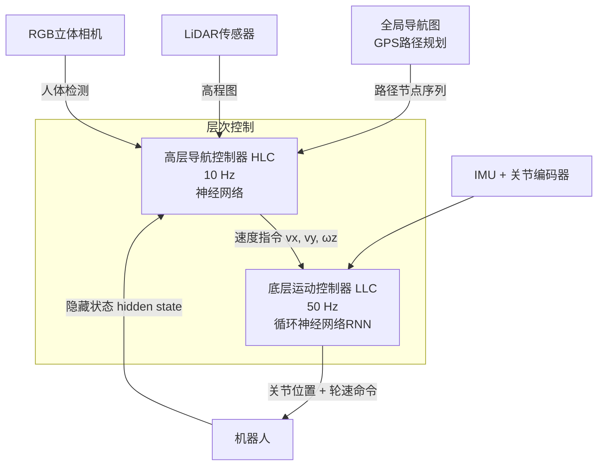
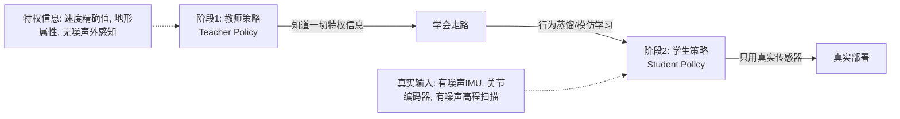
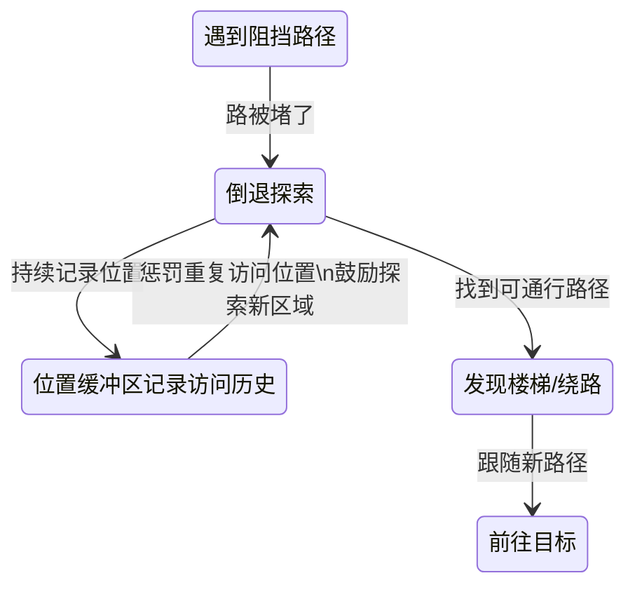
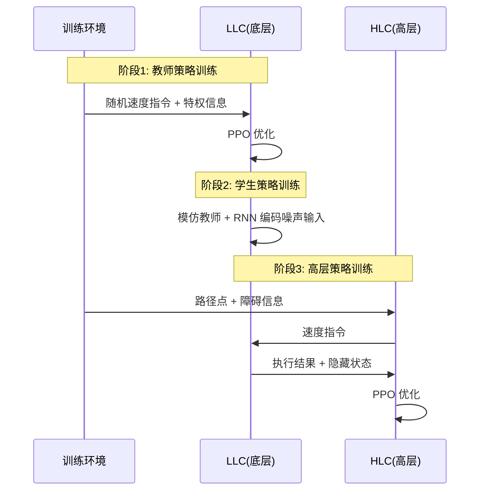
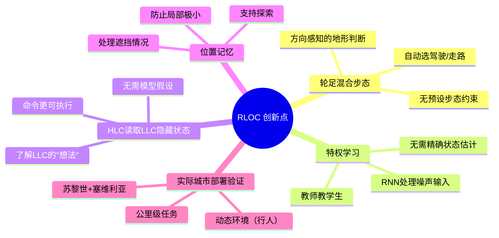

# Learning Robust Autonomous Navigation and Locomotion for Wheeled-Legged Robots

> **论文信息**
> - **作者**：Joonho Lee, Marko Bjelonic, Alexander Reske, Lorenz Wellhausen, Takahiro Miki, Marco Hutter
> - **机构**：ETH Zurich 机器人系统实验室 & Swiss-Mile Robotics AG
> - **发表**：*Science Robotics* Vol. 9, Issue 89, 2024（顶级期刊！）
> - **arXiv**：arXiv:2405.01792v1
> - **关键词**：轮足机器人、层次强化学习、自主导航、城市配送、混合运动控制

---

## 📖 TL;DR（一句话总结）

ETH Zurich 研究团队让一个带轮子的四足机器人在**苏黎世和塞维利亚的城市街道**上完成了公里级自主送货任务——速度是普通四足机器人的 3 倍，能耗降低 53%，能走楼梯、避行人、穿窄道，全部靠强化学习实现！

---

## 🤔 为什么需要"轮足机器人"？

传统机器人各有局限：

```mermaid
graph TD
    A[城市配送机器人的需求] --> B[纯轮式机器人\n轮椅/小车]
    A --> C[纯足式机器人\nANYmal]
    A --> D[轮足混合机器人\n本文]
    
    B --> B1[✓ 平地速度快\n✓ 能耗低\n✗ 无法上楼梯\n✗ 复杂地形失败]
    C --> C1[✓ 能攀爬\n✓ 适应复杂地形\n✗ 速度慢(2.2km/h)\n✗ 能耗高\n✗ 仅续航1小时]
    D --> D1[✓ 平地高速(>5m/s)\n✓ 能上楼梯\n✓ 能耗低\n✓ 续航长\n✓ 遇障碍自适应切换步态]
```

本文机器人的关键能力数据：
- 平均速度：**1.68 m/s**（ANYmal 的 3 倍）
- 机械运输成本（COT）：**0.16**（降低 53%）
- 最高速度：**5.0 m/s**（驾驶模式）
- 苏黎世测试总行程：**8.3 km**，极少人工干预

---

## 🏗️ 系统架构总览

系统由三层组成：



| 控制器 | 频率 | 输入 | 输出 | 职责 |
|--------|------|------|------|------|
| HLC（高层） | 10 Hz | 路径点 + 地形高程图 + LLC隐藏状态 + 位置历史 | 速度指令 (vx, vy, ωz) | 导航规划 + 避障 |
| LLC（底层） | 50 Hz | IMU + 关节状态 + 高程扫描 | 关节位置 + 轮速 | 步态控制 + 平衡 |

---

## 🦾 底层运动控制器（LLC）：让机器人会"走"

### 核心设计思路：特权学习（Privileged Learning）

训练分**两阶段**：



**为什么分两阶段？**  
真实机器人的 IMU 是有噪声的，传感器会有误差。如果直接用噪声数据训练，很难学好。先用"上帝视角"的完美信息训练一个好的教师，再让学生通过 RNN 从噪声中恢复这些信息。

### 涌现出来的步态行为

LLC 没有预设步态，**完全从零学习**，结果自然涌现出多种步态：

| 地形场景 | 涌现的步态 |
|---------|----------|
| 平坦地面 | 驾驶模式（全轮接地，腿基本不动）|
| 凹凸路面（障碍<轮子半径） | 主动悬挂（轮子接地，腿动态调整保持身体稳定）|
| 楼梯 / 陡坡 | 对角步（Trot，类似四足机器人）|
| 大型离散障碍 | 非对称步态（部分腿爬，部分轮子滚）|
| 极端高障碍（40cm） | 用膝盖爬行 |

> 💡 **关键：不对称地形感知**  
> 机器人"下台阶"比"上台阶"能处理更高的落差！这是因为重力方向不同，对稳定性的影响不对称。传统遍历性地图（traversability map）假设对称，**本文的 HLC 学会了方向感知**。

---

## 🗺️ 高层导航控制器（HLC）：让机器人会"想"

### 观测空间设计

HLC 的输入包含 4 种信息：

| 信息类型 | 具体内容 | 作用 |
|---------|---------|------|
| 外感知（地形） | 机器人周围 3m×1.5m 的高程扫描（包含前两帧）| 感知障碍物 |
| LLC 隐藏状态 | RNN 的内部状态向量 | 了解当前步态和地形适应情况 |
| 位置记忆 | 最近 20 个已访问位置（每 0.5m 记录一次）+ 停留时间 | 防止兜圈、支持探索 |
| 路径点 | WP1（近）+ WP2（远）及历史 | 目标方向 |

> 🔑 **关键设计：LLC 隐藏状态**  
> 传统导航器只知道机器人的估计位置和速度。本文 HLC 直接读取 LLC 的 RNN 隐藏状态（相当于知道 LLC 在"想什么"），能自动适应当前地形和步态状态，避免给出 LLC 无法执行的速度指令。

### 位置记忆的作用



**没有记忆会怎样？** 实验证明：无记忆版本会陷入局部极小（来回打转），失败率最高。

### 动作空间：Beta 分布 vs 高斯分布

HLC 用 **Beta 分布** 来表示速度指令，而不是常用的高斯分布。

原因：Beta 分布天然有**有界输出**（值域在 [0,1]，可缩放到任意范围），避免输出超出物理限制：
- \(v_x \in [-1.0, 2.0]\) m/s（前向偏多，方便朝前走）
- \(v_y \in [-0.75, 0.75]\) m/s（左右移动）
- \(\omega_z \in [-1.25, 1.25]\) rad/s（转向）

### 奖励函数设计

**密集奖励**（训练初期）：

$$
r_{h,dense} = \begin{cases} 1.0 & \text{if } |e_{wp1}| < 0.75 \\ \text{clip}(v \cdot d_{e_{wp1}}, 0, v_{thres}) / v_{thres} & \text{otherwise} \end{cases}
$$

**探索奖励**（防止兜圈）：

$$
C(p_{robot}, wp_1, p_{buf}^i) = \begin{cases} 0 & \text{if } |p_{robot} - wp_1| < 0.75 \\ -n_{buf}^i & \text{if } |p_{robot} - p_{buf}^i| < 1.0 \end{cases}
$$

如果机器人一直待在同一个地方，就会收到惩罚（惩罚值 = 停留时间次数），迫使其探索新区域。

---

## 🏙️ 训练环境：游戏技术启发

### 波函数折叠（Wave Function Collapse, WFC）算法

受**电子游戏**技术启发，用 WFC 算法自动生成多样化的训练地图：


WFC 算法保证地形多样性：有走廊、房间、楼梯、开阔区域的各种组合，同时保证路径一定可达（使用 Dijkstra 算法确认连通性）。

### 训练流程



---

## 📊 实验结果

### 大规模城市部署（苏黎世）

- **区域大小**：245m × 345m，约 8.5 公顷
- **总行程**：8.3 km
- **目标点数**：13 个（人工选取，最大化覆盖范围）
- **扫描时间**：90 分钟（使用手持激光扫描仪预扫描）

**速度与能耗对比（vs ANYmal-C 在 DARPA 地下挑战赛中的数据）：**

| 指标 | ANYmal-C | 本文机器人 | 改进幅度 |
|------|---------|----------|--------|
| 平均速度 | ~0.56 m/s | 1.68 m/s | **+3×** |
| 机械运输成本 COT | ~0.34 | 0.16 | **-53%** |
| 腿关节 \(\sum\tau^2\) | 100% | 84%（更重+更快） | **-16%** |

### 对比传统导航方法

| 指标 | 传统采样规划器 | **本文 HLC（+记忆）** |
|------|-------------|-------------------|
| 任务失败率 | 高 | **最低** |
| 碰撞率 | 有（延迟导致） | **0**（全无碰撞）|
| 规划时间 | 最高>1 秒 | **0.34 ms**（快 3000×）|
| 平均追踪误差 | 0.45 m/s | **0.24 m/s** |

> 传统方法的碰撞原因：重规划有延迟，机器人速度快时来不及刹车；且对 LLC 跟踪能力做了理想化假设。本文 HLC 因为直接读取 LLC 状态，完全避免了这个问题。

---

## 🔑 关键创新总结



---

## ⚙️ 关键名词解释

### 机械运输成本（COT，Cost of Transport）

$$
COT_{mech} = \frac{\sum_{all\ joints} [\tau \dot{\theta}]^+}{mg \cdot |v_{xy}^b|}
$$

- 分子：所有关节的**正**机械功率（推动运动的有效功）
- 分母：机器人重量 × 水平速度（"传送1牛顿重量前进1米的代价"）
- 越小越节能，驾驶模式 COT ≈ 0.01（近乎免费！）

### 波函数折叠（WFC）

一种从游戏开发借鉴的**程序化地图生成**算法。给定几种基本地块的约束规则（比如"楼梯只能连接到平地"），WFC 算法像解数独一样，递归地随机生成满足所有约束的合法地图布局。

### 路径追踪算法（Pure Pursuit）

一种经典的路径跟随算法：在路径上设定一个"前瞻点"（look-ahead point），始终让机器人朝那个点移动。本文将其与 RL 结合，由 HLC 动态决定向哪个路径点方向走。

---

## ⚠️ 局限性与未来方向

| 局限性 | 原因 | 未来方向 |
|--------|------|---------|
| 最高速度限于 2m/s（自主） | 高程图更新延迟，3m 感知范围不够 | 依赖原始传感器流替代高程图 |
| 语义感知缺失 | 仅用几何信息 | 加入语义分割（识别草地/私人领地） |
| 地图建立需人工预扫描 | 约 90 分钟 | 在线建图 |
| 孩子等小型动态障碍 | 保守处理，主动停机 | 更精细的动态感知 |
| 走廊定位退化 | LiDAR 无特征 | 鲁棒定位算法 |
