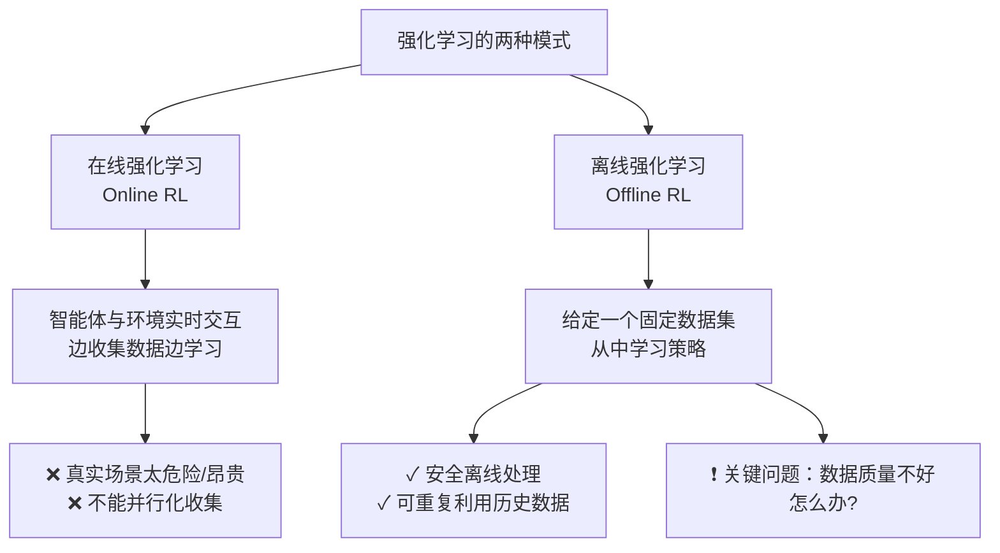
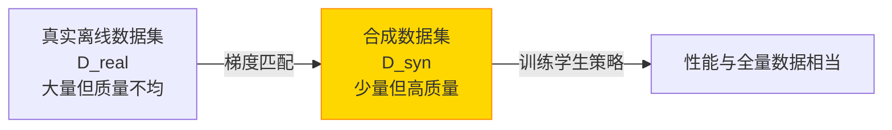
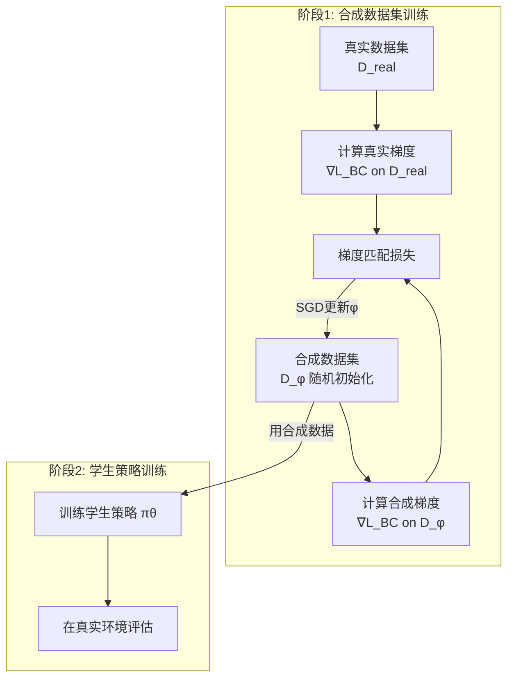
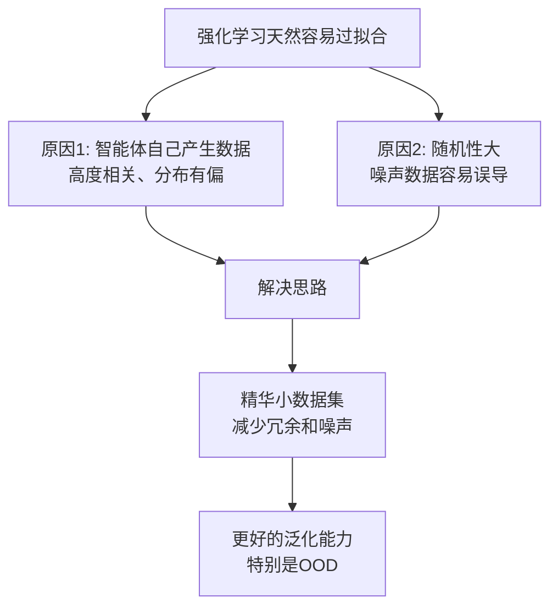

# Dataset Distillation for Offline Reinforcement Learning

> **论文信息**
> - **作者**：Jonathan Light\*, Yuanzhe Liu\*, Ziniu Hu（\*同等贡献）
> - **机构**：Rensselaer Polytechnic Institute & Caltech
> - **发表**：ICML Workshop on Data-centric Machine Learning Research, 2024
> - **arXiv**：arXiv:2407.20299
> - **关键词**：离线强化学习、数据集蒸馏、行为克隆、梯度匹配

---

## 📖 TL;DR（一句话总结）

离线强化学习的质量取决于数据集。本文提出：**与其在烂数据上练出更好的算法，不如先把烂数据"蒸馏"成好数据**——用梯度匹配技术合成一个超小但高质量的合成数据集，训练出来的策略性能与全量数据相当，数据量仅需原来的 **1.5%**！

---

## 🎯 问题背景

### 什么是"离线强化学习"？

### 已有数据集质量差的两大表现

1. **数据是"普通"策略产生的**：现实中很难获得完美专家数据，大多是"凑合"策略产生的
2. **分布偏移（Distribution Shift）**：策略在数据中学到的分布，与在真实环境中遇到的分布不同

### 已有的应对方法：百分位行为克隆（Percentile BC）

只保留数据集中表现最好的 x% 的轨迹来训练：
- BC 10%：只用得分最高的 10% 数据
- BC 25%：只用得分最高的 25% 数据
- 以此类推……

问题：这还是在"筛选"数据，没有真正提升数据质量。

---

## 💡 本文方案：数据集蒸馏（Dataset Distillation）

核心思想：**不筛选数据，而是"合成"更好的数据。**

### 直觉理解

> **比喻**：假设你要学一门课，有两种选择：
> - 选项A：读 1000 篇杂乱的网文（BC full dataset）
> - 选项B：读 15 篇精心整理的精华笔记（本文合成数据）
>
> 精华笔记虽然量少，但包含了最核心的梯度信息，训练出来的模型反而更好！

---

## 📐 方法详解：梯度匹配（Gradient Matching）

### 核心公式

合成数据集 \(D_\phi\) 的参数 \(\phi\) 通过最小化以下**梯度匹配损失**来学习：

$$
L_{grad\_match}(\phi|\theta_i) = \mathbb{E}_{\theta \sim p_\theta} \left[ \|\nabla_\theta L_{BC}(\theta|D_{real}) - \nabla_\theta L_{BC}(\theta|D_\phi)\| \right]
$$

**通俗解释**：
1. 随机初始化一个模型 \(\theta\)
2. 计算在**真实数据集**上的梯度 \(\nabla_\theta L_{BC}(\theta|D_{real})\)
3. 计算在**合成数据集**上的梯度 \(\nabla_\theta L_{BC}(\theta|D_\phi)\)
4. 让两个梯度尽量接近

> **关键洞察**：如果一个小数据集在随机初始化的模型上产生的梯度，与大数据集产生的梯度相同，那么训练出来的模型也会相同！

### 行为克隆损失（BC Loss）

$$
L_{BC}(\theta|D) = \sum_{(s_t^i, a_t^i, \ldots) \in D} w(s_t^i, a_t^i, \ldots) \|\pi_\theta(s_t^i) - a_t^i\|
$$

就是用监督学习训练策略模仿专家动作。合成数据集需要让这个损失的梯度和真实数据相匹配。

### 整体流程

---

## 🎮 实验环境：Procgen

Procgen 是 OpenAI 开发的**程序化生成游戏**环境，共 16 款游戏。

| 特点 | 描述 |
|------|------|
| 状态空间 | 64×64 像素 RGB 图像 |
| 动作空间 | 离散（上下左右 + 互动） |
| 关键特性 | 同一游戏规则，但每个 seed 生成不同地图 |
| 泛化测试 | 在分布内（ID）和分布外（OOD）地图上分别测试 |

本文使用的 3 个游戏：

| 游戏 | 描述 |
|------|------|
| **Bigfish** | 控制鱼吃更小的鱼，避开大鱼 |
| **Starpilot** | 太空飞船射击游戏，躲子弹打敌人 |
| **Jumper** | 平台跳跃游戏，需要跳跃过关 |

### 模型设置

| 角色 | 架构 | 参数量 | 训练步数 |
|------|------|--------|---------|
| 专家（Expert） | IMPALA CNN | 621,632 | 2500万步 |
| BC 学生 | 轻量 CNN | 6,966 | 1000步 |
| 合成数据学生 | 轻量 CNN | 6,966 | **100步** |

> 合成数据学生训练步数是BC学生的 1/10，却能达到相当性能！

---

## 📊 实验结果

### 数据集大小对比

| 游戏 | BC 10% | BC 25% | BC 100% | 本文合成数据 |
|------|--------|--------|---------|-------------|
| Bigfish | 2,027 | 5,014 | 10,450 | **150** |
| Starpilot | 1,116 | 2,796 | 6,830 | **150** |
| Jumper | 392 | 919 | 4,837 | **150** |

→ 合成数据集大小固定为 **150 条**，相当于 BC10% 的 **4%~38%**！

### 分布内（ID）性能

| 游戏 | BC 10% | BC 25% | BC 40% | BC 100% | **本文 Synthetic** |
|------|--------|--------|--------|---------|-------------------|
| Bigfish | 0.90 | 0.93 | 1.01 | 1.00 | **1.03** ✓ |
| Starpilot | 1.73 | 2.10 | 2.17 | 1.85 | 1.5（较差）|
| Jumper | 1.79 | 2.15 | 1.95 | 2.32 | **2.76** ✓✓ |

### 分布外（OOD）性能

| 游戏 | BC 10% | BC 100% | **本文 Synthetic** |
|------|--------|---------|-------------------|
| Bigfish | 0.93 | 0.87 | 0.83（相当）|
| Starpilot | 1.83 | 1.82 | 1.54（稍差）|
| Jumper | 1.81 | 2.50 | **2.86** ✓✓ |

> **结论**：在 Jumper 和 Bigfish 上，合成数据训练的学生优于所有 BC 变体；Starpilot 除外（原因：动作分布极度不均衡，导致蒸馏失败）。

---

## 🔑 为什么更小的数据集反而能帮助 RL 泛化？

本文的洞察：

类比：让学生学好一本写得好的教材，比让学生读 1000 篇低质量文章更有效。

---

## ⚠️ 局限性

| 局限性 | 描述 |
|--------|------|
| 测试环境有限 | 仅测试了 3 个 Procgen 游戏 |
| Starpilot 失败 | 动作分布极不平衡时，梯度匹配效果差 |
| 使用BC（行为克隆）策略 | 未探索 Q-learning 或 Actor-Critic 等方法 |
| 计算成本 | 蒸馏过程本身需要额外计算 |

---

## 🧠 关键概念解释

### 知识蒸馏（Knowledge Distillation）vs 数据集蒸馏（Dataset Distillation）

| 方面 | 知识蒸馏 | 数据集蒸馏 |
|------|---------|---------|
| 目标 | 压缩**模型**（大→小）| 压缩**数据集**（大→小）|
| 输出 | 轻量化学生模型 | 小型合成数据集 |
| 应用 | 模型部署 | 数据效率提升 |

### 梯度匹配为什么有效？

如果两个数据集在同一个模型上产生相同的梯度，则无论从哪个初始权重开始训练，训练轨迹都会相似，最终收敛到相近的模型。因此，**梯度匹配 = 训练行为匹配**。

---

## 📝 总结

| 要素 | 内容 |
|------|------|
| **问题** | 离线RL数据质量差 |
| **方法** | 用梯度匹配蒸馏小型合成数据集 |
| **结果** | 150条数据 ≈ 10000条真实数据的训练效果 |
| **最佳场景** | 数据稀少、噪声大、无法在线收集的场景 |
| **局限** | 动作分布不均衡时效果下降 |
