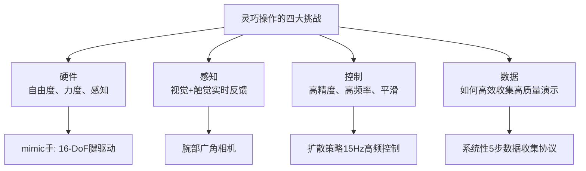
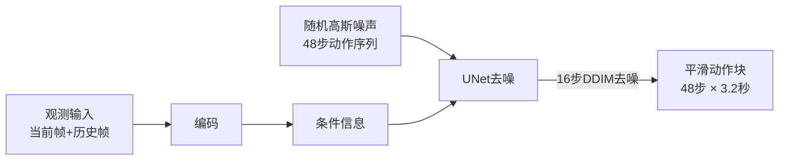
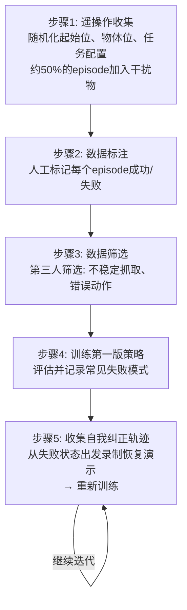
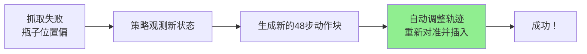
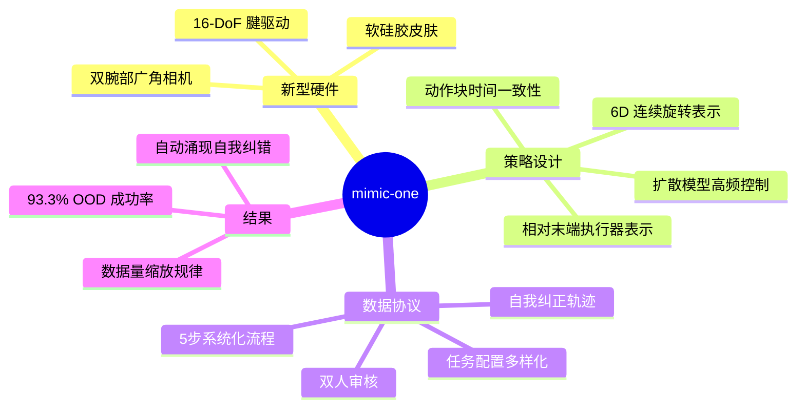

# mimic-one: A Scalable Model Recipe for General Purpose Robot Dexterity

> **论文信息**
> - **作者**：Elvis Nava\*, Victoriano Montesinos, Erik Bauer, Benedek Forrai 等（\*通讯作者）
> - **机构**：mimic robotics（苏黎世）& ETH Zurich
> - **发表**：arXiv:2506.11916（2025年6月）
> - **主页**：https://mimicrobotics.github.io/mimic-one/
> - **关键词**：灵巧操作、扩散策略、模仿学习、腱驱动机械手、自我纠正

---

## 📖 TL;DR（一句话总结）

mimic-one 提供了一套**完整的灵巧机器人手方案**：新设计的 16 自由度腱驱动手 + 扩散模型策略 + 系统性数据收集协议，在面包抓取、瓶子分拣、电池插入等任务上达到高达 **93.3% 的分布外成功率**，并展现出意外的"自我纠错"能力。

---

## 🤔 为什么灵巧操作这么难？

人的手有 27 块骨头、29 个关节，可以完成无数复杂动作。机器人要做到同等灵巧，需要同时解决：



现有方案的局限：
- 研究级机械手：超级贵、维护复杂
- 双指夹爪：便宜但能力有限（无法完成装配、分拣等复杂任务）
- 大规模VLA模型（RT-1/2）：推理慢、不适合高频灵巧控制

---

## 🦾 硬件：mimic 灵巧手

### 设计理念

**人体仿生 + 工程简化**：保留最重要的人手特征，去掉不必要的复杂度。

| 参数 | 数值 | 意义 |
|------|------|------|
| 关节数 | 20 个 | 完整的五指 |
| 自由度（DoF） | 16 | 实际控制的独立维度 |
| 驱动方式 | 腱驱动（Tendon-Driven） | 柔顺、类人 |
| 最大负载 | >7 kg（五指抓握）| 工业级可用 |
| 皮肤材质 | 软硅胶接触面 | 接触更稳定 |
| 视觉 | 2 个宽角 RGB 腕部相机 | 丰富视角、低延迟 |

### 设计重点

- **拇指对立（Opposition）**：解剖学准确的拇指设计，能做出人手的对握
- **所有手指的展收（Abduction/Adduction）**：手指左右张合，对于灵巧操作非常重要
- **关节耦合**：对不太关键的自由度用联动机构简化，减重
- **软皮肤**：接触更稳定，避免硬接触失控

---

## 🤖 系统总览

### 完整硬件配置

```
[Apple Vision Pro / Manus手套] → 遥操作
        ↓
[Franka Panda 7-DoF 机械臂]
        ↓
[mimic 16-DoF 灵巧手]
   ├── 腕部相机（上方）
   ├── 腕部相机（下方）
   └── 软硅胶皮肤
        ↓
外部工作空间相机（俯视）
```

### 遥操作方式

| 方式 | 设备 | 特点 |
|------|------|------|
| 手套式 | Manus 运动捕捉手套 + SpaceMouse | 高精度手部跟踪 |
| VR 式 | Apple Vision Pro | 更自然、便携 |

两种方式都通过"关键向量重定向（Key-Vector Retargeting）"将人手姿态转换为机器人手关节角度：

$$
E\left((\beta^h, \theta^h), q\right) = \sum_{i=1}^{15} \|v_i^h - (c_i \cdot v_i^r)\|
$$

其中 \(v_i^h\) 和 \(v_i^r\) 是人手和机器人手的掌心到指尖向量，\(c_i\) 是尺度比例因子。

---

## 🧠 策略架构：扩散策略（Diffusion Policy）

### 核心思路

用扩散模型（Diffusion Model）来生成动作序列：从高斯噪声出发，逐步"去噪"，最终得到平滑的动作轨迹。



### 模型细节

| 组件 | 具体实现 |
|------|---------|
| 图像编码器 | CLIP 预训练 ViT-B/16（3个相机各一份，权重共享）|
| 动作生成网络 | UNet（嵌入维度128，核大小5）|
| 观测窗口 Ho | 2帧 |
| 动作块长度 Ha | 48步 = 3.2秒（15Hz） |
| 推理去噪步数 | 16步（DDIM 加速采样）|
| 推理重置频率 | 每执行第10步重新计算下一个动作块 |

### 关键设计：相对末端执行器表示

这是论文中**最重要的技术细节**之一，影响泛化能力：

**问题**：机器人每次启动位置不同，如果用"绝对坐标"表示动作，同一个任务在不同起始位置要学截然不同的轨迹。

**解决**：用**相对坐标**——以最近一次观测到的末端执行器位置为"基准坐标系"，所有状态和动作都表示为相对于这个基准的偏移。

$$
T_k^{state\ rel} = (R_t^{obs})^T (T_k^{obs} - T_t^{obs})
$$
$$
R_k^{state\ rel} = (R_t^{obs})^T R_k^{obs}
$$

> **直觉**：就像GPS导航：
> - **绝对坐标**："从经度116°，纬度39°出发..."（每次位置不同，就是全新任务）
> - **相对坐标**："往前走200米，右转..."（无论从哪里出发，方向不变）

### 6D 旋转表示

旋转矩阵 \(R \in SO(3)\) 用**6D 连续表示**（取旋转矩阵前两列）：

$$
R_{6D} = \begin{bmatrix} r_1 \\ r_2 \end{bmatrix} \in \mathbb{R}^6
$$

**为什么不用欧拉角或四元数？**
- 欧拉角：有万向节锁（Gimbal Lock），在 ±180° 处有奇点
- 四元数：有双倍覆盖（同一旋转有两个表示），神经网络难以学习连续性
- **6D 连续表示**：完全连续，没有奇点，神经网络友好

---

## 📋 数据收集协议：5 步系统流程

这是论文的另一大核心贡献——**靠谱的数据收集，比算法更重要**。



### 关键设计决策

| 决策 | 具体做法 | 目的 |
|------|---------|------|
| 随机化 | 每次随机化机器人起始姿态 + 物体位置 | 防止策略只学到单一位置 |
| 干扰物 | ~50% episode 加入无关物体 | 提升对干扰的鲁棒性 |
| 任务配置多样化 | 每约100次换一次桌子颜色/背景/光照 | 遵循数据缩放定律 |
| 双人审核 | 收集者标注 + 第三人筛选 | 两道质量关卡 |
| 自我纠正数据 | 从失败状态出发收集恢复演示 | 最关键的提升（+25-33%）！|

### 三类失败模式（自我纠正的重点）

1. **不稳定抓取**：抓住了但不稳，移动时会掉落
2. **未抓取**：定位或轨迹有误，没有抓到物体
3. **对准错误**：抓取成功，但插入/放置时位置偏差

---

## 📊 实验结果

### 三大任务

| 任务 | 难点 | 数据量（成功/过滤）|
|------|------|-------------------|
| 面包拿放（Bread Pick）| 可变形物体、不同表面 | 1830 / 550 |
| 瓶子分拣（Bottle Sort）| 侧向抓取、精确插入槽位 | 2420 / 882 |
| 电池插入（Battery Insertion）| 毫米级精度 + 最终"按入"动作 | 1192 / 528 |

### 成功率 vs 数据量（分布外评估）

| 任务 | 20%数据 | 50%数据 | 100%数据 | +自我纠正提升 |
|------|---------|---------|---------|--------------|
| 面包拿放 | 22.5% | - | 66.7% | **+26.6% → 93.3%** |
| 瓶子分拣 | - | 25.0% | 56.0% | **+33.3% → 75.0%** |
| 电池插入 | - | 12.5% | 12.5% | **+25.0% → 37.5%** |

> 🔑 **自我纠正数据是最大的提升来源**：仅靠加入失败-恢复轨迹，成功率提升 25-33%，这来自"涌现的自我纠正行为"。

### 消融实验（面包拿放任务）

| 变体 | 成功率 |
|------|--------|
| 绝对动作表示 | 23.0% |
| 相对动作（错误基准帧）| 30.0% |
| 单一任务配置 | 15.0% |
| 未过滤数据 | 5.0% |
| 无自我纠正轨迹 | 41.3% → 56.7% |
| **完整 mimic-one** | **55.4% → 93.3%** |

每个组件都不可或缺！移除任何一个都会导致性能大幅下降。

---

## 💡 关键发现：扩散模型 + 动作块 = 平滑自我纠错

扩散策略的一个意外优点：**自然涌现了自我纠正行为**。



> **直觉理解**：扩散模型预测的是"未来48步的完整轨迹"而不是"当前单步动作"。当出现偏差时，下一次采样时会自动将纠正行为融入新轨迹——这就是自我纠正的来源。

---

## 🔄 与相关工作的关系

| 相关工作 | 联系 |
|---------|------|
| **Diffusion Policy** | 本文的策略架构基础 |
| **ACT（VAE动作分块）** | 同类动作块方法，本文用扩散替代VAE |
| **UMI（Universal Manipulation Interface）** | 本文借鉴相对动作表示 + 数据收集理念 |
| **π0（Flow Matching + VLM）** | 同类高频生成控制，本文专注单任务深度 |
| **VideoDex** | 关键向量重定向方法来源 |

---

## ⚠️ 局限性

| 局限性 | 说明 |
|--------|------|
| 依赖模仿学习 | 上限受人类演示质量限制 |
| 数据收集需专用硬件 | mimic手 + Franka臂 + 摄像头，成本较高 |
| 单任务评估 | 没有测试多任务共训练 |
| 硬件专用 | 策略与特定手型绑定，换手需重训 |
| 无触觉感知 | 缺少接触力反馈，接触感知仅靠视觉 |

---

## 📝 总结

mimic-one 的核心贡献不在于单一技术突破，而在于将多个"已知有效"的组件**正确地整合**在一起：


