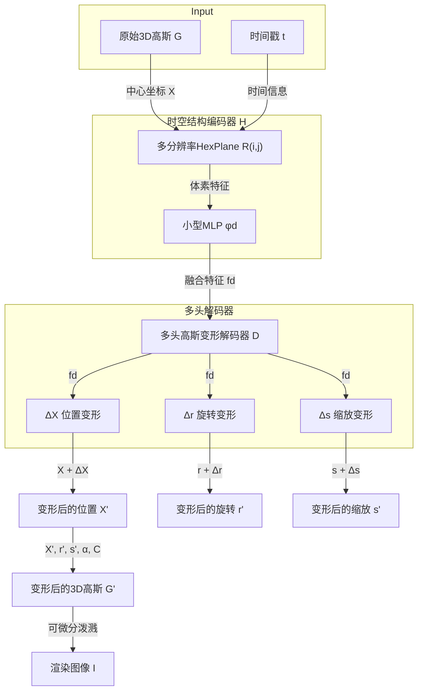
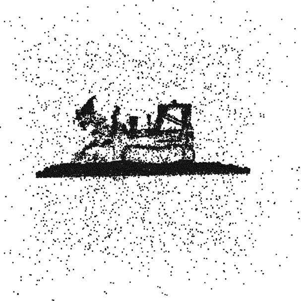
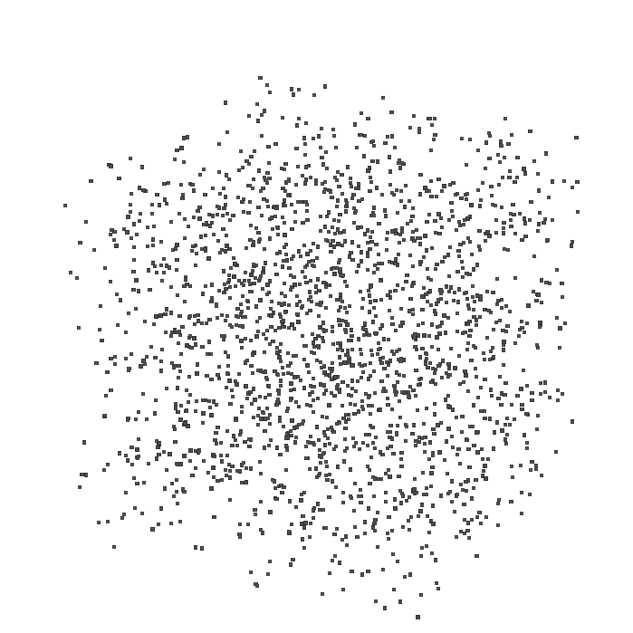
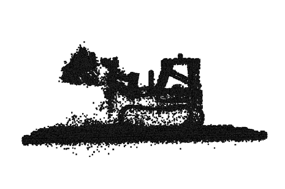
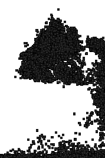
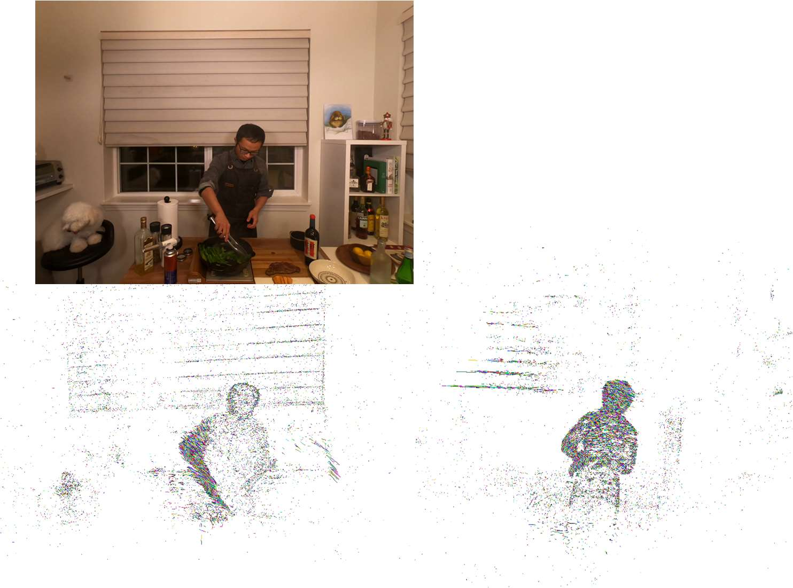

# 4D Gaussian Splatting for Real-Time Dynamic Scene Rendering

## 论文信息

- **作者**: Guanjun Wu, Taoran Yi, Jiemin Fang, Lingxi Xie, Xiaopeng Zhang, Wei Wei, Wenyu Liu, Qi Tian, Xinggang Wang
- **单位**: 华中科技大学、华为
- **arXiv**: [2310.08528](https://arxiv.org/abs/2310.08528)
- **代码**: https://guanjunwu.github.io/4dgs/

## 一句话总结

提出 **4D Gaussian Splatting (4D-GS)** 方法，通过结合 3D 高斯表示和 4D 神经体素，在单个 RTX 3090 GPU 上实现动态场景的实时渲染（最高 82 FPS）。

---

## 背景知识（让零基础也能看懂）

### 什么是"新视角合成"(Novel View Synthesis)？

想象你有一组从不同角度拍摄的照片，比如一个跳舞的人。你想看到这个人**从侧面或背后**看到的样子——但你没有拍过那些角度的照片。新视角合成的任务就是**用 AI 生成这些"不存在"的视角图片**。

这项技术在 VR/AR、电影特效等领域非常重要。

### 什么是"动态场景"？

普通的 3D 重建只能处理**静止不动**的场景（比如一座雕塑）。但现实世界中大多数场景都是**动态的**——人在走动、物体在运动。

动态场景的难点在于：不仅要重建空间信息，还要捕捉**时间维度上的变化**。

### 什么是 NeRF？

**NeRF (Neural Radiance Fields)** 是 2020 年提出的一种革命性方法，用**神经网络**来隐式表示 3D 场景。它的工作原理是：

1. 将 3D 空间中的每个点 $(x, y, z)$ 映射到颜色和密度
2. 使用**体素渲染**（Volume Rendering）技术从任意视角"合成"图像

**问题**：NeRF 训练很慢（通常需要几小时甚至几天），渲染也很慢（每秒只能渲染几张图），无法实时应用。

### 什么是 3D Gaussian Splatting (3D-GS)？

2023 年提出的 **3D Gaussian Splatting** 是一种更高效的方法：

- 用**高斯分布**（Gaussian）来表示 3D 场景中的点
- 用**可微分的泼溅**（Differentiable Splatting）技术直接将 3D 高斯投影到 2D 平面
- 不需要耗时的体素渲染，可以**实时渲染**

**但 3D-GS 只适用于静态场景**，无法处理动态内容。

### 什么是 4D？

我们平时说的 3D 是三维空间 $(x, y, z)$。加上**时间维度 $t$**，就是 4D。

所以 "4D 场景" = "3D 空间 + 时间变化"

---

## 核心问题

现有的方法存在以下问题：

1. **NeRF 类方法**：训练慢、渲染慢，无法实时
2. **3D-GS**：只能处理静态场景
3. **扩展 3D-GS 到动态场景**：需要在每个时间点都构建一套 3D 高斯，**存储成本呈线性增长**（时间越长，存储越多）

**核心挑战**：如何在保持实时渲染能力的同时，处理动态场景？

---

## 方法详解

### 核心思想

不是为每个时间点都存储一套完整的 3D 高斯，而是：
1. 维护**一套canonical（标准）3D高斯**
2. 用一个**变形网络**来描述高斯如何随时间移动和变形

这样，存储成本就与时间无关了！

### 方法流程图

### 关键技术 1：时空结构编码器 (Spatial-Temporal Structure Encoder)

灵感来自 **HexPlane/K-Planes** 方法，将 4D 神经体素分解为 **6 个 2D 平面**：

- 空间平面：$(x,y)$, $(x,z)$, $(y,z)$
- 时空平面：$(x,t)$, $(y,t)$, $(z,t)$

每个 3D 高斯的位置 $(x,y,z)$ 和时间 $t$ 可以在这些平面中查询到对应的特征。

### 关键技术 2：多头高斯变形解码器 (Multi-head Gaussian Deformation Decoder)

变形包括三个部分：
- **位置变形 $\Delta X$**：高斯移动到新位置
- **旋转变形 $\Delta r$**：高斯朝向改变
- **缩放变形 $\Delta s$**：高斯大小/形状改变

变形公式：
$$\left( X', r', s' \right) = \left( X + \Delta X, r + \Delta r, s + \Delta s \right)$$

### 关键技术 3：两阶段优化

1. **Warm-up 阶段**（前 3000 次迭代）：只用静态 3D 高斯训练
2. **完整训练**：开启完整的 4D 变形学习

这样做的好处是让动态部分的学习更稳定。

---

## 实验结果

### 性能对比（合成数据集）

| 方法 | PSNR (dB) | SSIM | 训练时间 | FPS | 存储 (MB) |
|------|-----------|------|----------|-----|-----------|
| TiNeuVox-B | 32.67 | 0.97 | 28 min | 1.5 | 48 |
| K-Planes | 31.61 | 0.97 | 52 min | 0.97 | 418 |
| 3D-GS | 23.19 | 0.93 | 10 min | 170 | 10 |
| **Ours (4D-GS)** | **34.05** | **0.98** | **8 min** | **82** | **18** |

**关键优势**：
- 最高渲染质量（PSNR 最高）
- 极快的渲染速度（82 FPS 实时）
- 合理的训练时间（8 分钟）
- 紧凑的存储（18 MB）

### 视觉效果对比

从左到右：Ours、TiNeuVox、Ground Truth、K-Planes、HexPlane、3D-GS

可以看到 4D-GS 渲染的图像最接近 Ground Truth（真实图像）。

优化过程：从随机初始化的 3D 高斯逐渐学习到正确的结果。

---

## 技术细节

### 3D 高斯的数学表示

一个 3D 高斯由以下属性定义：
- **位置 $X \in \mathbb{R}^3$**：高斯的中心点
- **颜色 $C$**：用球谐函数 (SH) 系数表示
- **不透明度 $\alpha \in \mathbb{R}$**：控制透明度
- **旋转 $r \in \mathbb{R}^4$**：用四元数表示
- **缩放 $s \in \mathbb{R}^3$**：三个方向的缩放因子

高斯的形状由**协方差矩阵** $\Sigma$ 决定：
$$\Sigma = RS S^T R^T$$

其中 $R$ 是旋转矩阵，$S$ 是缩放矩阵。

### 渲染公式

对于每个像素，渲染颜色 $C$ 的公式：
$$C = \sum_{i \in N} c_i \alpha_i \prod_{j=1}^{i-1}(1 - \alpha_j)$$

这里 $N$ 是覆盖该像素的有序高斯集合，$c_i$ 和 $\alpha_i$ 是每个高斯的颜色和不透明度。

### 损失函数

$$\mathcal{L} = \left| \hat{I} - I \right| + \mathcal{L}_{tv}$$

- $\left| \hat{I} - I \right|$：L1 颜色损失
- $\mathcal{L}_{tv}$：基于网格的总变差损失（来自 K-Planes）

---

## 应用场景

### 1. 单目动态场景渲染

从一段视频中重建整个动态场景，可以从任意角度观看。

### 2. 3D 跟踪

跟踪场景中物体的 3D 运动轨迹：

### 3. 4D 编辑

对动态场景进行编辑，添加新物体或修改场景：

---

## 性能分析

### FPS 与高斯数量的关系

当 3D 高斯数量少于 30,000 时，渲染速度可达 **90 FPS**。

这为实际应用提供了很好的参考：
- 简单场景 → 高 FPS
- 复杂场景 → 降低 FPS 但保持质量

---

## 局限性与未来工作

### 当前局限

1. **大运动**：对于运动幅度很大的场景，训练困难
2. **缺少背景点**：如果没有足够的背景点，效果下降
3. **相机位姿不准确**：影响重建质量
4. **单目设置下的动静分离**：静态和动态物体难以自动分离
5. **大规模场景**：城市级重建需要更紧凑的算法

### 未来方向

- 更好的动静分离方法
- 更紧凑的表示以支持大规模场景
- 与其他编辑工具的结合

---

## 总结

**4D-GS 的核心贡献**：

1. 提出了一个高效的 **4D 高斯泼溅框架**，在单一 GPU 上实现实时动态场景渲染
2. 设计了 **时空结构编码器**，用多分辨率 HexPlane 连接相邻高斯
3. 开发了 **多头变形解码器**，分别预测位置、旋转、缩放变形
4. 在多个数据集上达到 **SOTA** 质量，同时保持 **82 FPS** 的实时渲染能力

**为什么重要**：
- 首次将 3D-GS 的实时渲染能力扩展到动态场景
- 为 VR/AR、电影制作等应用提供了实用方案
- 开源代码，促进社区发展

---

## 参考

如果你想深入学习，建议按以下顺序阅读：

1. **NeRF** (Mildenhall et al., ECCV 2020) - 理解隐式场景表示的基础
2. **3D Gaussian Splatting** (Kerbl et al., SIGGRAPH 2023) - 理解高斯泼溅基础
3. **HexPlane/K-Planes** - 理解时空特征编码
4. **4D-GS** (本文) - 理解如何结合两者

---

*本笔记由 AI 自动生成，如有疏漏请指正。*
