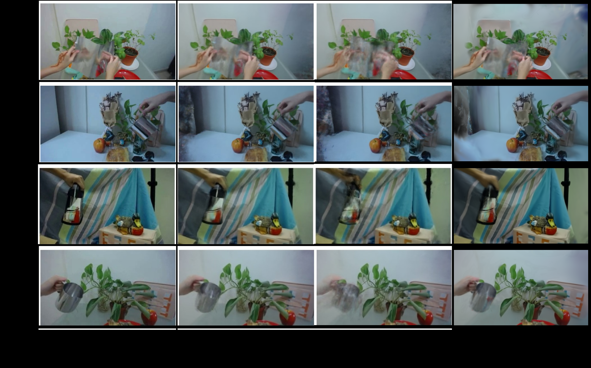
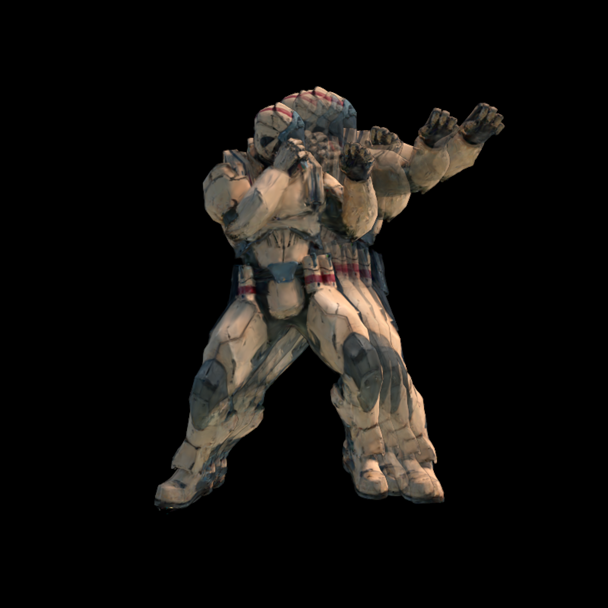
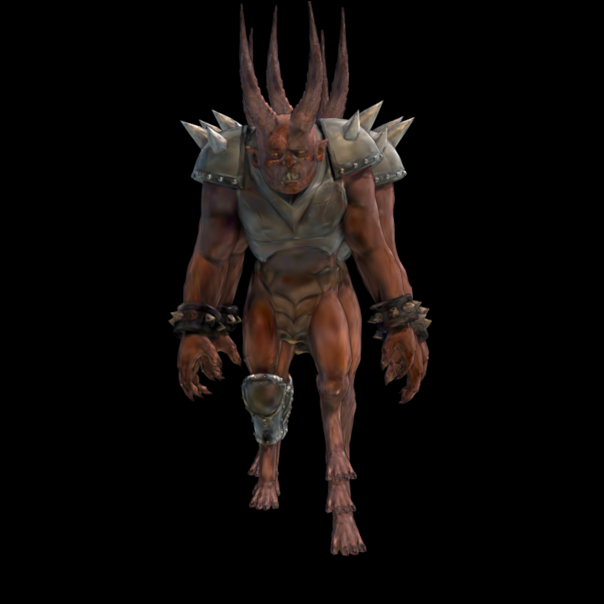
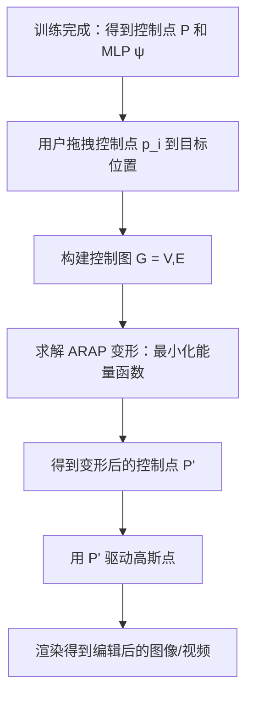
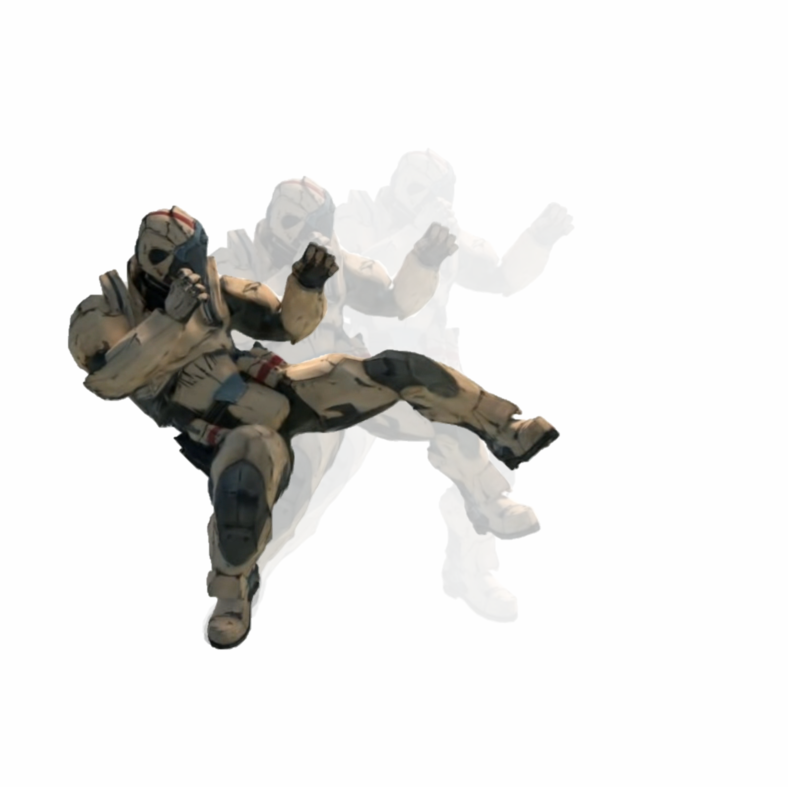
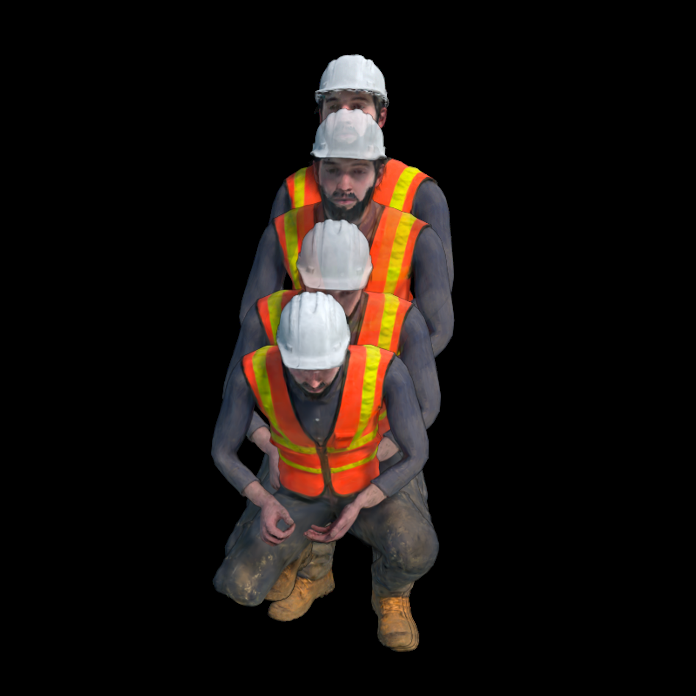
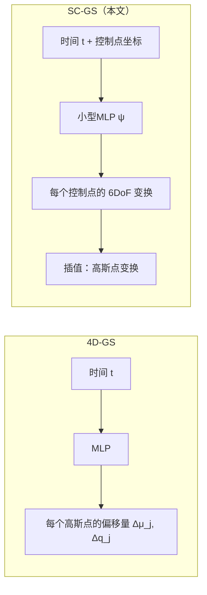

# SC-GS: Sparse-Controlled Gaussian Splatting for Editable Dynamic Scenes

> **论文题目**：SC-GS: Sparse-Controlled Gaussian Splatting for Editable Dynamic Scenes  
> **作者**：Yi-Hua Huang, Yang-Tian Sun, Ziyi Yang, Xiaoyang Lyu, Yan-Pei Cao, Xiaojuan Qi  
> **单位**：香港大学（The University of Hong Kong）、VAST、浙江大学  
> **项目主页**：https://yihua7.github.io/SC-GS-web/  
> **PDF 路径**：`PDF/234.pdf`

---

## 摘要

这是一篇关于**动态场景 Novel View Synthesis（新视角合成）**的论文。换句话说，就是：给你一段单目视频（只有一个摄像头的视频），让 AI 学会从任意角度"重新拍摄"这个场景——不仅能渲染静态背景，还能正确呈现其中人物的动作。

这篇论文的核心贡献是：

1. **用稀疏控制点（Sparse Control Points）来表示场景运动**，控制点的数量（约 512 个）远少于场景中的高斯点（约 10 万个），因此运动表示非常紧凑。
2. **引入变形 MLP（多层感知机）**，每个控制点预测随时间变化的 6DoF（六自由度）变换，大幅降低了学习复杂度。
3. **自适应控制点策略 + ARAP 损失**，让控制点分布自适应调整以适配不同区域的运动复杂度，同时保证运动的局部刚性。
4. **支持用户控制的运动编辑**，因为运动表示是显式且稀疏的，用户可以直接拖拽控制点来实现运动编辑，而不破坏外观质量。

实验结果表明，SC-GS 在 D-NeRF 和 NeRF-DS 两个基准数据集上，量化指标（PSNR、SSIM、LPIPS）全面超越已有方法，同时保持实时渲染速度。

---



## 第一节：背景知识——你需要先理解这些概念

> 如果你对这些概念已经熟悉，可以跳过本节。

### 1.1 什么是 Novel View Synthesis（新视角合成）？

想象你用手机绕着一朵花拍了一段视频。新视角合成的目标是：**让你能从任意角度"看"这朵花**——哪怕拍摄时根本没有从这个角度拍过。

用更专业的语言说：给定一组已知相机姿态的图像，重建出场景的 3D 表示，然后可以从任意新的相机位置渲染出图像。

**应用场景**：
- VR/AR：在虚拟世界中自由走动查看物体
- 电影制作：从任意机位"拍摄"特效场景
- 视频会议：从任意角度渲染参会者头像

### 1.2 什么是 Dynamic Scene（动态场景）？

静态场景 = 场景里一切都不动（比如拍一栋建筑）。  
动态场景 = 场景里有东西在动（比如拍一个人在走路）。

动态场景的新视角合成**难得多**，因为：
- 同一个像素在不同时间点对应场景里不同的 3D 点
- 需要同时重建场景的"形状"和"运动"

### 1.3 什么是 Gaussian Splatting（高斯泼溅）？

这是 2023 年提出的一种革命性场景表示方法，核心思想是：

**把场景表示成一堆带颜色、带透明度、带旋转缩放的 3D 高斯椭球**，然后通过一种叫做"泼溅（Splatting）"的方式把它们投影到 2D 图像平面上，从而实现极快渲染（实时！）。

对比 NeRF（神经辐射场）：
| 特性 | NeRF | Gaussian Splatting |
|------|------|----------------------|
| 表示方式 | 神经网络（隐式） | 3D 高斯点云（显式） |
| 渲染速度 | 慢（需沿射线采样数百个点） | 极快（实时） |
| 训练速度 | 慢 | 快 |
| 动态扩展 | 已有一些工作 | SC-GS 是代表作品之一 |

### 1.4 什么是 6 DoF（六自由度）？

描述一个刚体在 3D 空间中的完整运动状态需要 6 个参数：

$$
T = \begin{bmatrix} R & t \\ 0 & 1 \end{bmatrix} \in SE(3)
$$

- **3 个平移自由度**：沿 X、Y、Z 轴的移动
- **3 个旋转自由度**：绕 X、Y、Z 轴的旋转（常用四元数 \\(q \in \mathbb{R}^4\\) 或旋转矩阵 \\(R \in SO(3)\\) 表示）

---

## 第二节：本文方法——SC-GS 是如何工作的？

### 2.1 核心思想概述

SC-GS 的核心洞察是：**真实世界的运动通常是稀疏的、空间连续的、局部刚性的**。

比如一个人在走路：
- 头部和躯干的运动可以用很少几个"控制点"来描述
- 手臂的摆动是局部刚性的（手臂不会像面条一样扭曲）
- 不同区域的运动复杂度不同（腿部运动复杂，背景几乎不动）

基于这个洞察，SC-GS 把动态场景分解成两个组成部分：

```
动态场景 = 静态外观（3D 高斯点）+ 稀疏运动（控制点 + MLP）
```

**推理流程**（见图 2）：


（见图 2）：


### 2.2 稀疏控制点（Sparse Control Points）

#### 2.2.1 控制点是什么？

在 canonical 空间（可以理解为"参考帧"对应的空间）中，我们定义一组可学习的控制点：

$$
P = \{(p_i, o_i) \mid i \in \{1, 2, \dots, N_p\}\}
$$

其中：
- \\(p_i \in \mathbb{R}^3\\)：控制点 \\(i\\) 在 canonical 空间中的坐标（可学习参数）
- \\(o_i \in \mathbb{R}^+\\)：控制点 \\(i\\) 的半径参数（用于 RBF 核函数，可学习）
- \\(N_p\\)：控制点总数（约 512，远小于高斯点数）

#### 2.2.2 为什么用稀疏控制点？

| 方案 | 参数量 | 问题 |
|------|--------|------|
| 每个高斯点直接预测运动 | ~10 万 × 6 = 60 万参数 | 容易过拟合、泛化能力差、推理慢 |
| 用一个 MLP 预测所有高斯点的运动 | MLP 参数量大 | 难以处理复杂运动、不同区域运动混淆 |
| **稀疏控制点 + 插值（本文）** | ~512 × 6 + 小型 MLP | **紧凑、泛化能力强、支持编辑** |

#### 2.2.3 控制点的 6DoF 变换是如何预测的？

对于每个控制点 \\(p_i\\)，用一个**小型 MLP \\(\psi\\)** 来预测它在时间 \\(t\\) 的 6DoF 变换：

$$
(R_i^t, T_i^t) = \psi(p_i, t)
$$

其中：
- 输入：控制点 canonical 坐标 \\(p_i\\) + 时间 \\(t\\)
- 输出：旋转 \\(R_i^t \in SO(3)\\)（用四元数 \\(r_i^t \in \mathbb{R}^4\\) 表示以便优化）+ 平移 \\(T_i^t \in \mathbb{R}^3\\)

> **为什么要把 \\(p_i\\) 也作为输入？**  
> 这样 MLP 可以"知道"每个控制点在空间中的位置，从而学习到空间上连续的运动模式（比如"左边的控制点都往左移"）。

### 2.3 动态场景渲染（Dynamic Scene Rendering）

#### 2.3.1 如何从控制点运动得到每个高斯点的运动？

用**线性混合蒙皮（Linear Blend Skinning, LBS）**技术：

对于每个高斯点 \\(G_j\\)（中心坐标为 \\(\mu_j\\)，四元数为 \\(q_j\\)），先通过 KNN 找到它最邻近的 \\(K=4\\) 个控制点 \\(\{p_k \mid k \in N_j\}\\)。

插值权重用**高斯 RBF 核**计算：

$$
w _\{jk} = \frac{\hat{w} _\{jk}}{\sum _\{k' \in N_j} \hat{w} _\{jk'}}, \quad \hat{w} _\{jk} = \exp\left(-\frac{d _\{jk}^2}{2o_k^2}\right)
$$

其中 \\(d _\{jk} = \| \mu_j - p_k \|_2\\) 是高斯点 \\(j\\) 到控制点 \\(k\\) 的距离。

然后，高斯点在时间 \\(t\\) 的变换通过插值得到：

$$
\mu_j^t = \sum _\{k \in N_j} w _\{jk} \left[ R_k^t (\mu_j - p_k) + p_k + T_k^t \right]
$$

$$
q_j^t = \big( \sum _\{k \in N_j} w _\{jk} \cdot r_k^t \big) \otimes q_j
$$

> **公式解释**：  
> 第一个公式是：每个控制点对高斯点的变换贡献，按照权重 \\(w _\{jk}\\) 加权求和。其中 \\(R_k^t(\mu_j - p_k) + p_k\\) 是把高斯点先相对于控制点做旋转、再平移回去，\\(+ T_k^t\\) 是加上控制点自身的平移。  
> 第二个公式是：四元数用加权求和（再归一化）来插值旋转。

#### 2.3.2 渲染

得到变形后的高斯点参数 \\((\mu_j^t, q_j^t, s_j, \alpha_j, sh_j)\\) 后，用标准 Gaussian Splatting 渲染流程得到时间 \\(t\\)、视角 \\(\theta\\) 下的图像。

### 2.4 优化目标（Optimization Objective）

总损失函数：

$$
\mathcal{L} = \mathcal{L} _\{\text{render}} + \lambda _\{\text{arap}} \mathcal{L} _\{\text{arap}}
$$

#### 2.4.1 渲染损失 \\(\mathcal{L} _\{\text{render}}\\)

$$
\mathcal{L} _\{\text{render}} = (1 - \lambda _\{\text{SSIM}})\mathcal{L}_1 + \lambda _\{\text{SSIM}} \mathcal{L} _\{\text{SSIM}}
$$

对比渲染图像和 ground truth 图像，用 L1 损失 + D-SSIM 损失的加权和。

#### 2.4.2 ARAP 损失 \\(\mathcal{L} _\{\text{arap}}\\)

ARAP = **As-Rigid-As-Possible（尽可能刚性）**，这是一个来自计算机图形学经典网格变形算法的正则化项。

**直观解释**：真实世界中，大多数物体的局部运动是刚性的（比如人的手臂变形时，小臂近似一个刚体）。ARAP 损失鼓励学习到的控制点运动满足"局部刚性"假设。

**具体计算**：

1. 先为每个控制点 \\(p_i\\) 计算其运动轨迹：\\(p_i ^\{\text{traj}} = [p_i ^\{t_1}, p_i ^\{t_2}, \dots, p_i ^\{t_N}]\\)
2. 通过 ball query 找到每个控制点的局部邻域 \\(N _\{ci}\\)
3. 用 SVD 分解估计局部刚性旋转 \\(R_i^*\\)：

$$
R_i^* = \arg\min_R \sum _\{k \in N _\{ci}} w _\{ik} \|(p_i ^\{t_1} - p_k ^\{t_1}) - R(p_i ^\{t_2} - p_k ^\{t_2})\|^2
$$

4. ARAP 损失 = 实际变换与刚性变换之差：

$$
\mathcal{L} _\{\text{arap}}(p_i, t_1, t_2) = \sum _\{k \in N _\{ci}} w _\{ik} \|(p_i ^\{t_1} - p_k ^\{t_1}) - R_i^*(p_i ^\{t_2} - p_k ^\{t_2})\|^2
$$

### 2.5 自适应控制点调整（Adaptive Control Points）

类似于 Gaussian Splatting 中的自适应密度调整，本文也对控制点做自适应调整：

- **修剪（Prune）**：如果一个控制点对所有高斯点的"总影响力" \\(W_i = \sum_j w _\{ji}\\) 接近零，说明它没用，删除。
- **克隆（Clone）**：如果一个控制点附近的高斯点梯度很大（\\(g_k\\) 大，说明重建误差大），则克隆一个新控制点到该区域。

### 2.6 运动编辑


（Motion Editing）

这是本文的一大亮点：**因为运动是用稀疏控制点显式表示的，用户可以直接编辑运动！**

步骤：
1. **构建控制图**：用控制点的运动轨迹来建立邻接关系（轨迹相似的控制点之间连边）
2. **用户指定控制点**：用户拖拽某些控制点到目标位置
3. **ARAP 变形**：求解一个能量最小化问题，在用户约束下，让整个控制图做"尽可能刚性"的变形
4. **重新渲染**：用变形后的控制点驱动高斯点，得到编辑后的图像



---

## 第三节：实验结果与对比

### 3.1 数据集

- **D-NeRF 数据集**：8 个动态场景，360° 视角设置，合成数据
- **NeRF-DS 数据集**：7 个真实世界动态视频，包含复杂运动，相机位姿用 COLMAP 估计

### 3.2 评估指标

| 指标 | 全称 | 越高/越低越好 | 解释 |
|------|------|--------------|------|
| PSNR | Peak Signal-to-Noise Ratio | 越高越好 | 像素级精度 |
| SSIM | Structural Similarity | 越高越好 | 结构相似性 |
| MS-SSIM | Multi-Scale SSIM | 越高越好 | 多尺度结构相似性 |
| LPIPS | Learned Perceptual Image Patch Similarity | 越低越好 | 感知相似度（越接近 0 越好） |

### 3.3 主要实验结果

#### D-NeRF 数据集上的量化对比（表 1 摘要）

SC-GS 在几乎所有场景上取得 **SOTA（最优）** 成绩：

| 场景 | SC-GS (PSNR) | 最佳竞品 (PSNR) | SC-GS (LPIPS↓) |
|------|----------------|-------------------|-----------------|
| Hellwarrior | **42.93** | 39.07 (Baseline) | **0.0155** |
| Mutant | **45.19** | 41.45 (Baseline) | **0.0028** |
| Standup | **47.89** | 41.04 (Baseline) | **0.0023** |
| Hook | **39.87** | 34.47 (Baseline) | **0.0076** |
| Jumpingjacks | **41.13** | 35.74 (Baseline) | **0.0067** |

> **结论**：SC-GS 相比直接在每个高斯点上做变形的 baseline 方法，PSNR 平均提升约 4-5 dB，LPIPS 降低约 60-70%。

#### NeRF-DS 数据集上的量化对比（表 2 摘要）

在真实世界数据上，SC-GS 同样取得最优平均性能：

| 方法 | 平均 PSNR | 平均 MS-SSIM | 平均 LPIPS (Alex) |
|------|-----------|---------------|---------------------|
| HyperNeRF | 22.5 | 0.827 | 0.206 |
| NeRF-DS | 23.9 | 0.898 | 0.127 |
| TiNeuVox-B | 21.5 | 0.843 | 0.162 |
| Baseline | 23.7 | 0.891 | 0.151 |
| **SC-GS (Ours)** | **24.1** | **0.891** | **0.140** |

> **注意**：NeRF-DS 数据集上相机位姿估计存在误差，影响了所有方法的性能。即便如此，SC-GS 仍取得最优平均结果。

### 3.4 消融实验


（Ablation Study）

表 3 展示了去掉各个组件后的性能变化（在 D-NeRF 数据集上平均）：

| 配置 | PSNR | SSIM | LPIPS |
|------|------|------|--------|
| 无控制点（w/o Control Points） | 38.51 | 0.9922 | 0.0162 |
| 无 ARAP 损失（w/o ARAP Loss） | 42.62 | 0.9963 | 0.0067 |
| **完整模型（Full）** | **43.31** | **0.9976** | **0.0063** |

> **结论**：
> - 去掉控制点（直接用 MLP 预测每个高斯点的运动）：性能大幅下降，说明稀疏控制点是一种有效的运动正则化手段
> - 去掉 ARAP 损失：性能略有下降，且会出现不自然的扭曲（见图 6）

### 3.5 视觉质量对比

下图展示了 SC-GS 与其他方法在 D-NeRF 数据集上的视觉对比（对应论文图 3）：



可以看出，SC-GS 生成的细节（如 Lego 人物的运动）比其他方法更清晰、更自然。

---

## 第四节：方法细节深入

### 4.1 MLP \\(\psi\\) 的网络结构

论文中并未详细描述 MLP 的层数，但根据相关工作的惯例：
- 输入维度：3（控制点坐标）+ 1（时间 t 编码）= 4+ 维
- 隐藏层：通常 2-4 层，每层 64-128 维
- 输出维度：7（4 个四元数 + 3 个平移参数）

时间 \\(t\\) 通常用**位置编码（Positional Encoding）**映射到高维空间：

$$
\gamma(t) = [\sin(2^0 \pi t), \cos(2^0 \pi t), \dots, \sin(2 ^\{L-1} \pi t), \cos(2 ^\{L-1} \pi t)]
$$

### 4.2 与 4D-GS 的区别

4D-GS（同期工作）直接用 MLP 预测每个高斯点的变形偏移量，而 SC-GS 用稀疏控制点驱动。区别：



**SC-GS 的优势**：
- 参数量更少（控制点远少于高斯点）
- 运动表示更紧凑，泛化能力更强
- 支持运动编辑（这是 4D-GS 做不到的）

### 4.3 控制点数量的选择

论文中 \\(N_p \approx 512\\)。这个数量是如何确定的？

- 太少：无法表示复杂运动（比如多个人同时做不同动作）
- 太多：失去"紧凑表示"的优势，且增加计算量

本文采用**自适应策略**：训练过程中自动增加/删除控制点，最终数量由场景运动复杂度决定。

---

## 第五节：局限性与未来工作

### 5.1 局限性

1. **对相机位姿误差敏感**：NeRF-DS 数据集上性能下降，说明方法对相机位姿估计误差较敏感。
2. **高光材质处理不佳**：论文承认，对于镜面反射等效果，当前方法不如专门设计的高光处理方法（如 Spec-Gaussian）。
3. **动态模糊**：输入视频中若有运动模糊，会影响重建质量。

### 5.2 未来工作

1. **结合 Spec-Gaussian**：处理高光表面
2. **结合去模糊技术**：处理动态模糊
3. **扩展到多视图输入**：当前主要针对单目视频，多视图可以进一步提升质量

---

## 第六节：总结

SC-GS 提出了一种基于**稀疏控制点**的动态场景表示方法，核心创新在于：

1. **运动与外观解耦**：用少量控制点表示运动，用大量高斯点表示外观
2. **紧凑运动表示**：控制点数量远少于高斯点，运动用 MLP 预测的 6DoF 变换表示
3. **局部刚性正则化**：ARAP 损失保证学习到的运动自然、物理合理
4. **支持运动编辑**：显式控制点表示使得用户可以直接编辑运动

在 D-NeRF 和 NeRF-DS 数据集上的实验表明，SC-GS 在渲染质量和速度上都达到了 SOTA 水平。

---

## 附录：关键公式汇总

| 公式 | 含义 |
|------|------|
| \\(G(x) = e ^\{-\frac{1}{2}(x-\mu)^T \Sigma ^\{-1}(x-\mu)}\\) | 3D 高斯分布函数 |
| \\((R_i^t, T_i^t) = \psi(p_i, t)\\) | MLP 预测控制点变换 |
| \\(w _\{jk} = \frac{\exp(-d _\{jk}^2/2o_k^2)}{\sum \exp(...)}\\) | 高斯 RBF 插值权重 |
| \\(\mu_j^t = \sum_k w _\{jk}[R_k^t(\mu_j - p_k) + p_k + T_k^t]\\) | 高斯点中心变换 |
| \\(\mathcal{L} = \mathcal{L} _\{\text{render}} + \lambda _\{\text{arap}}\mathcal{L} _\{\text{arap}}\\) | 总损失函数 |

---

## 参考文献

论文引用格式（部分关键文献）：

- [13] Kerbl et al., *3D Gaussian Splatting for Real-Time Radiance Field Rendering*, ACM TOG 2023
- [37] Pumarola et al., *D-NeRF: Neural Radiance Fields for Dynamic Scenes*, CVPR 2021
- [41] Sorkine & Alexa, *As-Rigid-As-Possible Surface Modeling*, SGP 2007
- [50] Wu et al., *4D Gaussian Splatting for Real-Time Dynamic Scene Rendering*, arXiv 2023
