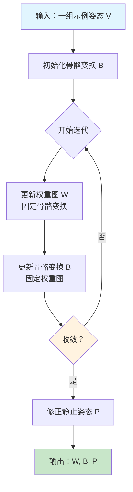
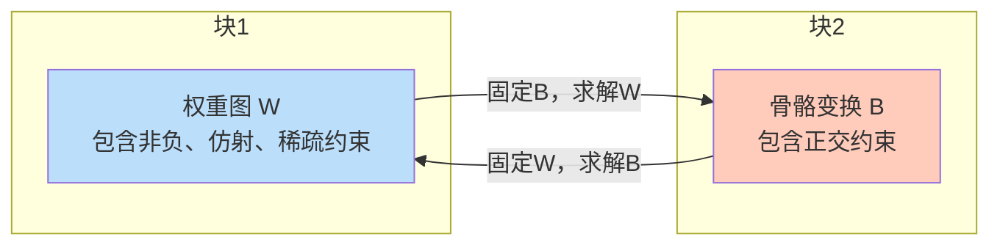
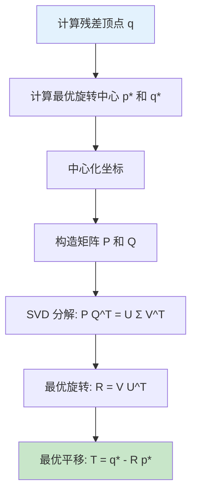
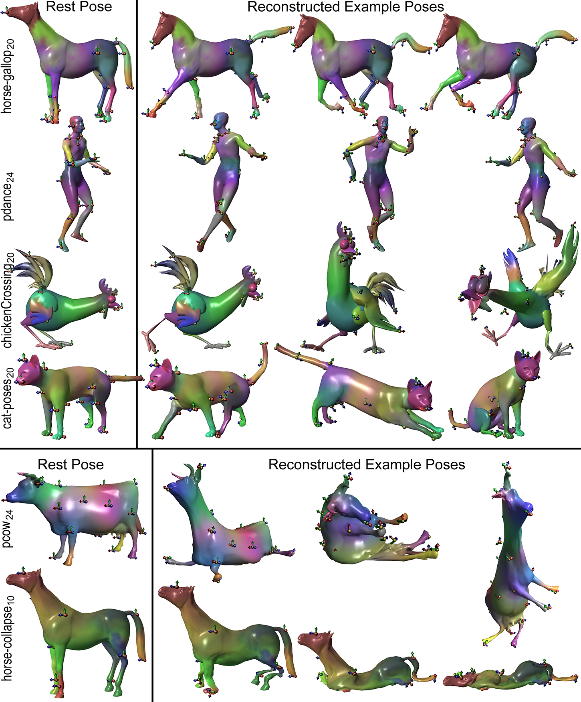
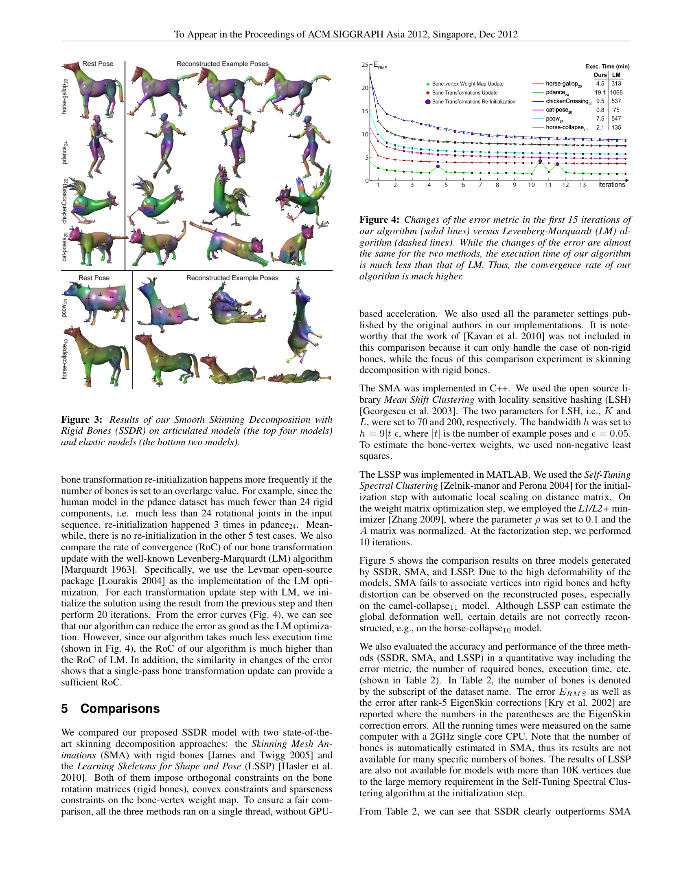
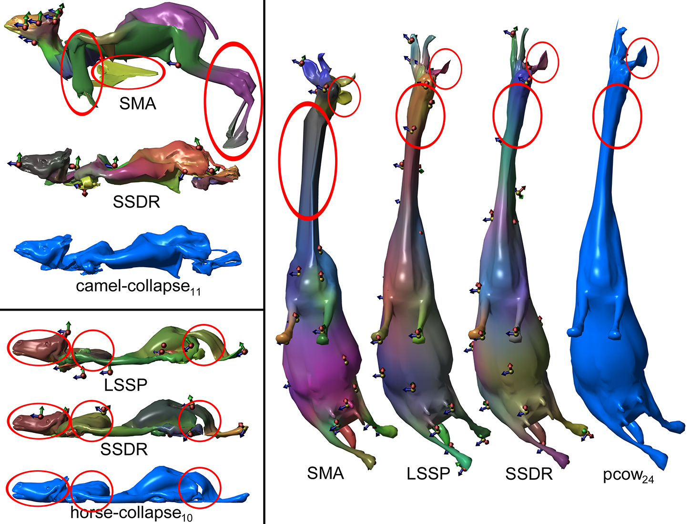
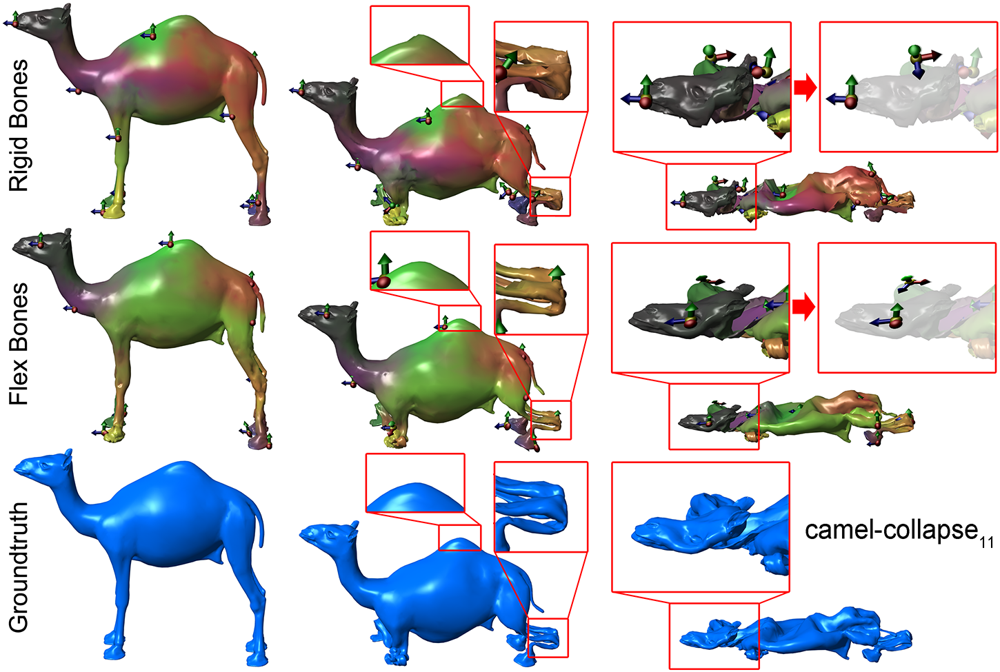
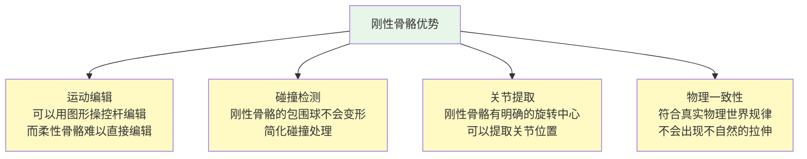
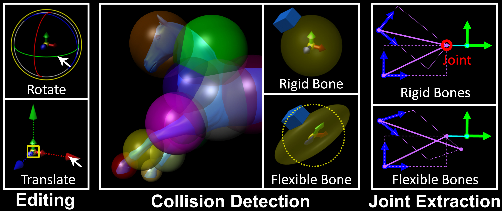

# Smooth Skinning Decomposition with Rigid Bones (SSDR)
## 刚性骨骼的平滑蒙皮分解

**论文详解文档**

---

## 目录

1. [基本信息](#1-基本信息)
2. [核心问题：这篇论文要解决什么问题？](#2-核心问题这篇论文要解决什么问题)
3. [基础知识铺垫](#3-基础知识铺垫)
4. [SSDR 方法的核心思想](#4-ssdr-方法得核心思想)
   - [4.1 整体框架](#41-整体框架)
   - [4.2 为什么这样设计](#42-为什么这样设计)
   - [4.3 数学建模](#43-数学建模)
   - [4.4 块坐标下降算法](#44-块坐标下降算法)
5. [技术细节详解](#5-技术细节详解)
   - [5.1 初始化](#51-初始化)
   - [5.2 更新骨骼-顶点权重图](#52-更新骨骼-顶点权重图)
   - [5.3 更新骨骼变换](#53-更新骨骼变换)
   - [5.4 骨骼变换重初始化](#54-骨骼变换重初始化)
   - [5.5 静止姿态修正](#55-静止姿态修正)
6. [实验结果](#6-实验结果)
7. [总结与启发](#7-总结与启发)

---

## 1. 基本信息

| 项目 | 内容 |
|------|------|
| **论文标题** | Smooth Skinning Decomposition with Rigid Bones |
| **中文译名** | 刚性骨骼的平滑蒙皮分解 |
| **发表会议** | ACM SIGGRAPH Asia 2012 |
| **作者单位** | 美国休斯顿大学 |
| **主要作者** | Binh Huy Le, Zhigang Deng |
| **关键词** | 蒙皮分解、线性混合蒙皮、几何变形、块坐标下降 |
| **代码/数据** | 公开数据集（Deformation Transfer、Geometry Videos 等） |

---

## 2. 核心问题：这篇论文要解决什么问题？

### 2.1 背景故事

想象一下你在看一部 3D 动画电影，比如《冰雪奇缘》或者《疯狂动物城》。里面的角色会有各种丰富的表情和动作——奔跑、跳跃、挥手、皱眉等等。

**问题来了：计算机是怎么让 3D 角色动起来的？**

在 3D 动画和游戏中，角色通常由一个 **3D 网格（Mesh）** 构成——你可以把它想象成一张由无数三角形拼成的"皮"。

要让这张"皮"动起来，最常用的方法叫做 **线性混合蒙皮（Linear Blend Skinning，简称 LBS）**。这个方法的原理非常直观：

1. 角色的皮里面藏着一个 **骨架（Skeleton/Bones）**——就像人体的骨骼一样
2. 每根骨头控制皮的一部分区域
3. 当骨头移动/旋转时，它控制的皮也就跟着动

```
举个简单的例子：你的手臂
- 手臂里面有一根"骨头"（肱骨）
- 当你旋转手臂时，手臂上的皮肉跟着动
- LBS 就是用数学来模拟这个过程
```

### 2.2 蒙皮分解：逆向工程 LBS

这篇论文要解决的是 LBS 的 **逆向问题**：

> **已知**：一个角色的多个姿态（已经做好的动画）
>
> **求**：这个角色的骨架是什么样的？每根骨头控制哪些部位？骨头是怎么转的？

这就好比你拿到了一段人偶动画的视频，但不知道人偶内部骨架的结构，需要你从外部形变 **反推** 出骨架。

**为什么这个问题重要？**

- **动画压缩**：知道了骨架和权重，就不需要存储每一帧的顶点位置，只存骨架变换就行，大大减小文件体积
- **GPU 加速渲染**：LBS 模型可以在 GPU 上高效运行
- **运动编辑**：有了骨架，就可以用操控杆（manipulator）来编辑动作
- **碰撞检测**：刚性骨骼更容易做碰撞检测
- **骨架提取**：可以从已有的动画中自动提取骨架

### 2.3 现有方法的局限性

在 SSDR 之前，主要有两类方法：

#### 方法 1：SMA（Skinning Mesh Animations, James & Twigg 2005）
- 通过聚类三角面片旋转序列来分组确定刚性变换
- **问题**：只能处理接近刚性的模型（比如动物的身体），遇到弹性变形（比如大象塌陷）就不行了

#### 方法 2：LSSP（Learning Skeletons for Shape and Pose, Hasler et al. 2010）
- 使用软约束（soft constraint）来处理稀疏性和凸性
- **问题**：
  - 软约束意味着不一定能严格满足（权重和可能不等于 1）
  - 稀疏性只是"鼓励"而非"强制"
  - 不能保证每个顶点最多被多少根骨头影响

#### 核心矛盾

之前的算法通常把"骨骼旋转必须是刚性的"和"权重之和必须等于1"当作 **软约束** 来处理。这意味着算法需要在"精确满足约束"和"减小重建误差"之间做取舍。

> **SSDR 的核心贡献**：将所有约束都作为 **硬约束** 严格满足，同时保持较低的重建误差。

---

## 3. 基础知识铺垫

在深入方法之前，我们先了解几个关键概念。

### 3.1 线性混合蒙皮（LBS）

LBS 是最流行的角色蒙皮方法。它的核心公式非常简单：

$$
\mathbf{v} _{i} ^{t} = \sum _{j=1}^{|B|} w _{ij} \left( \mathbf{R} _{j} ^{t} \mathbf{p} _{i} + \mathbf{T} _{j} ^{t} \right)
$$

让我们逐项解释：

| 符号 | 含义 | 通俗解释 |
|------|------|----------|
| \\(\mathbf{v} _{i} ^{t}\\) | 第 \\(t\\) 个姿态中第 \\(i\\) 个顶点的位置 | 动画中某一帧的某个表面点 |
| \\(\mathbf{p} _{i}\\) | 静止姿态中第 \\(i\\) 个顶点的位置 | 角色摆好标准姿势时的那个点 |
| \\(w _{ij}\\) | 第 \\(j\\) 根骨头对第 \\(i\\) 个顶点的影响权重 | 这根骨头对这个点有多大的控制力 |
| \\(\mathbf{R} _{j} ^{t}\\) | 第 \\(t\\) 个姿态中第 \\(j\\) 根骨头的旋转矩阵 | 这根骨头转了多少 |
| \\(\mathbf{T} _{j} ^{t}\\) | 第 \\(t\\) 个姿态中第 \\(j\\) 根骨头的平移向量 | 这根骨头平移了多少 |
| \\(|B|\\) | 骨头的总数 | 角色一共有多少根骨头 |

**通俗理解**：

```
想象你有一块橡皮泥（顶点），它被钉在几根棍子（骨头）上。
每根棍子上都有一个钉子，钉子对橡皮泥的拉力就是权重 w。

当棍子移动时，橡皮泥的位置 = 每根棍子拉力 × 棍子移动距离 的总和
```

### 3.2 LBS 权重的约束条件

为了让 LBS 模型有意义，权重 \\(w _{ij}\\) 需要满足三个条件：

1. **非负性（Non-negativity）**：\\(w _{ij} \geq 0\\)
   - 骨头不能"推"顶点，只能"拉"
   
2. **凸性/仿射性（Affinity）**：\\(\sum _{j=1}^{|B|} w _{ij} = 1\\)
   - 所有骨头对一个顶点的总影响权重等于 1
   - 这保证了如果所有骨头都不动，顶点也不动

3. **稀疏性（Sparseness）**：\\(|\\{w _{ij} | w _{ij} \neq 0\\}| \leq |K|\\)
   - 每个顶点最多被 \\(|K|\\) 根骨头影响
   - 在实际应用中，通常 \\(|K| = 4\\)（称为 4-bone skinning）
   - 这是为了 GPU 加速——每个顶点只需计算 4 个变换

### 3.3 刚性骨骼约束

旋转矩阵 \\(\mathbf{R} _{j} ^{t}\\) 必须满足正交约束：

$$
\mathbf{R} _{j} ^{t} {}^{T} \mathbf{R} _{j} ^{t} = \mathbf{I}, \quad \det(\mathbf{R} _{j} ^{t}) = 1
$$

**通俗理解**：

```
"刚性"意味着骨头不能被拉伸、压缩或剪切。
旋转只会改变方向，不会改变长度。

对比：
- 刚性旋转：把一本书转个角度，书还是原来的形状
- 非刚性变换：把一本书拉长、压扁、撕扯——这些都不允许
```

### 3.4 块坐标下降（Block Coordinate Descent）

这是一种优化算法。当你有很多变量需要优化时，不一次性全部优化，而是：

1. 固定其他所有变量，只优化第一组变量
2. 固定其他所有变量，只优化第二组变量
3. ...重复直到收敛

```
好比调音响：
- 先固定低音和高音，只调中音，找到最佳中音
- 再固定中音和高音，只调低音，找到最佳低音
- 再固定中音和低音，只调高音，找到最佳高音
- 重复几轮，直到听起来最好
```

### 3.5 SVD（奇异值分解）与 Kabsch 算法

**SVD** 是一种矩阵分解技术，可以将任意矩阵分解为三个矩阵的乘积：

$$
\mathbf{A} = \mathbf{U} \mathbf{\Sigma} \mathbf{V} ^{T}
$$

**Kabsch 算法** 解决的问题是：给定两组对应的 3D 点，找到最优的旋转矩阵使得第一组点旋转后尽可能对齐第二组点。它就是用 SVD 来求解的。

```
例子：
你有两组点（比如同一个物体在两个时刻的位置）：
- A 组：{(1,0,0), (0,1,0), (0,0,1)}
- B 组：{(0,1,0), (0,0,1), (1,0,0)}

Kabsch 算法会告诉你：B 组是 A 组绕某个轴旋转了 120° 得到的
```

---

## 4. SSDR 方法的核心思想

### 4.1 整体框架

SSDR 的整体思路可以用下面的流程图来表示：



**核心思想**：通过交替更新权重和骨骼变换，逐步逼近最优解。

### 4.2 为什么这样设计

SSDR 的设计有三大亮点：

**亮点 1：硬约束而非软约束**

```
之前的方法：
  "我希望权重和接近1" → 软约束 → 可能有误差
  "我希望旋转矩阵接近正交" → 软约束 → 可能有拉伸

SSDR：
  "权重和必须精确等于1" → 硬约束 → 零误差
  "旋转矩阵必须精确正交" → 硬约束 → 真正刚性
```

**亮点 2：线性精确解**

对于骨骼旋转的更新，SSDR 给出了一个 **线性的、闭式的精确解**，而不需要像 Levenberg-Marquardt 那样迭代多次。这使得 SSDR 比 LM 快几十倍。

**亮点 3：保证算法收敛**

块坐标下降的每次更新都必须 **严格降低** 目标函数值，这样才能保证算法收敛到局部最优。SSR 的两个更新步骤都满足这个条件。

### 4.3 数学建模

#### 目标函数

SSDR 将蒙皮分解建模为一个约束最小二乘问题：

$$
\min _{\mathbf{w}, \mathbf{R}, \mathbf{T}} E = \min _{\mathbf{w}, \mathbf{R}, \mathbf{T}} \sum _{t=1}^{|t|} \sum _{i=1}^{|V|} \left\| \mathbf{v} _{i} ^{t} - \sum _{j=1}^{|B|} w _{ij} \left( \mathbf{R} _{j} ^{t} \mathbf{p} _{i} + \mathbf{T} _{j} ^{t} \right) \right\| ^{2}
$$

这个公式看起来很长，但含义很简单：

> **"让 LBS 重建出来的顶点位置，和实际的顶点位置尽可能接近"**

通俗地说就是：我们找到了一套骨架和权重，用 LBS 公式算出来的变形效果，跟原来动画中的变形效果越像越好。

#### 四大约束条件

| 约束 | 公式 | 含义 |
|------|------|------|
| 非负性 | \\(w _{ij} \geq 0, \forall i, j\\) | 权重不能是负数 |
| 仿射性 | \\(\sum _{j} w _{ij} = 1, \forall i\\) | 每个顶点所有权重之和等于 1 |
| 稀疏性 | \\(|\\{w _{ij} \neq 0\\}| \leq |K|, \forall i\\) | 每个顶点最多被 \\(|K|\\) 根骨头影响 |
| 正交性 | \\(\mathbf{R} _{j} ^{tT} \mathbf{R} _{j} ^{t} = \mathbf{I}\\) | 旋转必须是刚性的 |

### 4.4 块坐标下降算法

SSDR 将上面的优化问题分为两个"块"，交替求解：



**为什么这样分块？**

- 权重图 W 的约束（非负、仿射、稀疏）和骨骼变换 B 的约束（正交）是 **不同类型** 的约束
- 放在一起同时优化非常困难
- 分开优化后，每一块都可以找到精确解

---

## 5. 技术细节详解

### 5.1 初始化

**核心思想**：假设初始状态下没有权重混合，即每个顶点只被一根骨头控制。

这受 "As-Rigid-As-Possible"（尽可能刚性）思想的启发——真实的变形通常是接近刚性的。

初始化过程：

1. 对每一帧，用 **K-means 聚类** 将三角面片的旋转序列分成 \\(|B|\\) 组
2. 每组对应一根骨头
3. 每个聚类中心就是该骨头的初始旋转
4. 初始权重：每个顶点只属于权重最大的那根骨头（\\(w _{ij} = 1\\) 或 \\(0\\)）

```
类比：
- 你有一堆运动轨迹（三角面片的旋转历史）
- 你要找到几条"代表性轨迹"（骨架）
- K-means 就是自动分组的方法
```

### 5.2 更新骨骼-顶点权重图

这一步 **固定骨骼变换 B**，只更新权重 W。

#### 问题分解

因为每个顶点的权重是独立的（不同顶点之间没有约束），所以可以 **逐顶点** 求解。

对于第 \\(i\\) 个顶点，问题变为：

$$
\min _{\mathbf{w} _{i}} \left\| \mathbf{v} _{i} ^{t} - \sum _{j=1}^{|B|} w _{ij} \left( \mathbf{R} _{j} ^{t} \mathbf{p} _{i} + \mathbf{T} _{j} ^{t} \right) \right\| ^{2}
$$

约束：\\(w _{ij} \geq 0\\), \\(\sum _{j} w _{ij} = 1\\), 最多 \\(|K|\\) 个非零权重。

#### 第一步：确定活跃骨头

对于每个顶点，首先确定哪些骨头对它有显著影响。效果的计算方式是：

$$
e _{ij} = \left\| \sum _{t} w _{ij} \left( \mathbf{R} _{j} ^{t} \mathbf{p} _{i} + \mathbf{T} _{j} ^{t} \right) \right\| ^{2}
$$

选取影响最大的 \\(|K|\\) 根骨头作为"活跃骨头集合"。

```
通俗解释：
- 想象你是一个顶点，你的身体被几根绳子（骨头）拉着
- 大部分绳子对你几乎没有拉力，可以忽略
- 只有拉力最大的那几根才真正影响你
- SSDR 先找出对你最重要的 |K| 根绳子
```

#### 第二步：求解权重

确定了活跃骨头后，就变成了一个 **带边界约束的最小二乘问题**。SSDR 使用 **Lawson-Hanson 活跃集方法（ASM）** 来求解。

**ASM 的优点**：
- 可以处理非负约束和仿射约束
- 比暴力搜索快得多
- 不需要把约束当软约束来近似

**加速技巧**：
1. 用上一轮迭代的权重作为初始值（因为相邻迭代间权重变化不大）
2. 预计算矩阵的 LU 分解和 QR 分解
3. 利用问题的特殊结构简化计算

### 5.3 更新骨骼变换

这一步 **固定权重图 W**，只更新骨骼变换 B。

#### 问题分解

由于不同姿态的骨骼变换是独立的，可以 **逐姿态** 求解。

对于第 \\(t\\) 个姿态，问题变为：

$$
\min _{\mathbf{R} ^{t}, \mathbf{T} ^{t}} E ^{t} = \min _{\mathbf{R} ^{t}, \mathbf{T} ^{t}} \sum _{i=1}^{|V|} \left\| \mathbf{v} _{i} ^{t} - \sum _{j=1}^{|B|} w _{ij} \left( \mathbf{R} _{j} ^{t} \mathbf{p} _{i} + \mathbf{T} _{j} ^{t} \right) \right\| ^{2}
$$

#### 逐骨头求解

更进一步，每根骨头的变换也是独立的。对于第 \\(j\\) 根骨头，定义"残差顶点"：

$$
\mathbf{q} _{i} ^{t} = \mathbf{v} _{i} ^{t} - \sum _{k \neq j} w _{ik} \left( \mathbf{R} _{k} ^{t} \mathbf{p} _{i} + \mathbf{T} _{k} ^{t} \right)
$$

```
通俗解释：
- 当前骨头 j 要做的事情就是：把静止姿态的顶点，变换到"残差位置"
- "残差位置" = 实际位置 - 其他骨头已经处理的位移
- 也就是说，骨头 j 只需要处理其他骨头没处理完的部分
```

#### 核心创新：寻找最优旋转中心

这是 SSDR 最重要的技术贡献之一。

**之前方法的问题**：

"加权绝对方向"（Weighted Absolute Orientation）方法假设所有骨头共享同一个旋转中心（原点），但这只是一个 **近似解**，不能保证目标函数严格下降。

**SSDR 的解法**：

SSDR 为每根骨头计算一个 **最优旋转中心（Center of Rotation, CoR）** \\(\mathbf{p} _{j}^{\*}\\)：

$$
\mathbf{p} _{j}^{\*} = \frac{\sum _{i=1}^{|V|} w _{ij} ^{2} \mathbf{p} _{i}}{\sum _{i=1}^{|V|} w _{ij} ^{2}}, \quad \mathbf{q} _{j}^{\*t} = \frac{\sum _{i=1}^{|V|} w _{ij} ^{2} \mathbf{q} _{i} ^{t}}{\sum _{i=1}^{|V|} w _{ij} ^{2}}
$$

然后定义中心化的坐标：

$$
\mathbf{p} _{i}^{\prime} = \mathbf{p} _{i} - \mathbf{p} _{j}^{\*}, \quad \mathbf{q} _{i}^{\prime t} = \mathbf{q} _{i} ^{t} - \mathbf{q} _{j}^{\*t}
$$

这样做的好处是：**消除了平移参数**，只需要优化旋转。最后用 SVD 求解旋转矩阵。



#### 最终公式

$$
\mathbf{R} _{j} ^{t} = \mathbf{V} \mathbf{U} ^{T}, \quad \mathbf{T} _{j} ^{t} = \mathbf{q} _{j}^{\*t} - \mathbf{R} _{j} ^{t} \mathbf{p} _{j}^{\*}
$$

**关键性质**：这个解是 **线性** 的、**闭式的**，不需要迭代，而且保证目标函数不增。

> 你可能会好奇：为什么 \\(\mathbf{R} = \mathbf{V}\mathbf{U} ^{T}\\)？
>
> 简单来说，SVD 把矩阵 \\(\mathbf{P}\mathbf{Q} ^{T}\\) 分解成了"旋转-缩放-旋转"的形式。我们要找的旋转矩阵应该保留旋转部分但去掉缩放，所以直接取 \\(\mathbf{V}\mathbf{U} ^{T}\\)。如果 \\(\det(\mathbf{V}\mathbf{U} ^{T}) = -1\\)（表示包含反射），还需要做特殊处理。

### 5.4 骨骼变换重初始化

**问题**：某些骨头可能对任何顶点的影响都很小（称为"不显著骨头"）。这时它们的变换无法被准确估计，就像用少于 3 个点去求解旋转一样（旋转有 3 个自由度，至少需要 3 个点）。

**判断标准**：

$$
\sum _{i=1}^{|V|} w _{ij} ^{2} < \epsilon
$$

其中 \\(\epsilon = 3\\)（Kabsch 算法至少需要 3 个点）。

**重初始化策略**：

1. 找到重建误差最大的顶点 \\(\alpha\\)
2. 找到 \\(\alpha\\) 在静止姿态中的 20 个最近邻 \\(N(\alpha)\\)
3. 用这 20 个点通过 Kabsch 算法重新初始化该骨头的变换

```
类比：
- 一根骨头变成了"酱油党"——没有实际作用
- 把它重新分配到最需要帮助的区域
- 用那个区域的数据重新计算它的变换
```

**防止死循环**：限制最大重初始化次数为 10 次。

### 5.5 静止姿态修正

在迭代结束后，对静止姿态进行修正。这是因为原始的静止姿态可能不是最优的。

但 SSDR **不在每次迭代中都做静止姿态修正**（这与 Kavan et al. 2010 不同），原因是：

> 静止姿态修正引入的顶点位移可能不会被刚性旋转很好地捕捉，这可能使骨骼变换偏离真实解。

```
完整算法流程：

Algorithm 1: SSDR
1. 初始化骨骼变换 B
2. 重复：
   a. 更新权重图 W（固定 B）
   b. 更新骨骼变换 B（固定 W）
   c. 对不显著的骨头进行重初始化
3. 直到收敛或达到最大迭代次数
4. 修正静止姿态 P
5. 返回 W, B, P
```

---

## 6. 实验结果

### 6.1 测试数据集

论文使用了 16 个公开数据集，分为两类：

| 类型 | 模型 | 特点 |
|------|------|------|
| **铰接模型**（近刚性） | camel-gallop, cat-poses, chickenCrossing, elephant-gallop 等 | 身体各部分像关节连接一样运动 |
| **弹性模型**（高变形） | camel-collapse, face-poses, horse-collapse 等 | 有明显的非刚性变形（如塌陷、面部表情） |



### 6.2 收敛性分析

SSDR 与 Levenberg-Marquardt（LM）算法的对比：

| 模型 | SSDR 耗时 (分钟) | LM 耗时 (分钟) | 加速比 |
|------|-----------------|---------------|--------|
| horse-gallop20 | 4.5 | 313 | **70x** |
| pdance24 | 19.1 | 1066 | **56x** |
| chickenCrossing20 | 9.5 | 537 | **57x** |

> SSDR 在误差下降效果和 LM 相当的情况下，速度快了几十倍！



### 6.3 与现有方法的对比

SSDR 与 SMA 和 LSSP 的对比结果（部分数据）：

| 数据集 [#骨头] | SMA 误差 | LSSP 误差 | SSDR 误差 |
|----------------|----------|-----------|-----------|
| camel-collapse [11] | 125.3 | - | **5.4** |
| horse-collapse [3] | 139.5 | 51.0 | **26.5** |
| pdance [24] | 3.8 | 3.4 | **1.3** |
| face-poses [36] | 37.6 | - | **3.6** |

> SSDR 在几乎所有数据集上都取得了最低的重建误差，尤其是在弹性变形模型上优势明显。



### 6.4 刚性骨骼 vs 柔性骨骼

论文还讨论了刚性骨骼和柔性骨骼（允许缩放和剪切）的区别：

- **柔性骨骼**可以略微降低重建误差（因为它们有更多自由度）
- 但**刚性骨骼**在很多应用场景中更有用



**刚性骨骼的优势**：





### 6.5 权重求解器对比

SSDR 提出的权重求解器与 Kavan et al. 2010 的对比：

- SSDR 求解器更慢（因为需要解稠密最小二乘问题）
- 但可以 **显著降低估计误差**，同时严格满足仿射约束和稀疏约束

---

## 7. 总结与启发

### 7.1 核心贡献总结

| 贡献 | 内容 | 重要性 |
|------|------|--------|
| **硬约束框架** | 将正交约束和仿射约束作为硬约束严格满足 | 消除了软约束的取舍问题 |
| **闭式解** | 骨骼变换更新的线性闭式解，无需迭代 | 比传统方法快几十倍 |
| **最优旋转中心** | 为每根骨头计算最优旋转中心 | 比加权绝对方向更精确 |
| **保证收敛** | 每步更新都严格降低目标函数 | 算法可靠性高 |
| **广泛适用** | 同时适用于铰接模型和弹性模型 | 比之前方法适用范围更广 |

### 7.2 方法优缺点

**优点**：
- 精度高：在几乎所有测试集上取得最佳结果
- 速度快：比 LM 快几十倍
- 约束严格：所有约束都是硬约束
- 应用广泛：骨架提取、运动编辑、碰撞检测等

**缺点**：
- 比略慢于 SMA（虽然精度高得多）
- 骨骼数量需要手动指定
- 可能收敛到局部最优（这是所有迭代算法的通病）

### 7.3 对后续研究的启发

1. **硬约束 vs 软约束**：在计算机图形学中，很多问题用硬约束可以比软约束得到更好的结果。这个思想可以推广到其他领域。

2. **分块优化的威力**：将复杂的约束优化问题分解为简单的子问题，每个子问题都有闭式解——这是一种非常优雅的工程思路。

3. **从动画中学习**：这篇论文属于"从数据中学习角色控制"的大方向，这个思想在后来被广泛应用于深度学习和强化学习中（如 AMP、DeepMimic 等）。

4. **SVD 的巧妙应用**：SVD 不仅用于求解旋转，在很多图形学问题中都有应用（如姿态对齐、矩阵分解等）。

### 7.4 与现代方法的联系

虽然 SSDR 发表于 2012 年，但它的思想在后来的研究中仍然有影响：

- **DeepMimic (2018)**：同样从示例动作中学习角色控制，但用深度强化学习替代了优化
- **AMP (2021)**：用对抗学习替代了显式的权重计算，但"从示例中学习"的思想一脉相承
- **SMPL 等人体模型**：虽然使用了更复杂的蒙皮模型，但 LBS 仍然是基础

### 7.5 遗留问题

1. 能否自动确定最优骨骼数量？目前的 \\(|B|\\) 仍需手动指定
2. 如何更好地处理全局优化问题，避免陷入局部最优？
3. 能否将此方法扩展到非刚性的、带有物理模拟的场景中？
4. 对于拓扑变化（如断裂、融合）的模型，SSDR 是否适用？

---

## 附录：关键术语对照表

| 英文 | 中文 | 简要说明 |
|------|------|----------|
| Linear Blend Skinning (LBS) | 线性混合蒙皮 | 最流行的角色蒙皮方法 |
| Skinning Decomposition | 蒙皮分解 | 从示例姿态反推骨架和权重 |
| Bone-vertex weight map | 骨骼-顶点权重图 | 描述每根骨头对每个顶点的影响程度 |
| Block Coordinate Descent | 块坐标下降 | 交替优化不同变量组的迭代算法 |
| Singular Value Decomposition (SVD) | 奇异值分解 | 矩阵分解技术，用于求解旋转 |
| Center of Rotation (CoR) | 旋转中心 | 骨头绕其旋转的中心点 |
| Active Set Method (ASM) | 活跃集方法 | 带约束的最小二乘求解算法 |
| Rigid bones | 刚性骨骼 | 只允许旋转和平移，不允许缩放/剪切 |
| Flexible bones | 柔性骨骼 | 允许包含缩放和剪切的变换 |
| Sparseness constraint | 稀疏性约束 | 限制每个顶点受影响的骨头数量 |
| Affinity constraint | 仿射性约束 | 权重之和等于1 |
| Orthogonal constraint | 正交约束 | 旋转矩阵必须正交 |
| Rest pose | 静止姿态 | 角色的标准参考姿态 |
| EigenSkin correction | EigenSkin 修正 | 用特征空间修正 LBS 误差的技术 |
