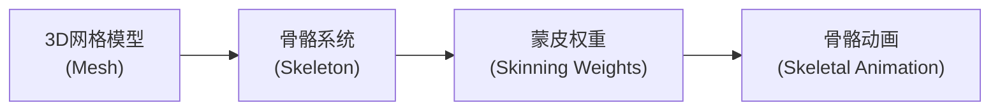
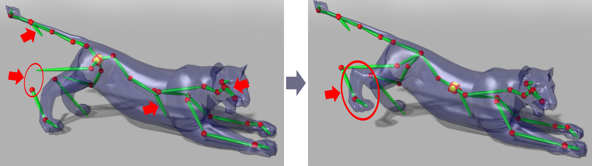
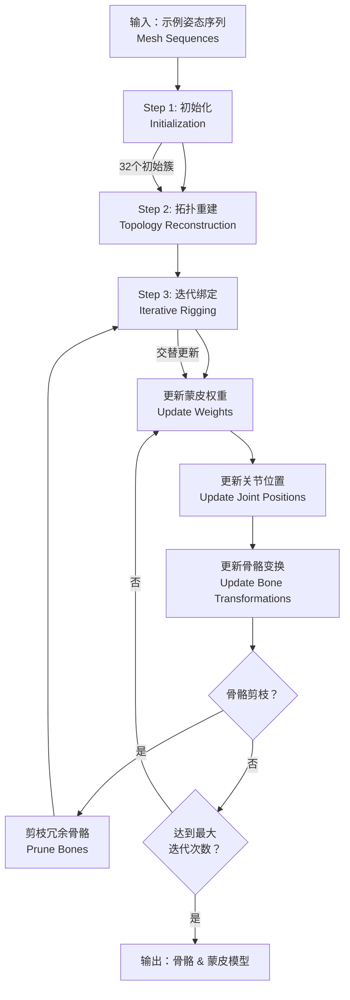
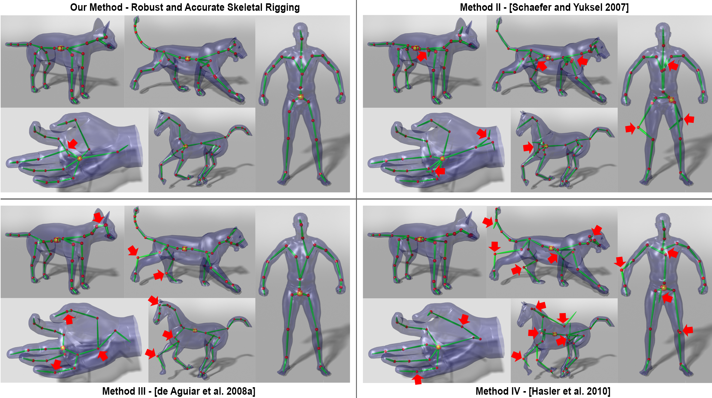
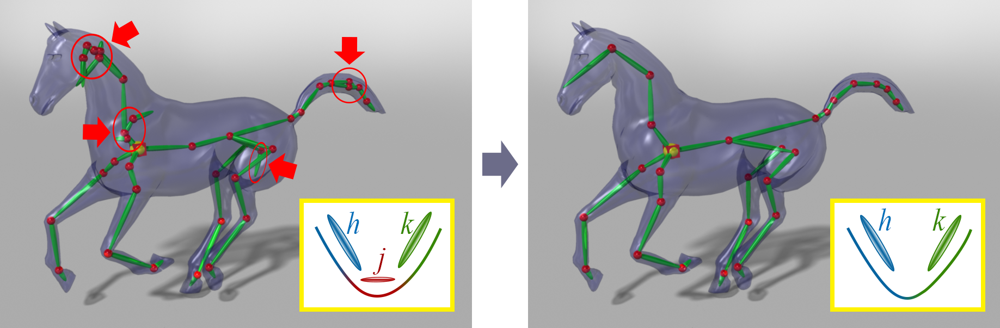
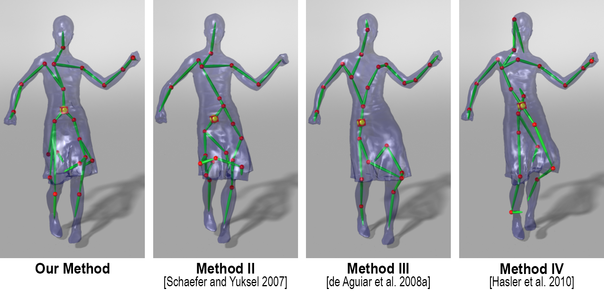
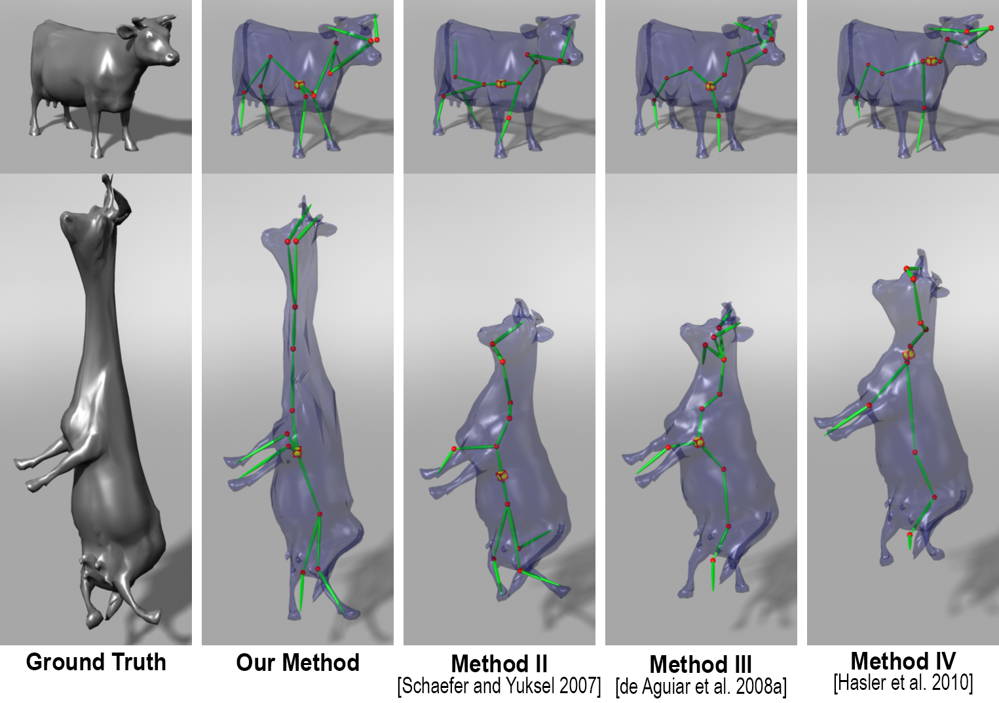
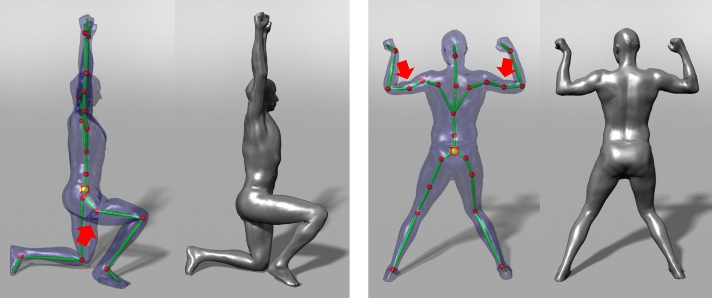

# Robust and Accurate Skeletal Rigging from Mesh Sequences

> **论文信息**
> - **标题**：Robust and Accurate Skeletal Rigging from Mesh Sequences
> - **作者**：Binh Huy Le, Zhigang Deng（休斯顿大学）
> - **发表**：ACM Transactions on Graphics (SIGGRAPH)

## 0. 背景知识

### 0.1 什么是骨骼绑定（Skeletal Rigging）？

在3D动画制作中，"骨骼绑定"是连接3D模型（称为"皮肤"或"网格"）与虚拟骨骼系统的过程。这个过程就像给木偶安装关节：



**为什么需要骨骼绑定？**
- 让角色能够自然地弯曲和运动
- 只需要控制少量骨骼参数，就能驱动大量顶点
- 游戏引擎和动画软件（如Maya、Blender）都支持骨骼动画

### 0.2 什么是线性混合蒙皮（LBS - Linear Blend Skinning）？

线性混合蒙皮是目前最广泛使用的骨骼蒙皮方法。它的核心思想是：**每个网格顶点受多个骨骼影响，影响程度由权重决定**。

数学表达式：

$$
\mathbf{v}_i' = \sum_{j=1}^{B} w_{ij} \left( \mathbf{R}_j \mathbf{t}_j \right) \mathbf{v}_i
$$

其中：
- \\(\mathbf{v}_i\\) 是第 \\(i\\) 个顶点在初始姿态（静止姿态）的位置
- \\(\mathbf{v}_i'\\) 是变换后的位置
- \\(w_{ij}\\) 是顶点 \\(i\\) 受到骨骼 \\(j\\) 影响的权重
- \\(\mathbf{R}_j\\) 是骨骼 \\(j\\) 的旋转矩阵
- \\(\mathbf{t}_j\\) 是骨骼 \\(j\\) 的平移向量
- \\(B\\) 是骨骼的总数

**直观理解**：
- 想象你用手拉动一块布的不同位置
- 靠近手指的布跟随手指移动（高权重）
- 远处的布只受轻微影响（低权重）

### 0.3 骨骼（Bone）与关节（Joint）

- **骨骼（Bone）**：刚体部分，在旋转时保持形状不变
- **关节（Joint）**：连接骨骼的枢纽点，骨骼绕此点旋转

```
    骨骼A           骨骼B
   ┌─────┐         ┌─────┐
   │     │         │     │
   │     │    关节 ├──    │
   └─────┘      ●  └─────┘
```

### 0.4 本文要解决的核心问题

传统骨骼绑定需要**人工操作**，非常耗时耗力。本文提出**自动化方法**：从一组示例姿态（网格序列）自动生成骨骼系统。

**输入**：一组不同姿态的3D网格序列（如运动捕捉数据）

**输出**：
- 骨骼结构（哪些骨骼相连）
- 关节位置
- 蒙皮权重
- 各姿态对应的骨骼变换

## 1. 问题与动机

### 1.1 传统方法的局限性

现有基于示例的骨骼绑定方法（如 Schaefer & Yuksel 2007、de Aguiar 2008、Hasler 2010）存在两个主要问题：

**问题1：过度估计的骨骼初始化**

初始化时产生的骨骼数量往往过多，导致：
- 不准确的骨骼
- 冗余的骨骼（可以被其他骨骼组合替代）



*Figure 2: 红箭头标注的是过度估计的骨骼*

**问题2：关节位置不准确**

关节位置的估计误差会**逐级累积**——从根关节到叶关节，误差越来越大。

### 1.2 本文的核心贡献

1. **鲁棒性**：通过自动剪枝冗余骨骼，比之前方法更鲁棒
2. **准确性**：通过关节约束优化，比之前方法更准确

## 2. 方法概述

### 2.1 整体流程



*Figure 3: 本文方法的完整流程*

### 2.2 三个主要步骤

| 步骤 | 名称 | 功能 |
|------|------|------|
| 1 | 初始化 | 从示例姿态识别刚体部分，初始化骨骼变换 |
| 2 | 拓扑重建 | 构建骨骼层级结构（哪些骨骼相连） |
| 3 | 迭代绑定 | 交替优化权重、关节位置、骨骼变换，并剪枝冗余骨骼 |

## 3. 初始化（Initialization）

### 3.1 运动驱动聚类（Motion-Driven Vertex Clustering）

核心思想：**运动相似的顶点属于同一个刚体部分**。

使用 Linde-Buzo-Gray (LBG) 算法对顶点进行聚类：
- 具有相似刚体变换的顶点被分到同一簇
- 初始分为1簇，然后分裂成2、4、8、16、32簇

### 3.2 簇分裂-EM策略

**为什么要分裂簇？**

初始一个簇包含所有顶点，然后逐步分裂，让算法自动找到合适的骨骼数量。

**如何选择分裂种子？**

选择使得**重建误差 × 到质心距离**最大的顶点作为新簇种子：

$$
s = \arg\max_{i} \left\{ d \left( \mathbf{u}_i, \mathbf{O} \right) e(i) \right\}
$$

其中：
- \\(d(\mathbf{u}_i, \mathbf{O})\\) 是顶点到质心的欧氏距离
- \\(e(i)\\) 是重建误差
- \\(L(i)\\) 是顶点 \\(i\\) 的簇标签

```
    原始簇              分裂后
   ┌────────┐         ┌────────┐
   │   ●种子│   →     │  簇1   │ ●种子
   │  顶点  │         │  顶点  │
   │   ●   │         ├────────┤
   │   ●   │         │  簇2   │
   │   ●   │         │  顶点  │
   └────────┘         └────────┘
```

### 3.3 连接块生成

聚类算法只考虑运动相似性，忽略网格连接信息。因此，同一刚体部分可能被分割到多个簇。

**解决方案**：对每个簇，找出所有连通分量（连接块），每个连通分量初始化一个独立的骨骼变换。

## 4. 拓扑重建（Topology Reconstruction）

### 4.1 骨骼图构建

构建加权图 \\(G\\)：
- 节点：每个骨骼
- 边权重 \\(g(j,k)\\)：两个骨骼共享关节的概率

权重计算公式：

$$
g(j,k) = \frac{ \sum_{f=1}^{F} \left\| \left[ \mathbf{R}_j^f | \mathbf{t}_j^f \right] \mathbf{C}_{jk} - \left[ \mathbf{R}_k^f | \mathbf{t}_k^f \right] \mathbf{C}_{jk} \right\|^2 }{ \sum_{i=1}^{N} w_{ij} w_{ik} }
$$

直觉理解：
- **分子**：关节拟合误差越小 → 两骨骼越应该相连
- **分母**：两骨骼的权重混合越大 → 它们越可能共享关节

### 4.2 最小生成树（MST）

使用 Kruskal 算法从加权图 \\(G\\) 构建最小生成树，即得到骨骼拓扑结构。

```
    加权图                    最小生成树（骨骼拓扑）
    
    A ──0.3── B              A ──0.3── B
    │╲       │                    ╲
   0.5╲ 0.4  │        →            ╲
    │   ╲    │                      C
    C ──0.6── D              C ──0.6── D
```

## 5. 迭代绑定（Iterative Rigging）

这是本文的**核心创新**部分！

### 5.1 优化目标

最小化目标函数：

$$
E = E_D + \lambda_S E_S + \lambda_J E_J
$$

三项分别为：
- \\(E_D\\)：**数据拟合项** —— 最小化网格重建误差
- \\(E_S\\)：**权重平滑项** —— 保证相邻顶点权重相似
- \\(E_J\)：**关节约束项** —— 保证骨骼绕关节旋转

### 5.2 权重更新（Skinning Weights Update）

**问题**：传统最小二乘法对噪声敏感，且可能产生"蒙皮断裂"。

**解决方案**：刚性拉普拉斯正则化

定义拉普拉斯矩阵 \\(\mathbf{L}\\)：

$$
L_{ik} = \begin{cases}
1 - \sum_{h \in N(i)} d_{ik} & \text{if } k = i \\
-d_{ik} & \text{if } k \in N(i) \\
0 & \text{otherwise}
\end{cases}
$$

其中刚性权重：

$$
d_{ik} = \frac{1}{F} \sum_{f=1}^{F} \frac{ \left\| \mathbf{v}_i^f - \mathbf{v}_k^f \right\|^2 }{ \left\| \mathbf{u}_i - \mathbf{u}_k \right\|^2 }
$$

**效果**：刚性权重 \\(d_{ik}\\) 衡量顶点间距离在运动中是否保持不变
- 距离保持不变 → \\(d_{ik} \approx 1\\) → \\(L_{ik} \approx 0\\) → 权重应相似
- 距离变化大 → \\(d_{ik} \ll 1\\) → \\(L_{ik} \approx 1\\) → 允许权重不同

### 5.3 骨骼变换更新（Bone Transformations Update）

**关键创新**：关节软约束

约束骨骼 \\(j\\) 和 \\(k\\) 在共同关节处一起旋转：

$$
\min_{[\mathbf{R}_j^f | \mathbf{t}_j^f]} E_j^f = \frac{1}{N} \sum_{i=1}^{N} w_{ij}^2 \left\| [\mathbf{R}_j^f | \mathbf{t}_j^f] \mathbf{u}_i - \mathbf{q}_i^f \right\|^2 + \lambda \sum_{(j,k) \in S} \left\| [\mathbf{R}_j^f | \mathbf{t}_j^f] \mathbf{C}_{jk} - \mathbf{q}^f(\mathbf{C}_{jk}) \right\|^2
$$

其中 \\(\mathbf{q}^f(\mathbf{C}_{jk})\\) 是骨骼 \\(k\\) 变换后的关节位置。

```
    无关节约束                    有关节约束
    ┌─────────┐                  ┌─────────┐
    │    ●    │  骨骼不绕关节旋转   │    ●────┼── 骨骼绕关节旋转
    │   ╱ ╲   │  造成变形错误       │   ╱ ╲   │
    └─────────┘                  └─────────┘
```

*Figure 6: 关节约束的效果对比*

### 5.4 骨骼剪枝（Skeleton Pruning）

**动机**：初始化时故意生成过多骨骼（过度估计），然后剪枝。

**剪枝策略**：利用权重正则化项

如果骨骼 \\(j\\) 的权重平方和小于最大权重平方和的1%，则剪枝：

$$
\text{如果} \sum_{i=1}^{N} w_{ij}^2 < 10^{-2} \max_k \sum_{i=1}^{N} w_{ik}^2 \text{，则移除骨骼 } j
$$

```
    剪枝前                        剪枝后
    ┌───────────────┐           ┌───────────────┐
    │  骨骼j(冗余)   │           │               │
    │    ↓ w≈0     │    →      │    骨骼A       │
    │  骨骼A ●────●骨骼B         │         ●────● 骨骼B
    └───────────────┘           └───────────────┘
```

*Figure 7: 骨骼剪枝示意*

## 6. 实验结果

### 6.1 数据集

| 数据集 | 顶点数 | 帧数 | 骨骼数 |
|--------|--------|------|--------|
| cat-poses | 7,826 | 29 | 8 |
| lion-poses | 5,000 | 930 | 4 |
| horse-gallop | 8,431 | 4,827 | 41 |
| hand | 7,997 | 4,318 | 65 |
| dance | 7,061 | 201 | 16 |
| scape | 12,500 | 7,023 | 25 |
| samba | 9,971 | 175 | 23 |
| cow | 2,904 | 204 | 11 |

### 6.2 定量对比

| 方法 | 我们的方法 | Method II<br/>(Schaefer 2007) | Method III<br/>(de Aguiar 2008) | Method IV<br/>(Hasler 2010) |
|------|------------|-------------------------------|--------------------------------|------------------------------|
| RMSE | **0.80** | 2.87 | 1.10 | 0.84 |
| 骨骼数量 | 24 | 24 | 24 | 24 |

我们的方法在**所有测试数据集上**都达到了最低的RMSE（均方根误差）。

### 6.3 定性对比



*Figure 10: 与三种最先进方法的对比。红箭头标注了问题区域。*

**观察**：
- 我们的方法在所有5个数据集上都产生了合理的结果
- 其他方法在不同数据集上都有各自的问题
- 我们的方法即使只使用**一组参数**也能处理所有数据集

### 6.4 鲁棒性测试



*Figure 8: 不同数据集的骨架提取结果*

即使初始化为不同数量的簇（4, 8, 16, 32），我们的方法都能收敛到相似的最终骨架结构。

### 6.5 复杂模型应用



*Figure 13: 即使裙子高度变形，我们的方法也能生成合理的骨骼结构*



*Figure 14: 弹性模型也能被成功绑定*

## 7. 局限性

### 7.1 计算效率

- 方法需要多次迭代剪枝，如果初始化骨骼过多，运行时间会显著增加
- 目前只适用于离线应用

### 7.2 对输入数据的依赖

- 输入姿态的运动范围受限可能导致关节不对称
- 噪声和不完整的运动数据会影响结果质量

### 7.3 近似能力的局限

LBS模型的近似能力有限，无法捕捉某些复杂的非线性变形。



*Figure 15: 上臂和上腿的4个冗余骨骼无法被剪枝，因为LBS需要它们来近似肌肉鼓起效果*

## 8. 结论

1. 提出了一种**鲁棒且准确**的自动化骨骼绑定方法
2. 核心创新：
   - **关节约束优化**：保证骨骼绕关节旋转
   - **骨骼剪枝**：自动移除冗余骨骼
   - **权重平滑正则化**：刚性拉普拉斯正则化
3. 在所有测试数据集上**优于**三种最先进的方法
4. 输出可直接用于游戏引擎和3D动画软件

## 9. 公式速查表

| 公式编号 | 名称 | 用途 |
|----------|------|------|
| (1a) | 簇分裂种子选择 | 选择最佳分裂点 |
| (2) | 骨骼连接权重 | 计算两骨骼共享关节的概率 |
| (3a) | 总目标函数 | 迭代优化的总体目标 |
| (3b) | 数据拟合项 | 最小化重建误差 |
| (3c) | 权重平滑项 | 保证相邻顶点权重相似 |
| (3d) | 关节约束项 | 保证骨骼绕关节旋转 |
| (4a) | 拉普拉斯矩阵 | 定义权重平滑的图结构 |
| (4b) | 刚性权重 | 衡量顶点距离保持能力 |
| (11) | 剪枝条件 | 判断是否应移除骨骼 |

## 10. 术语对照表

| 英文 | 中文 | 解释 |
|------|------|------|
| Skeletal Rigging | 骨骼绑定 | 将骨骼系统与3D网格连接的过程 |
| Linear Blend Skinning (LBS) | 线性混合蒙皮 | 最广泛使用的骨骼蒙皮方法 |
| Skeleton | 骨骼系统 | 由骨骼和关节组成的层级结构 |
| Bone | 骨骼 | 刚体部分，在旋转时保持形状 |
| Joint | 关节 | 连接骨骼的枢纽点 |
| Skinning Weight | 蒙皮权重 | 顶点受骨骼影响的程度 |
| Vertex | 顶点 | 3D网格的基本组成单元 |
| Mesh | 网格 | 由顶点组成的多边形表面 |
| Rest Pose | 静止姿态 | 角色的初始/参考姿态 |
| Example Poses | 示例姿态 | 用于训练的多个不同姿态 |
| Pruning | 剪枝 | 移除冗余骨骼的过程 |
| Rigidness Laplacian | 刚性拉普拉斯 | 用于权重平滑的图拉普拉斯变体 |

## 参考论文

1. Le & Deng (2012) - 骨骼分解的平滑蒙皮（SSDR）
2. Schaefer & Yuksel (2007) - 基于示例的骨骼提取
3. de Aguiar et al. (2008) - 自动将网格动画转换为骨骼动画
4. Hasler et al. (2010) - 学习用于形状和姿态的骨骼
5. Kabsch (1978) - 绝对方向问题的解

---

*本文档由 AI 自动生成，基于论文原文内容*
