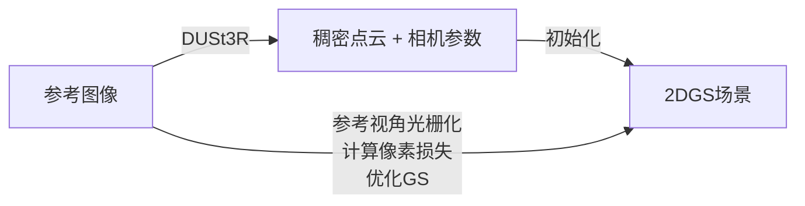
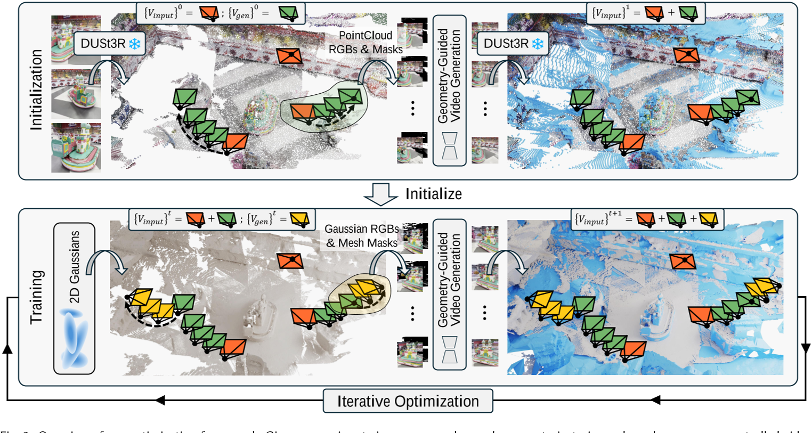
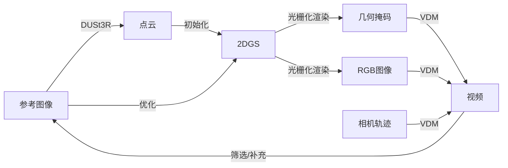

# VidSplat: Gaussian Splatting Reconstruction with Geometry-Guided Video Diffusion Priors

## 研究背景与问题

解决的问题：稀疏视角的3DGS重建

本文方法：『基于视频大模型的多视角生成』+『稠密视角重建』

## 现有方法及其问题

### 基于视频大模型的多视角生成

（1）利用I2I修复插值视角下的伪影，但无法恢复外推视角下的未观测区域。且生成的渲染结果视觉上看似合理，但缺乏一致的底层几何结构。
（2）相机轨迹控制的视频生成，尽管这些方法对开放域内容生成有效，但往往会产生动态变化和抖动损害3D几何一致性。

### 稠密视角重建

## 主要方法

## 思考

1. 把『稀疏视角重建』转化为『新视角合成』+『稠密视角重建』，这不是新思路，两个子步骤都不是新问题。本文主要的创新点在哪里？  
答：不是简单的两个子步骤的拼接，而是结合。  
（1）不是先批量生成多视角数据，再一次性用于重建。而是迭代地加新视角数据和GS优化。  
（2）用于生成多视角的相机轨迹不是预置的，而是根据实际情况采样出可有用的相机轨迹。  
（3）VDM基于当前的渲染结果进行未知区域的补全，而不是基于初始的参考图像。  
2. 这个方案的关节瓶颈在新视角生成的质量和一致性，这点如何保证？  
（1）VDM使用『分段掩码机制』，让生成结果既贴合物体表面又保证渲染质量。  
（2）基于当前渲染结果而不是初始参考图像进行补全，每次补全都是结合之前已经生成的结果，保证了一致性。
3. 其它  
（1）优化物体表面的2DGS，而不是优化3DGS，这是提升几何保真度并减小GS的优化空间的常用做法。