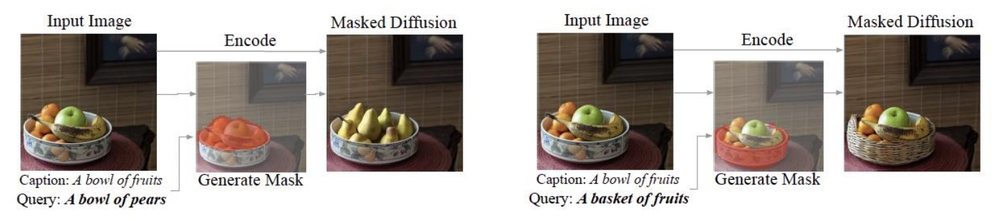
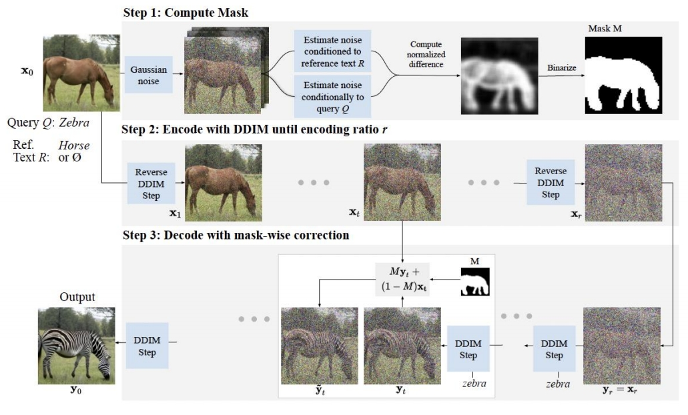
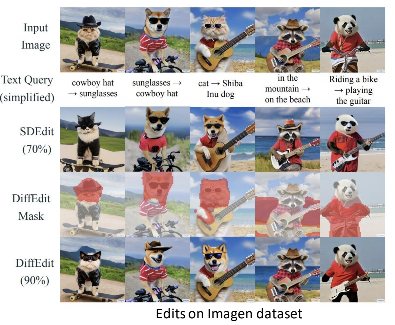

## DiffEdit: Diffusion-based semantic image editing with mask guidance     

---

### **一、核心思想与背景**

 

传统的基于扩散模型的图像编辑方法通常需要用户提供显式的遮罩（mask）来定位编辑区域，例如将任务转化为条件修复（inpainting）。而DiffEdit提出了一种**无需人工标注mask**的语义编辑框架，仅通过文本提示（text prompt）即可自动推断需修改的区域，并生成符合文本描述的编辑结果。其核心在于利用扩散模型在不同文本条件下的噪声预测差异，生成与编辑语义相关的区域mask，从而实现精准的局部编辑。

---

### **二、方法原理**

  

DiffEdit的流程分为三步：
1. **计算编辑mask**  
   通过对比源文本（原始图像描述）和目标文本（编辑要求）的噪声预测差异，定位需修改的区域。具体而言，对输入图像添加高斯噪声后，分别用两种文本条件进行去噪，计算两次噪声估计的差异，并通过阈值化生成二值mask。这一步骤利用了扩散模型对文本敏感的特性，自动捕捉语义相关区域。

2. **DDIM编码**  
   使用DDIM（Denoising Diffusion Implicit Models）的前向过程将输入图像编码至隐空间，生成中间隐变量。编码比例（r）控制编辑强度：r越大，编辑自由度越高，但可能偏离原图更多。

> &#x2705; 注意：step 1 的加高斯噪声与 step 2 的 DDIM Encoding 不同。前者是非确定的，后者是确定的。    

3. **Mask引导的解码**  
   在隐变量基础上，结合目标文本条件进行扩散模型的反向解码过程。解码时，非mask区域的像素值被固定为DDIM编码结果，而mask区域则根据目标文本生成新内容，从而保留原图未编辑部分的结构。

---

### **三、技术贡献与优势**
1. **自动mask生成**  
   无需用户标注mask，显著降低交互成本，尤其适用于复杂场景的编辑任务。
2. **平衡编辑与保留**  
   通过DDIM编码保留原图非编辑区域的细节，同时在mask区域实现高保真度的语义修改，解决了传统方法在“真实性”与“忠实性”之间的权衡问题。
3. **多模态兼容性**  
   支持文本引导的编辑，并可通过调整mask生成策略（如使用空文本作为参考）灵活适应不同场景。
4. **高效性**  
   无需额外训练或微调扩散模型，直接利用预训练模型实现编辑，计算成本较低。

---

### **四、实验验证**
1. **数据集与指标**  

      

   在ImageNet、COCO和Imagen等数据集上验证，使用LPIPS（衡量与原图相似性）和CSFID/FID（衡量生成质量与文本一致性）作为评估指标。
2. **性能对比**  
   - 在ImageNet上，DiffEdit在LPIPS与CSFID的均衡性优于CycleGAN、SDEdit等基线方法。
   - 在COCO上，尽管CLIP得分略低于SDEdit，但其生成的图像在保持结构一致性的同时更贴合文本描述。
3. **消融实验**  
   - 编码比例r的选择对结果影响显著，r=0.5时在编辑能力与保真度之间达到最佳平衡。
   - 结合DDIM编码与mask引导的解码策略（DiffEdit w/ Encode）相比单一策略（仅mask或仅编码）效果更优。

---

### **五、理论分析与局限**
1. **理论基础**  
   DiffEdit的mask生成机制与扩散模型的**跨模态对齐能力**密切相关。通过噪声差异捕捉语义变化，其本质是利用文本条件对图像特征的动态重构。
2. **局限性**  
   - 对复杂语义变化的处理有限，例如同时修改多个不相关区域时可能生成错误mask。
   - 高分辨率图像编辑时需结合分层扩散模型或加速采样策略，以降低计算开销。
   - 文本描述的模糊性可能导致mask定位偏差，需进一步引入多模态对齐机制（如CLIP特征融合）。

---

### **六、应用与拓展**
1. **医学图像编辑**  
   后续研究（如CT超分辨率任务）借鉴DiffEdit思想，通过双流扩散模型在保留结构的同时提升分辨率。
2. **多任务扩展**  
   结合SDE（随机微分方程）框架，提升编辑过程的鲁棒性。例如，SDE-Drag方法通过隐变量操控实现点拖动编辑，进一步扩展了DiffEdit的应用场景。
3. **风格迁移**  
   与LoRA等参数高效微调技术结合，实现风格-内容解耦，例如B-LoRA通过隐式分离风格与内容组件，支持细粒度编辑。

---

### **七、总结**
DiffEdit通过扩散模型的跨模态推理能力，为语义图像编辑提供了一种高效、低成本的解决方案。其核心创新在于将文本条件与隐空间编码相结合，实现了自动化mask生成与局部编辑的平衡。尽管存在计算效率与复杂场景适应性等挑战，其在多领域的拓展应用（如医学成像、艺术创作）展现了扩散模型在图像编辑任务中的巨大潜力。
