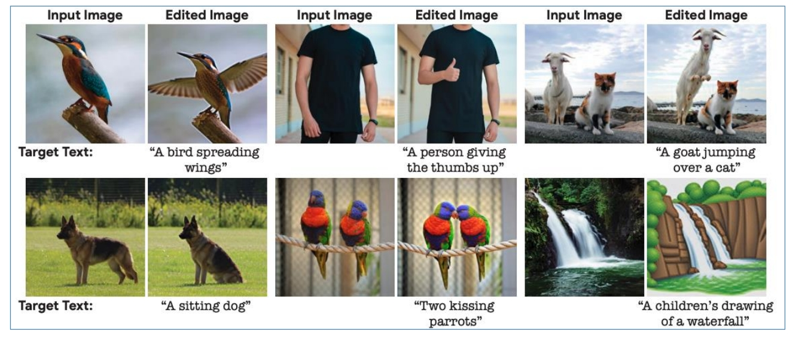
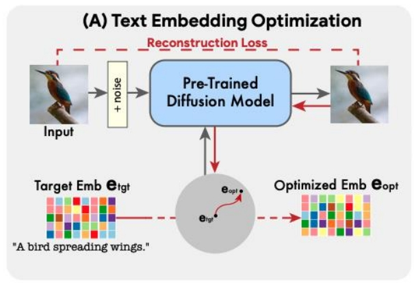
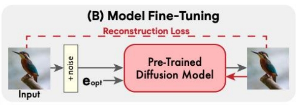
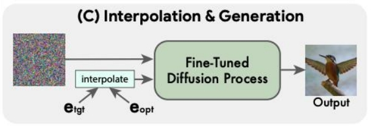
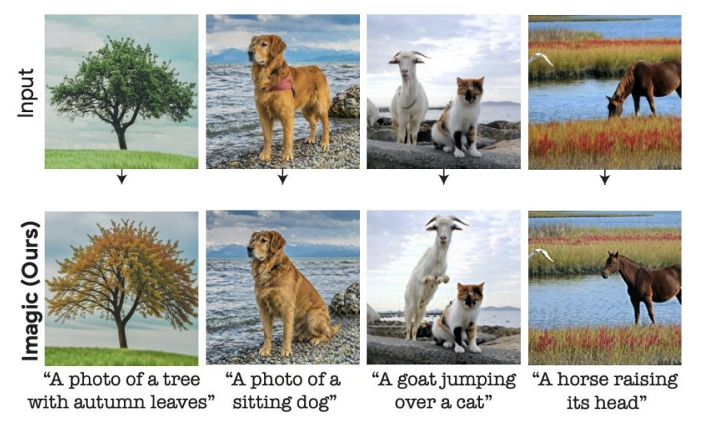

## Imagic: Text-Based Real Image Editing with Diffusion Models   

 

> &#x2705; 对内容进行复杂修改，但对不相关部分保留。    

P25   
### Pipeline

> 输入：Origin Image和target text promt

     

> &#x2705; Step 1： 对 target text 作 embedding，得到init text embedding \\(e_{tgt}\\)。然后优化init text embedding，使得Pre-Trained Diffusion Model可以根据Optimized text embedding \\(e_{opt}\\) 重建出Origin Image。
 
     

> &#x2705; Step 2： 用 Optimized text embedding \\(e_{opt}\\) 重建 Origin Image，这一步会 finetune diffusion model。   

    

> &#x2705; Step 3：用finetuned diffusion model生成target Image。其中condition为\\(e_{tgt}\\)和\\(e_{opt}\\)的插值。  

P26   
### 效果

 
