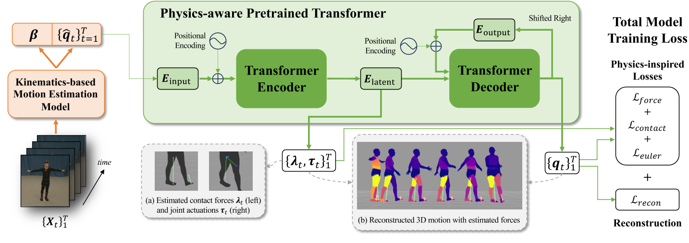
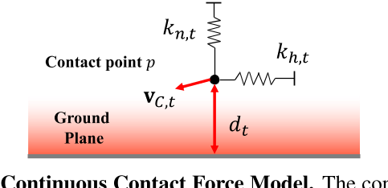

# PhysPT: Physics-aware Pretrained Transformer for Estimating Human Dynamics from Monocular Videos

这是一篇关于从单目视频中估计人体动态的研究论文。这篇论文由Yufei Zhang、Jeffrey O. Kephart、Zijun Cui和Qiang Ji共同撰写，他们分别来自Rensselaer Polytechnic Institute、IBM Research和University of Southern California。

在这篇论文中，作者们介绍了一种名为PhysPT（Physics-aware Pretrained Transformer）的新方法，旨在改善基于运动学的运动估计，并推断运动力。PhysPT利用Transformer编码器-解码器骨架，通过自监督的方式有效地学习人体动态，并结合了物理原理，以提高运动估计的物理真实性。具体来说，PhysPT构建了基于物理的人体表示和接触力模型，并引入了新的基于物理的训练损失（例如，力损失、接触损失和欧拉-拉格朗日损失），使模型能够捕捉人体和其所经历的力的物理属性。

## 核心问题是什么?

### **现有方法的局限性**

尽管当前的深度学习方法在3D人体重建方面取得了进展，但它们往往产生不真实的估计，因为这些方法主要考虑了运动学而忽略了物理原理。

### 本文方法

本文提出的物理感知预训练变压器（PhysPT），它改进了基于运动学的运动估计并推断运动力。 PhysPT 利用 Transformer 编码器解码器backbone以自我监督的方式有效地学习人类动力学。  
它还结合了控制人体运动的物理原理。构建了基于物理的身体表示和接触力模型。并利用它们施加新颖的物理启发训练损失（即力损失、接触损失和欧拉-拉格朗日损失），使 PhysPT 能够捕获人体的物理特性及其所经历的力。  

###  **实验结果**

实验表明，经过训练后，PhysPT 可以直接应用于基于运动学的估计，以显着增强其物理合理性并产生有利的运动力。此外，我们还表明，这些具有物理意义的量可以转化为重要下游任务（人类行为识别）准确性的提高。

## 核心贡献是什么？

- 提出了一个Transformer编码器-解码器模型，通过自监督学习进行训练，并结合了物理原理。
- 引入了基于物理的人体表示（Phys-SMPL）和接触力模型，以及一系列新的基于物理的训练损失，用于模型训练。
- 实验表明，PhysPT可以显著提高运动估计的物理真实性，并推断出有利的运动力。

## 大致方法是什么？

所提出的框架由基于运动学的运动估计模型（橙色）和物理感知的预训练 Transformer（绿色）组成，用于从单目视频估计人体动力学。插图 (a) 说明了右骨盆的关节驱动和每只脚的接触力。 (b) 说明了重建的身体运动和推断的力，较浅的颜色代表更大的关节驱动幅度（例如，人物站立时的上身关节，行走时的腿部关节）。

## Preliminary

### Euler-Lagrange Equations.

看不懂

### Kinematics-based Motion Estimation Model

1. 使用任意一种Mocap算法，从视频中提取出人在相机坐标系下的shape参数和pose参数。  
2. 使用GLAMER把人从相机坐标系转到世界坐标系。  
3. 返回
- 世界坐标系下的位移、朝向和关节旋转
- 所有帧的shape参数的均值

## Physics-aware Pretrained Transformer

优化Mocap结果，使其符合物理

### Transformer Encoder-Decoder Backbone

|输入|输出|方法|
|---|---|---|
|q(T, R, theta)|input embedding|linear layer|
|input embedding, time positional embedding|latent embedding|Transformer Encoder|
|latent embedding, time positional embedding, 历史输出|output embedding|Transformer Decoder|

loss：
- q的重建损失
- joint position的重建损失

**自监督训练**：PhysPT通过重建输入的人体运动来进行自监督训练，无需3D标注视频。

### Physics-based Body Representation

**物理原理的整合**：PhysPT通过直接从广泛采用的3D人体模型（SMPL）计算身体物理属性，避免了不现实的代理身体模型的使用。

1. 把人体根据关节分段
2. 使分段mesh封闭
3. 计算每一段mesh的体积
4. 计算每一段mesh的质量和转动惯量
5. 代入Euler-Lagrange公式

### 连续接触力模型

目标：从 3D 运动估计地面反作用力  
难点：
1. 接触状态通常需要事先确定——这本身就很难准确地做到
2. 离散接触状态还引入了估计力的不可微过程。
本文方法：引入弹簧质量系统  

$$
\lambda_{p,t} = s_{p,t}(-k_{h,t}b_{h,t}-k_{n,t}b_{n,t}-c_tV_{C,t})
$$

|符号|含义|前置计算
|---|---|---|
|\\(k_{h,t}\\)|弹簧系统在水平方向上的stifness|
|\\(k_{n,t}\\)|弹簧系统在竖直方向上的stifness|
|\\(c_t\\)|弹簧系统的damping系数|
|\\(s_{p,t}\\)|力的量级大小|\\(d_t, V_{C,t}\\)|
|\\(d_t\\)|point p到地面的距离|
|\\(V_{C,t}\\)|point p的速度|
|\\(b_{h,t}\\)|point p在水平方向上与reference point的距离|看样子reference point是（0.5， 0.5， 2）
|\\(b_{n,t}\\)|point p在垂直方向上与reference point的距离|
|\\(d_{t，x}\\)|\\(d_t\\)投影到x轴的向量|与触地点的法向是什么关系？|
|\\(d_{t，y}\\)|\\(d_t\\)投影到y轴的向量|

**为了计算效率**，仅将接触模型应用于每个身体部位内的**顶点子集**。  

接触模型的特点：  
1. 接触模型捕捉了自然接触行为的本质，即：​​其中最接近地面且最稳定的点会受到更大的力。
2. 接触模型避免了估计离散接触状态时出现的问题。

### Physics-inspired Training Losses

优化目标：让论文中的公式（2）成立。  
其中公式（2）中的\\(\lambda\\)为接触力，根据公式（4），是一个跟点的位置p和弹簧参数（stiffness, damping）有关的值。此处把公式（4）简化为  
$$
\lambda_t = A_t x_t
$$
其中，第一项为与点p相关的矩阵，前面提到给完整的mesh顶点定义了一个subset，subset中的所有点都要参与计算，因此构成了一个比较大的矩阵。第二顶就是弹簧系数。  

优化对象：\\(x_t, \tau_t\\)  
优化约束：接触力lambda应考虑到人类正常站立时可能经历的最大接触力。  
优化方法：这是一个二次规划问题，用CVXOPT求解。  

#### Force Loss

目的：利用导出的运动力来指导模型产生真实的运动力并提取有意义的潜在表示以预测物理上合理的运动。

将latent embedding和上一节中优化出的\\({\lambda_t, \tau_t}\\)构成pair data。并使用一个linear layer来拟合latent embedding到\\({\lambda_t, \tau_t}\\)的映射。  

#### Contact Loss

目的：让经历接触力的顶点应用约束，获得真实的接触行为

#### Euler-Lagrange Loss

目的：优化公式（5）

#### 完整loss

重建loss + force loss + contact loss + euler loss

## 有效

## 缺陷

## 验证

PhysPT在多个数据集上的表现证明了其有效性，包括在Human3.6M和3DOH数据集上的评估，以及在PennAction数据集上对人类行为识别任务的改进。

## 启发

**应用前景**：PhysPT的方法可以应用于各种基于运动学的重建模型，以生成更精确的运动和力估计，这对于虚拟现实、增强现实、人机交互和机器人等领域具有潜在的应用价值。

这篇论文为单目视频下的人体动态估计领域提供了新的视角，并展示了通过结合深度学习和物理原理来提高模型性能的可能性。

## 遗留问题

## 参考材料

- [1] https://arxiv.org/pdf/2404.04430