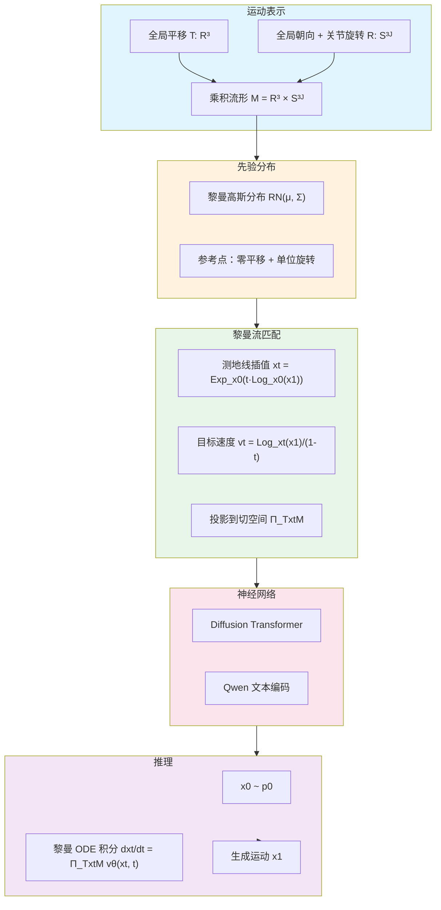

# Riemannian Motion Generation: A Unified Framework for Human Motion Representation and Generation via Riemannian Flow Matching

**论文信息**: arXiv:2603.15016v1 [cs.CV], 16 Mar 2026, Fangran Miao et al., The Hong Kong Polytechnic University / Southern University of Science and Technology

**Link**: [arXiv:2603.15016](https://arxiv.org/abs/2603.15016)

---

## 一、核心问题

### 1.1 研究背景

**人体运动生成的几何表示问题**：

现有方法大多在**欧几里得空间**中学习运动生成，但**有效的运动遵循结构化的非欧几何**。

**现有表示方法的问题**：

| 方法 | 表示格式 | 维度 | 问题 |
|------|---------|------|------|
| HumanML3D | T + R_ori + R_joint + P + dT + dR_ori + dR_joint + dP + 足部接触 | \\(12J-1\\) | 冗余编码，在欧氏空间训练 |
| MotionStreamer | T + R_ori + R_joint + P + dT + dR_ori + dR_joint | \\(12J+8\\) | 冗余，需要后处理归一化 |
| DART | T + R_ori + R_joint + P + dT + dR_ori + dR_joint | \\(12J+12\\) | 冗余 |
| HY-Motion | T + R_ori + R_joint | \\(9J+3\\) | 较紧凑 |
| **RMG (本文)** | **T + R** | **\\(4J+3\\)** | **最紧凑，流形感知** |

其中：
- \\(T\\): 全局平移 (Translation)
- \\(R_{ori}\\): 全局朝向 (Orientation)
- \\(R_{joint}\\): 每关节旋转 (Joint Rotation)
- \\(P\\): 关节位置 (Position)
- \\(d\cdot\\): 时间差分 (Temporal Difference)

**核心观察**：
- 对于 \\(J\\) 个关节的骨骼，关节姿态的内在自由度约为 \\(3J\\)
- 常见编码方式串联多个相关视图，占据更高维的 ambient 空间
- 模型在 \\(\mathbb{R}^D\\) 中训练，但物理有效的运动位于更低维的流形上

### 1.2 核心问题

**如何在一个统一的几何感知框架中表示和生成人体运动？**

具体来说：
1. 能否将运动分解为多个低维因子，每个因子有自己的自然几何？
2. 能否在乘积流形上直接学习生成动力学，而非在欧氏空间？
3. 能否实现尺度无关的表示，无需额外的数据归一化？

### 1.3 本文方法

论文提出了 **Riemannian Motion Generation (RMG)**，一个基于**黎曼流形匹配**的统一运动生成框架。

**核心思想**：
1. **运动分解**：将运动分解为多个流形因子（平移、旋转、姿态）
2. **黎曼流形匹配**：在乘积流形上学习动力学，使用黎曼流匹配 (Riemannian Flow Matching)
3. **测地线插值**：使用测地线进行插值和采样，保持流形约束

**关键创新**：
- 第一个将黎曼流匹配扩展到大规模数据集和高容量架构的工作
- 紧凑的 T + R 表示（平移 + 旋转），无需额外的时间差分或姿态因子
- 在 HumanML3D 上达到 SOTA FID (0.043)，在 MotionMillion 上超越所有基线

---

## 二、核心贡献

1. **Riemannian Motion Generation (RMG) 框架**
   - 在乘积流形上建模运动
   - 使用黎曼流匹配学习动力学
   - 几何一致性内置到表示和生成过程中

2. **紧凑的黎曼表示**
   - \\(\mathcal{M}_{RMG} = \mathbb{R}^3 \times (S^3)^J\\)
   - 仅需 \\(4J+3\\) 维（最紧凑）
   - 尺度无关，无需数据归一化

3. **大规模扩展验证**
   - 第一个证明黎曼流匹配可扩展到大规模数据集的工作
   - 在 MotionMillion (100 万动作片段) 上验证有效性

4. **SOTA 性能**
   - HumanML3D: FID = 0.043 (新 SOTA)
   - MotionMillion: FID = 5.6, R@1 = 0.86

---

## 三、大致方法

### 3.1 框架概述

### 3.2 运动表示与流形

**因子分解**：

RMG 将每个运动帧分解为以下因子，每个因子位于其自然流形上：

| 因子 | 流形 | 维度 | 说明 |
|------|------|------|------|
| **全局平移 \\(T\\)** | \\(\mathbb{R}^3\\) | 3 | 根关节（骨盆）的全局轨迹 |
| **全局朝向 \\(R_{ori}\\)** | \\(S^3\\) (单位四元数) | 4 | 骨骼的全局旋转 |
| **关节旋转 \\(R_{joint}\\)** | \\(S^3\\) (单位四元数) | \\(4(J-1)\\) | 每关节的局部旋转 |
| **局部姿态 \\(P\\)** (可选) | Kendall 预形状空间 \\(S^{3J}\\) | \\(3J-4\\) | 帧内骨骼配置 |

**紧凑表示**（通过消融研究验证）：

RMG 采用最紧凑的 T + R 表示，省略局部姿态和时间差分：

$$\mathcal{M}_{RMG} = \mathcal{M}_T \times \mathcal{M}_R = \mathbb{R}^3 \times (S^3)^J$$

**单位四元数的优势**（相比连续 6D 旋转）：
- 无冗余表示 SO(3)
- 在 \\(S^3\\) 上诱导平滑测地线
- 改进插值和采样稳定性
- 无需重新正交化
- 维度从 6 降至 4，具有一致的距离度量

### 3.3 先验分布

**黎曼高斯分布**：

在黎曼流形 \\(\mathcal{M}\\) 上定义高斯分布：

1. 在嵌入欧氏空间 \\(\mathbb{R}^n\\) 中采样高斯噪声：\\(\xi \sim \mathcal{N}(0, \Sigma)\\)
2. 投影到切空间：\\(v = \Pi_{T_\mu\mathcal{M}}(\xi) \in T_\mu\mathcal{M}\\)
3. 使用指数映射"包裹"到流形：\\(z = \text{Exp}_\mu(v) \in \mathcal{M}\\)

记作：\\(z \sim \mathcal{RN}(\mu, \Sigma)\\)

**参考点选择**：

对于运动生成，设置参考点为**静止姿态**（零平移 + 单位旋转）：
- 平移：\\(\mu_T = 0 \in \mathbb{R}^3\\)
- 旋转：\\(\mu_R = [1, 0, 0, 0] \in S^3\\)（单位四元数）

这确保先验样本对应合理的静态姿态。

### 3.4 黎曼流匹配 (Riemannian Flow Matching)

**核心思想**：

流匹配学习一个时间依赖的速度场，将源分布 \\(p_0\\) 传输到目标分布 \\(p_1\\)。在黎曼流形上，使用**测地线**替代欧氏空间中的线性插值。

**测地线插值**：

对于 \\(t \sim \mathcal{U}[0, 1]\\)，构造从 \\(x_0\\) 到 \\(x_1\\) 的插值状态：

$$x_t = \text{Exp}_{x_0}\left(t \cdot \text{Log}_{x_0}(x_1)\right)$$

在乘积流形上，Exp 和 Log 按因子逐元素应用。

**目标速度场**：

$$v_t(x_t | x_1) = \frac{1}{1-t} \text{Log}_{x_t}(x_1) \in T_{x_t}\mathcal{M}$$

当 \\(\mathcal{M} = \mathbb{R}^n\\) 时，退化为标准欧氏流匹配目标。

**训练损失**：

$$\mathcal{L}(\theta) = \mathbb{E}_{x_1 \sim p_{data}, x_0 \sim p_0, t \sim \mathcal{U}[0,1]} \left\| v_t(x_t | x_1) - \Pi_{T_{x_t}\mathcal{M}} v_\theta(x_t, t) \right\|^2$$

其中 \\(\Pi_{T_{x_t}\mathcal{M}}\\) 是将神经网络输出投影到切空间的算子。

**推理（ODE 积分）**：

从 \\(t=0\\) 到 \\(t=1\\) 积分黎曼 ODE：

$$\frac{dx_t}{dt} = \Pi_{T_{x_t}\mathcal{M}} v_\theta(x_t, t), \quad x_0 \sim p_0$$

使用一阶黎曼欧拉更新（步长 \\(h\\)）：

$$x_{t+h} = \text{Exp}_{x_t}\left(h \cdot \Pi_{T_{x_t}\mathcal{M}} v_\theta(x_t, t)\right)$$

这通过构造保持流形约束。

### 3.5 网络架构

| 组件 | 架构 | 说明 |
|------|------|------|
| **主干网络** | Diffusion Transformer (DiT) | 处理时间依赖向量场 |
| **文本编码** | Qwen (1.7B) | 隐藏状态作为文本表示 |
| **优化器** | AdamW | 余弦学习率 + 线性 warmup |
| **学习率** | 1e-4 (warmup 后余弦退火) | - |
| **Classifier-Free** | 10% dropout | 条件生成 |
| **EMA** | 指数移动平均 | 稳定训练和推理 |

---

## 四、训练细节

### 4.1 数据集

**HumanML3D**:
- 14,616 个运动片段
- 44,970 条文本描述
- 基于 AMASS 数据集
- 标准 text-to-motion 基准

**MotionMillion**:
- 100 万运动片段
- 400 万文本描述
- 大规模预训练数据集
- 评估泛化能力

### 4.2 训练配置

| 超参数 | 值 |
|--------|-----|
| Optimizer | AdamW |
| 初始学习率 | 1e-4 (线性 warmup) |
| 学习率调度 | 余弦退火 |
| Dropout | 10% (classifier-free) |
| EMA | 启用 |
| 批次大小 | - |

### 4.3 损失函数

**流匹配损失**：

$$\mathcal{L}(\theta) = \mathbb{E}_{x_1, x_0, t} \left\| \frac{1}{1-t}\text{Log}_{x_t}(x_1) - \Pi_{T_{x_t}\mathcal{M}} v_\theta(x_t, t) \right\|^2$$

**关键实现细节**：
- 在乘积流形上逐因子计算 Exp/Log
- 平移因子使用欧氏运算
- 旋转因子使用 \\(S^3\\) 流形运算
- 神经网络输出需投影到切空间

---

## 五、实验与结论

### 5.1 主要结果

**HumanML3D 基准**（Text-to-Motion）：

| 方法 | FID↓ | R@1↑ | 多样性→ | 多模态↑ |
|------|------|------|--------|--------|
| GT (Ground Truth) | 0.002 | 0.511 | 9.503 | 2.799 |
| MLD | 0.473 | 0.481 | 9.724 | 2.413 |
| T2M-GPT | 0.116 | 0.492 | 9.761 | 1.856 |
| MotionGPT | 0.232 | 0.492 | 9.528 | 2.008 |
| MoMask | 0.045 | 0.521 | 9.761 | 2.413 |
| MotionLCM | 0.304 | 0.505 | 9.607 | 2.259 |
| MotionCLR | 0.269 | 0.542 | 9.607 | 1.985 |
| MotionLab | 0.167 | - | 9.593 | 2.912 |
| MARDM | 0.114 | 0.500 | - | 2.231 |
| **Ours (RMG)** | **0.043** | **0.525** | **9.555** | **2.748** |

**关键发现**：
- FID = 0.043，超越之前的 SOTA MoMask (0.045)
- R@1 = 0.525，文本 - 运动一致性优秀（仅次于 MotionCLR 的 0.542）
- 多样性和多模态性保持高水平
- 在质量、对齐和多样性之间实现更平衡的改进

**MotionStreamer 格式**：

| 方法 | FID↓ | R@1↑ | 多样性→ | 多模态↑ |
|------|------|------|--------|--------|
| MotionStreamer | 11.790 | 0.631 | 27.284 | - |
| **Ours (RMG)** | **5.835** | **0.710** | **27.672** | **14.906** |

**MotionMillion 基准**（大规模）：

| 方法 | Guidance Scale | FID↓ | R@1↑ |
|------|---------------|------|------|
| ScaMo | - | 89.0 | 0.67 |
| MotionMillion-3B | - | 10.8 | 0.79 |
| MotionMillion-7B | - | 10.3 | 0.79 |
| **Ours (0.5B+1.7B)** | 2.0 | **5.6** | **0.81** |
| **Ours (0.5B+1.7B)** | 3.0 | 7.8 | **0.86** |

**关键发现**：
- FID = 5.6，比最强基线 MotionMillion-7B (10.3) 提升近一半
- R@1 从 0.81 提升至 0.86（guidance scale 从 2.0 增至 3.0）
- 证明 RMG 框架的可扩展性和泛化能力

### 5.2 消融研究

**RQ1: 哪些因子对运动质量和引导稳定性重要？**

| 表示 | FID (ω=6.5) | 说明 |
|------|-----------|------|
| T + R | **最优** | 平移 + 旋转（最紧凑） |
| T + R + P (从 P 恢复) | 较差 | 添加局部姿态 |
| T + R + P (从 R 恢复) | 较差 | 添加局部姿态 |
| T + P | 最差 | 缺少旋转信息 |

**结论**：T + R 表示已足够，添加局部姿态 (P) 不会带来改进。

**RQ2: 时间差分建模是否改进运动质量？**

| 表示 | FID | 说明 |
|------|-----|------|
| T + R | **最优** | 无时间差分 |
| dT + R | 较差 | 添加平移差分 |
| T + dR | 较差 | 添加旋转差分 |

**结论**：时间差分不会改进质量，T + R 表示已捕捉足够动态信息。

### 5.3 应用场景

1. **文本到运动生成**
   - 根据文本描述生成自然运动
   - 游戏 NPC 动画
   - VR/AR 化身驱动

2. **运动编辑**
   - 在流形上进行运动插值
   - 风格转换

3. **大规模运动合成**
   - 利用 MotionMillion 等大规模数据集
   - 预训练通用运动生成器

---

## 六、局限性

1. **单位四元数的双覆盖问题**
   - \\(q\\) 和 \\(-q\\) 表示相同旋转
   - 可能需要额外的符号一致性处理

2. **计算复杂度**
   - 黎曼流形运算（Exp/Log）比欧氏运算计算量大
   - 推理速度可能慢于欧氏方法

3. **足部接触未显式建模**
   - 当前表示不包含足部接触指示器
   - 可能需要后处理 IK 减少滑动

4. **仅限于运动生成**
   - 未涉及物理仿真
   - 生成的运动可能需要进一步验证物理合理性

---

## 七、启发

### 7.1 方法学启发

**几何感知建模的重要性**：
- 人体运动本质上是非欧的，应在其自然流形上建模
- 黎曼流匹配提供了一个通用框架，可扩展到各种流形

**表示设计的关键洞察**：
- 紧凑表示（T + R）已足够，无需冗余因子
- 单位四元数比 6D 旋转更适合流形建模
- 尺度无关表示简化了训练流程（无需归一化）

**与 Diffusion 的比较**：

| 特性 | 欧氏 Diffusion | 黎曼流匹配 (RMG) |
|------|---------------|-----------------|
| 表示空间 | \\(\mathbb{R}^D\\) | 乘积流形 \\(\mathcal{M}\\) |
| 插值路径 | 线性 | 测地线 |
| 约束处理 | 投影/后处理 | 内置于流形 |
| 归一化 | 需要 | 无需（流形内在） |

### 7.2 与相关工作对比

| 方法 | 核心思想 | 表示 | FID (H3D) |
|------|---------|------|----------|
| MLD | VAE + Diffusion | 欧氏 | 0.473 |
| T2M-GPT | VQ-VAE + GPT | 离散 | 0.116 |
| MotionGPT | LLM + Motion Token | 离散 | 0.232 |
| MoMask | Masked Transformer | 欧氏 | 0.045 |
| **RMG (本文)** | **黎曼流匹配** | **流形** | **0.043** |

### 7.3 技术细节启发

**黎曼流匹配的实现**：
1. 选择合适的流形结构（\\(S^3\\) 用于旋转）
2. 实现 Exp/Log 映射（可使用几何库如 geomstats）
3. 切空间投影确保有效动力学
4. 测地线插值替代线性插值

**网络设计**：
- DiT 作为主干，适合处理流形值数据
- Qwen 等现代 LLM 用于文本编码
- Classifier-free guidance 用于条件生成

---

## 八、遗留问题

### 8.1 开放性问题

1. **扩展到更复杂的流形**
   - 能否加入局部姿态因子（Kendall 预形状空间）？
   - 能否建模更复杂的骨骼约束？

2. **物理一致性**
   - 如何将物理约束（如足部接触、碰撞）整合到流形框架？
   - 能否与物理仿真器结合？

3. **多模态条件**
   - 除文本外，能否处理图像、音频等其他条件？
   - 如何实现细粒度的运动控制？

4. **推理速度**
   - 黎曼流匹配需要 ODE 积分，推理较慢
   - 能否使用一致性模型或蒸馏加速？

5. **单位四元数的双覆盖**
   - 如何处理 \\(q\\) 和 \\(-q\\) 的符号不一致问题？
   - 是否需要特殊的损失函数或约束？

---

## 九、补充：黎曼几何基础

### 9.1 流形 (Manifold)

**定义**：流形 \\(\mathcal{M}\\) 是一个拓扑空间，局部类似于欧氏空间 \\(\mathbb{R}^n\\)，允许进行微积分运算。

**例子**：
- \\(\mathbb{R}^3\\): 欧氏空间（平坦流形）
- \\(S^2\\): 球面（弯曲流形）
- \\(S^3\\): 单位四元数流形
- \\(SO(3)\\): 旋转群（等价于 \\(\mathbb{R}P^3\\)）

### 9.2 黎曼度量 (Riemannian Metric)

**定义**：黎曼度量 \\(g\\) 是在每个切空间 \\(T_p\mathcal{M}\\) 上定义的内积，记作 \\(g_p(u, v)\\)。

**作用**：
- 测量向量长度
- 测量向量夹角
- 诱导测地线距离（最短路径）

### 9.3 指数映射和对数映射

**指数映射 (Exponential Map)**：
$$\text{Exp}_p: T_p\mathcal{M} \to \mathcal{M}$$
将切空间中的向量映射到流形上的点。

**对数映射 (Logarithm Map)**：
$$\text{Log}_p: \mathcal{M} \to T_p\mathcal{M}$$
将流形上的点映射到切空间中的向量。

**在 \\(S^3\\) 上的具体形式**：
- 对于单位四元数 \\(q_1, q_2 \in S^3\\)：
  $$\text{Log}_{q_1}(q_2) = \frac{\arccos(q_1 \cdot q_2)}{\sqrt{1 - (q_1 \cdot q_2)^2}} (q_2 - (q_1 \cdot q_2)q_1)$$
- 指数映射是对数映射的逆运算

### 9.4 测地线 (Geodesic)

**定义**：测地线是流形上两点之间的最短路径，是欧氏直线的推广。

**公式**：
$$\gamma(t) = \text{Exp}_{x_0}(t \cdot \text{Log}_{x_0}(x_1)), \quad t \in [0, 1]$$

在流匹配中用于构造插值路径。

---

## 十、补充：黎曼流匹配 vs 欧氏流匹配

| 特性 | 欧氏流匹配 | 黎曼流匹配 |
|------|-----------|-----------|
| **流形** | \\(\mathbb{R}^n\\) | 任意黎曼流形 \\(\mathcal{M}\\) |
| **插值路径** | 线性：\\(x_t = (1-t)x_0 + tx_1\\) | 测地线：\\(x_t = \text{Exp}_{x_0}(t \cdot \text{Log}_{x_0}(x_1))\\) |
| **目标速度** | \\(v_t = x_1 - x_0\\) | \\(v_t = \frac{1}{1-t}\text{Log}_{x_t}(x_1)\\) |
| **切空间投影** | 无需（恒等） | 需要：\\(\Pi_{T_{x_t}\mathcal{M}}\\) |
| **推理更新** | \\(x_{t+h} = x_t + h \cdot v_\theta(x_t, t)\\) | \\(x_{t+h} = \text{Exp}_{x_t}(h \cdot \Pi_{T_{x_t}\mathcal{M}} v_\theta(x_t, t))\\) |

**关键关系**：当 \\(\mathcal{M} = \mathbb{R}^n\\) 时，黎曼流匹配退化为欧氏流匹配。

---

**笔记说明**：本文是 2026 年 3 月最新工作，提出了基于黎曼流形匹配的运动生成框架 RMG。核心创新是将运动表示为乘积流形 \\(\mathbb{R}^3 \times (S^3)^J\\) 上的点，并使用黎曼流匹配学习生成动力学。在 HumanML3D 上达到 SOTA FID (0.043)，并首次证明黎曼流匹配可扩展到大规模数据集。理解本文有助于学习几何感知的人体运动生成方法，与 PhysDiff、POMP 等工作形成对比。

---

## 十一、公式汇总

**重要公式速查**：

1. **紧凑表示**：
   $$\mathcal{M}_{RMG} = \mathbb{R}^3 \times (S^3)^J$$

2. **黎曼高斯采样**：
   $$\xi \sim \mathcal{N}(0, \Sigma), \quad v = \Pi_{T_\mu\mathcal{M}}(\xi), \quad z = \text{Exp}_\mu(v)$$

3. **测地线插值**：
   $$x_t = \text{Exp}_{x_0}\left(t \cdot \text{Log}_{x_0}(x_1)\right)$$

4. **目标速度场**：
   $$v_t(x_t | x_1) = \frac{1}{1-t} \text{Log}_{x_t}(x_1)$$

5. **训练损失**：
   $$\mathcal{L}(\theta) = \mathbb{E}_{x_1, x_0, t} \left\| v_t(x_t | x_1) - \Pi_{T_{x_t}\mathcal{M}} v_\theta(x_t, t) \right\|^2$$

6. **推理 ODE**：
   $$\frac{dx_t}{dt} = \Pi_{T_{x_t}\mathcal{M}} v_\theta(x_t, t), \quad x_0 \sim p_0$$

7. **黎曼欧拉更新**：
   $$x_{t+h} = \text{Exp}_{x_t}\left(h \cdot \Pi_{T_{x_t}\mathcal{M}} v_\theta(x_t, t)\right)$$
