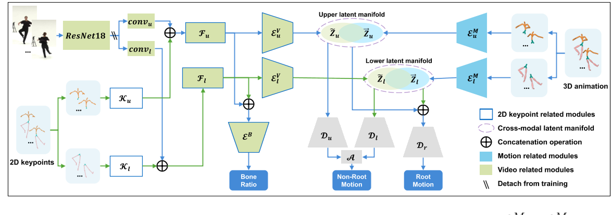

# Learning Human Motion from Monocular Videos via Cross-Modal Manifold Alignment

## 核心问题是什么?

**从 2D 输入学习 3D 人体运动**是计算机视觉和计算机图形领域的一项基本任务。

### 当前方法及问题

以前的许多方法通过在学习过程中**引入运动先验**来解决这种本质上不明确的任务。然而，这些方法在定义此类先验的完整配置或训练鲁棒模型方面面临困难。

可以找到由2D和3在这两个域的数据共享的紧凑且定义明确的latent manifold，类似于 CLIP 潜在流形。这个潜在空间应该包含足够的信息来忠实地重建人体姿势。因此，在 3D 人体姿态重建中进行跨模态对齐时存在两个技术挑战：    
1）识别这样的潜在流形，它封装了 3D 人体运动中体现的运动学约束并作为我们的运动先验，  
2）找到有效的方法将视频特征空间与运动先验对齐以实现高保真 3D 运动重建的方法。

### 本文方法

为了解决上述两个挑战，我们引入了一种称为 VTM 的新型神经网络。  
- VTM 采用两部分运动自动编码器 (TPMAE)，它将运动潜在流形的学习分为上半身和下半身部分。这种划分有效地降低了整个人体姿态流形建模的复杂性。 
- TPMAE在与尺度不变的虚拟骨架对齐的3D人体运动数据上进行训练，这有利于消除骨架尺度对流形的影响。  
- VTM 结合了一个两部分视觉编码器 (TPVE)，将由视频帧和 2D 关键点组成的视觉特征转换为上半身和下半身的两个视觉latent manifold。  
- 采用歧管对齐损失来将上半身部分和下半身部分的跨模态歧管拉得更近。  
- TPVE 与预先训练的 TPMAE 联合训练，以重建具有完整表示的 3D 人体运动：所有关节的旋转、根关节的平移以及包含尺度信息的运动骨架。  

这个精心设计的流程确保了 VTM 框架内运动和视觉表示之间的协调。

- 3D 人体运动和 2D 输入（即视频和 2D 关键点）之间的**跨模式潜在特征空间对齐**来利用运动先验。  
- 为了降低运动先验建模的复杂性，我们**分别对上半身和下半身部位**的运动数据进行建模。
- 将运动数据与**尺度不变的虚拟骨骼对齐**，以减轻人体骨骼变化对运动先验的干扰。  

### 效果

VTM 在 AIST++ 上进行评估，展示了从单眼视频重建 3D 人体运动的最先进性能。值得注意的是，我们的 VTM 展示了对未见过的视角和野外视频的泛化能力。

## 核心贡献是什么？

1.  **跨模态潜在特征空间对齐**：VTM将3D人体运动和2D输入（视频和2D关键点）的潜在特征空间进行对齐，以利用运动先验信息。
2.  **上半身和下半身的运动数据建模**：为了降低建模运动先验的复杂性，VTM将上半身和下半身的运动数据分别建模。
3.  **与尺度不变虚拟骨骼对齐**：VTM将运动数据与尺度不变的虚拟骨骼对齐，以减少人体骨骼变化对运动先验的干扰。
4.  **3D运动表示**：VTM能够重建包括所有关节的旋转、根关节的平移以及包含尺度信息的运动骨架在内的完整运动表示。

## 大致方法是什么？

### Learn Motion Priors

#### 模型

|输入|输出|方法|
|---|---|---|
|3D motion序列X|上半身序列Xu，下半身序列Xd|分割，两者都包含root数据|右上浅蓝色部分|
|part动作序列|latent code zu和zl|3D Encoder|
|zu, zl|decoded features of body parts|3D Decoder|
|decoded features of body parts|non-root motion|an aggregation layer A,1D 卷积层|
|zu, zl|root motion,仅包含根旋转 rq 、Z 轴上的 3D root位置 rzp 以及相应的速度 rz|Decoder, Dr|
| 轴上的 3D root位置 rzp|root translations|

#### Loss 

|Loss|目的|方法|
|---|---|---|
|motion重建loss|限制latent manifold的明确定义|由于不同的关节在运动中的重要性不同，我们通过为根关节和其他关节赋予相对重要性 ωr 和 ωnr 来缩放重建的和真实的运动数据|
|平滑|防止重建运动沿时间轴突然变化|

### Learn Human Motion from Videos

#### 模型

|输入|输出|方法|
|---|---|---|
|video|video feature|ResNet18|
|2D keypoints|2D keypoints feature|分成上、下part，分别用CNN提取feature|
|video features, keypoints features|visual features|视觉特征融合块|一维卷积层|
|visual features|latent manifold|2D Encoder，这些编码器具有与3D Encoder类似的结构，但后面有两个跨时间上下文聚合模块（CTCA）以便更好地捕捉时间相关性|
|visual features|bone ratio|由于人体不同身体部位的身高和比例存在很大差异，因此骨骼的尺度在 3D 人体运动中起着至关重要的作用。虽然我们故意从训练运动数据中删除尺度信息以增强运动先验的学习，但我们可以有效地从 2D 输入中提取骨骼比率 b。这些输入本质上体现了角色的比例信息。|

#### Loss

|Loss|目的|方法|
|---|---|---|
|motion重建loss|限制latent manifold的明确定义|由于不同的关节在运动中的重要性不同，我们通过为根关节和其他关节赋予相对重要性 ωr 和 ωnr 来缩放重建的和真实的运动数据|
|平滑|防止重建运动沿时间轴突然变化|
|流形空间对齐损失|
|bone ratio loss|

## 有效

1.  **实时性能**：VTM能够以接近70fps的速度快速生成与视频序列同步的精确人体运动，使其成为各种实时应用的潜在候选者。
2.  **泛化能力**：VTM在未见过的视角和野外视频上展现出了良好的泛化能力。

## 缺陷

## 验证

数据集：AIST++, Human3.6, BVHAIST++

## 启发

## 遗留问题

## 参考材料

1. https://arxiv.org/pdf/2404.09499