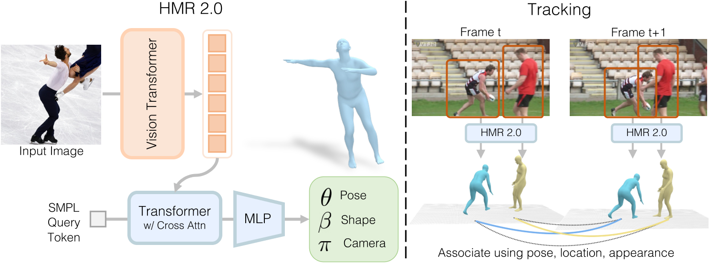

# Humans in 4D: Reconstructing and Tracking Humans with Transformers

## 核心问题是什么?

我们提出了一种重建人类并随着时间的推移追踪他们的方法。

**Human Mesh Recovery**：我们提出了一个用于人类mesh reconvery的完全“transformer”的网络版本。该网络 HMR 2.0 可以从单个图像中进行人体重建。  
**Human Tracking**：以 HMR 2.0 的 3D 重建作为以 3D 运行的跟踪系统的输入，使得我们可能在多人场景及遮挡场景中保持身份。  

## 核心贡献是什么？

1.  **HMR 2.0**：这是一个完全基于Transformer的架构，用于从单张图像中恢复人体网格。它不依赖于特定领域的设计，但在3D人体姿态重建方面超越了现有方法。

2.  **4DHumans**：这是一个建立在HMR 2.0基础上的系统，可以联合重建和跟踪视频中的人体。它在PoseTrack数据集上实现了最先进的跟踪结果。

3.  **动作识别**：通过在AVA v2.2数据集上的动作识别任务，展示了HMR 2.0在3D姿态估计方面的改进，最终为AVA基准测试贡献了最先进的结果（42.3 mAP）。

## 大致方法是什么？

### Reconstructing People

#### 模型结构

|输入|输出|方法|
|---|---|---|
|Image|image tokens|ViT-H/16|
|a single (zero) input token, image tokens|3D rotations|a standard transformer decoder [74] with multi-head self-attention|

#### Loss

- SMPL参数Loss
- 3D keypoint重建loss
- 2D keypoint重建loss
- SMPL参数的差别器loss

### Tracking People

1. 逐帧检测各个帧中的人物，将它们“lifting”到 3D，提取它们的 3D 姿势、3D 空间中的位置（来自估计的相机）和 3D 外观（来自纹理贴图）。  
2. 随着时间的推移，构建出每个人的tracklet representation。  
3. 针对每个tracklet，预测下一帧中人的姿势、位置和外观（全部以 3D 形式进行）。  
4. 在这些自上而下的预测（来自第3步）和该帧中人的自下而上的检测（来自第1步）之间找到最佳匹配。  
5. 更新tracklet representation并迭代该过程。

## 有效

## 缺陷

## 验证

1.  **数据集和基线**：使用标准的H3.6M、MPI-INF3DHP、COCO和MPII数据集进行训练，并使用InstaVariety、AVA和AI Challenger作为额外数据，其中生成了伪地面真实拟合。

2.  **实验**：作者们在多个数据集上定性和定量地评估了他们的重建和跟踪系统。首先，他们展示了HMR 2.0在标准2D和3D姿态精度指标上超越了以前的方法。其次，他们展示了4DHumans是一个多才多艺的跟踪器，实现了最先进的性能。最后，他们通过在动作识别的下游应用中展示优越的性能，进一步证明了恢复姿态的鲁棒性和准确性。

3.  **模型设计**：在开发HMR 2.0的过程中，作者们探索了一系列设计决策，包括不同的模型架构、训练数据的影响、ViT预训练的影响以及SMPL头部架构的影响。

## 启发

## 遗留问题

## 参考材料

1. https://shubham-goel.github.io/4dHumans/.