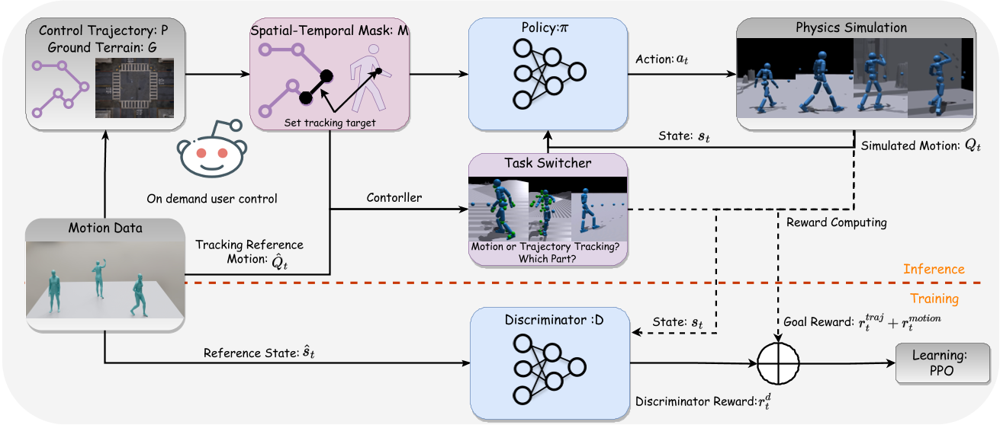

# PACER+: On-Demand Pedestrian Animation Controller in Driving Scenarios

## 核心问题是什么?

### 要解决的问题

在驾驶场景中生成多样化和自然的行人动画。

### 当前方法及问题

现有行人动画框架的局限性，这些框架通常只关注遵循轨迹或参考视频的内容，而忽略了人类运动的潜在多样性。

### 本文方法及效果

PACER+通过结合运动跟踪任务和轨迹跟踪，实现了对特定身体部位（例如上半身）的跟踪，同时通过单一策略跟随给定的轨迹。这种方法显著提高了模拟人类运动的多样性和控制内容的能力，包括基于语言的控制。

## 核心贡献是什么？

1.  **PACER+框架**：一个基于物理的行人动画框架，可以控制模拟的行人同时跟随2D轨迹和特定身体部位的参考运动。

2.  **多样化的运动生成**：PACER+支持从多种来源生成多样化的行人行为，包括生成模型、预先捕获的动作和视频。

3.  **零样本重建**：PACER+能够零样本重现真实世界的行人动画到模拟环境中，自动填充缺失的部分。

4.  **运动跟踪与轨迹跟踪的协同**：通过联合训练方案，PACER+建立了运动模仿和轨迹跟踪任务之间的协同关系，使用单个策略以物理合理的方式同时跟踪部分身体运动和轨迹。

5.  **空间-时间掩码**：引入了每个关节的空间-时间掩码，指示策略需要跟踪的参考运动的存在。

## 大致方法是什么？

(1) 地形轨迹跟踪，决定了模拟行人在复杂环境中的所需路径；(2) 运动内容控制，指定行人所表现出的所需动作和手势（例如，打电话或挥手）手），同时遵守提供的轨迹和地形。

> PACER+ 框架遵循具有对抗性运动先验的目标条件强化学习。为了实现对特定身体部位的细粒度控制，作者在运动跟踪任务中引入了一个额外的时空掩码。该掩码指示策略应跟踪reference motion。通过专注于此跟踪任务，PACER+框架能够以零样本的方式演示特定时间步骤和位置的不同行人行为。

### RL 的关键要素

$$
M = \lbrace S, A, T, R, \gamma \rbrace
$$

|元素|内容|来源|
|---|---|---|
|Stage S|humanoid proprioception [30] \\(s^p_t\\) goal state \\(s^g_t\\)  ---- 轨迹跟踪的目标 \\(s^{traj}_t\\)  ---- 运动跟踪的目标 \\(s^{motion}_t\\)|PD控制|||
|Action A||policy network|||
|转移 T||PD控制|
|reward R||与给定的轨迹和运动跟踪任务相关||
|discount factor \\(\gamma\\)||

### 地形上的轨迹跟踪

#### 状态 S

在轨迹跟随任务中，人形机器人有一个局部高度图G和要跟随的轨迹P。P为接下来一段时间的轨迹采样序列。

$$
s^{traj}_t \triangleq  (P_t^{traj}， G_t)
$$

[?]G为什么和时间有关？地形会变吗？

#### Reward R

t 时序轨迹 期望轨迹 p 与模拟角色根节点位置之间的 xy 距离，公式为 

$$
d = \parallel\hat p_t^{xy} - r_t^{xy}\parallel\\ r^{traj}_t = e^{-2d}
$$

#### 提前终止机制

如果在时间步 t 时距离d大于阈值 τ （0.5米），将终止轨迹跟踪任务。

### 运动跟踪

#### 状态 S

t+1时刻的运动跟踪目标包含：  
- t+1时刻的运动状态：关节位置、关节旋转、关节速度和旋转速度。不管特定帧特定关节是否需要跟踪，都将其设置为与模拟角色状态相同的值。
- 时空掩码：希望policy netword只在给定时间范围内跟踪特定运动部分，同时遵循轨迹，引入时空掩码。定义时空掩码为 M1 = T * J，表示在时间步 t 是否需要运动跟踪关节 j。1为跟踪，0为不跟踪。

#### Reward R

类似于带mask的重建loss

#### 对抗运动先验（AMP）

AMP 采用运动discriminator来鼓励策略生成与dataset中观察到的运动模式一致的运动。  

1. 使用大约 200 个序列的较小数据集训练 AMP。AMP 使用discriminator来计算style reward，并将其添加到task reward中。Good：确保了生成运动的自然性。Bad：但它限制了运动跟踪任务中看不见的运动的泛化。
2. 为了解决工作1引入的问题，将补充运动序列作为运动跟踪中的motion reference。Good：可以引入了不同的运动内容，并且有可能增强跟踪性能。Bad：然而，使用额外的数据集训练运动跟踪任务对联合学习 AMP 和较小的数据集提出了挑战，
3. 为了解决工作2引入的问题，在训练期间采用了提前终止机制。

### System Overview

#### 训练过程

policy network通过轨迹跟踪和运动跟踪任务的组合方法进行训练。
- 第一阶段，轨迹跟踪和动作跟踪两项任务联合训练。在此步骤中，在每个时间步随机生成reference motion（随机采样自AMASS）的二进制掩码，并将提前终止应用于运动跟踪任务。
- 第二阶段，使用随机生成的合成轨迹来训练轨迹跟踪任务 。在此阶段，时空掩模内的所有关节都被分配值 0。

#### 使用场景1：

输入轨迹，输出3D motion  
从其它来源中获取reference motion，将reference motion与输入的轨迹对齐，然后设置掩码生成运动。  

#### 使用场景2：真实场景

输入视频，输出3D motion。  
根据2D keypoints的置信度来打mask。 
## 有效

## 缺陷

## 验证

## 启发

## 遗留问题

## 参考材料