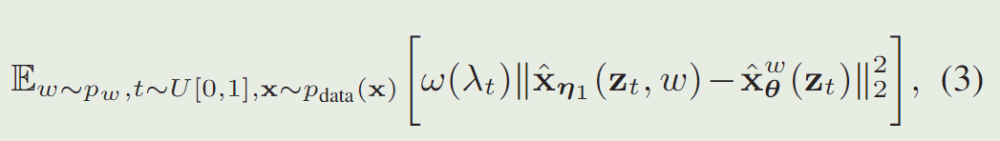
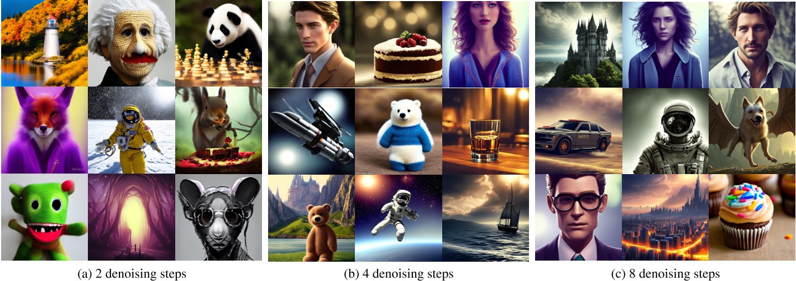

# On Distillation of Guided Diffusion Models

## 核心问题是什么?

无分类器引导扩散模型的缺点是，它们在推理时的计算成本很高，因为它们需要评估两个扩散模型（一个类条件模型和一个无条件模型）数十到数百次。    
而现有的加速方法不适用于classifier-free guided diffusion models。  

## 核心贡献是什么？

使用两步蒸馏法提升classifier-free guided diffusion models的采样效率。  
给定一个预先训练的无分类器引导模型，我们首先学习一个模型来匹配两个教师模型（条件模型和无条件模型）的组合输出，然后我们逐步将该模型提炼为需要更少采样步骤的扩散模型。

## 大致方法是什么？

### 第一阶段

引入单个学生模型来匹配两个老师扩散模型（条件模型和无条件模型）的组合输出。  

classifier-free guidance使用w来权衡条件模型（质量）和无条件模型（多样性）。因此蒸馏模型也应该能够保持这一特性。  
给定我们感兴趣的指导强度范围 [wmin, wmax]，使用以下目标优化学生模型  

其中\\(\hat x_{\theta}^w(z_t)\\)是由两个老师扩散模型提供的GT。\\(\hat x_{\eta 1}(z_t, w)\\)是要学习的学生模型。  

1. 对 w 应用傅里叶嵌入，然后将其合并到扩散模型主干中，其方式类似于将时间步。  
2. 学生模型与老师模型相同，且使用老师模型来初始化学习模型。  

### 第二阶段

逐步将第一阶段学习的模型提炼为少步模型，见[PROGRESSIVE DISTILLATION FOR FAST SAMPLING OF DIFFUSION MODELS](https://caterpillarstudygroup.github.io/ReadPapers/1.html).   

## 有效

1. 对于在**像素空间**上训练的标准扩散模型，我们的方法能够在 ImageNet 64x64 和 CIFAR-10 上使用短短 4 个采样步骤生成视觉上与原始模型相当的图像，实现与原始模型相当的 FID/IS 分数原始模型的采样速度提高了 256 倍。
2. 对于在**隐空间**上训练的扩散模型（例如稳定扩散），我们的方法能够使用少至 1 到 4 个去噪步骤生成高保真图像，与 ImageNet 上的现有方法相比，推理速度至少提高 10 倍256x256 和 LAION 数据集。

3. 在**文本引导图像编辑和修复**方面，我们的蒸馏模型能够使用少至 2-4 个去噪步骤生成高质量的结果。
For standard diffusion models trained on the pixel-space, our approach is able to generate images visually comparable to that of the original model using as few as 4 sampling steps on ImageNet 64x64 and CIFAR-10, achieving FID/IS scores comparable to that of the original model while being up to 256 times faster to sample from.   

## 缺陷

## 验证

## 启发

## 参考材料

1. https://blog.csdn.net/zjc910997316/article/details/131812691
2. https://caterpillarstudygroup.github.io/ImportantArticles/diffusion-tutorial-part/diffusiontutorialpart1.html