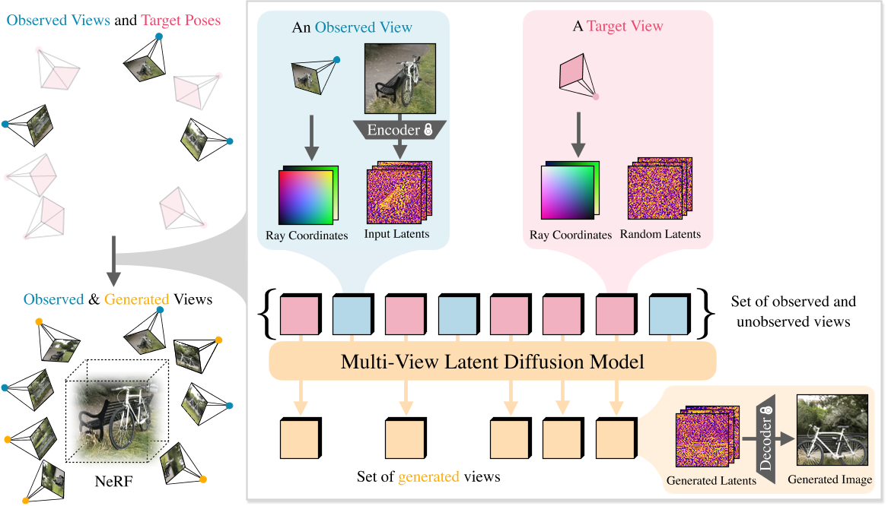
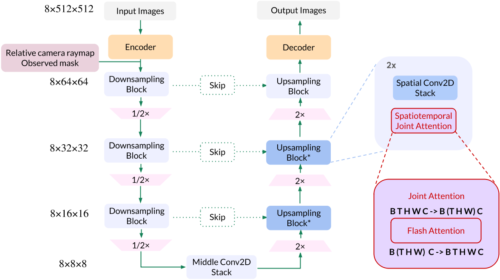

# CAT3D: Create Anything in 3D with Multi-View Diffusion Models

## 核心问题是什么?

### 目的

3D 重建技术，通过图像重建3D场景。  

### 现有方法

现有方法需要用户收集数百到数千张图像来创建 3D 场景。

### 本文方法

我们提出了 CAT3D，这是一种通过使用多视图扩散模型模拟现实世界捕获过程来创建 3D 任何东西的方法。给定任意数量的输入图像和一组目标新视角，我们的模型会生成高度一致的场景新视角。这些生成的视图可用作稳健 3D 重建技术的输入，以生成可从任何视点实时渲染的 3D 表示。 

### 效果

CAT3D 可以在短短一分钟内创建整个 3D 场景，并且优于单图像和少视图 3D 场景创建的现有方法。请参阅我们的项目页面以获取结果和交互式演示：cat3d.github.io。

## 核心贡献是什么？

1.  **多视图扩散模型**：CAT3D使用多视图扩散模型来生成与输入图像数量无关的一致性新视图。这种模型可以接受任意数量的输入视图，并生成一组新颖的、与目标新视点一致的3D视图。

2.  **3D场景创建的高效性**：CAT3D能够在短短一分钟内创建完整的3D场景，并且在单图像和少视图3D场景创建方面超越了现有方法。

3.  **高质量的3D重建**：通过将生成的视图输入到强大的3D重建技术中，CAT3D能够产生可以在任何视点实时渲染的3D表示。

4.  **从文本到3D的转换**：CAT3D展示了如何使用预训练的文本到图像模型作为生成3D内容的强有力先验，通过文本提示生成输入图像，然后创建3D场景。

5.  **改进的3D重建流程**：CAT3D通过修改标准的NeRF训练过程来提高对不一致输入视图的鲁棒性，包括使用感知损失（如LPIPS）来强调渲染图像和输入图像之间的高级语义相似性。

6.  **自适应的相机轨迹设计**：为了充分捕捉3D场景，CAT3D探索了基于场景特征的四种类型的相机路径，包括不同规模和高度的轨道路径、不同规模和偏移的正面圆周路径、不同偏移的样条路径，以及沿着圆柱形路径进出场景的螺旋轨迹。

7.  **高效的并行采样策略**：CAT3D采用了高效的并行采样策略，通过多视图扩散模型生成大量一致的新视图，这些视图随后被用于3D重建管道。

8.  **实验验证**：CAT3D在多个数据集上进行了训练和评估，包括Objaverse、CO3D、RealEstate10k和MVImgNet，并在几个真实世界的基准数据集上进行了评估，证明了其在不同设置下的性能。

9.  **未来工作的方向**：论文讨论了CAT3D的局限性，并提出了未来工作的方向，如使用预训练的视频扩散模型初始化多视图扩散模型，扩展模型处理的视图数量，以及自动确定不同场景所需的相机轨迹。

## 大致方法是什么？

CAT3D 有两个阶段：(1) 从多视角latent diffusion model生成大量合成视图，该模型以输入视图和目标视图的相机姿态为条件； (2) 在观察到的和生成的视图上运行强大的 3D 重建管道以学习 NeRF 表示。

### Multi-View Diffusion Model

输入：当前视角的图像及相机参数，目标视角的相机参数  
输出：目标视角的图像

#### VAE

图像（512 × 512 × 3，图上应该是写错了） --E-- latent code --D-- 图像（64 × 64 × 8）  

#### video LDM

video LDM根据给定条件估计图像的latent code的联合分布。  
条件为相机的raymap。  
video LDM 以LDM为2D diffusion model backbone，并在此基础上做了以下修改：  
1. 使用了LDM的预训练模型，并用新的数据finetune  
2. 去掉文本condition，并增加camera raymap及mask condition
3. 在每个 2D 残差块之后将 2D 自注意力膨胀为 3D 自注意力 [43]，以支持时序特征。**我们发现通过 3D 自注意力层对输入视图进行调节消除了对 PixelNeRF 的需求 [63]**
4. condition中包含mask信息，mask用于指示这个角度的图像是已知图像（条件图像）还是未知图像（目标图像）。在训练过程中，条件图像和目标图像会以不同的方式处理。  

### Generating Novel Views

输入：给定一组视图  
输出：生成大量一致的视图以完全覆盖场景并实现准确的 3D 重建  
要解决的问题：  
1. 决定要采样的相机姿势集  
2. 设计一种采样策略，该策略可以使用在少量视图上训练的多视图扩散模型来生成更大的一致视图集。

#### 相机轨迹

3D 场景重建的挑战在于**完全覆盖场景所需的视图可能很复杂，并且取决于场景内容**。  
我们根据场景的特征探索了四种类型的相机路径：  
- （1）围绕中心场景的不同尺度和高度的轨道路径，
- （2）不同尺度和偏移的前向圆形路径，
- （3）样条线不同偏移的路径，
-  (4) 沿着圆柱形路径的螺旋轨迹，移入和移出场景。

### 3D重建

多视图扩散模型生成的视图通常不完全 3D 一致。我们以 Zip-NeRF [71] 为基础，修改了标准 NeRF 训练程序，以提高其对不一致输入视图的鲁棒性。    

## 训练与验证

### Multi-View Diffusion Model

我们使用 FlashAttention [65 , 66 ] 进行快速训练和采样，并对潜在扩散模型的所有权重进行微调。  
我们发现当我们从预先训练的图像扩散模型转向捕获更高维度数据的多视图扩散模型时，将noise schedule转向高噪声水平非常重要。  
具体来说，我们将log信噪比移动log(N)，其中N是目标图像的数量。对于训练，目标图像的latent受到噪声扰动，而条件图像的latent不被哭声污染，并且仅在目标图像上定义扩散损失。  
用mask来标示图像是目标图像还是条件图像。为了处理多个 3D 生成设置，我们训练一个通用模型，该模型可以建模总共 8 个条件视图和目标视图 (N + M = 8)，并在训练期间随机选择条件视图的数量 N 为 1 或 3，对应分别为 7 个和 5 个目标视图。

### 3D重建

Zip-NeRF Loss:  
- 光度重建损失、
- 畸变损失、
- 层间损失
- 归一化 L2 权重正则化器
本文增加的损失：  
LPIPS：渲染图像和输入图像之间的感知损失（LPIPS [72]）。

与光度重建损失相比，LPIPS 强调渲染图像和观察图像之间的高级语义相似性，而忽略低级高频细节中潜在的不一致。  
由于生成的视图已经接近观察到的视图，但具有较小的语义不一致，因此使用LPIPS可以衡量这种不一致。  
我们根据到最近的观察到的视图的距离对生成的视图的损失进行加权。这种权重在训练开始时是统一的，并逐渐退火为权重函数，该权重函数对更接近观察到的视图之一的视图的重建损失进行更强烈的惩罚。

## 有效

## 缺陷

## 启发

## 遗留问题

## 参考材料