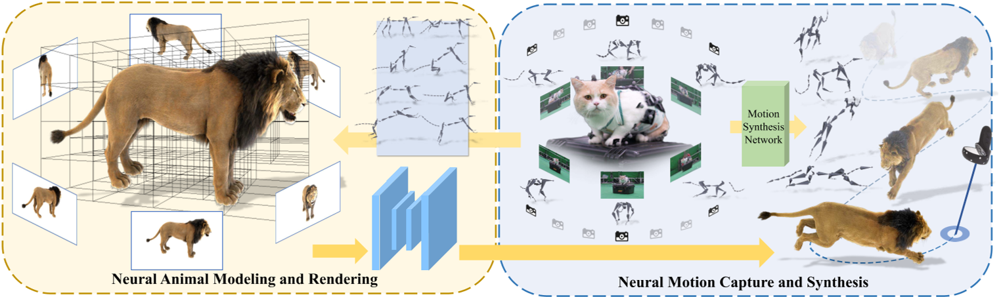
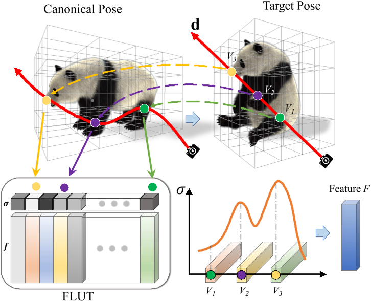

# Artemis: Articulated Neural Pets with Appearance and Motion Synthesis

## 核心问题是什么?

### 要解决的问题

计算机生成 (CGI) 毛茸茸的动物受到繁琐的离线渲染的限制，更不用说交互式运动控制了。

### 现有方法
### 本文方法

我们提出了 ARTEMIS，一种新颖的神经建模和渲染管道。  
ARTEMIS 通过 AppEarance 和 Motion SynthesIS 生成 ARTiculated 神经宠物，并宠物进行交互式的动作控制，实时动画和毛茸茸动物的真实感渲染。  
ARTEMIS 的核心是基于神经网络的生成式（NGI）动物引擎：  
- 采用基于八叉树的高效表示来进行动物动画和毛皮渲染。这样，动画就相当于基于显式骨骼扭曲的体素级变形。  
- 使用快速八叉树索引和高效的体积渲染方案来生成外观和密度特征图。
- 提出了一种新颖的着色网络，可以根据外观和密度特征图生成新颖姿势下的外观和不透明度的高保真细节。
- 使用动物运动捕捉方法，来重建由多视图 RGB 和 Vicon 相机阵列捕获的真实动物的骨骼运动。
- 将所有捕获的运动输入神经角色控制方案中，以生成具有运动风格的抽象控制信号。
- 将ARTEMIS集成到支持VR耳机的现有引擎中，提供前所未有的沉浸式体验，用户可以通过生动的动作和逼真的外观与各种虚拟动物亲密互动。

### 效果

1. 实时
2. NGI 动物的高度逼真渲染方面
3. 提供了与数字动物前所未见的日常沉浸式互动体验。

## 核心贡献是什么？

1.  **神经体积表示法（Neural Volume Representation）**：Artemis使用神经体积来表示动物，这种方法可以实时渲染动物的外观和毛发。

2.  **动态场景建模（Dynamic Scene Modeling）**：与传统的基于骨架和皮肤蒙皮技术不同，Artemis采用神经网络生成图像（NGI）来动态模拟动物的外观和运动。

3.  **实时渲染（Real-time Rendering）**：Artemis能够实现对动物模型的实时、逼真渲染，这对于虚拟现实（VR）等交互式应用至关重要。

4.  **运动合成（Motion Synthesis）**：系统利用局部运动相位（Local Motion Phase, LMP）技术，根据用户的控制信号生成动物的骨架运动。

5.  **多视角动作捕捉（Multi-view Motion Capture）**：论文中提出了一种结合多视角RGB摄像头和Vicon摄像头的动作捕捉方法，用于捕捉真实动物的运动。

6.  **优化方案（Optimization Scheme）**：为了从捕捉到的动作中重建动物的骨架运动，研究者提出了有效的优化方案。

7.  **虚拟现实集成（VR Integration）**：Artemis被集成到支持VR头显的现有引擎中，为用户提供了与虚拟动物亲密互动的沉浸式体验。

8.  **交互式控制（Interactive Control）**：用户可以通过简单的控制信号，如指向目的地，来引导虚拟动物移动，实现自然的运动控制。

9.  **数据集和资源分享（Dataset and Resource Sharing）**：论文中提到了动态毛发动物数据集（Dynamic Furry Animal Dataset），并承诺将这些资源分享给研究社区，以促进未来关于逼真动物建模的研究。

10. **系统性能和应用（System Performance and Applications）**：Artemis在多视角、多环境条件下均展现出高效和实用的性能，论文还讨论了其在动物数字化和保护、VR/AR、游戏和娱乐等领域的潜在应用。

11. **挑战和未来工作（Challenges and Future Work）**：论文讨论了当前系统的局限性，如对预定义骨架的依赖、未观察到的动物身体区域的外观伪影问题，以及在新环境中对光线变化的适应性问题，并提出了未来工作的方向。

## 大致方法是什么？

ARTEMIS 由两个核心组件组成。  
在第一个模块中，给定 CGI 动物资产的骨骼和蒙皮权重以及代表性姿势中相应的**多视角渲染 RGBA 图像**，构建基于动态八叉树的神经表示，以实现动态动物的显式骨骼动画和实时渲染，支持实时交互应用；  
在第二个模块中，我们构建了一个具有**多视角 RGB 和 VICON 相机**的混合动物运动捕捉系统，以重建逼真的 3D 骨骼姿势，该系统支持训练神经运动合成网络，使用户能够交互式地引导神经动物的运动。   
ARTEMIS系统进一步集成到现有的消费级VR耳机平台中，为神经生成的动物提供身临其境的VR体验。   

### Preliminary

#### 神经不透明辐射场

NeRF 用沿着光线的每个点的颜色和密度来表示场景，其中密度自然地反映了该点的不透明度。  
优点：可真实地表现毛发渲染。  
缺点：NeRF 生成的 alpha 有噪音且连续性较差。

#### ConvNeRF [Luo et al. 2021]

在特征空间中处理图像而不是直接在 RGB 颜色中处理图像。  
优点：解决噪声和不连续性问题。  
缺点：只能处理静态物体。

### Animatable Neural Volumes

目的：借助PlenOctree的想法，将神经不透明辐射场扩展到动态动物，且实现实时渲染。  

要解决的问题：  
1. 将不透明度特征存储在体积八叉树结构中，使得可以快速获取渲染特征。
2. 基于骨架的体积变形（类似于原始 CGI 模型的蒙皮权重），将规范帧与动画的实时帧连接起来。
3. 设计一个神经着色网络来处理动画对象建模，并采用有效的对抗训练方案来优化模型

#### 八叉树特征索引

由于是针对特定的CGI动物模型，其Mesh是已知的。  

1. 我们首先将 CGI 动物角色（例如老虎或狮子）转换为基于八叉树的表示。

遇到的问题：原始 CGI 模型包含非常详细的毛发，
- 如果直接转换为离散体素，可能会导致后续神经建模中出现强烈的混叠和严重错误。
- 如果去除毛皮并仅使用裸模型，则体素表示将与实际的显着偏差。

解决方法：用“dilated”体素表示。  
- 初始化一个统一的体积
- 以一组密集视角的渲染的 alpha matte 作为输入，利用dilated mask构造八叉树。  
生成的八叉树包含体素构成的array。

2. 基于这种体积表示，在每个体素处存储依赖于视图的特征𝑓。

分配一个称为特征查找表 (FLUT) 的数组 F 来存储特征和密度值，如原始 PlenOctree 中一样。  
对于体绘制过程中空间中给定的查询点，我们可以在常数时间内索引到 FLUT 中，查出该点的特征和密度。

类似于 PlenOctree，将不透明度特征𝑓建模为一组SH（球面谐波）系数。

$$
S(f,d) = \sum_{h=1}^H k_h^i Y_h(d)
$$

k为SH系数，Y为SH基。f为一组SH系数，d为视角。

#### 绑定与形变

对用八叉树描述的体素进行绑定（放置目标骨架S）和蒙皮（定义体素与骨骼的带动关系）。[Huang et al. 2020]

绑定：复用CGI的骨骼  
蒙皮：使用 CGI 模型提供的蒙皮网格将蒙皮权重应用于体素。即，通过混合最接近的顶点的权重生成每体素蒙皮权重。  
驱动：LBS

#### 动态体积渲染

1. 使用LBS驱动Oct Tree
2. 通过ray marching得到每个点的特征
3. 把特征组合成Feature F
4. 使用ConvNeRF进行渲染

#### Neural Shading

输入：视点处的体积光栅化为神经外观特征图 F 和不透明度 A。  
输出：将光栅化体积转换为具有类似经典着色器的相应不透明度贴图的彩色图像。

- 要解决的问题：  
为了保留毛发的高频细节，必须考虑最终渲染图像中的空间内容。但NeRF 和 PlenOctree 都没有考虑空间相关性，因为所有像素都是独立渲染的。  
- 解决方法：  
在 ConvNeRF 之后采用额外的 U-Net 架构进行图像渲染。  
优点：基于ray marching的采样策略可以实现全图像渲染。

神经着色网络𝐺包含两个encoder-decoder分支，分别用于 RGB 和 alpha 通道。 RGB 分支将 F 转换为具有丰富毛发细节的纹理图像 I𝑓。 alpha 分支细化粗略不透明度图 A 和 I𝑓 以形成超分辨率不透明度图 A。该过程通过显式利用 A 中编码的隐式几何信息来强制多视角一致性。

### 基于神经网络的动物运动合成

#### 动物动作捕捉

动作捕捉：尽管不同物种的四足动物具有相似的骨骼结构，但其形状和尺度却截然不同。**捕获适合所有类型四足动物的动作捕捉数据集是根本不可能的。**因此，先学习温顺的小型宠物的运动先验，并将先验转移到老虎和狼等大型动物身上。对于后者，使用多视图 RGB 球顶进一步提高了预测精度。

动物姿势估计：采用参数化 SMAL 动物姿势模型。从观察到的 2D 关节和轮廓中恢复 SMAL 参数 𝜃、𝜙、𝛾。

#### Motion Synthesis

## 训练与验证

优化对象：feature array, 参数G  
优化目标：各视角下的外观

### 数据集

动态毛茸茸动物（DFA）数据集：  
- 来自艺术家的建模。
- 含九种高质量的 CGI 动物，包括熊猫、狮子、猫等。
- 它们具有基于纤维/线的毛皮和骨骼
- 使用商业渲染引擎（例如 MAYA）将所有这些 CGI 动物角色渲染成各种代表性骨骼运动下的高质量多视图 1080 × 1080 RGBA 视频。具体来说，我们采用了 36 个摄像机视图，这些摄像机视图均匀地围绕捕获的动物排列成一个圆圈，每个动物的代表性姿势数量从 700 到 1000 个不等。

### loss

|loss|content|
|---|---|
|𝑟𝑔𝑏𝑎 在自由视角下恢复毛茸茸动物的外观和不透明度值|渲染图像与原始图像的L1 Loss，渲染alpha与真实alpha的L1 Loss|
|P 鼓励交叉视图一致性并保持时间一致性|渲染图像的VGG l层feature map与真实图像的VGG l层feature map|
|A 鼓励跨视图一致性|几何特征的L1 Loss|
|VRT 体素正则化项（VRT），强制deform后落在同一网格上的特征应具有相同的值，避免体素上的特征冲突|
|GAN 进一步提高皮毛高频外观的视觉质量|

### 训练策略

## 有效

## 缺陷

## 启发

## 遗留问题

## 参考材料

1. ARTEMIS 模型和动态毛茸茸动物数据集 https://haiminluo.github.io/publication/artemis/