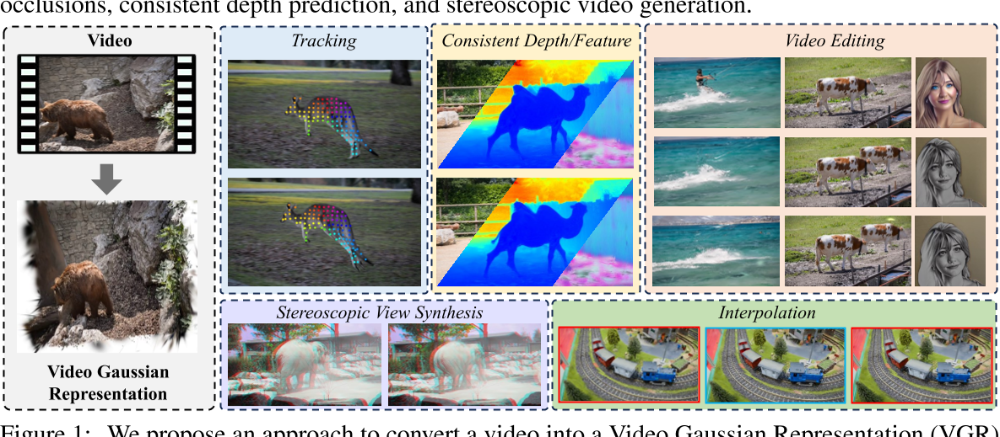
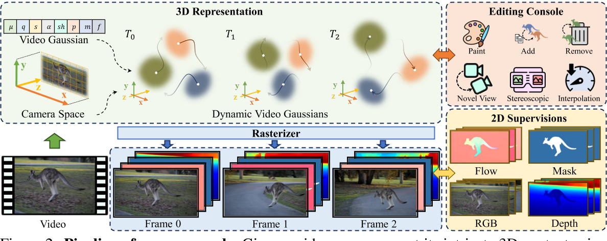

# Splatter a Video: Video Gaussian Representation for Versatile Processing

## 核心问题是什么?

视频表示是一个长期存在的问题，对于跟踪、深度预测、分割、视图合成和编辑等各种下游任务至关重要。

### 现有方法

当前的方法要么由于缺乏 3D 结构而难以对复杂运动进行建模，要么依赖于隐式 3D 表示而难以控制。

### 本文方法

引入了一种新颖的**显式 3D 表示——视频高斯表示** —— 它将视频嵌入到 3D 高斯中。即：使用显式高斯作为代理，对 3D 规范空间中的视频外观进行建模，并将每个高斯与视频运动的 3D 运动相关联。  
这种方法提供了**比分层图集或体积像素矩阵更内在和更明确的表示**。  
为了获得这样的表示，我们从基础模型中提取了 2D 先验，例如光流和深度，以规范这种不适定环境中的学习。

### 效果

在许多视频处理任务中有效，包括跟踪、一致的视频深度和特征细化、运动和外观编辑以及立体视频生成。

## 核心贡献是什么？

1.  **视频高斯表示（VGR）**：这是一种新的显式3D表示方法，它将视频嵌入到3D高斯空间中。与传统的2D或2.5D技术相比，VGR提供了一种更为内在和显式的表示形式。

2.  **3D规范化空间**：VGR在相机坐标空间中对视频进行建模，这避免了从3D到2D投影时丢失的3D信息，并且简化了动态建模的复杂性。

3.  **动态3D高斯**：每个高斯由中心位置、旋转四元数、比例、不透明度、球谐系数等属性定义，并且与时间依赖的3D运动属性相关联，以控制视频运动。

4.  **2D先验知识的应用**：为了解决从2D到3D映射的不适定问题，论文提出了利用从基础模型中提取的2D先验知识（如光流和深度估计）来规范学习过程。

5.  **多用途视频处理**：VGR证明了其在多个视频处理任务中的有效性，包括跟踪、一致性视频深度和特征细化、运动和外观编辑、立体视频生成等。

6.  **光流和深度的蒸馏**：通过将估计的光流和深度作为先验知识，论文提出了一种方法来规范学习过程，确保3D高斯的运动与实际观测到的2D运动一致。

7.  **3D运动的规范**：除了深度和光流的蒸馏，还采用了局部刚性规范来防止高斯通过非刚性运动过度拟合渲染目标。

8.  **优化方法**：论文详细介绍了如何通过结合颜色渲染损失、掩码损失以及可选的掩码损失来进行优化，以及如何通过自适应密度控制来初始化和调整高斯的密度。

## 大致方法是什么？

给定一个视频，在相机坐标空间中使用视频高斯表示其复杂的 3D 内容。并通过将它们与运动参数相关联，使视频高斯能够捕获视频动态。这些视频高斯由 RGB 图像帧和 2D 先验（例如光流、深度和标签掩模）进行监督。这种表示方式可以方便用户对视频执行各种编辑任务。

### Video Gaussian Representation

#### 相机坐标空间

使用相机坐标系（而不是世界坐标系）来建模视频的 3D 结构。因为使用相机坐标系可以避免估计相机姿态和相机运动，而是让相机运动与物体运动耦合。  

相机坐标系下，视频的宽度、高度和深度分别对应于 X、Y 和 Zax。

#### 视频高斯函数 

视频序列为 V = {I1, I2, ..., In}
对应的高斯表示为 G ={G1, G2, ..., Gm}，同时表示视频的外观和运动动态。  
每个高斯 G 表示包含：
- 基本外观属性： 位置 μ、旋转四元数 q、尺度 s、外观球谐 (SH) 系数 sh 和不透明度 α 。
- 来自 2D 基础模型的：动态属性 p、分割标签 m 和图像特征 f 

渲染：将其表示为 R(μ, q, s, α, x)，其中 x 表示要渲染的特定属性。渲染函数 R 遵循与原始高斯 Splatting 方法 [16] 中的颜色渲染相同的过程。

## 训练与验证

**实验验证**：通过在DAVIS数据集以及Omnimotion和CoDeF使用的视频上进行实验，论文展示了其方法在视频重建质量和下游视频处理任务方面的性能。

### 数据集

### loss

### 训练策略

## 有效

## 局限性

**局限性和未来工作**：尽管取得了令人满意的性能，但论文也指出了方法的一些局限性，例如对场景变化的敏感性以及对现有对应估计方法的依赖性，并提出了可能的改进方向。

## 启发

## 遗留问题

## 参考材料

1. 项目页面：https://sunyangtian.github.io/spatter_a_video_web/