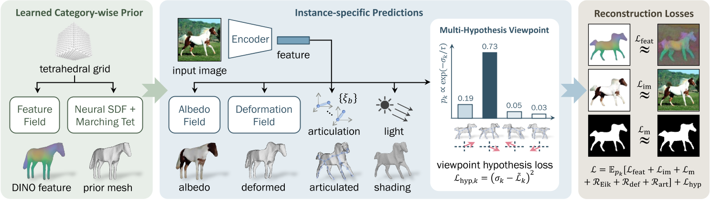

# MagicPony: Learning Articulated 3D Animals in the Wild

## 核心问题是什么?

在给定单个测试图像作为输入的情况下，预测马等有关节动物的 3D 形状、关节、视点、纹理和光照。

### 本文方法

我们提出了一种名为 MagicPony 的新方法，该方法仅从特定类别对象的野外单视图图像中学习，并且对变形拓扑的假设最少。  
其核心是**铰接形状**和**外观的隐式-显式表示**，结合了神经场和网格的优点。  
为了帮助模型理解物体的形状和姿势，我们提炼了已有的自监督**ViT**，并将其融合到 3D 模型中。  
为了克服视点估计中的局部最优，我们进一步引入了一种新的**视点采样**方案，无需额外的训练成本。 

### 效果

MagicPony 在这项具有挑战性的任务上表现优于之前的工作。尽管它仅在真实图像上进行训练，但在重建艺术方面表现出出色的泛化能力。

## 核心贡献是什么？

1.  **隐式-显式表示（Implicit-Explicit Representation）**：MagicPony结合了神经场和网格的优势，使用隐式表示来定义形状和外观，并通过Differentiable Marching Tetrahedra（DMTet）方法即时转换为显式网格，以便进行姿态调整和渲染。

2.  **自监督知识蒸馏**：为了帮助模型理解对象的形状和姿态，论文提出了一种机制，将现成的自监督视觉变换器（如DINO-ViT）捕获的知识融合到3D模型中。

3.  **多假设视角预测方案**：为了避免在视角估计中陷入局部最优，论文引入了一种新的视角采样方案，该方案在每次迭代中只采样单一假设，且几乎不需要额外的训练成本。

4.  **层次化形状表示**：从通用模板到具体实例的层次化形状表示方法，允许模型学习类别特定的模板形状，并预测实例特定的变形。

5.  **外观和着色分解**：将对象的外观分解为反照率和漫反射着色，假设了一种兰伯特照明模型，并使用可微分的延迟网格渲染技术。

6.  **训练目标和损失函数**：论文详细描述了训练过程中使用的损失函数，包括重建损失、特征损失、掩码损失、正则化项和视角假设损失。


## 大致方法是什么？



左：给定特定类别动物的单视图图像集合，我们的模型使用“隐式-显式”表示来学习特定于类别的先验形状，以及可以用于自监督特征渲染损失的特征字段。  
中：根据从训练图像中提取的特征，对先前的形状进行变形、铰接和着色。  
中右：为了克服视点预测中的局部最小值，我们引入了一种有效的方案，该方案可以探索多种假设，而基本上不需要额外的成本。  
右：除了fix Image Encoder之外，整个管道都经过端到端的重建损失训练。

### Implicit-Explicit 3D Shape Representation

#### 隐式

目的：用于优化出一个通用的Mesh。
方法：SDF。定义隐式Mesh函数为  

S = {x ∈ R3|s(x) = 0}

#### 显式

目的：方便后面的deformation  
方法：DMTet

#### 优化过程

1. 初始时，用SDF描述一个椭圆作为prior shape。    
2. 空间采样，使用DMTet生成prior Mesh的shape。  
3. 用下文的方法驱动调整和驱动prior mesh，得到deformed mesh。  
4. 通过deformed mesh与GT的重建Loss，优化SDF。  

得到此类别所有对象共用的template。  

```python
# 代码有删减
class PriorPredictor(nn.Module):
    def __init__(self, cfgs):
        super().__init__()
        self.netShape = DMTetGeometry(。。。)

    def forward(self, total_iter=None, is_training=True):
        # 得到prior template mesh
        prior_shape = self.netShape.getMesh(total_iter=total_iter, jitter_grid=is_training)
        return prior_shape, self.netDINO

class DMTetGeometry(torch.nn.Module):
    def get_sdf(self, pts=None, total_iter=0):
        if pts is None:
            pts = self.verts
        if self.symmetrize:
            xs, ys, zs = pts.unbind(-1)
            pts = torch.stack([xs.abs(), ys, zs], -1)  # mirror -x to +x
        sdf = self.mlp(pts)

        if self.init_sdf is None:
            pass
        elif type(self.init_sdf) in [float, int]:
            sdf = sdf + self.init_sdf
        elif self.init_sdf == 'sphere':
            init_radius = self.grid_scale * 0.25
            init_sdf = init_radius - pts.norm(dim=-1, keepdim=True)  # init sdf is a sphere centered at origin
            sdf = sdf + init_sdf
        elif self.init_sdf == 'ellipsoid':
            rxy = self.grid_scale * 0.15
            xs, ys, zs = pts.unbind(-1)
            init_sdf = rxy - torch.stack([xs, ys, zs/2], -1).norm(dim=-1, keepdim=True)  # init sdf is approximately an ellipsoid centered at origin
            sdf = sdf + init_sdf
        else:
            raise NotImplementedError

        return sdf

    def getMesh(self, material=None, total_iter=0, jitter_grid=True):
        # Run DM tet to get a base mesh，预置的一些空间中的点
        v_deformed = self.verts

        if jitter_grid and self.jitter_grid > 0:
            jitter = (torch.rand(1, device=v_deformed.device)*2-1) * self.jitter_grid * self.grid_scale
            v_deformed = v_deformed + jitter

        # 计算这些点的sdf
        self.current_sdf = self.get_sdf(v_deformed, total_iter=total_iter)
        # 根据预置点的sdf找出0表面，并生成Mesh
        verts, faces, uvs, uv_idx = self.marching_tets(v_deformed, self.current_sdf, self.indices)
        self.mesh_verts = verts
        return mesh.make_mesh(verts[None], faces[None], uvs[None], uv_idx[None], material)

```
### Articulated Shape Modelling and Prediction

|输入|输出|方法|
|---|---|---|
|image|Image Mask|PointRend|
|image, mask|a set of key and output tokens|
|local keys token <br> \\(\Phi_k \in R^{D\times H_p \times W_p}\\)代表 deformation<br> local outputs token \\(\Phi_o \in R^{D\times H_p \times W_p}\\)代表appreance|DINO-ViT，包含prepare层，ViT blocks层，final层|
|local keys token Φk|global keys token φk|small convolutional network|
|local output token Φo|global output token φo|small convolutional network|
|template shape \\(V_{pr,i}\\)<br>global keys token φk|mesh displacement ∆Vi|CoordMLP，因为每一sdf生成的Mesh的顶点数和顶点顺序都是不确定的，因此不能使用普通的MLP<br>许多对象是双边对称的，因此通过镜像来强制先前的 Vpr 和 ∆V 对称|
| \\(V_{pr,i}\\)<br>∆Vi|Vins|
|ξ1，Vpr|bone在图像上的像素 ub|根据ξ1把每个rest状态下的bone投影到图像上|
|patch key feature map Φk(ub)<br>ub|local feature|从投影像素位置 ub 处的 Φk(ub) 中采样局部特征。|
|image features Φk and φk<br>bone position 3D<br>bone position 2D|local rotation ξ2:B|The viewpoint ξ1 ∈ SE(3) is predicted separately|
|Vins<br>动作参数ξ<br>a set of rest-pose joint locations Jb（启发式方法）<br>skinning weights（relative proximity to each bone）|Vi|LBS|

```python
def forward(self, images=None, prior_shape=None, epoch=None, total_iter=None, is_training=True):
    batch_size, num_frames = images.shape[:2]
    # 从图像生成a set of key and output tokens，使用一个ViTEncoder
    # patch_out：local outputs token
    # patch_key：local key token
    # feat_out：global outputs token
    # feat_key：global key token
    feat_out, feat_key, patch_out, patch_key = self.forward_encoder(images)  # first two dimensions are collapsed N=(B*F)
    shape = prior_shape
    texture = self.netTexture

    # 预测root rotation，这一部分会在下文中展开
    poses_raw = self.forward_pose(patch_out, patch_key)
    pose_raw, pose, multi_hypothesis_aux = sample_pose_hypothesis_from_quad_predictions(poses_raw, total_iter, rot_temp_scalar=self.rot_temp_scalar, num_hypos=self.num_pose_hypos, naive_probs_iter=self.naive_probs_iter, best_pose_start_iter=self.best_pose_start_iter, random_sample=is_training)
    # root rotation不体现在bone 0的rotation上，而是体现在相机的位姿上
    mvp, w2c, campos = self.get_camera_extrinsics_from_pose(pose)

    deformation = None
    if self.enable_deform and epoch in self.deform_epochs:
        # 根据feature key计算这个图像上的shape offset
        # deformation：shape offset
        # shape: prior shape + shape offset
        shape, deformation = self.forward_deformation(shape, feat_key)
    
    arti_params, articulation_aux = None, {}
    if self.enable_articulation and epoch in self.articulation_epochs:
        # 根据feature key计算关节旋转，并使用LBS得到驱动后的mesh
        # 每次都会根据mesh重新计算bone position，使用启发式方法
        # shape：驱动后的mesh
        # arti_params：bone rotation，轴角形式
        shape, arti_params, articulation_aux = self.forward_articulation(shape, feat_key, patch_key, mvp, w2c, batch_size, num_frames, epoch)
    
    light = self.netLight if self.enable_lighting else None

    aux = multi_hypothesis_aux
    aux.update(articulation_aux)

    # shape：根据图像生成的特定体型特定动作下的mesh
    # pose_raw：root rotation
    # pose：root rotation in mat
    # mvp：3D->2D投影变换矩阵
    # w2c：world->camera变换矩阵
    # campos：camera position
    # feat_out：global outputs feature，用于记录目标的外观
    # deformation：shape offset
    # arti_params：bone rotation in angle-axis
    # aux：root rotation sample机制
    return shape, pose_raw, pose, mvp, w2c, campos, texture, feat_out, deformation, arti_params, light, aux
```

### Appearance and Shading

|输入|输出|方法|
|---|---|---|
|x, global output token φo|albedo|MLP|
|global output token φo|主光源方向l<br>环境和漫射强度ks, kd|MLP|
|3D coordinates Mesh V<br>all pixels u|V中投影到u上的顶点x(u)||
|x(u)，fa|像素u对应的颜色 a|
|ks, kd, l, n, 像素u对应的颜色 a|像素u最终的颜色|
|ks, kd, l, n, 像素u对应的颜色 a|像素u的MASK|

> 这一段代码没有看懂

### Viewpoint Prediction

我们提供了一种稳健且高效的方法，该方法利用多假设预测管道中的自监督对应关系。

**这一段没看懂，参考Neural Feature Fusion Fields: 3D Distillation of Self-Supervised 2D Image Representations**

难点：学习对象视点的一个主要挑战是重建目标中存在多个局部最优。  
解决方法：我们提出了一种统计探索多个观点的方案，但在每次迭代时仅采样一个观点，因此没有额外成本。  

|输入|输出|方法|
|---|---|---|
|global keys token φk|4个假设的viewpoint rotation<br>score σk，第k个假设的可能性|Encoder32|

学习 σk 的简单方法是对多个假设进行采样并比较它们的重建损失以确定哪一个更好。然而，这很昂贵，因为它需要使用所有假设来渲染模型。相反，我们建议为每次训练迭代采样一个假设，并通过最小化目标来简单地训练 σk 来预测预期重建损失 Lk

```python
# poses_raw[:,:-3]：通过self.netPose预测出的num_hypos个假设的参数
# 每个假设的参数包含4维：概率*1、角度*3
# poses_raw[:,-3:]：预测出的translation
# 根据每个假设的概率进行一些计算，得出这个迭代的rot
def sample_pose_hypothesis_from_quad_predictions(poses_raw, total_iter, rot_temp_scalar=1., num_hypos=4, naive_probs_iter=2000, best_pose_start_iter=6000, random_sample=True):
    rots_pred = poses_raw[..., :num_hypos*4].view(-1, num_hypos, 4)  # NxKx4
    N = len(rots_pred)
    rots_logits = rots_pred[..., 0]  # Nx4
    rots_pred = rots_pred[..., 1:4]
    trans_pred = poses_raw[..., -3:]
    temp = 1 / np.clip(total_iter / 1000 / rot_temp_scalar, 1., 100.)

    rots_probs = torch.nn.functional.softmax(-rots_logits / temp, dim=1)  # NxK
    naive_probs = torch.ones(num_hypos).to(rots_logits.device)
    naive_probs = naive_probs / naive_probs.sum()
    naive_probs_weight = np.clip(1 - (total_iter - naive_probs_iter) / 2000, 0, 1)
    rots_probs = naive_probs.view(1, num_hypos) * naive_probs_weight + rots_probs * (1 - naive_probs_weight)
    best_rot_idx = torch.argmax(rots_probs, dim=1)  # N

    if random_sample:
        rand_rot_idx = torch.randperm(N, device=poses_raw.device) % num_hypos  # N
        best_flag = (torch.randperm(N, device=poses_raw.device) / N < np.clip((total_iter - best_pose_start_iter)/2000, 0, 0.8)).long()
        rand_flag = 1 - best_flag
        rot_idx = best_rot_idx * best_flag + rand_rot_idx * (1 - best_flag)
    else:
        rand_flag = torch.zeros_like(best_rot_idx)
        rot_idx = best_rot_idx
    rot_pred = torch.gather(rots_pred, 1, rot_idx[:, None, None].expand(-1, 1, 3))[:, 0]  # Nx3
    pose_raw = torch.cat([rot_pred, trans_pred], -1)
    rot_prob = torch.gather(rots_probs, 1, rot_idx[:, None].expand(-1, 1))[:, 0]  # N
    rot_logit = torch.gather(rots_logits, 1, rot_idx[:, None].expand(-1, 1))[:, 0]  # N

    rot_mat = lookat_forward_to_rot_matrix(rot_pred, up=[0, 1, 0])
    pose = torch.cat([rot_mat.view(N, -1), pose_raw[:, 3:]], -1)  # flattened to Nx12
    pose_aux = {
        'rot_idx': rot_idx,
        'rot_prob': rot_prob,
        'rot_logit': rot_logit,
        'rots_probs': rots_probs,
        'rand_pose_flag': rand_flag
    }
    return pose_raw, pose, pose_aux
```

## 训练与验证

### 数据集

DOVE  
Weizmann Horse Database [4], PASCAL [10] and Horse-10 Dataset  
Microsoft COCO Dataset  
CUB  

### loss

|loss name|优化目的|计算方法|
|---|---|---|
|im|图像重建|仅计算前景区域，L1 Loss|
|m|mask重建|L2 Loss|
|feat|dino feature重建，dino是绑在每个mesh顶点的的属性，且dino属性只于species type有关，与特定图像无关|仅计算前景区域，L2 loss|
|Eik|正则化项，约束s被学习成一个SDF函数|Eikonal regulariser|
|def|正则化项，约束shape offset不要太大|L2 Loss|
|art|正则化项，约束旋转量不要太大|
|hpy|正则化项，好像是一个loss截断器，没看懂？|

### 训练策略

1. 首先对视点假设k进行采样，计算重建损失  
2. 然后，将正则化项和视点假设损失相加，得到最终目标.  
每次梯度评估仅采用一个视点样本 k。为了进一步提高采样效率，我们根据学习到的概率分布pk4对视点进行采样：为了提高训练效率，我们在 80% 的时间对视点 k* = argmaxk pk 进行采样，并在 20% 的时间均匀随机采样。

## 有效

7.  **广泛的实验验证**：在动物类别上进行了广泛的实验，包括马、长颈鹿、斑马、奶牛和鸟类，并与先前的工作进行了定性和定量比较。

8.  **少监督学习**：MagicPony在几乎没有关于变形拓扑的假设下，仅使用对象的2D分割掩码和3D骨架拓扑的描述进行训练，展示了在少监督情况下学习3D模型的能力。

9.  **泛化能力**：尽管MagicPony仅在真实图像上训练，但它展示了对绘画和抽象绘画的出色泛化能力。

## 局限性

如果以单张照片作为输出，虽然会对目标角色先生成可驱动的3D模型，可以通过驱动3D模型再渲染得到新动作的生成图像，但是缺少3D模型的驱动数据，还需要一种方法生成适配角色的动作。  

## 启发

先通过大量数据得到目标角色所属种类的3D范式。有了这个3D范式作为先验，就可以根据单张图像生成这个种类的3D模型。

## 遗留问题

## 参考材料

1. 项目页面: https://3dmagicpony.github.io/