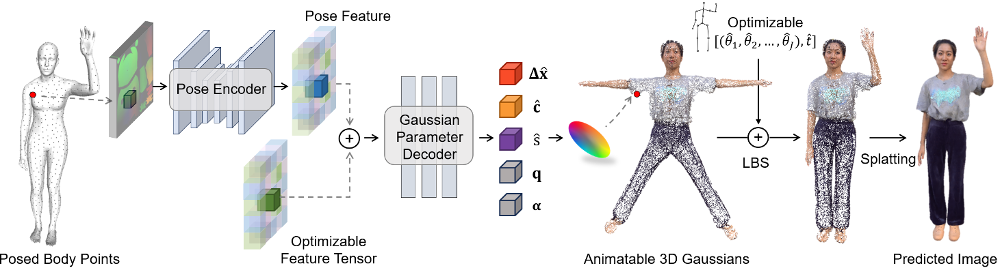

# GaussianAvatar: Towards Realistic Human Avatar Modeling from a Single Video via Animatable 3D Gaussians

## 核心问题是什么?

### 目的

输入：单个视频
输出：具有动态 3D 外观的逼真人类头像
目的：实现自由视角渲染，生成逼真人类头像动画

### 本文方法

1. 引入可动画化的 3D 高斯函数来明确代表各种姿势和服装风格的人类。这种明确且可动画化的表示可以更有效、更一致地融合 2D 观察中的 3D 外观。
2. 进一步增强了表示的动态属性，以支持依赖姿势的外观建模，其中动态外观网络和可优化的特征张量被设计为学习运动到外观的映射。
3. 通过利用可微运动条件，在头像建模过程中对运动和外观进行联合优化，这有助于解决单目设置中运动估计不准确的长期存在的问题。 

### 效果

GaussianAvatar的功效在公共数据集和我们收集的数据集上都得到了验证，证明了其在外观质量和渲染效率方面的优越性能。

## 核心贡献是什么？

1.  **3D高斯表示法（3D Gaussians）**：论文提出了使用3D高斯来显式表示不同姿势和服装样式下的人体。这种方法可以有效地从2D观察中融合3D外观。

2.  **动态属性建模**：为了支持不同姿势下的动态外观建模，论文设计了一个动态外观网络和可优化的特征张量，以学习运动到外观的映射。

3.  **运动和外观的联合优化**：利用可微分的运动条件，论文的方法可以在化身建模过程中同时优化运动和外观，有助于解决单目设置中不准确运动估计的长期问题。

4.  **实现细节**：论文详细介绍了如何通过3D高斯表示法来重建具有动态外观的人体化身，包括如何将3D高斯与SMPL或SMPL-X模型集成，以及如何通过动态外观网络预测3D高斯的动态属性。

5.  **训练策略**：论文提出了一个两阶段的训练策略，首先在不包含姿势依赖信息的情况下训练网络，然后在第二阶段整合姿势特征编码。

## 大致方法是什么？

给定当前帧上拟合的 SMPL 模型，我们对其表面上的点进行采样，并将它们的位置记录在 UV 位置图 I 上，然后将其传递给姿势编码器以获得姿势特征。可优化的特征张量与姿势特征进行像素对齐，并学会捕捉人类的粗糙外观。然后将两个对齐的特征张量输入到高斯参数解码器中，该解码器预测每个点的偏移量 Δˆx、颜色 ˆc 和尺度 ˆs。这些预测与固定旋转 q 和不透明度 α 一起构成了规范空间中的可动画化 3D 高斯。

### Animatable 3D Gaussians 可驱动的3D高斯

先预测高斯属性，然后用LBS驱动这个高斯球，渲染驱动后的高斯球。  
Mesh以SMPL为template，且Mesh上的每个顶点对应一个高斯球，因此LBS的蒙皮绑定直接复用SMPL的。  

### 动态 3D 高斯属性估计

1. 根据pose预测高斯属性，可得到与pose相关的动态高斯属性。  
2. 属性pose feature，还有feature tensor，用于描述global appreance，防止对动作过拟合。  
3. pose feature通过UV map（H×W×3，其中每个有效像素存储姿势身体表面上一个点的位置（x，y，z）），描述2D人体。  
4. 用各向同性（旋转和缩放均为单位值）的高斯球代替各向异性的高斯球，防止陷入特定视角的local optima(训练数据的视角数据不均等)。  
5. 固定alpha=1，以获得更准确的高高斯球位置。  

### 动作与外观联合优化

由于对人体姿势的不精确估计，运动空间中的 3D 高斯分布不准确，可能导致渲染结果不令人满意。  
因此同时优化动作和高斯属性。  

## 训练与验证

第一阶段：仅输入feature tensor F，使用Encoder & Decoder解出高斯属性，用SMPL拟合所得到的动作驱动高斯，重建图像  
第二阶段：使用pose encoder和同时作为输入，decoder出高斯属性，用SMPL拟合所得到的动作驱动高斯，重建图像  

|Loss|优化目的|方法|阶段|
|---|---|---|---|
|rgb|图像重建|L1 Loss|1,2
|ssim||SSIM Loss|1,2
|lpips||LPIPS Loss|1,2|
|f|feature map|L2 Loss|1
|offset||L2|1,2
|scale||L2|1,2
|p|limit the pose space|L2|2

### 数据集

### loss

### 训练策略

## 有效

6.  **实验验证**：通过在公共数据集和收集的数据集上的实验，论文验证了GaussianAvatar在外观质量和渲染效率方面的优越性能。

7.  **代码和数据集的可用性**：论文提供了代码和数据集的链接，这有助于其他研究人员复现结果并在此基础上进行进一步的研究。

8.  **潜在的社会效益和限制**：论文讨论了该技术可能的社会效益，例如在虚拟现实、增强现实、游戏和电影行业中的应用，同时也指出了其局限性，如在处理不准确前景分割和松散服装（如连衣裙）时可能遇到的挑战。

9.  **相关工作**：论文还回顾了利用神经渲染技术进行人体重建的相关研究，以及从单目视频中重建人体的现有方法。

## 局限性

## 启发

## 遗留问题

## 参考材料

1. 代码和数据集：https://huliangxiao.github.io/GaussianAvatar