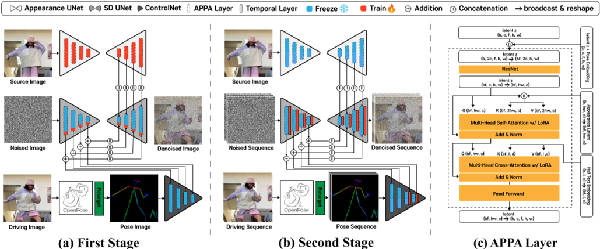
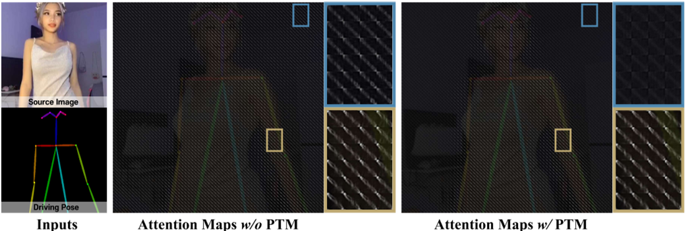

# TCAN: Animating Human Images with Temporally Consistent Pose Guidance using Diffusion Models

|缩写|英文|中文|
|---|---|---|
|APPA|APpearance-Pose Adaptation layer|
|PTM|Pose-driven Temperature Map|

2024，开源       

## 核心问题是什么?

基于diffusion model的pose驱动人体图像的视频生成，能够生成逼真的人体视频，但在时间一致性和对pose控制信号的鲁棒性方面仍然存在挑战。

### 本文方法

我们提出了 TCAN，一种姿势驱动的人体图像动画合成方法，它对错误姿势具有鲁棒性，并且随着时间的推移保持一致。  
1. 利用预先训练的 ControlNet，但不进行微调，利用其“文本+动作 -> 图像”的能力。
2. 保持 ControlNet 冻结，将 LoRA 适配到 UNet 层中，使网络能够在姿势空间和外观空间之间的对齐。
3. 通过向 ControlNet 引入额外的时间层，增强了针对异常姿态的鲁棒性。
4. 通过分析时间轴上的注意力图，设计了一种利用姿势信息的新型温度图，从而实现更静态的背景。

### 效果

大量实验表明，所提出的方法可以在包含各种姿势（例如《赤壁》）的视频合成任务中取得有希望的结果。

## 核心贡献是什么？

1.  **时间一致性**：TCAN专注于生成在时间上连贯的动画，即使输入的姿势检测有误差，也能保持动画的稳定性。

2.  **使用预训练的ControlNet**：与以往方法不同，TCAN使用预训练的ControlNet而不进行微调，利用其从大量姿势-图像-标题对中获得的知识。

3.  **LoRA适应**：为了在保持ControlNet冻结的同时对齐姿势和外观特征，TCAN采用了LoRA（Low-Rank Adaptation）适应UNet层。

4.  **时间层的引入**：通过在ControlNet中引入额外的时间层，增强了对姿势检测器异常值的鲁棒性。

5.  **注意力图分析**：通过分析时间轴上的注意力图，设计了一种利用姿势信息的新颖温度图，允许更静态的背景。

6.  **扩展到不同领域**：TCAN不仅在TikTok数据集上训练，还能够泛化到未见过的领域，如动画角色。

7.  **姿势重定向方法**：提出了一种姿势重定向方法，以适应源图像中的对象与实际人体不同的身体比例。

## 大致方法是什么？

Bose Model 为SD。   
方法涉及两阶段训练策略。我们从训练视频中随机选择两个图像，分别用作source图像和driving图像。  
第一阶段是以**多张**image为条件的图像生成任务，appreance UNet 和 APPA 层在source图像上进行condition训练，同时 ControlNet 被freeze。多张是指一张 driving pose 和一张 source image.    
在第二阶段，训练 UNet 和 ControlNet 中的时间层。    
LoRA 只加在ControlNet上，时序层在 UNet 和 ControlNet 上都有。   

|输入|输出|方法|
|---|---|---|
|driving frame|pose information|OpenPose|
|pose information|pose image| |
|pose image noise|encoder feature z|UNet Encoder with ControlNet|
|reference image|intermediate feature maps of the appearance za|appearance UNet|
|encoder feature z appearance information za|denoised image|UNet Decoder with attention |

pose 以 ControlNet 形式注入，reference 以 UNet Decoder Cross-attention 形式注入。   

### reference图像注入

#### z（encoder feature）与za（appearance information）结合

以attention的方式结合z和za，仅应用于UNet Decoder部分

分析原因：appearance Za 与此包含 pose information 的 Z misalignment.    

#### APPA层

在UNet Decoder attention层中引入APPA layer（类似LoRA）  
没有APPA的UNet能生成与driving pose相似的动作，但不是保持reference image中的外观。     
引入APPA层有以下三个作用：     
1. 解决frozen ControlNet引入的artifacts      
2. 防止对training domain过拟合     
3. appearance与pose解耦     

相当于是对 ControlNet 的微调，只是用 LoRA 代替全参微调。  

### 对错误动作的鲁棒性

在UNet的所有层后面加入时序层，仅在第二阶段的训练启用时序层。  

Temporal层用于解决pose不正确引入的artifacts。pose模块（ControlNet）的实现类似AnimateDiff。  

### 背景闪烁问题

引入Pose-driven Temperature Map。  
第二阶段训练完成后，把 Temperature attention layer 的 attention map 可视化。   

把image resize到和attention map相同的大小，发现前景像素对应的attention的对角值更高。  

**与前景相比，背景在时间轴上的焦点往往不太具体**，因此可以通过attention map，仅对背景部分进行平滑。  

|输入|输出|方法|
|---|---|---|
|pose image|binary mask B|画了骨架的地方标记为1，否则为0|
|binary mask B|distance map D|计算每个像素到离它最近的骨骼的距离|
|distance map D|PTM \\(\\tau \\)|\\(\\tau  = \tau * D + 1\\) PTM代表attention的temperature|
|PTM \\(\tau  \\)|resized PTM \\(\tau \\)|把PTM \\(\tau  \\) resize到与attention map相同的大小|

以以下方式把PTM \\(\tau  \\) 引入到UNet attention layer中：离骨架距离远（被认为是背景）&#x2192; D 大 &#x2192;\\(\tau \\)大 &#x2192; attention score 小 &#x2192; 与时间相关性小 &#x2192; 稳定    

attention map 中的值比较平均，说明Output 相当于input 的均值。    
作者期望背景表现为这种效果。    
attention map 的值比较大，说明在这个位置看比较强的相关性。           
attention map 中比较大的值出现在对角线上，说明是顺序相关的。    
attention map 中比较大的值没有明显规律，说明相关没有明显规律。  
attention map 中没有较大值，说明没有明显相关性。   

attention map 是\\(QK^T\\) 矩阵，在时序层，Q.shape=K.shape=(bxwxh)xfxc,   
因此，attention map.shape=(bxwxh)xfxf=bxwxh xfxf   
可视化后，每个像素的内容fxf代表Q和k P 这个像素在时间上相关性。    
推断时，把推断序列切成有重叠的clip，在一个step 中推断所有clip的噪声，把overlap 的噪声average,得到的噪声进入下一个step.    

### 长视频推断策略

MultiDiffusion [2] along the temporal axis

## 训练

### 训练策略

|阶段|freeze|trainable|特有模块|
|---|---|---|---|
|第一阶段|denoising UNet with SD1.5 OpenPose ControlNet|appreance UNet with Realistic Vision LoRA layer in APPA|无|
|第二阶段|denoising UNet with SD1.5 OpenPose ControlNet|temporal layer in denoising UNet temporal layer in ControlNet|temporal layer in denoising UNet temporal layer in ControlNet|

### 数据集

### loss

同Stable Diffusion Model
### 训练策略

## 实验与结论   

0      
0      
0      
0      
0      
0      
0      
0      
0      
0      
0      
0      
0      
0      
0      
0      
0      
0      
0      
0      
0      
0      
0      
0      
0      
0      
0      
0      
0      
0      
0      
0      
0      
0      
0      
0      
0      
0      
0      
0      
0      
0      
0      
0      
0      
0      
0      
0      

0      
0      
0      
0      
0      
0      
0      
0      
0      
0      
0      
0      
0      
0      
0      
0      
0      
0      
0      
0      
0      
0      
0      
0      
0      
0      
0      
0      
0      
0      
0      
0      
0      
0      
0      
0      

## 有效

8.  **用户研究**：进行了用户研究来评估TCAN在不同数据集上的表现，包括动画角色，结果显示TCAN在保持运动和身份、背景、闪烁和整体偏好方面均优于现有技术。

9.  **实验结果**：TCAN在多个指标上展示了优越的性能，包括L1损失、结构相似性（SSIM）、感知损失（LPIPS）、Fréchet距离（FID）和视频质量指标（FID-VID和FVD）。

## 局限性

## 启发

## 遗留问题

TCAN（Temporally Consistent Human Image Animation）技术在实际应用中可能面临以下挑战和限制：

1.  **姿势检测器的准确性**：TCAN依赖于姿势检测器来提供输入姿势序列。如果姿势检测器出现误差，可能会影响生成动画的质量和时间一致性。

2.  **数据集的多样性**：TCAN在特定数据集（如TikTok数据集）上训练时表现良好，但在处理与训练数据分布显著不同的数据时，可能需要额外的调整或训练。

3.  **计算资源**：高质量的图像和视频生成通常需要大量的计算资源。TCAN作为一种基于扩散模型的技术，可能在实际部署时面临计算能力和效率的挑战。

4.  **泛化能力**：尽管TCAN旨在提高对未知领域的泛化能力，但在面对与训练数据差异较大的新领域时，其性能可能会下降。

5.  **模型的复杂性**：TCAN结合了多种技术，如ControlNet、LoRA和时间层，这增加了模型的复杂性，可能需要专业知识来维护和更新。

6.  **过拟合风险**：在特定领域内训练时，模型可能会过拟合到该领域的特定特征，从而降低其在其他领域的适用性。

7.  **伦理和隐私问题**：生成逼真的人类动画可能引发伦理和隐私问题，尤其是在创建deepfakes或未经授权使用个人图像时。

8.  **内容的可控性**：虽然TCAN提供了一定程度的控制能力，但在生成特定风格或满足特定条件的内容方面可能仍有限制。

9.  **实时性能**：在需要实时生成动画的应用场景中，TCAN的处理速度和响应时间可能是一个考虑因素。

10. **模型的可解释性**：深度学习模型通常被认为是“黑箱”，TCAN模型的决策过程可能不够透明，这可能限制了其在需要高度可解释性的应用中的使用。

11. **对抗性攻击的脆弱性**：像其他基于深度学习的模型一样，TCAN可能对精心设计的对抗性攻击敏感，这可能需要额外的防御措施。

12. **长期视频生成的挑战**：由于内存限制，TCAN可能难以一次性生成长期视频。虽然可以通过多扩散方法来解决这个问题，但这可能会影响视频的整体一致性。

10. **潜在的滥用问题**：论文最后指出，尽管TCAN在动画生成方面取得了进展，但这种技术可能被滥用于生成伪造视频（deepfakes），因此需要进一步研究验证模型以检测生成模型的痕迹。

这些挑战和限制表明，尽管TCAN在技术上具有创新性，但在将其应用于实际问题之前，需要仔细考虑和解决这些潜在的问题。

## 参考材料

1. 项目页面：https://eccv2024tcan.github.io/