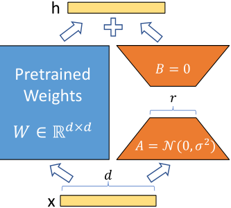
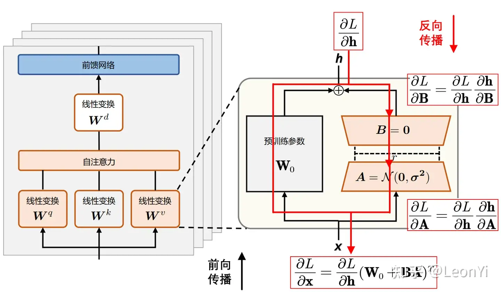
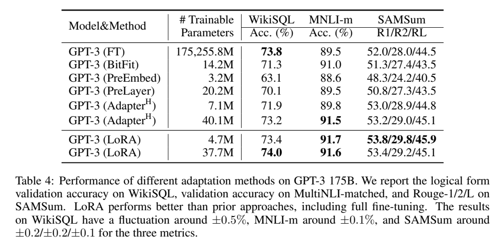
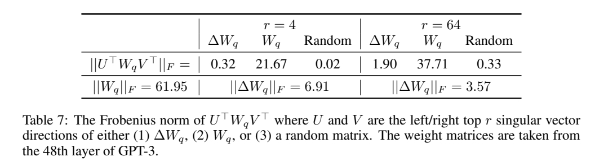

# LORA: LOW-RANK ADAPTATION OF LARGE LAN-GUAGE MODEL

Microsoft，开源 

## 核心问题是什么?

基于预训练的大模型进行finetune时，重新训练所有模型参数变得不太可行。

### 现有方法及存在的问题

#### 适配器层引入推理延迟

1. 适配器会引入额外的计算。  
这不是关键问题，因为适配器层被设计为具有很少的参数（有时<原始模型的 1%），并且具有小的瓶颈尺寸。  

2. 适配器层必须按顺序处理。    
大型神经网络依赖硬件并行性来保持低延迟。Adapter 对在线推理设置产生了影响，其中批量大小通常小至 1。在没有模型并行性的一般场景中，例如在单个 GPU 上的 GPT-2推理，**使用适配器时延迟会显着增加，即使瓶颈维度非常小**。

[&#x2753;] 为什么 Adapter 导致在线推理的 batchsize 为1？

#### 直接优化提示很难

[&#x2753;] 这一段没看懂

### 本文方法

我们提出了Low Rank Adapter（LoRA），它冻结了预训练的模型权重，并将可训练的rank分解矩阵注入到 Transformer 架构的每一层中，大大减少了下游任务的可训练参数的数量。与使用 Adam 微调的 GPT-3 175B 相比，LoRA 可以将可训练参数数量减少 10,000 倍，GPU 内存需求减少 3 倍。 


### 效果

LoRA 在 RoBERTa、DeBERTa、GPT-2 和 GPT-3 上的模型质量上表现与微调相当或更好，尽管可训练参数较少、训练吞吐量较高，并且与适配器不同，没有额外的推理延迟。

## 核心贡献是什么？

1.  **Low Rank Adapter（LoRA）**：这是一种新技术，通过在Transformer架构的每一层中注入可训练的低秩分解矩阵来调整预训练模型的权重，而不是重新训练所有模型参数。

2.  **易于实现和集成**：论文提供了一个便于与PyTorch模型集成的LoRA包，以及RoBERTa、DeBERTa和GPT-2的实现和模型检查点。

3.  **经验性研究**：论文还提供了对语言模型适应中的秩不足进行实证研究，这有助于理解LoRA的有效性。


## 大致方法是什么？

### LoRA

神经网络包含许多执行矩阵乘法的密集层。这些层中的权重矩阵通常具有满秩。  
我们假设**在adaption过程中权重的更新具有较低的“内在维度”。**  
定义预训练的权重矩阵为 \\(W0 ∈ R^{d×k}\\)，其更新过程为：W0 + ΔW  

我们通过用低秩分解，将权重更新过程描述为： W0 + ΔW = W0 + BA，其中 \\(B ∈ R^{d×r} , A ∈ R^{r×k}\\) ，并且秩 \\(r \ll min(d, k)\\)。  



```python
self.lora_A = nn.Parameter(self.weight.new_zeros((r, num_embeddings)))
self.lora_B = nn.Parameter(self.weight.new_zeros((embedding_dim, r)))
```

请注意，W0 和 ΔW = BA 都与相同的输入相乘，并且它们各自的输出向量按坐标求和。

### LoRA应用到Transformer

理论上，LoRA可以应用于网络中的任意密集矩阵上，但本文仅将LoRA应用于attention层。  
对于特定adaption，使用特定的BA。换一种adaption则换一组BA。不需要adaption则将BA去掉。  

### 全参微调   

极限情况下（所有层加 LoRA，且秩与原参数相同），LoRA 相当于全参微调。    
Adapter 相当于MLP   
prefix-based methods 收敛到“不能接收长输入”的模型。    


## 训练


## 训练与验证

### 训练策略

#### 参数冻结

训练期间，W0 被冻结，不接收梯度更新，而 A 和 B 包含可训练参数。

#### 参数初始化

对 A 使用随机高斯初始化，对 B 使用零，因此 ΔW = BA 在训练开始时为零，且梯度不为0。  

```python
nn.init.zeros_(self.lora_A)
nn.init.normal_(self.lora_B)
```


实际实现时，\\(\Delta \mathbf{W} = \mathbf{B}\mathbf{A}\\)会乘以系数\\(\frac{\alpha}{r}\\)与原始预训练权重合并\\(\mathbf{W}_{0}\\)，\\(\alpha\\)是一个超参：

$$
\mathbf{h} = (\mathbf{W}_{0} + \frac{\alpha}{r} \Delta \mathbf{W})\mathbf{x}
$$

```python
def __init__(self, ...):
    ...
    self.scaling = self.lora_alpha / self.r
    ...

def train(self, ...):
    ...
    self.weight.data += (self.lora_B @ self.lora_A).transpose(0, 1) * self.scaling
    ...
```

#### 调参

超参\\(\alpha\\)和\\(r\\)实现了训练强度和注入强度的解耦。    
只需训练一种训练强度\\(r\\)，通过调整\\(\alpha\\)，就可以得到不同注入强度的效果。    

直观来看，系数\\(\frac{\alpha}{r}\\)决定了在下游任务上微调得到的LoRA低秩适应的权重矩阵\\(\mathbf{B}\mathbf{A}\\)占最终模型参数的比例。

给定一个或多个下游任务数据，进行LoRA微调：

系数\\(\frac{\alpha}{r}\\)越大，LoRA微调权重的影响就越大，在下游任务上越容易过拟合
系数\\(\frac{\alpha}{r}\\)越小，LoRA微调权重的影响就越小（微调的效果不明显，原始模型参数受到的影响也较少）
一般来说，在给定任务上LoRA微调，让\\({\alpha}\\)为\\(r\\)的2倍数。（太大学过头了，太小学不动。）

根据经验，LoRA训练大概很难注入新的知识，更多是修改LLM的指令尊随的能力，例如输出风格和格式。原始的LLM能力，是在预训练是获得的（取决于参数量、数据规模X数据质量）。

LoRA的秩\\(r\\)决定，LoRA的低秩近似矩阵的拟合能力，实际任务需要调参挑选合适的秩\\(r\\)维度。系数\\(\frac{\alpha}{r}\\)中\\(\alpha\\)决定新老权重的占比。


### 数据集

### loss

### 训练策略

## 实验与结论

在三种预训练模型上使用不同方式微调     

1. FT/BitFit：不使用插件，全部微调或部分参数微调。   
2. Adpt：原参数fix，加入各种不同版本的Adapter.    
3. LoRA.               

**实验一：** RoBERT 等 NLP models     

**效果：** 

**实验二：** GPT-2 等 NLG models     

### 最优的\\(\Delta W\\)矩阵真的低秩的吗？实践中怎么定义rank?      
 
**效果：** 

**实验三：** 超大模型 GPT-3       

**效果：**      

当在 prefix-embedding tuning 使用超过256 special token 或在prefix-layer tuning使用超过32 special token时，性能明显下降。   
.

**分析：** more special token 会导致输入分布与预训练模型的输入分布有偏移。    

## 相关工作

### Transformer Language Models   

BERT,GPT-2,GPT-3   

### 提示工程和微调        

**提示工程：** 通过额外的训练示例输入模型，而不是训练模型，就可以调整模型的行为，学到新的任务。    
**微调：** 将一般领域预训练的模型重新训练到特定任务上。   

### Parameter-Efficient Adaption   

1. 在NN层之间插入adapter层。    
同样只引入少量的参数，但adapter的训练结果不能直接与原模型合并，而LoRA可以，因此使用LoRA不引及额外的推断时延。   
2. COMPACTER，一种adapter的扩展方法，可以提升参数效率。    
3. 优化输入词的embedding      
4. 低秩结构    

## 理解LoRA 

“LoRA中的参数更新”与“预训练模型的weight”之间的关系，是可解释的。    

### 给定可调参数的预算，应当调整预训练transformer中的哪个权重矩阵？   

**实验一：**     

1. 对1个模块做LoRA，rank=8      
2. 对2个模块做LoRA，rank=4    
3. 对4个模块做LoRA，rank=2   

**效果：**       

**结论：**     
1. rank=4 是够用的。    
2. 对更多的模块做LoRA优于对一个模块用更大的rank做LoRA.    

**实验二：**     
1. 使用不同的rank    

**效果：**       

**结论：** \\(\Delta W\\)具有较小的内在rank.    

**实验三：** 不同的\\(r\\)之间的相似度    

步骤：    
1. 在相同的预训练模型上训LoRA，rank分别取8和64。    
2. 训好后，取矩阵\\(A_{r=8}\\) 和 \\(A_{r=64}\\)     
3. 对\\(A\\)做SVD（奇异值分解），取\\(U_{r=8}\\) 和 \\(U_{r=64}\\)      
4. 计算\\(U^i_{r=8}\\) 和 \\(U^j_{r=64}\\)的高斯距离和subspace相似度。1代表完全重合，0代表完全分离。    

**效果：**     

**结论：**    
1. \\(A_{r=8}\\) 和 \\(A_{r=64}\\)的 top singular Vector具有很高的相似度，其中 dimension 1 的相拟度大于 0.5，所以 \\(r=1\\)也能 performs quite well.     
2. top singular-vector directions 包含了大部信息，而剩下的大部分都是随机嗓声，因此\\(\Delta w\\)使用低秩就够用了。     

**实验四：** 
1. 使用不同的seed 和 相同的 rank =64.   

**效果：**     
\\(\Delta w_q\\)的 singular value具有更多的相似性。   

**结论：** \\(\Delta W_q\\)比\\(\Delta W_\upsilon\\)具有更高的 intrinsic rank\\(_q\\)，因为如果方向没有明显一致性，更有可能是随机噪声。     

**实验五：**    

### \\(\Delta W与W\\)是什么关系？    

1. \\(W 和 \Delta W\\)  的关系分析   

**结果：**      

**结论：**   \\(\Delta W 和 W\\) 之间有比较明显的关系。   

1. \\(\Delta W 对 W\\) 中已有的feafure 放大。    
2. \\(\Delta W\\) 只放大\\(W\\)中不那么强调的特征。   
3. 放大因子比较大，且 r = 4，大于 r > 64    
4. LoRA 的主要作用是放大那些在下游任务中重要但在预训练模型中不重要的特征。   

## 有效

1.  **模型质量**：尽管可训练参数数量减少，LoRA在多个模型（如RoBERTa、DeBERTa、GPT-2和GPT-3）上的表现**与全参数微调相当或更好**。

2.  **参数效率和计算效率**：LoRA通过在Transformer架构的每一层中引入低秩矩阵来调整预训练模型，大幅减少了可训练参数的数量，从而降低了模型对计算资源的需求，训练更加高效。

3.  **内存和存储效率**：由于减少了可训练参数，LoRA在训练和部署时需要的内存和存储空间显著减少，使得在资源受限的环境中部署大型模型成为可能。

4.  **无损推理速度**：与其他方法（如适配器层）不同，LoRA在推理时不会引入额外的延迟，因为它允许在部署时**合并训练的低秩矩阵与冻结的权重**，保持了与原始模型相同的推理速度。

5.  **模型共享与快速任务切换**：LoRA允许共享一个预训练模型，并根据不同任务快速切换低秩矩阵，这减少了存储和部署多个独立模型实例的需要。

6.  **易于实现和集成**：论文提供了LoRA的实现和模型检查点，便于研究者和开发者将其集成到现有的PyTorch模型中。

7.  **泛化能力**：LoRA显示出良好的泛化能力，即使是在低数据环境下也能保持较好的性能。

8.  **训练和推理的一致性**：LoRA在训练和推理过程中保持了一致性，这有助于简化模型部署和应用。

## 局限性

1.  **特定权重的选择**：LoRA需要选择哪些权重矩阵应用低秩适应，这可能需要基于经验或额外的启发式方法来决定。

2.  **对低秩结构的依赖**：LoRA假设模型权重的更新具有低秩结构，这可能不适用于所有类型的任务或模型架构。

3.  **可能的性能瓶颈**：尽管LoRA在多个任务上表现良好，但对于某些特定任务，可能需要更多的参数来捕捉任务的复杂性，这可能限制了LoRA的性能提升空间。

4.  **适配器层的局限性**：LoRA在某些情况下可能无法完全替代传统的适配器层，特别是在需要模型并行处理或处理不同任务输入的场景中。

5.  **对预训练模型的依赖**：LoRA依赖于高质量的预训练模型，如果预训练模型在某些领域或任务上的表现不佳，LoRA的适应效果也可能受限。

6.  **超参数调整**：LoRA的性能可能受到超参数（如低秩矩阵的秩）的影响，需要仔细调整这些参数以获得最佳性能。

7.  **特定任务的适用性**：LoRA可能在某些任务上特别有效，而在其他任务上则可能需要更多的定制化或不同的适应策略。


## 启发

## 遗留问题

## 参考材料

1. 代码仓库： https://github.com/microsoft/LoRA
2. https://www.cnblogs.com/justLittleStar/p/18242820