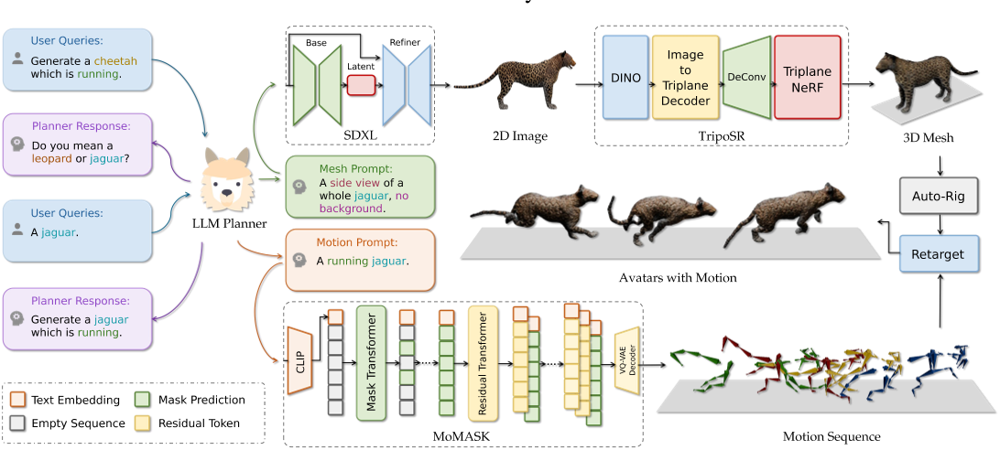

# Motion Avatar: Generate Human and Animal Avatars with Arbitrary Motion

## 核心问题是什么?

1. 当前的工作主要集中在单独生成 3D 头像网格或生成运动序列，事实证明，集成这两个方面是一个持续的挑战。  
2. 虽然化身和动作生成主要针对人类，但由于训练数据和方法不足，将这些技术扩展到动物仍然是一个重大挑战。

### 本文方法
1. 提出了一种名为“Motion Avatar”的新颖的基于代理的方法，它允许通过文本查询自动生成带有动作的高质量可定制人类和动物头像。该方法显着推进了动态 3D 角色生成的进展。
2. 引入了一个协调运动和头像生成的 LLM 规划器，它将区分性规划转变为可定制的问答方式。
3. 提出了一个名为 Zoo-300K 的动物运动数据集，其中包含 65 个动物类别的约 300,000 个文本运动对及其构建管道 ZooGen，它是社区的宝贵资源。

## 核心贡献是什么？

1.  **文本驱动的动态3D角色生成**：Motion Avatar技术允许用户通过文本描述来生成具有特定动作的3D角色，这在动态3D角色生成领域是一个重要的进步。

2.  **基于代理的方法**：该方法利用大型语言模型（LLM）代理来管理和响应用户查询，生成定制的动作提示和网格提示，这些提示用于后续的动作序列生成和3D网格创建。

3.  **LLM规划器**：引入了一个LLM规划器，它将动作和头像生成的判别性规划转变为更灵活的问答（Q\&A）模式，提高了对动态头像生成任务的适应性。

4.  **动物动作数据集Zoo-300K**：论文提出了一个包含约300,000个文本-动作对的动物动作数据集，涵盖了65种不同的动物类别，以及构建该数据集的ZooGen管道，为社区提供了宝贵的资源。

5.  **动作和网格生成的自动重定向**：生成的3D网格会经过自动绑定过程，使得动作可以重新定向到绑定的网格上，这为动态头像的动画制作提供了便利。

6.  **多模态大型语言模型的应用**：使用专门为视频理解设计的多模态大型语言模型Video-LLaMA来描述经过ZooGen处理的动作数据，提高了描述的准确性和质量。

7.  **用户研究**：通过用户研究，论文评估了Motion Avatar生成的动画在真实世界应用中的有效性，包括动作的准确性、网格的视觉质量、动作和网格的整合度以及用户的整体参与度和吸引力。

8.  **技术细节和方法论**：论文详细介绍了Motion Avatar生成过程中使用的各种技术，包括文本到动作的转换、3D网格生成、自动绑定和动作重定向等。

9.  **实验和评估**：论文通过实验评估了LLM规划器的性能，以及Motion Avatar在生成人类和动物动作方面的有效性。

10. **应用前景**：这项技术在电影制作、视频游戏、增强现实/虚拟现实、人机交互等领域具有广泛的应用潜力。

## 大致方法是什么？

1. Motion Avatar 利用基于 LLM 代理的方法来管理用户查询并生成定制的提示。
2. 这些生成运动序列和 3D 网格。运动生成遵循自回归过程，而网格生成在 imageto-3D 框架内运行。
3. 3D网格会经历自动绑定过程，从而允许将运动重新定位到已装配的网格。
4. 用生成的运动序列经过3D重定向驱动绑定好的3DMesh。  

## 训练与验证

### 数据集

### loss

### 训练策略

## 有效

## 局限性

无法生成背景。  

## 启发

## 遗留问题

## 参考材料

1. 数据集：[link](./40.md)