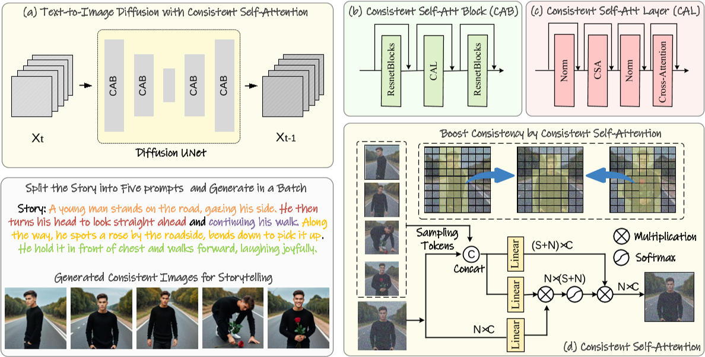
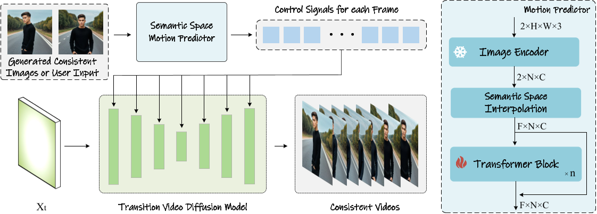

# HumanVid: Demystifying Training Data for Camera-controllable Human Image Animation

## 核心问题是什么?

对于最近基于扩散的生成模型，在一系列生成的图像中保持一致的内容，特别是那些包含主题和复杂细节的图像，提出了重大挑战。

### 本文方法

1. 一致性自注意力：一种新的自注意力计算方法，它显着提高了生成图像之间的一致性，并以零样本方式增强了流行的基于预训练扩散的文本到图像模型。
2. 语义运动预测器：一种新颖的语义空间时间运动预测模块。它被训练来估计语义空间中两个提供的图像之间的运动条件。该模块将生成的图像序列转换为具有平滑过渡和一致主题的视频，比仅基于潜在空间的模块更加稳定，特别是在长视频生成的情况下。

### 效果

通过合并这两个新颖的组件，我们的框架（称为 StoryDiffusion）可以描述基于文本的故事，其中包含包含丰富内容的一致图像或视频。

## 核心贡献是什么？

1.  **一致性自注意力（Consistent Self-Attention）**：提出了一种新的自注意力计算方法，能够在生成图像的过程中显著提高内容的一致性，例如保持角色身份和服饰的一致性。这种方法不需要额外的训练，可以以零样本（zero-shot）的方式插入到现有的扩散模型中。

2.  **语义运动预测器（Semantic Motion Predictor）**：为了将一系列图像转换为具有平滑过渡的视频，提出了一种新的模块，它在语义空间中估计两张图像之间的运动条件。这种方法在长视频生成中特别有效，能够生成比仅基于潜在空间的方法更稳定的视频。

3.  **StoryDiffusion框架**：结合了上述两个新组件，能够根据文本描述生成一致性的图像或视频，涵盖了丰富多样的内容。这种方法在视觉故事生成方面进行了开创性的探索。

4.  **无需训练的一致性图像生成**：StoryDiffusion能够在不需要训练的情况下，通过分割文本故事并使用提示生成一系列高度一致的图像，这些图像能够有效地叙述一个故事。

5.  **滑动窗口技术**：为了支持长故事的生成，StoryDiffusion实现了与滑动窗口相结合的一致性自注意力，这消除了峰值内存消耗对输入文本长度的依赖，使得长故事的生成成为可能。

6.  **预训练的运动模块**：结合预训练的运动模块，Semantic Motion Predictor能够生成比现有条件视频生成方法（如SEINE和SparseCtrl）更平滑、更稳定的视频帧。

## 大致方法是什么？

第一步：根据描述生成一系列一致的图像，作为关键帧  
第二步：在关键帧之间生成中间动作，补全成视频  

### 免训练一致图像生成



> StoryDiffusion **生成主题一致图像**的流程。为了创建主题一致的图像来描述故事，我们将一致的自我注意力融入到预先训练的文本到图像的扩散模型中。我们将故事文本拆分为多个提示，并使用这些提示批量生成图像。一致的自注意力在批量的多个图像之间建立连接，以实现主题一致性。

在生成过程中在batch内的图像之间建立连接。保持一批图像中角色的一致性。  
方法：将一致性自注意力插入到图像生成模型现有 U-Net 架构中原始自注意力的位置，并重用原始自注意力权重以保持免训练和可插拔。

定义一批图像特征为： \\(\mathcal{I} ∈ R^{B×N×C}\\) ，其中 B、N 和 C 分别是batch size、每个图像中的token数量和channel数。    
通常情况下，第i张图像的Attention函数的输入xQ、xK、xV由第i图像的特征（1×N×C）通过映射得到。  

本文为了在batch中的图像之间建立交互以保持一致性，修改为从batch中的其他图像特征中采样一些token加入第i个图像的特征中，第i张图像的特征变为1×(W * N * sampling_rate + N)×C，其中第一部分为从其它图像采样来的token，第二部分为自己原有的token。  

```python
def ConsistentSelfAttention(images_features, sampling_rate, tile_size): 
    """ 
    images_tokens: [B, C, N] # 论文上是这么写的，但我认为是[B, N, C] 
    sampling_rate: Float (0-1) 
    tile_size: Int 
    """ 
    output = zeros(B, N, C), count = zeros(B, N, C), W = tile_size 
    for t in range(0, N - tile_size + 1): 
        # Use tile to override out of GPU memory 
        tile_features = images_tokens[t:t + W, :, :] 
        reshape_featrue = tile_feature.reshape(1, W*N, C).repeat(W, 1, 1) 
        sampled_tokens = RandSample(reshape_featrue, rate=sampling_rate, dim=1) 
        # Concat the tokens from other images with the original tokens 
        token_KV = concat([sampled_tokens, tile_features], dim=1) 
        token_Q = tile_features 
        # perform attention calculation: 
        X_q, X_k, X_v = Linear_q(token_Q), Linear_k(token_KV), Linear_v(token_KV) 
        output[t:t+w, :, :] += Attention(X_q, X_k, X_v) 
        count[t:t+w, :, :] += 1 
    output = output/count 
    return output
```

> demo中可以使用reference Image注入生成与reference Image相似的风格化人物。但是这里没有提及reference 注入的部分。  

### 用于视频生成的语义运动预测器



> **生成过渡视频**的方法的流程。为了有效地建模角色的大动作，我们将条件图像编码到图像语义空间中，以编码空间信息并预测过渡嵌入。然后使用视频生成模型对这些预测的嵌入进行解码，嵌入作为交叉注意力中的控制信号来指导每帧的生成。

任务描述：通过在每对相邻图像之间插入帧，可以将生成的字符一致图像的序列进一步细化为视频。这可以看作是一个**以已知开始帧和结束帧为条件的视频生成任务**。  

主要挑战：当两​​幅图像之间的差异较大时，SparseCtrl (Guo et al., 2023) 和 SEINE (Chen et al., 2023) 等最新方法**无法稳定地连接**两个条件图像。  

当前解决方法的问题：这种限制源于它们**仅依赖时间模块来预测中间帧**，这可能不足以处理图像对之间的大状态间隙。时间模块在每个空间位置上的像素内独立操作，因此，在推断中间帧时可能没有充分考虑空间信息。这使得**对长距离且具有物理意义的运动进行建模变得困难**。

本文解决方法：**语义运动预测器**它将图像编码到图像语义空间中以捕获空间信息，从给定的起始帧和结束帧实现更准确的运动预测。  

1. 引入CLIP作为图像编码器，利用其零样本的能力，建立从 RGB 图像到图像语义空间中的向量的映射，对空间信息进行编码。
2. 使用CLIP 图像编码器，将给定的起始帧Fs和结束帧Fe压缩为图像语义空间向量Ks、Ke。
3. 线性插值，将 Ks 和 Ke 扩展为序列 K1, K2, ..., KL，其中 L 是所需的视频长度。
4. 在图像语义空间中，训练transformer-based structure predictor来预测每个中间帧。predictor的输入是序列 K1, K2, ..., KL。输出是过渡帧。
5. 将这些图像语义嵌入 P1、P2、...、PL 定位为控制信号，将视频扩散模型定位为解码器，将图像语义空间中的这些预测帧解码为最终的过渡视频。


## 训练与验证

### 数据集

### loss

### 训练策略

## 有效

7.  **实验结果**：论文通过实验验证了StoryDiffusion在生成一致性图像和过渡视频方面的性能，与最新的技术进行了比较，并展示了其优越性。

## 局限性

## 启发

8.  **应用潜力**：StoryDiffusion的提出为可控图像和视频生成领域带来了新的启示，尤其是在需要讲述故事的应用场景中，如动画制作、游戏开发或虚拟现实体验。

## 遗留问题

## 参考材料

1. 项目主页：https://StoryDiffusion.github.io
