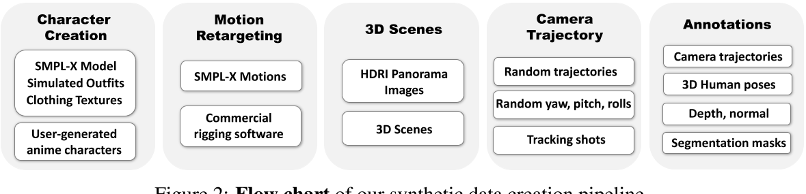

# HumanVid: Demystifying Training Data for Camera-controllable Human Image Animation

## 核心问题是什么?

### 目的

从角色照片生成视频

### 现有方法及问题

1. 数据集的不可访问性阻碍了公平和透明的基准测试。
2. 当前方法优先考虑 2D 人体运动，而忽视了视频中相机运动的重要性，导致控制有限和视频生成不稳定。

### 本文方法

1. 推出了 HumanVid，第一个针对人体图像量身定制的大规模高质量数据集动画，结合了精心制作的现实世界和合成数据。
2. 为了验证 HumanVid 的有效性，我们建立了一个名为 CamAnimate 的基线模型，CamAnimate 是相机可控人体动画的缩写，它将人类和相机运动都视为条件。

### 效果

通过广泛的实验，我们证明了在 HumanVid 上进行的这种简单的基线训练在控制人体姿势和相机运动方面实现了最先进的性能，树立了新的基准。

## 核心贡献是什么？

1.  **高质量数据集的创建**：HumanVid是首个为人类图像动画量身定制的大规模高质量数据集，它结合了精心挑选的真实世界视频和合成数据。这个数据集的创建强调了高质量、公开可用的数据集在公平和透明基准测试中的重要性。

2.  **真实与合成数据的结合**：为了提高数据的多样性和质量，作者不仅从互联网上收集了大量版权免费的真人视频，还结合了2300多个版权免费的3D头像资产来丰富数据集。

3.  **相机运动的重要性**：与以往主要关注2D人体运动的方法不同，HumanVid和CamAnimate同时考虑了人体和相机运动，这对于生成逼真的人类视频至关重要。

4.  **精确的相机轨迹注释**：通过使用基于SLAM（Simultaneous Localization and Mapping）的方法，作者能够为真实世界视频提供准确的相机轨迹注释，这在以往的数据集中很难找到。

5.  **规则化的相机轨迹生成方法**：为了增强合成数据中相机运动的多样性和精确性，作者引入了一种基于规则的相机轨迹生成方法，这有助于模拟真实视频中常见的相机运动。

## 大致方法是什么？

3D建模 + 3D重定向 + 渲染

## 训练与验证

### 数据集

### loss

### 训练策略

## 有效

6.  **CamAnimate基线模型**：这个模型考虑了人体和相机运动作为条件，通过广泛的实验验证了在HumanVid数据集上训练的简单基线模型能够实现对人类姿势和相机运动的控制，达到了最先进的性能。

7.  **公平和透明的评估基准**：通过提供统一的测试协议和数据集，作者为人类视频生成领域建立了一个新的评估基准，这有助于促进该领域的进一步发展和创新。

## 局限性

## 启发

## 遗留问题

## 参考材料

1. 代码和数据：https://github.com/zhenzhiwang/HumanVid/