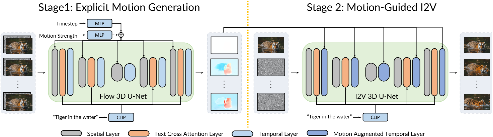
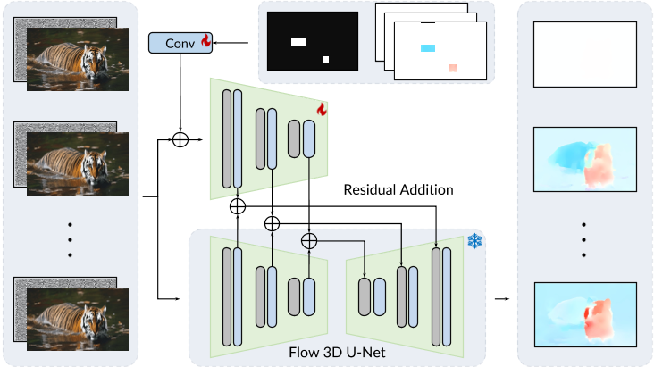

# Motion-I2V: Consistent and Controllable Image-to-Video Generation with Explicit Motion Modeling

## 核心问题是什么?

INVDIA，开源

### 目的

图像到视频合成 (I2V)

输入：参考图像 I 和控制条件      
输出：生成一系列后续视频帧，且确保生成的视频剪辑不仅表现出合理的运动，而且忠实地保留了参考图像的视觉外观。

> &#x2705; 区别于类似[link](.148.md)这种的“图像生成 &#x2192; 视频生成”的任务。    

### 现有方法及存在的问题

通过利用扩散模型强大的生成先验，最近的方法显示出有前途的开放域 I2V 泛化能力。  
1. 现有方法很难维持**时间一致性**。
2. 现有方法对生成结果提供有限的控制。

### 本文方法

Motion-I2V 通过显式运动建模将 I2V 分解为两个阶段。  
对于第一阶段，我们提出了一种**基于扩散的运动场预测器**，其重点是**推导参考图像像素的轨迹**。  
对于第二阶段，我们提出**运动增强时间注意力**来增强 VDM 中有限的一维时间注意力。该模块可以在第一阶段预测轨迹的指导下有效地将参考图像的特征传播到合成帧。  

### 效果

> [&#x2753;] 光流擅长描述视角不变的物体平移，本文以光流为条件为什么能支持较大运动和视点变化？

与现有方法相比，即使存在较大运动和视点变化，Motion-I2V 也可以生成更一致的视频。  
通过第一阶段训练稀疏轨迹ControlNet，Motion-I2V可以支持用户通过稀疏轨迹和区域注释精确控制运动轨迹和运动区域。与仅依赖文本指令相比，这为 I2V 过程提供了更多的可控性。  
此外，Motion-I2V 的第二阶段自然支持零镜头视频到视频的转换。  

> [&#x2753;] 优点是精确控制。    
缺点是，当用户控制与图像内容存在矛盾时该如何调和？    

## 核心贡献是什么？

1. **双阶段图像到视频生成**：Motion-I2V将图像到视频的生成分解为两个阶段。第一阶段专注于预测像素级的运动轨迹，第二阶段则利用这些预测轨迹来指导视频帧的生成。

2. **显式运动建模**：与以往直接学习复杂图像到视频映射的方法不同，Motion-I2V通过显式建模运动来增强生成视频的一致性和可控性。

3. **基于扩散的运动场预测**：在第一阶段，提出了一种基于扩散模型的运动场预测器，该预测器接收参考图像和文本指令作为条件，并预测参考图像中所有像素的轨迹。

4. **运动增强的时间注意力**：在第二阶段，提出了一种新颖的运动增强时间注意力模块，用于增强视频潜在扩散模型中有限的一维时间注意力。

5. **稀疏轨迹控制**：Motion-I2V支持使用稀疏轨迹ControlNet进行训练，允许用户通过稀疏的轨迹和区域注释精确控制运动轨迹和运动区域。

6. **区域特定动画（Motion Brush）**：框架还支持区域特定的I2V生成，用户可以通过自定义的运动遮罩来指定要动画化的图像区域。

7. **零样本视频到视频翻译**：Motion-I2V的第二阶段自然支持零样本视频到视频翻译，可以使用源视频的运动信息来指导转换后的第一帧。

## 大致方法是什么？

> Motion-I2V 概述。 Motion-I2V 的第一阶段的目标是推导能够合理地为参考图像设置动画的运动。它以参考图像和文本提示为条件，预测参考帧和所有未来帧之间的**运动场图**。第二阶段传播参考图像的内容以合成帧。一种新颖的**运动增强时间层**通过扭曲特征增强一维时间注意力。该操作扩大了时间感受野并减轻了直接学习复杂时空模式的复杂性。

### 使用VDM进行运动预测

我们选择采用预先训练的稳定扩散模型进行视频运动场预测，以利用强大的生成先验。

#### 运动场建模

将第一阶段的预测目标（使参考图像动画化的运动场）表示为一系列 2D 位移图{\\(f_{0→i}|i = 1,..., N \\)}，其中每个 f0→i 是参考帧与时间步 i 处未来帧之间的光流。通过这样的运动场表示，对于参考图像 I0 的每个源像素 p ∈ I2，我们可以轻松地确定其在时间步 i 处目标图像 Ii 上对应的坐标 p′i = p + f0→i(p)。

> &#x2705; 根据视频数据生成运动场。    

#### 训练运动场预测器

1. 调整预训练的 LDM 来预测以参考图像和文本提示为条件的单个位移场。
2. 冻结调整后的 LDM 参数，并集成vanilla 时间模块以创建用于训练的 VLDM。
3. 继续微调整个 VLDM 模型以获得最终的运动场预测器。

> [&#x2753;] 任务的输入是稀疏轨迹和区域注释，为什么训练输入是文本注释？    

#### 编码运动场和条件图像

考虑到扩散模型的计算效率时，我们使用optical flow encoder 把 motion field map 编码为 latent representation。optical flow encoder 的结构与 LDM 的图像自动编码器相同，不同之处在于它接收和输出2通道光流图而不是3通道RGB图像。  

> [&#x2753;] 光流 encoder 是预训练的吗？   

为了引入reference image condition，我们沿着通道维度把reference image latent representation 与 noise concat到一起。

使用 SD 1.5 预训练模型初始化的 LDM 权重，并将新添加的 4 个输入通道的权重设置为零。  
帧步长 i 使用两层 M LP 进行嵌入，并添加到时间嵌入中，作为运动强度条件。

### 运动预测和视频渲染

#### 运动增强的时间注意力

通过**motion-augmented temporal attention**，增强了 vanilla VLDM 的1-D temporal attention的同时，保持其他模块不变。

定义z为第 l 个时间层的 latent feature。简化batch size的情况下，z的维度为  (1+N )×Cl ×hl ×wl，其中 cl、hl、wl 分别表示特征的通道维度、高度和宽度。其中 z[0] 为参考帧对应的特征图，用 z[1 : N ]为后续帧。  
根据第一阶段预测的运动场 {f0→i|i = 1, ..., N } （假设调整大小以对齐空间形状）对z[0]作warp，得到z[i]'

$$
z[i]' = \mathcal W(z[0], f_{i\rightarrow 0})
$$

z[i]'与z[i]在时间维度上交错，得到

$$
z_{aug} = [[z[0], z[1]', z[1], ..., z[N]', z[N]]
$$

调整z和\\(z_{aug}\\)的维度，使得在后面做时间维度上的attention。  
时间维度上的attention为cross attention，其中K和V来自\\(z_{aug}\\),Q来自z。  

> 该操作通过引入第一阶段的预测运动场引导，扩大了的时间模块的感受野。

#### 选择性噪声

在去噪过程的每个时间步 t，总是将reference image latent code与noise latent code在时间维度上concat，以保证reference image的内容在生成过程中被忠实地保留。

### Motion-I2V生成的细粒度控制

#### 稀疏轨迹控制

第一阶段中，通过ControlNet把人工绘制的轨迹图作为控制信号进行motion field map的生成。  
第二阶段不变。  

#### 区域控制

第一阶段中，通过ControlNet把人工绘制的区域图作为控制信号进行motion field map的生成。  
第二阶段不变。  

#### 视频风格转换

1. 使用 image-to-image 第一帧进行图像风格转换
2. 使用dense point tracker 计算dispacement space。  
3. 使用2和1计算motion field
4. 使用motion field驱动1

## 训练与验证

### 预训练模型

第一阶段：Stable Diffusion v1.5  
第二阶段：AnimateDiff v2

### 数据集

WebVid-10M [1], a large scale text-video dataset

### loss

### 训练策略

## 有效

8. **一致性和可控性的比较优势**：通过定量和定性比较，Motion-I2V在一致性和可控性方面优于现有方法，尤其是在存在大运动和视角变化的情况下。

9. **实验和评估**：论文中详细描述了实验设置、评估方法以及与现有方法的比较，证明了Motion-I2V在多个指标上的优势。

## 局限性

10. **局限性和结论**：论文讨论了方法的一些局限性，例如生成视频的亮度倾向于中等水平，并提出了可能的改进方向。

## 启发

## 遗留问题

## 参考材料

1. 项目页面：https://xiaoyushi97.github.io/Motion-I2V/