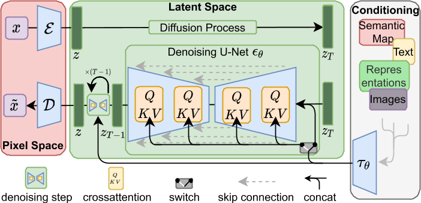

# High-Resolution Image Synthesis with Latent Diffusion Models

开源，精读   

## 核心问题是什么?

### 目的

在有限的计算资源上进行 DM 训练，同时保持其质量和灵活性

### 现有方法

现有模型通常直接在像素空间中运行，且顺序评估，因此训练和推理成本很高。

### 本文方法

将DM应用在强大的预训练自动编码器的潜在空间中。  
1. 在这种表示上训练扩散模型首次允许在复杂性降低和细节保留之间达到接近最佳的点，从而极大地提高了视觉保真度。
2. 通过将交叉注意力层引入模型架构中，我们将扩散模型转变为强大而灵活的生成器，用于一般条件输入（例如文本或边界框），并且以卷积方式使高分辨率合成成为可能。

### 效果

LDM 在图像修复和类条件图像合成方面取得了新的最先进分数，并在各种任务上实现了极具竞争力的性能，包括文本到图像合成、无条件图像生成和超分辨率，与基于像素的 DM 相比，同时显着降低了计算要求。

## 核心贡献是什么？

1.  **潜在扩散模型（LDMs）**：这是一种新型的生成模型，它通过在潜在空间中应用去噪自编码器序列来实现图像合成，能够在保持图像质量的同时，显著减少计算资源的需求。

2.  **高分辨率图像合成**：LDMs能够在高分辨率下生成复杂的自然场景图像，这在以往的技术中往往需要大量的计算资源。

3.  **计算效率**：与基于像素的扩散模型相比，LDMs在训练和推理时更加高效，因为它们在低维的潜在空间中进行操作，而不是在高维的像素空间中。

4.  **条件生成**：LDMs支持多种类型的条件输入，如文本或边界框，使得生成过程更加灵活和可控。

5.  **跨注意力层（Cross-Attention Layers）**：通过引入跨注意力层，LDMs能够将扩散模型转变为强大的生成器，用于处理一般的条件输入。

6.  **两阶段图像合成方法**：LDMs采用两阶段方法，首先通过感知压缩模型（如自编码器）降低数据的维度，然后在潜在空间中训练扩散模型，以学习数据的语义和概念组成。

7.  **感知压缩**：论文提出了一种基于感知损失和对抗性目标的图像压缩方法，以确保重建图像在视觉上与原始图像保持一致。

## 大致方法是什么？



这种方法有几个优点： 
1. 计算效率更高，因为采样是在低维空间上执行的。
2. 利用从 UNet 架构继承的 DM 的归纳偏差 [71]，这使得它们对于具有空间结构的数据特别有效，因此减轻了先前方法所需的激进的、降低质量的压缩级别的需求 [23， 66]。
3. 通用压缩模型，其潜在空间可用于训练多个生成模型，也可用于其他下游应用，例如单图像 CLIP 引导合成 [25]。

### 感知图像压缩

|输入|输出|方法|
|---|---|---|
|image, W * H * 3|z，h * w * c|Encoder|
|z|image|Decoder|

f = W/w = H/h = 2 ** m

正则化：
1. 对学习到的latent潜伏施加与标准正态的 KL 惩罚，类似VAE
2. 在解码器中使用矢量量化层，类似VQGAN    

高分辨率情况下，VQ中的 Cross-attention 比较消耗 GPU.   

与之前工作不同的是z是二维的，以保留其固有结构

```python
class AutoencoderKL(pl.LightningModule):
    def encode(self, x):
        h = self.encoder(x)
        moments = self.quant_conv(h)
        posterior = DiagonalGaussianDistribution(moments)
        return posterior

    def decode(self, z):
        z = self.post_quant_conv(z) #矢量量化层
        dec = self.decoder(z)
        return dec

    def forward(self, input, sample_posterior=True):
        posterior = self.encode(input)
        if sample_posterior:
            z = posterior.sample()
        else:
            z = posterior.mode()
        dec = self.decode(z)
        return dec, posterior
```
[&#x2753;] Decoder 中的 VQ 是怎么做的？

### DDPM

代码中提供了多个DDPM版本，主要差别在input的构造上：

- DDPM --- classic DDPM with Gaussian diffusion, in image space
    - LatentDiffusion
        - LatentUpscaleDiffusion
        - LatentFinetuneDiffusion --- Basis for different finetunas, such as inpainting or depth2image
         To disable finetuning mode, set finetune_keys to None
            - LatentInpaintDiffusion --- can either run as pure inpainting model (only concat mode) or with mixed conditionings,
    e.g. mask as concat and text via cross-attn.
    To disable finetuning mode, set finetune_keys to None
            - LatentDepth2ImageDiffusion --- condition on monocular depth estimation
            - LatentUpscaleFinetuneDiffusion --- condition on low-res image (and optionally on some spatial noise augmentation)
        - ImageEmbeddingConditionedLatentDiffusion

|||
|---|---|
|ImageEmbeddingConditionedLatentDiffusion|
### 条件机制

通过交叉注意力机制增强其底层 UNet 主干网，将 DM 转变为更灵活的条件图像生成器 [97]，这对于学习各种输入模态的基于注意力的模型非常有效 [35,36]。

1. 领域的编码器 τθ，把条件y 投影到中间表示  
2. 使用cross attention把z和1混合起来，其中K和V来自1，Q来自z

```python
class DiffusionWrapper(pl.LightningModule):
    def __init__(self, diff_model_config, conditioning_key):
        super().__init__()
        self.sequential_cross_attn = diff_model_config.pop("sequential_crossattn", False)
        self.diffusion_model = instantiate_from_config(diff_model_config)
        self.conditioning_key = conditioning_key
        assert self.conditioning_key in [None, 'concat', 'crossattn', 'hybrid', 'adm', 'hybrid-adm', 'crossattn-adm']

    # noise与condition的不同的结合方式
    def forward(self, x, t, c_concat: list = None, c_crossattn: list = None, c_adm=None):
        # 无条件信息
        if self.conditioning_key is None:
            out = self.diffusion_model(x, t)
        # condition与noise做concat，都作为要生成的内容传进去。没有独立的condition。
        elif self.conditioning_key == 'concat':
            xc = torch.cat([x] + c_concat, dim=1)
            out = self.diffusion_model(xc, t)
        # condition与noise做cross attention，论文中所提到的方法
        elif self.conditioning_key == 'crossattn':
            if not self.sequential_cross_attn:
                cc = torch.cat(c_crossattn, 1)
            else:
                cc = c_crossattn
            if hasattr(self, "scripted_diffusion_model"):
                # TorchScript changes names of the arguments
                # with argument cc defined as context=cc scripted model will produce
                # an error: RuntimeError: forward() is missing value for argument 'argument_3'.
                out = self.scripted_diffusion_model(x, t, cc)
            else:
                out = self.diffusion_model(x, t, context=cc)
        # concat方式与cross attention方式的混合
        elif self.conditioning_key == 'hybrid':
            xc = torch.cat([x] + c_concat, dim=1)
            cc = torch.cat(c_crossattn, 1)
            out = self.diffusion_model(xc, t, context=cc)
        # adm似乎是论文参考文献[15]中的方法
        elif self.conditioning_key == 'hybrid-adm':
            assert c_adm is not None
            xc = torch.cat([x] + c_concat, dim=1)
            cc = torch.cat(c_crossattn, 1)
            out = self.diffusion_model(xc, t, context=cc, y=c_adm)
        elif self.conditioning_key == 'crossattn-adm':
            assert c_adm is not None
            cc = torch.cat(c_crossattn, 1)
            out = self.diffusion_model(x, t, context=cc, y=c_adm)
        elif self.conditioning_key == 'adm':
            cc = c_crossattn[0]
            out = self.diffusion_model(x, t, y=cc)
        else:
            raise NotImplementedError()

        return out
```
   
1. 文本注入，BERT tokenizer + transformer &#x2192; latert code 与 UNet feature 做 cross attention    

**效果：** 可实现跨模态条件生成，生成质量指标接近 SOTA，但所需的参数量更少。   

2. 图像注入，在空间维度对齐后 concat.     

**效果：** 这种注入方式用于 image-to-image transtation 任条，例如 Semanic 生成、超分，inpainting.    

**结论：** 信噪比对生成质量有较大的影响。   


## 训练

1. **Two-stage** Training:   
2. CEG 训练方式极大地提升了 Sample 的质量。

### LDM的训练

```python
class LatentDiffusion(DDPM):
   def p_losses(self, x_start, cond, t, noise=None):
        noise = default(noise, lambda: torch.randn_like(x_start))
        x_noisy = self.q_sample(x_start=x_start, t=t, noise=noise)
        model_output = self.apply_model(x_noisy, t, cond)

        loss_dict = {}
        prefix = 'train' if self.training else 'val'

        if self.parameterization == "x0":
            target = x_start
        elif self.parameterization == "eps":
            target = noise
        elif self.parameterization == "v":
            target = self.get_v(x_start, noise, t)
        else:
            raise NotImplementedError()

        loss_simple = self.get_loss(model_output, target, mean=False).mean([1, 2, 3])
        loss_dict.update({f'{prefix}/loss_simple': loss_simple.mean()})

        logvar_t = self.logvar[t].to(self.device)
        loss = loss_simple / torch.exp(logvar_t) + logvar_t
        # loss = loss_simple / torch.exp(self.logvar) + self.logvar
        if self.learn_logvar:
            loss_dict.update({f'{prefix}/loss_gamma': loss.mean()})
            loss_dict.update({'logvar': self.logvar.data.mean()})

        loss = self.l_simple_weight * loss.mean()

        loss_vlb = self.get_loss(model_output, target, mean=False).mean(dim=(1, 2, 3))
        loss_vlb = (self.lvlb_weights[t] * loss_vlb).mean()
        loss_dict.update({f'{prefix}/loss_vlb': loss_vlb})
        loss += (self.original_elbo_weight * loss_vlb)
        loss_dict.update({f'{prefix}/loss': loss})

        return loss, loss_dict
```
### 数据集

### loss

### 训练策略

- train autoencoder first, then train the diffusion prior  
&#x2705; VAE 和 diffusion 分开训练。每次需要训练的网络都不大。
- Focus on compression without of any loss in reconstruction quality  
&#x2705; 使用Advanced Auto Encoders。由于使用的latent space比较小，diffusion model的大小也可以减小。  
- Demonstrated the expressivity of latent diffusion models on many conditional problems

## 实验与结论

**实验1:**     
1. 在 VQ 正则化隐空间训 DM     
2. 在 pixel 空间训 DM    

**效果:** VQ 重建出的结果相对原视频有轻微下降，但整体生成质量1优于2。    

**实验2:**    
Encoder & Decoder 使用不同的压缩率 \\(f \in\\) {\\(1,2,4,8,16,32\\)},\\(f=1\\)代表在像素空间。    

**效果：** \\(f=1\\)或2时，训练的收敛速度较慢，\\(f\\) 较大时，训练较少的次数后生成质量不再提升。    

**结论：** 信息压缩有利于模型的训练，但过多的压缩会导致信息丢失和降低上限。    
\\(f=\\){4-16}是模型训练与生成质量之间的好的平衡点。   

**实验3：**   
在不同的数据上测试\\(f\\)的影响。   

**效果：**@插入表7


**结论：** ImageNet 的数据相对复杂，对应合适的\\(f\\)道相对较小，例如4、8    

**实验4：** 横向对比较       
1. GAN-based Model     
2. LSGM，一种在 lantert space 的生成模型，但训练策略是 Auto Encoder 和 DM 同时训练。    
3. 本文方法。    

**效果：** 3优于1和2     

**结论：** AutoEncoder 与 Diffusion Mode 同时训练。latent Space 的分布一直在调整，DM 不得不一直跟随调整来适应 AE 的变化，增大了学习的难度，不利于 DM 的学习。    

**实验5：**  超分模型横向对比。用不同方法对图像降级后做超分。   
1. LDM-SR     
2. 本文方法     

**效果：** 客观指标1和2各有优劣。主观评测2优于1。    

**结论：** 客观指标不能很好地匹配人的主观感受。    

**实验6：**  inpainting，评价指标 Lama[88]     


## 有效

8.  **灵活性和通用性**：LDMs的潜在空间可以被多次用于不同的生成任务，例如图像修复、超分辨率和文本到图像的合成。

## 局限性

1. 对于高精度的场景，即使显 \\(f=4\\) 的 AE，也存可能成为生成质量的瓶颈。    
2. Sample process 速度慢    

## 启发

生成模型的生成图像的好坏，在于它生成的质量，对于图像而言，可以是像素之间的联系性、边界的清晰度、整体画面的结构性等。但不在于它的合理性，因为
1. 合理性无法衡量。因为生成一个没有见过的图像，不代表不合理。而能够生成没有见过的图像，正是它的创造性所在。  
2. 合理性也可以理解为生成的结果符合人类常识。但实际上生成模型并不真正理解人类常识。会生成符合人类常识的结果，只是因为对数据的偏见。  

因此，对于生成模型而言，要通过各种方法、策略来提升其生成质量。通过强化数据偏见来提升其合理性。

## 遗留问题

LDM 的生成速度较慢    

## 参考材料

1. paper: https://arxiv.org/abs/2112.10752
2. github: https://github.com/Stability-AI/stablediffusion