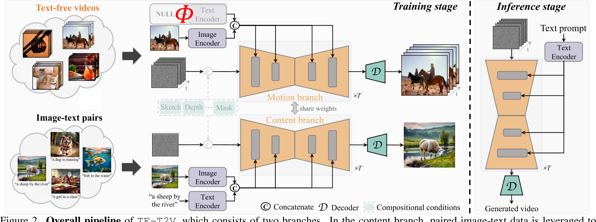

# A Recipe for Scaling up Text-to-Video Generation

## 核心问题是什么?

### 目的

基于diffusion model的文生视频

### 现有方法

文本视频的pair data规模有限。但是无标注的视频剪辑有很多。

### 本文方法

TF-T2V：一种新颖的文本到视频生成框架。它可以直接使用无文本视频进行学习。其背后的基本原理是**将文本解码过程与时间建模过程分开。** 为此，我们采用内容分支和运动分支，它们通过共享权重进行联合优化。

### 效果

通过实验，论文展示了TF-T2V在不同规模的数据集上的性能提升，证明了其扩展性。此外，TF-T2V还能够生成高分辨率的视频，并且可以轻松地应用于不同的视频生成任务。

## 核心贡献是什么？

1.  **文本到视频的生成框架（TF-T2V）**：提出了一个新的框架，它利用无文本的视频（text-free videos）来学习生成视频，从而克服了视频字幕的高成本和公开可用数据集规模有限的问题。

2.  **双分支结构**：TF-T2V包含两个分支：内容分支（content branch）和运动分支（motion branch）。内容分支利用图像-文本数据集学习空间外观生成，而运动分支则使用无文本视频数据学习时间动态合成。

3.  **时间一致性损失（Temporal Coherence Loss）**：为了增强生成视频的时间连贯性，提出了一个新的损失函数，它通过比较预测帧与真实帧之间的差异来显式地约束学习相邻帧之间的相关性。

4.  **半监督学习**：TF-T2V支持半监督学习设置，即结合有标签的视频-文本数据和无标签的视频数据进行训练，这有助于提高模型的性能。

## 大致方法是什么？

- 在内容分支中，利用成对的图像文**本数据来学习文本条件和图像条件的空间外观生成。**
- **运动分支通过提供无文本视频（或部分配对的视频文本数据，如果可用）来支持运动动态合成的训练。**
- **在训练阶段，两个分支联合优化。值得注意的是，TF-T2V 可以通过合并可组合条件无缝集成到组合视频合成框架中。**
- **在推理中，TF-T2V 通过将文本提示和随机**噪声序列作为输入来实现文本引导视频生成。

> [&#x2753;] 无文本时文本分支怎么处理？  

## 训练与验证

### 数据集

LAION-400M, LAION：大规模、高质量的图文数据集  
WebVid10M：小规模、低分辨率的文本-视频数据集  
YouTube, TikTok：大量无标注视频

### loss

新增coherence loss用于计算帧间的连续性。  

### 训练策略

## 有效

5.  **扩展性和多样性**：通过实验，论文展示了TF-T2V在不同规模的数据集上的性能提升，证明了其扩展性。此外，TF-T2V还能够生成高分辨率的视频，并且可以轻松地应用于不同的视频生成任务。

6.  **无需复杂的级联步骤**：与以往需要复杂级联步骤的方法不同，TF-T2V通过统一的模型组装内容和运动，简化了文本到视频的生成过程。

7.  **插拔式框架**：TF-T2V是一个即插即用（plug-and-play）的框架，可以集成到现有的文本到视频生成和组合视频合成框架中。

8.  **实验结果**：论文通过广泛的定量和定性实验，展示了TF-T2V在合成连贯性、保真度和可控性方面的优势。

## 局限性

## 启发

## 遗留问题

## 参考材料