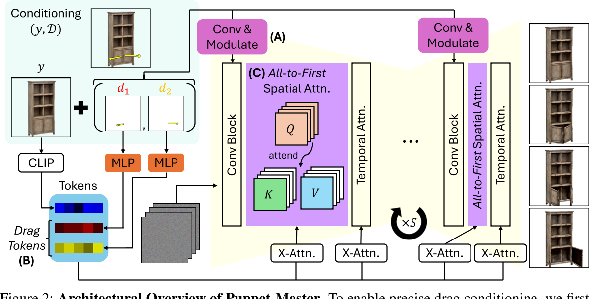

# Puppet-Master: Scaling Interactive Video Generation as a Motion Prior for Part-Level Dynamics

## 核心问题是什么?

零件级运动的视频生成

### 目的

Puppet-Master 是一种交互式视频生成模型，可以作为零件级动态的运动先验。  
在测试时，给定单个图像和一组稀疏的运动轨迹（即拖动），Puppet-Master 可以合成一个视频，描绘忠实于给定拖动交互的真实零件级运动。

### 现有方法

这是一个新问题，无现有方法

### 本文方法

1. 微调大规模预训练视频扩散模型SVD
2. 提出了一种新的调节架构来<u>有效地注入拖动控制</u>
3. 引入了all-to-first注意力机制，替换原始模型中空间注意力模块。它通过解决现有模型中的外观和背景问题来显着提高生成质量。
4. 使用 Objaverse-Animation-HQ 数据，这是一个精心策划的部件级运动剪辑的新数据集。
5. 提出了一种策略来自动过滤掉次优动画并通过有意义的运动轨迹增强合成渲染。

### 效果

 PuppetMaster 可以很好地<u>推广到各种类别</u>的真实图像，并在现实<u>世界</u>基准上以零样本的方式优于现有方法。

## 核心贡献是什么？

1.  **交互式视频生成**：Puppet-Master能够在测试时，根据单个图像和稀疏的运动轨迹合成视频，这些视频展示了与给定拖动交互一致的真实部分级别运动。

2.  **运动先验**：与传统的运动模型不同，Puppet-Master学习了一种更通用的运动表示，能够捕捉到对象内部动态，如抽屉滑出柜子或鱼摆动尾巴等。

3.  **数据集创建**：论文提出了Objaverse-Animation-HQ，这是一个新的数据集，包含经过筛选的部分级别运动剪辑，用于训练Puppet-Master。

4.  **新的条件架构**：为了有效地将拖动控制注入视频生成流程，论文提出了一种新的条件架构，包括自适应层归一化和带有拖动标记的交叉注意力模块。

5.  **all-to-first 注意力机制**：为了解决现有模型中的外貌和背景问题，论文引入了all-to-first 注意力机制，这是一种替代传统空间注意力模块的<u>方法，通过直接从条件帧传播信息来显著提高生成质量。</u>

## <u>大致方法是什么？</u>

在原始的SVD架构的基础上做以下修改：  
- 添加自适应层归一化模块来调节内部扩散特征
- 添加带有拖动标记的交叉注意
- 引入了 all-to-first 空间注意力，代替原有空间自注意力模块。它使用第一帧来关注每个带噪声的视频帧。

要解决的问题：  
1. 将拖动条件 D 注入视频生成管道中，以促进高效学习和准确且时间一致的运动控制，同时避免过多修改预训练视频生成器的内部表示
2. 仅仅微调预先训练的SVD可能会导致杂乱背景等伪影[39]。

### 向SVD模型添加拖动控制

1. 引入拖动 D 的编码函数  
2. 扩展 SVD 架构以将生成的代码注入网络
3. 使用视频与训练三元组 (X , y, D) 形式来微调模型。

#### 拖动编码

这是一个hand-crafted的编码方式，编码结果为：K * N * s * s * C  
K：控制点的个数  
N：视频帧数  
s：分辨率  
c：6，分别是start location, current localtion, end_location
 
> [&#x2753;] 直接记录位置，为什么还要SXS？     
> [&#x2753;] 格子没有点经过填什么？   

#### 拖动调制

调制：调整特征的均值和方差，使其与其它特征区别开来。但又不影响特征的原始结构。   

$$
f_s \leftarrow f_s \bigotimes （1 + \gamma_s） + \beta_s
$$

fs为UNET在s分辨率下的特征。gamma和beta通过对**拖动编码**做卷积操作得到。  

以调制的方式让拖动编码影响原始特征      

#### Drag Token

原始的SVD中的cross attention是clip embedding与z之间的。  
此处把Drag Token 进行MLP之后拼接到clip embedding上，成为新的clip embedding。  

[?] Drag Token 和拖动编码是什么关系？

### Attention with the Reference Image

实验观察结论：  
1. 生成的视频具有杂乱的或者灰色的背景，这是由于<u>SVD 是在 576 × 320 视频上进行训练</u>，无法泛化到非常不同的分辨率。强行在其它分辨上finetune，容易出现局部最优。  
2. 当模型学习到复制参考图像作为第一帧，第一帧的appearance不会出现退化。  
> [&#x2753;] 如果参考图像不是生成的任意一帧，如何解决这个问题？    

> [&#x2753;] 是否可以只对背景做这种处理？   

因此：  
创建一条从每个噪声帧到第一帧的“shortcut”，并具有all-to-first的空间注意力，这即使不能完全解决问题，也可以显着缓解问题。

本文设计：  
原始的cross attention机制的Q, K, V都是B * N * s * s * C的维度。spatial cross attention是在空间维度上做的，因此第i帧中参与计算的内容是Q[:,i], K[:,i], V[:,i]。但在此处分别将它们修改为Q[:,i], K[:,0], V[:,0]。  

> &#x2705; 可以把 K[:,0], V[:,0] 和 V[:,0] 换成 reference Image.    

好处：  
1. 第一帧的这种“short cut”允许每个非第一帧直接访问参考图像的未降级外观细节，从而有效地减轻优化过程中的局部最小值。  
2. 与所提出的drag encoding相结合，该编码为每一帧指定第一帧的原点 uk ，all-to-one注意力使包含拖动终止（即 vn k ）的latent像素更轻松关注第一帧上<u>包含拖动原点的潜在像素，可能有助于学习。</u>

## <u>训练与验证</u>

### <u>数据集</u>

<u>Objaverse：由 3D 艺术家创建的 800k 模型的大型 3D 数据集，其中约</u> 40k 是可动画的。

1. 从中挑出可被驱动的3D模型  
2. 根据动作从中提取出稀疏的drag motion

### loss

### 训练策略

## 有效

6.  **零样本泛化**：尽管Puppet-Master仅使用合成数据进行微调，但它能够在真实世界数据上实现良好的零样本泛化，超越了之前在真实视频上微调的方法。

7.  **性能提升**：Puppet-Master在多个基准测试中表现出色，包括文本到图像合成、无条件图像生成、超分辨率等任务，同时显著降低了与基于像素的扩散模型相比的计算需求。

8.  **模型细节**：论文详细介绍了Puppet-Master的架构，包括如何修改原始的潜在视频扩散架构以适应精确的拖动条件，以及如何通过引入参考图像的注意力来提高视频生成质量。

9.  **数据筛选策略**：论文提出了一种系统方法来大规模筛选动画，以创建数据集Objaverse-Animation和Objaverse-Animation-HQ，这些数据集包含更高质量和更逼真的动画。

10. **实验验证**：通过广泛的实验，论文展示了Puppet-Master在合成连贯性、保真度和可控性方面的优势，并证明了其在不同任务和数据集上的有效性。

## 局限性

## 启发

## 遗留问题

## 参考材料

1. 项目页面：vgg-puppetmaster.github.io。