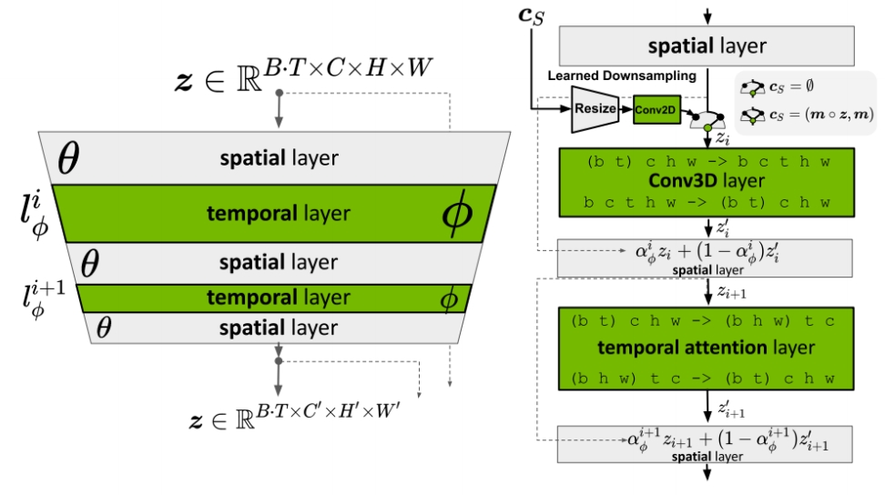
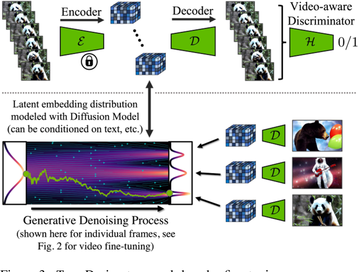

# Align your Latents: High-Resolution Video Synthesis with Latent Diffusion Models

INNIDIA，不开源，精读  

## 核心问题是什么?

### 目的

将 LDM 范式应用于高分辨率视频生成

### 现有方法
### 本文方法

1. 在图像上预训练 LDM
2. 通过向LDM（UNet部分和Decoder部分）引入时间维度，并用编码图像序列（即视频）进行微调，将图像生成器变成视频生成器。
3. 在扩散模型upsamplers上引入时间层，将它们转变为时间一致的视频超分辨率模型。

### 效果

#### 野外驾驶数据的生成

在分辨率为 512 × 1024 的真实驾驶视频上验证了我们的视频 LDM，实现了最先进的性能。

#### 文生成视频的创意内容创建

可以轻松利用现成的预训练图像 LDM，因为在这种情况下我们只需要训练时间对齐模型。

好处：可以将公开可用的、最先进的文本到图像 LDM 稳定扩散转换为高效且富有表现力的文本到视频模型，分辨率高达 1280 × 2048。且这种训练时间层的方式可以推广到不同的微调文本到图像 LDM。

## 核心贡献是什么？

1.  **高分辨率长视频合成**：LDMs扩展了传统的图像合成模型，使其能够生成高分辨率的长视频，是首个高分辨率长视频生成模型。

2.  **潜在空间中的扩散模型**：与传统在像素空间中训练的模型不同，LDMs在潜在空间（latent space）中训练扩散模型，这可以减少计算和内存的需求。

3.  **时间维度的引入**：作者通过在潜在空间中引入时间维度，将图像生成器转换为视频生成器，并通过在编码的图像序列（即视频）上进行微调来实现这一点。

4.  **时间对齐的扩散模型上采样器**：通过引入时间层，可以将用于图像超分辨率的扩散模型上采样器转换为视频超分辨率模型，从而保持时间上的连贯性。    

5.  **实际应用**：论文中提到了两个实际应用案例：野外驾驶数据的合成和文本到视频的创意内容创建。

6.  **预训练和微调**：LDMs可以利用现成的预训练图像LDMs，通过仅训练时间对齐模型来实现视频生成，这大大减少了训练成本。

7.  **个性化视频生成**：通过将训练好的时间层与不同微调的文本到图像LDMs结合，论文展示了个性化文本到视频生成的可能性。

8.  **计算效率**：通过在潜在空间中进行操作，LDMs能够在保持高分辨率输出的同时，降低训练和推理时的计算需求。

9.  **模型架构**：论文详细介绍了LDMs的架构，包括如何通过插入时间层来扩展现有的图像生成模型。

## 大致方法是什么？

> &#x2705; 所有工作的基本思路：(1) 先从小的生成开始 (2) 充分利用 T2I．  

     

### 图像生成模型 -> 视频生成模型

#### 引入 Temporal Layers

     

Interleave spatial layers and temporal layers.    

The spatial layers are frozen, whereas temporal layers are trained. 
Temporal 层与原始的Spatial 层是以residual的形式结合，省略掉维度变换的过程，

$$
z1 = Spatial Attention(z) \\\\
z2 = Temporal Attention(z1)\\\\
z3 = \alpha z1 + (1-\alpha) z2
$$

#### 定义时间层

Temporal layers can be Conv3D **or** Temporal attentions.   

- **For Conv3D,** shape is [batch, channel, time, height, width]    
- **For Temporal attention,** shape is [batch \\(^\ast \\)height\\(^\ast \\) width, time, channel]    

&#x2705; 时序层除了时序 attention，还有 3D conv，是真正的 3D，但是更复杂，且计算、内存等消耗更大。   
&#x2705; 时序attention只是时间维度的融合，而3D conv是在f, w, h三个维度同时融合。  

#### 引入time PE

相对 sinusoidal embeddings [28, 89]

#### 训练方法

先移除Temporal Layer(令alpha=1)，只训练Spatial Layer。然后Fix Spatial Layer，只训练Temporal Layer。  

训练image model和video model使用相同的noise schedule。  

#### Temporal Autoencoder Finetuning

原始的LDM是在图像上训练的，因此其Encoder&Decoder重建出的视频会闪烁。  
解决方法：在Decoder中引入temporal layer，并用视频重训。  

> 上图：微调解码器中的时间层时，会fix编码器，因此编码器是独立处理帧。解码时强制跨帧进行时间相干重建。使用Video-aware Discrimator。下图：在 LDM 中，解码是逐帧进行的。  

### 长视频生成

模型一次生成的帧数有限，通过两种方式生成长视频：    
1. 上一次生成的尾帧作为context注入到下一次生成的首帧信息中，以自回归方式生成长视频。    
2. 生成低帧率视频，再插帧，同样帧数，低帧率视频时间更长。    
本节（论文3.2）解决context注入的问题。     
下节（论文3.3）解决低帧率视频插帧的问题。    

#### Context 的构建 \\(\mathbf{c} _S = (\mathbf{m} _S \circ \mathbf{z} ,\mathbf{m} _S)\\)     

1. 构建 mask，长度为 T，需要参考预置内容的帧置为1，需要生成的帧置为0。    
2. 构建Z。训练时取GT对应帧，调整到对应(w,h), 经过SD Encoder,即为Z。推断时，取上一批生成过程的中间结果Z的对应帧。    
3. 构建\\(\mathbf{c} _S\\). Z 与 mosk 逐元素乘，其结果在channel维度上与 mask concat. 最终shape为 (B,T,c+1,w,h)      

#### 模型结构    

> [&#x2753;] 3D Conv 是怎样使用 \\(\mathbf{c} _S\\) 的？    

答：文章没有说明，推没为 channel 维度的 concat.后面文章都没有使用这种方法注入 reference Image，可能是效果不好，或者使用时有其它局限性。   

#### 训练策略    

CFG    

### Upsampler diffusion model

插帧模型的训练方法与自回归模型的训练相似,即 context 注入和 CFG 训练,区别在于 mask 的构造不同。    

### 超分    

引入现有的 diffusion based 图像超分方法，提升生成视频的分辨率。在现有方法的模型中引入时间层，保证了超分视频内容的时间一致性。    

“驾驶视频生成”应用在像素空间做超分。“T2V” 应用在 latent 空间做超分。   

为什么选择在像素空间做超分？作者没有解释，可能是因为这样效果更好。    

为什么可以在像素空间做超分？因为超分不需要关注较长的时序连续性（生成模型已经处理好这个问题）。所以训练时一个数据只包含较少的patch，在像素空间上也能训得起来。   

## 训练

### 数据集

RDS Videos   

WebVid-10M   

### loss

### 训练策略

1. 先训练图像生成的 LDM 或使用预训练的，再训练时序层。    
2. CFG 方式引入 context 条件。   

## 实验与结论  

**实验一：**   

1. Origin SD Decoder    
2. SD Decoder + 时序层 + 视频数据 finerune    

**效果：** 2的 FVD 明显优于1    

**结论：** Decoder 中引入时序信息，对视频生成质量非常重要。时序层会轻微牺牲单帧图像的质量，换来时序上的合理性。    

**实验二：**   

1. 不使用 AutoEncoder，直接在像素上训练 DM。    
2. 不使用预训练的 Spatial Layer，使用训练数据同时训Spatial Layer 和 Temporal Layer.    
3. Temporal Layer 不使用 Conv 3D 而是使用 Temporal Attention.     
4. 全量模型。    

**效果：** @ 插入Table 1    

**结论：** Latent Embedding 图像上的预训练模型，Conv3D对视频生成质量都有时显提升。

**实验三：**    

1. Image ZDM 替换成 Dream Booth 版本     

**效果：** 可以生成 Dream Booth 训练数据中的特定角色的视频，且角色有较好的一致性。    

**结论：** 通过替换 Spatial 层，可以实现定制化的 T2V 生成。    

**实验四：**    

在低分辨率视频上训练的模型直接用于生成高分辨率视频。    

**结论：** 在高分辨率视频生成上具有泛化性，这是图像 LDM 的固有属性，是通过 UNet 一主干的卷积性质实现的。可以通过控制初始噪声的维度生成指定维度的视频。    

**效果：** 可通过调声初始噪声的维度直接生成高分辨率视频，在生成质量有所下降。   

**实验五：**    

在短视频上训练的模型直接用于生成长视频。    

**效果：** 可生成，质量下降。   

**结论：** 原理与分辨率的泛化性类似通过对模型结构做特定的调整，可支持视频帧数的泛化性。[？]调整方法没看懂。    

**实验六：**    

1. 直接在预训练的 SD（较高分辨率）用视频数据（较低分辨率）训练新加入的时序层。    
2. 先用视频数据 fineture SD，然后再训练时序层。    

**效果：** 1的视频生成质量严重下降，2会导致 SD 的图像生成质量下降，但最终的视频生成质量优于1。    

**结论：**    
1. 2先对 SD fineture 是必要的，以防止对视频建模时出现失分布的情况。    
2. 使用预训练模型时，如果推断数据与预训练数据有较大的偏差，考虑对预训练参数做微调，否则，可以 fix.     
3. 微调预训练模型的方式可以是先微调再 fix，也可以是联合优化，二者有什么区别？   

## 有效

10. **实验结果：** 论文提供了在真实驾驶视频数据集上的实验结果，展示了LDMs在生成高分辨率、长时间视频方面的性能。

11. **模型泛化能力：** 通过在不同的微调设置下测试时间层，论文展示了这些层在不同模型检查点之间的泛化能力。

12. **文本到视频的生成：** 论文展示了如何将文本到图像的LDM扩展为文本到视频的生成模型，并通过实验验证了其有效性。

## 局限性

## 启发

每一帧独立上采样（或Decoder）会严重破坏视频的帧间连续性。

## 遗留问题

1. 为什么应用1在像素空间做超分，而应用2在 latent 空间做超分？是因为数据集不同？应用场景不同？还是任务不同？  
   

## 参考材料