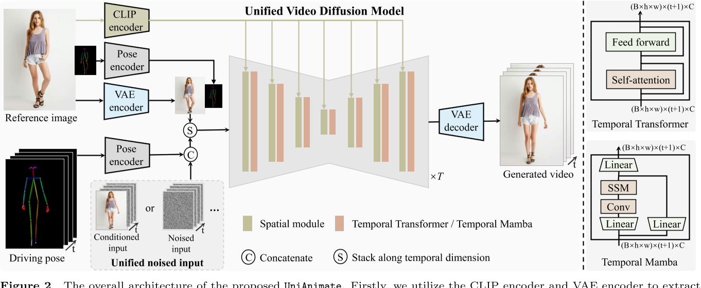
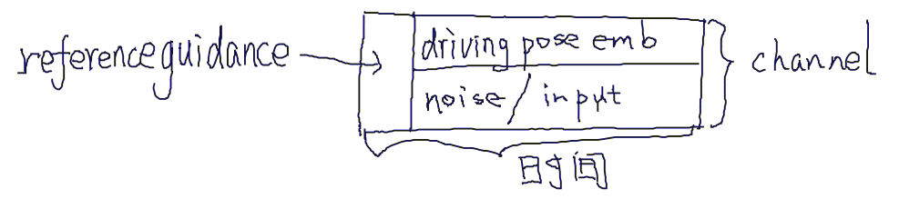
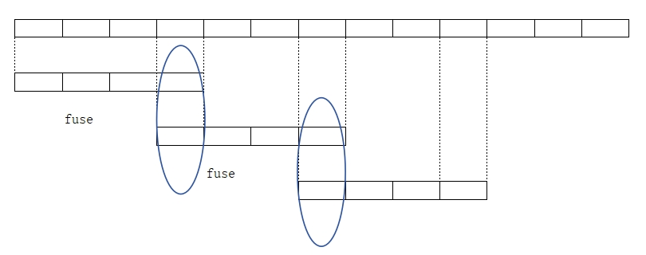
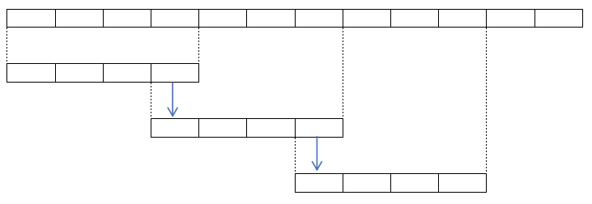
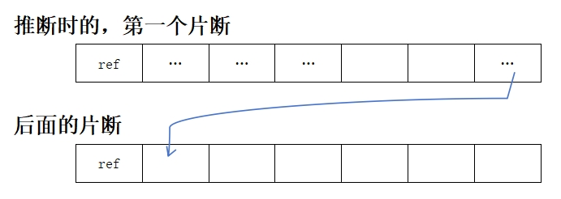
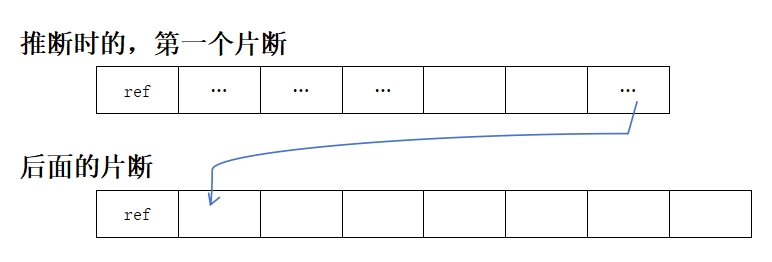
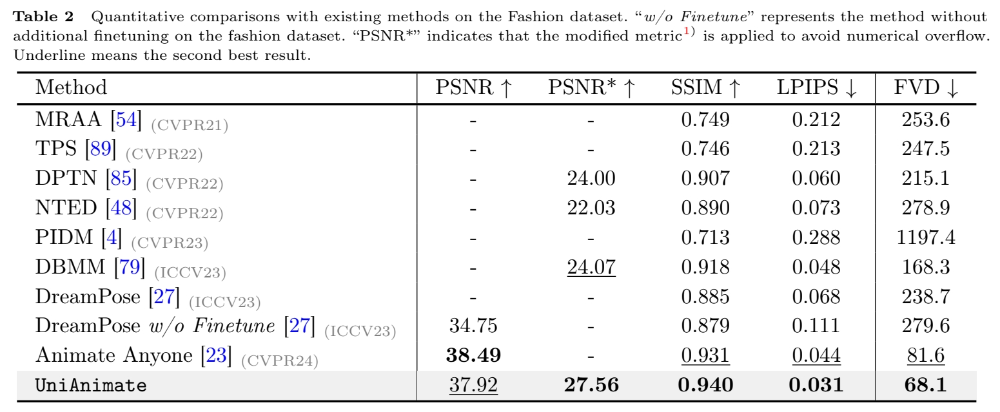

# UniAnimate: Taming Unified Video Diffusion Models for Consistent Human Image Animation    

Ali,开源   

## 核心问题是什么?

输入reference ID和driving pose，生成视频

### 目的

UniAnimate框架，以实现高效和长期的人类视频生成。  

### 现有方法

当前的Diffusion Model存在两个问题：   
i）需要额外的参考模型来将ID图像与主视频分支对齐，这大大增加了优化负担和模型参数；    
例如AnimateDiff,[TCAN](./37.md)           
ii）生成的视频通常时间较短（例如，24帧），阻碍了实际应用。     

### 本文方法

首先，为了降低优化难度并确保时间一致性，我们通过结合统一的视频扩散模型将参考图像与driving pose和噪声视频映射到一个共同的特征空间中。  
其次，我们提出了一种统一的噪声输入，支持随机噪声输入和第一帧条件输入，从而增强了生成长期视频的能力。  
最后，为了进一步有效地处理长序列，我们探索了一种基于状态空间模型的时态建模架构，以取代原始的计算消耗较大的Temporal Transformer。    

[&#x2753;] 把 reference Image 和 driving pose 分别 embedding, 然后以相加或 concat 的方式结合到一起，就算是映射到同一空间了？    
[&#x2753;] 原始是哪个？Modelscope?     

### 效果

UniAnimate在定量和定性评估方面都取得了优于现有最先进同行的合成结果。  
UniAnimate可以通过迭代地采用第一帧调节策略来生成高度一致的一分钟视频。

## 核心贡献是什么？

1. 提出了具有一致性的人体图像动画的UniAnimate框架。具体来说，我们利用统一的视频扩散模型来同时处理参考图像和噪声视频，促进特征对齐并确保时间相干的视频生成。
2. 为了生成平滑连续的视频序列，我们设计了一个**统一的噪声输入**，允许随机噪声视频或第一帧条件视频作为视频合成的输入。第一帧调节策略可以基于先前生成的视频的最后一帧生成后续帧，确保平滑过渡。
3. 为了减轻一次生成长视频的限制，我们利用**时态Mamba**[15,30,93]来替换原始的时态序Transformer，显著提高了效率。
4. 我们进行全面的定量分析和定性评估，以验证我们的UniAnimate的有效性，突出其与现有最先进方法相比的卓越性能。    

## 大致方法是什么？

首先，我们利用CLIP编码器和VAE编码器来提取给定参考图像的潜在特征(左上)。为了便于学习参考图像中的人体结构，我们还将参考姿势的表示纳入最终的reference guidance中（左上）。随后，我们使用姿势编码器对目标驱动的姿势序列进行编码，并将其与噪声输入在channel维度上连接起来（左下）。噪声输入是从第一帧条件视频或噪声视频。然后，将级联的噪声输入与reference guidance沿着时间维度进行叠加，并将其馈送到统一的视频扩散模型中以去除噪声(左中)。统一视频扩散模型中的时间模块可以是temporal transformer或temporal Mamba。最后，采用VAE解码器将生成的latent video映射到像素空间。

Noised input: 统一的噪声输入，即所有帧用同一个 noise 初始化       
Conditioned input: 用于长序列生成时固定首帧内容       

### 统一的 VDM 模型

当前方案（例如[TCAN](./37.md)），除UNet以外，还使用了referenceNet和Pose ControlNet。但本文把它们统一了。好处是：    
1. 将reference image feature 和 Output Video feature 对齐到同一latent space.   
&#x2705; 不同意，不同分支的feature也可以对齐同一latent space     

2. 减少了参数量，更容易训练   
&#x2705; 不同意，多分支虽然参数量多，但大部分参数都是fixed.实际要训练的参数没那么多，且由于大部分参数fixed，预训练的效果不容易恶化。     

当前方案显式地从reference Image 中取reference pose，并输入到模型中。

        

### 统一的噪声

||||
|--|--|--|
|当前方法：滑窗策略 ||两个CLip分别推断，在overlap处fusion.  这会导致两个clip的明显不连续，和overlap处的artifacts.   |
|本文方法|| 直接用上一帧的尾帧作为这一帧的首帧。优势：1.可生成指定首帧的视频。 2.可生成一致的长视频。    |  
         
### 时序建模

**当前方法：** Temporal Transformer，具有二次复杂性。   

**本文方法：** Temporal Mamba，具有线性复杂度。    
二者性能相似，但 Temporal Mamba 所需 memory 更少。   

0           
0           
0           
0           
0           
0       
        
        

## 训练与推断
0           
0           
0           
0           
0           
0    

### 数据集

TikTok   
Fashion     

### loss
0           
0           
0           
0           
0           
0    
### 训练策略

提取Pose:Dwpose,Visual encoder:CLIP-huge,    
Pose-encoder:STC-encoder in VideoComposer(仅借鉴结构)多条件输入，每次以一定的比例dropout部分条件。   

## 实验与结论   

### 评价指标   

**图像质量：** L1,PSNR,SSIM,LPIPS   
**视频质量：** FVD    

**实验一：**  横向对比

1. Disco       
2. Magic Animate   
3. Animate Anyone     
4. Champ    

**效果：**      
1. TikTok 上    

2. Fashion 上    

**结论：**     
1. UniAnimate 超越SOTA，且能更好地保持结构化信息。    
2. 作者认为，收益来自于统一的VDM结构，能将appearance,pose.noise对齐且统一处理，便于模型优化。     

**实验二：** Ablation of Reference Pose.   
1. 显式地引入reference Pose    
2. 不使用reference Pose    

**效果：**    
1. 2出现断肢    
2. 不能很好地识别前景和背景。    

## 有效

## 局限性

1. 手和脸的生成    
2. reference 中看不见的部位生成的一致性。   

## 启发

## 遗留问题

## 参考材料

1. 项目页面：https://unianimate.github.io/