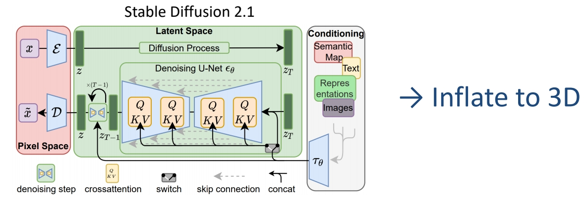
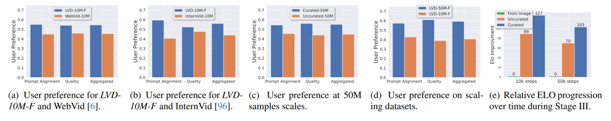
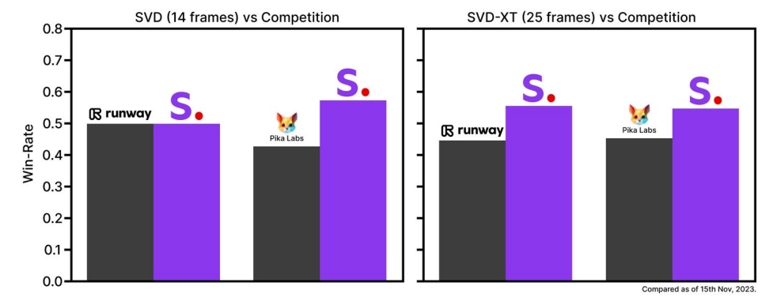
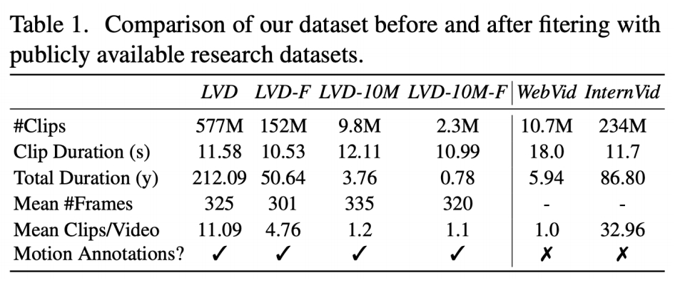

# Stable Video Diffusion: Scaling Latent Video Diffusion Models to Large Datasets

## 核心问题是什么?

### 目的
### 现有方法
### 本文方法
### 效果

## 核心贡献是什么？

## 大致方法是什么？

**Stage I: Image Pretraining**

 - Initialize weights from Stable Diffusion 2.1 (text-to-image model)   

 

**Stage II: Curating a Video Pretraining Dataset**

 - Systematic Data Curation
    - Curate subsets filtered by various criteria (CLIP-, OCR-, optical flow-, aesthetic-scores…)
    - Assess human preferences on models trained on different subsets
    - Choose optimal filtering thresholds via Elo rankings for human preference votes
 - Well-curated beats un-curated pretraining dataset

 

**Stage III: High-Quality Finetuning**

 - Finetune base model (pretrained from Stages I-II) on high-quality video data   
    - High-Resolution Text-to-Video Generation   
       - ~1M samples. Finetune for 50K iterations at 576x1024 (in contrast to 320x576 base resolution)   
    - High Resolution Image-to-Video Generation   
    - Frame Interpolation   
    - Multi-View Generation   
 - Performance gains from curation persists after finetuning   

 

## 训练

### 数据集

Scaling latent video diffusion models to large datasets

**Data Processing and Annotation** 

 - Cut Detection and Clipping    
    - Detect cuts/transitions at multiple FPS levels   
    - Extract clips precisely using keyframe timestamps   
 - Synthetic Captioning   
    - Use CoCa image captioner to caption the mid-frame of each clip   
    - Use V-BLIP to obtain video-based caption   
    - Use LLM to summarise the image- and video-based caption   
    - Compute CLIP similarities and aesthetic scores
 - Filter Static Scene   
    - Use dense optical flow magnitudes to filter static scenes   
 - Text Detection   
    - Use OCR to detect and remove clips with excess text    

Blattmann et al., “Stable Video Diffusion: Scaling Latent Video Diffusion Models to Large Datasets,” 2023.     

> &#x2705; SVD：构建数据集    
> &#x2705; (1) 把视频切成小段，描述会更准确   
> &#x2705; (2) 用现有模型生成视频描述 

### loss

### 训练策略

## 实验与结论

## 有效

## 局限性

## 启发

> &#x2705; 在少量高质量数据上 finetune，质量提升很大。

## 遗留问题

## 参考材料