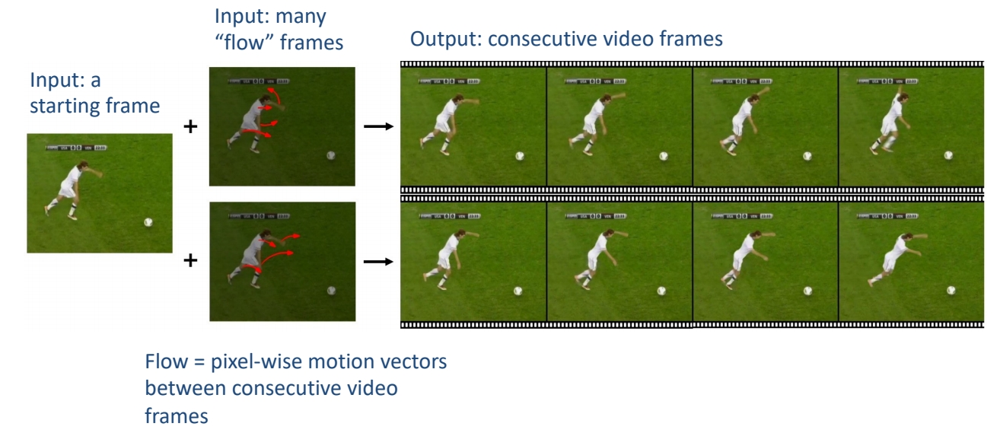
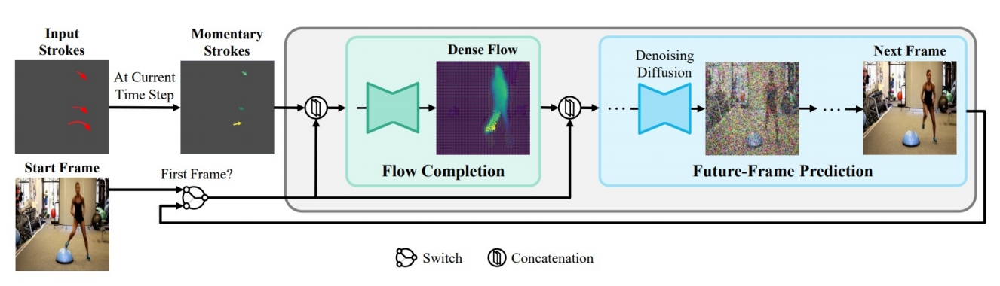
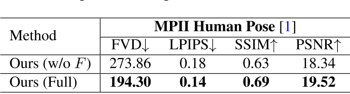

# Motion-Conditioned Diffusion Model for Controllable Video Synthesis

INVIDIA， Google Research， 不开源

## 核心问题是什么?

### 目的

以一种更可控的方式描述要生成的内容和动作，进行Motion-guided video generation

 

### 现有方法及局限性

缺乏控制和描述所需内容和运动的有效方法

### 本文方法

用户通过一些短划线对图像帧进行描述，可以合成的预期的内容和动态。
1. 利用flow completion model，基于视频帧的语义理解和稀疏运动控制来预测密集视频运动。
2. 以输入图像为首帧，future-frame prediction model合成高质量的未来帧以形成输出视频。

### 效果

我们定性和定量地表明，MCDiff 在笔画引导的可控视频合成中实现了最先进的视觉质量。

## 核心贡献是什么？

## 大致方法是什么？

Two-stage autoregressive generation

 

> MCDiff 是一种**自回归**视频合成模型。对于每个时间步，  
输入：前一帧（即开始帧或预测的上一帧）和笔画的瞬时段（标记为彩色箭头，较亮的颜色表示较大的运动）引导。
输出：（1）flow completion model预测代表每像素瞬时运动的密集flow。(2)future-frame prediction model通过条件扩散过程根据前一帧和预测的密集流合成下一帧。  
所有预测帧的集合形成一个视频序列，该序列遵循起始帧提供的上下文和笔划指定的运动。 

### 视频动态标注

这一步用于构造dense flows。

1. 计算两帧的光流。  
2. 计算两帧中的关键点的光流。  
3. 用2的flow代替1中有移动的点的flow。因为2的flow往往能更准确地描述人体形状。

> [?] 每个关键点的flow不同，分别代替哪些像素点的flow？
[?] 这个方法只适用于有人且单人？

### flow completion model F

|输入|输出|方法|
|---|---|---|
|dense flow|sparse flow|下采样 1. 采样与关键点像素想关的flow。  2. flow magnitude大的采样概率大。   3. 同时采样背影或其它物体的运动|
|稀疏的拖拽信息|2D的稀疏光流表示|w * h * 2的 矩阵，描述相对于上一帧的位移。由于是拖拽是稀疏光流，大部分格子上是没有拖拽信息的。把这些空白填上learnable embedding，表明用户没有在这些地方指定输入。|
|2D的稀疏光流表示 2D的图像信息|UNet输入|concat|
|UNet输入|dense flow|UNet|

[?] 直接监督dense flow?  
答：只是用了UNet，但没有用Diffusion。  

### future-frame prediction model G

输入：当前帧图像xi，当前帧到下一帧的光流di  
输出：下一帧图像  
方法：LDM  
条件注入方式：concat(noise, xi, di)

## 训练

### 数据集

### loss

### 训练策略

分别训练F和G，然后端到端finetune F和G。  

> F和G都使用UNet作为基本结构，但F是生成模型，直接预测图像。G是Diffusion模型，预测的是噪声，多次去噪迭代生成图像。  
> [Motion-I2V](https://caterpillarstudygroup.github.io/ReadPapers/44.html)是类似的工作，但它的第一步是通过diffusion根据图像生成合理的光流。  

BaseModel: [SD](./45.md)

## 实验与结论

**实验一：**横向对比 
**效果：** SOTA  

**实验二：**

1. 不使用F，sparse flow直接预测视频
2. full model
**效果：**     

**结论：** 使用Dense flow能更消除歧义，降低学习难度

## 有效

## 局限性

## 启发

## 遗留问题

## 参考材料

项目启动页面：https://tsaishien-chen.github.io/MCDiff/ing
